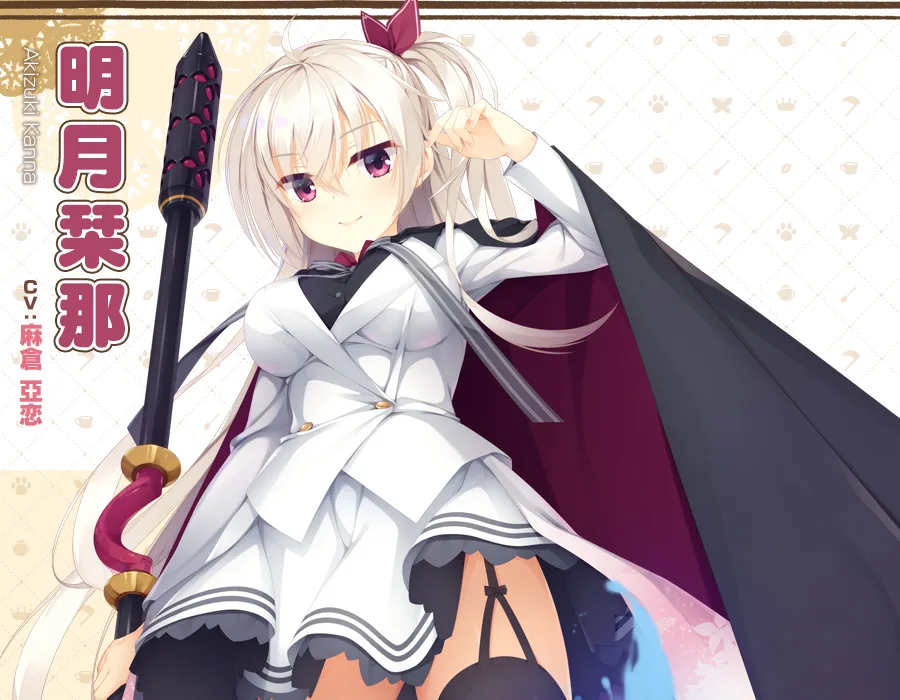
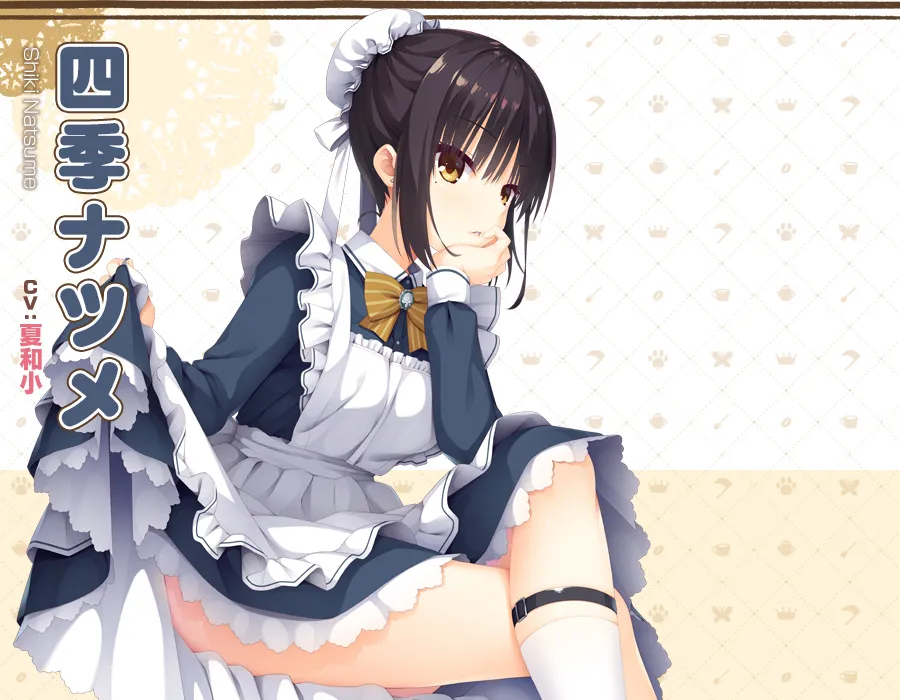
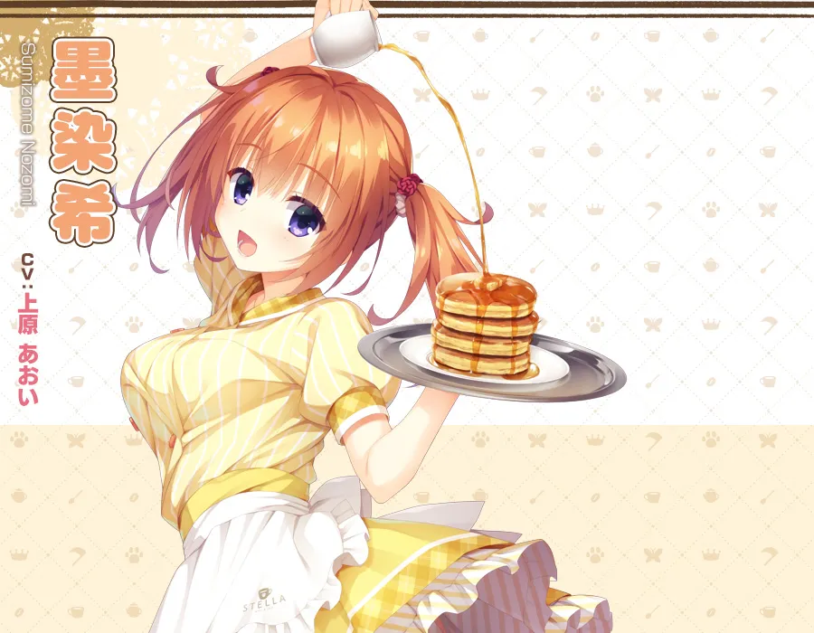
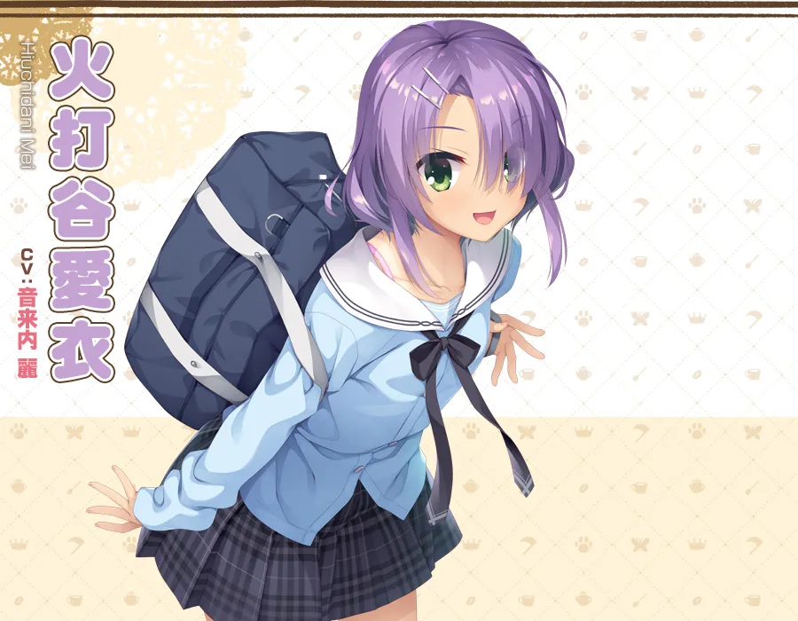
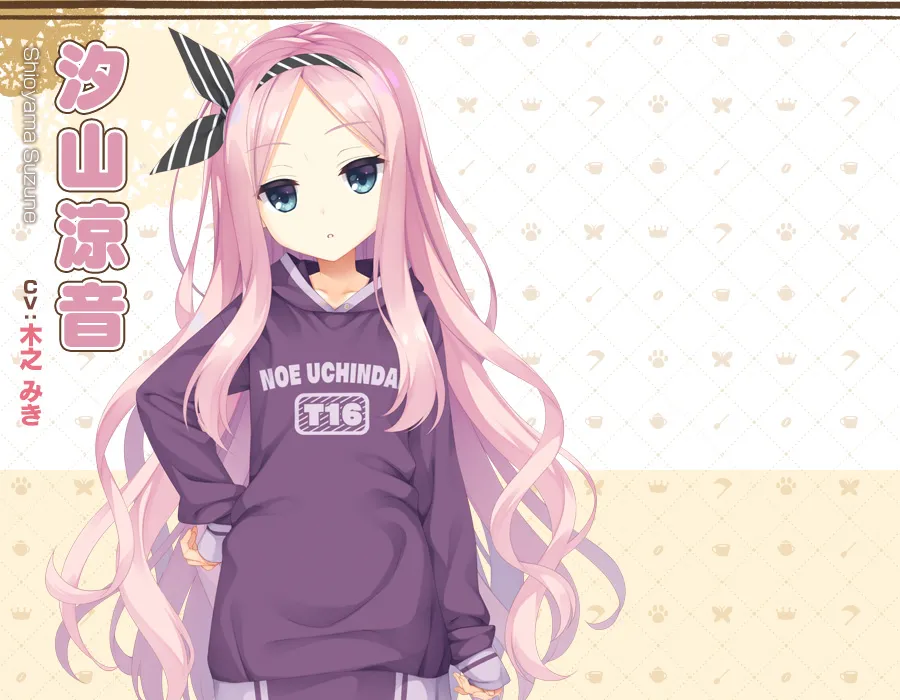

`作者：桐遠暮羽`

玩太多沉痛的 Galgame，大腦要降級啦。今天玩點輕鬆愉快的，歡迎來到死神咖啡店！


苦逼的處男大學生，走在街上慘遭泥頭車創死了。然後就被死神拉去了自家咖啡店強制打工，結果發現咖啡店裏除了死神還有人外。

| 資訊一覽     |                                                              |
| :----------- | :------------------------------------ |
| **作品名稱**   |  喫茶ステラと死神の蝶   |
| **開發商**   | 柚子社 |
| **遊戲時長** | 30 小時                     |
| **類型**     | 戀愛 搞笑                |
| **難度**     | 低（使用路線圖直接跳轉） |
| **分級**     | R-18（性行爲）      |

------

什麼，故事？柚子社的遊戲也要看故事？

## 故事

男主角高嶺昂晴，本來只是個普通大學生，還是處男。

他還沒破處就死了，被泥頭車給創的，當時簡直遺憾得要命，，，

結果他醒來的時候，發現時間倒回了當天早上，

而且發生的事情一模一樣，太哈人了！接下來豈不是又要死了，

然後路上被一隻會講話的貓帶走，見到了死神。

<br>

「你還沒有逃脫死亡的命運。」死神恐嚇道。

「要是想活命，就到我的咖啡店來打工。」死神強迫道。

<br>

昂晴就在咖啡店展開了打工生活，並且遇到了各種各樣的女孩子。

那麼他最後有沒有逃脫死亡的命運呢❓️


## 登場人物

<style>
#swipe {
    width: 100%;
    height: 100%;
    overflow-x: scroll;
    overflow-y: hidden;
    white-space:nowrap;
}
#swipe  .slide {
    display: inline-block;
}
#swipe  .slide img {
    max-height: 600px;
    background-color: transparent;
    border: none;
    }
#swipe  p {
   margin-right: 30px;
   display: inline-block;
}
</style>
<div id="swipe">
<div class="slide">
        
    </div>
    <div class="slide">
<p>
<strong>Komako</strong><br><br>
乾 駒子<br>
中文唸起來極其拗口，<br>所以叫 Komako。<br><br>
在島上上學的高二學生，<br>每天都拿着大刀和怪物搏鬥。<br>
不知爲何態度總是非常堅定。<br><br>
就算是暑假也穿校服，<br><em>算是制服戰鬥少女</em>
</p>
    </div>
<div class="slide">
        
    </div>
<div class="slide">
        
    </div>
</div>
<div id="swipe">
<div class="slide">
        
    </div>
    <div class="slide">
<p>
<strong>Komako</strong><br><br>
乾 駒子<br>
中文唸起來極其拗口，<br>所以叫 Komako。<br><br>
在島上上學的高二學生，<br>每天都拿着大刀和怪物搏鬥。<br>
不知爲何態度總是非常堅定。<br><br>
就算是暑假也穿校服，<br><em>算是制服戰鬥少女</em>
</p>
    </div>
<div class="slide">
        
    </div>
<div class="slide">
        
    </div>
</div><div id="swipe">
<div class="slide">
        
    </div>
    <div class="slide">
<p>
<strong>Komako</strong><br><br>
乾 駒子<br>
中文唸起來極其拗口，<br>所以叫 Komako。<br><br>
在島上上學的高二學生，<br>每天都拿着大刀和怪物搏鬥。<br>
不知爲何態度總是非常堅定。<br><br>
就算是暑假也穿校服，<br><em>算是制服戰鬥少女</em>
</p>
    </div>
<div class="slide">
        
    </div>
<div class="slide">
        
    </div>
</div><div id="swipe">
<div class="slide">
        
    </div>
    <div class="slide">
<p>
<strong>Komako</strong><br><br>
乾 駒子<br>
中文唸起來極其拗口，<br>所以叫 Komako。<br><br>
在島上上學的高二學生，<br>每天都拿着大刀和怪物搏鬥。<br>
不知爲何態度總是非常堅定。<br><br>
就算是暑假也穿校服，<br><em>算是制服戰鬥少女</em>
</p>
    </div>
<div class="slide">
        
    </div>
<div class="slide">
        
    </div>
</div><div id="swipe">
<div class="slide">
        
    </div>
    <div class="slide">
<p>
<strong>Komako</strong><br><br>
乾 駒子<br>
中文唸起來極其拗口，<br>所以叫 Komako。<br><br>
在島上上學的高二學生，<br>每天都拿着大刀和怪物搏鬥。<br>
不知爲何態度總是非常堅定。<br><br>
就算是暑假也穿校服，<br><em>算是制服戰鬥少女</em>
</p>
    </div>
<div class="slide">
        
    </div>
</div>
<br>

人物插畫

<div id="carouselExampleIndicators" class="carousel slide" data-ride="carousel">
  <ol class="carousel-indicators">
    <li data-target="#carouselExampleIndicators" data-slide-to="0" class="active"></li>
    <li data-target="#carouselExampleIndicators" data-slide-to="1"></li>
    <li data-target="#carouselExampleIndicators" data-slide-to="2"></li>
    <li data-target="#carouselExampleIndicators" data-slide-to="3"></li>
    <li data-target="#carouselExampleIndicators" data-slide-to="4"></li>
  </ol>
  <div class="carousel-inner">
    <div class="carousel-item active">
      
    </div>
    <div class="carousel-item">
      
    </div>
    <div class="carousel-item">
      
    </div>
    <div class="carousel-item">
      
    </div>
    <div class="carousel-item">
      
    </div>
  </div>
  <a class="carousel-control-prev" href="#carouselExampleIndicators" role="button" data-slide="prev">
    <span class="carousel-control-prev-icon" aria-hidden="true"></span>
    <span class="sr-only">Previous</span>
  </a>
  <a class="carousel-control-next" href="#carouselExampleIndicators" role="button" data-slide="next">
    <span class="carousel-control-next-icon" aria-hidden="true"></span>
    <span class="sr-only">Next</span>
  </a>
</div>

## 遊戲 OP 動畫欣賞

都是萌萌人，，，

<div class='vidcontainer'>
   <select class='qualitypick' autocomplete='off'>
      <option selected>低畫質</option>
      <option>高畫質</option>
   </select>
   <video controls preload="metadata" width='100%' poster="../image/CafeStella/op.webp">
      <source label="低畫質" src="https://bitbucket.org/sa-ya/my-static/raw/5bf816c9df4af8ab2e57fbbe9f3eb61d6e4063d4/CafeStella/op-480.mp4" type="video/mp4">
      <source label="高畫質"   src="https://bitbucket.org/sa-ya/my-static/raw/5bf816c9df4af8ab2e57fbbe9f3eb61d6e4063d4/CafeStella/op.mp4" type="video/mp4" >
<p> To view this video please enable JavaScript</p>
   </video>
</div>


## 一句話點評

直至今日，我才明白自己到底喜欢柚子的什么

快速的五章主线和两个更简短的开放式结局后日谈，可以用一句谚语概括，麻雀虽小，五脏俱全。 这句话也不完全对，因为Parquet没有R18。 这里指的俱全是，本作拥有柚子社传统废萌的基本结构：

第一步分别和女角色相识，

第二步由于某个原因和作品里的女角色们聚集到一起

第三步男主和女角色团一起解决一个重大的事件(这里的事件在Parquet中是案件，也可以比作魔宴中的学园祭，千恋万花里的祓禊，RJ里的学园祭)

第四步在事件结束后进入个人线路。

对于没有接触过柚子的玩家来说，初来乍到的全年龄新作很成功地表明了本社作品一贯的作风和节奏。

明明知道这些，那我究竟是为什么乐在其中呢？也许就算在现实里一同解决事件，途中相识的人也会分道扬镳。就算有过短暂的交集，也因为我这些年来从来也没有在什么城市里安定下来，更不知道自己未来将要去哪，到此却没有可以一起的伙伴。对于在一个地方安定下来也好，能结识理解自己的朋友也好，这种事情都是遥不可及的。柚子的主角伴随着事件来到故事的舞台，却在结束后安定下来，这是我根本无法想象的。

我总会对自己说我将来会离开这里，所以不行，就这么过了下去，很快的几年时间过去了，我的人际关系还是停留在高中时期的那些朋友里，但是朋友们都有了各自的栖息地，不像我。人总要迈出脚步，也总要找地方给自己休息。什么时候打算休息了，不用再四处奔波了，我大概就会回到老家西安去，在那里一边确定我长久的朋友，一边玩柚子吧。

柚子你的正作什么时候上？？ 

## 在猶豫是否要下載？

## 資源與下載

### 日文原版

遊戲本體（無需破解）

```
magnet:?xt=urn:btih:c70d2386bef29b55966f459b214c3d8b0537de4d
```

文件名：[191220] [ゆずソフト] 喫茶ステラと死神の蝶 + Character Songs + Tokuten CD + Bonus + Update 1.1

資源來自 Anime Sharing 論壇： [點此前往](http://www.anime-sharing.com/forum/torrents-47/5-%5B191220%5D-%5B%E3%82%86%E3%81%9A%E3%82%BD%E3%83%95%E3%83%88%5D-%E5%96%AB%E8%8C%B6%E3%82%B9%E3%83%86%E3%83%A9%E3%81%A8%E6%AD%BB%E7%A5%9E%E3%81%AE%E8%9D%B6-character-songs-tokuten-cd-bonus-update-1-1-%5Bh-game%5D-901428/)

遊戲有升級補丁，記得下載最新的來安裝。[點此前往官網](http://www.yuzu-soft.com/products/stella/download.html) 下載可能要翻牆。


### 中文版

沒有中文版！但是應該有漢化組的漢化，具體在哪裏有，請上網搜索或諮詢群友。

------

這遊戲還出了不少週邊，小動畫，小漫畫，還有貼紙，，，

 

<a class="btn btn-info" href="tg://addstickers?set=Yuzusoft_CAFE_STELLA_Sticker">直達 Telegram 貼紙</a>