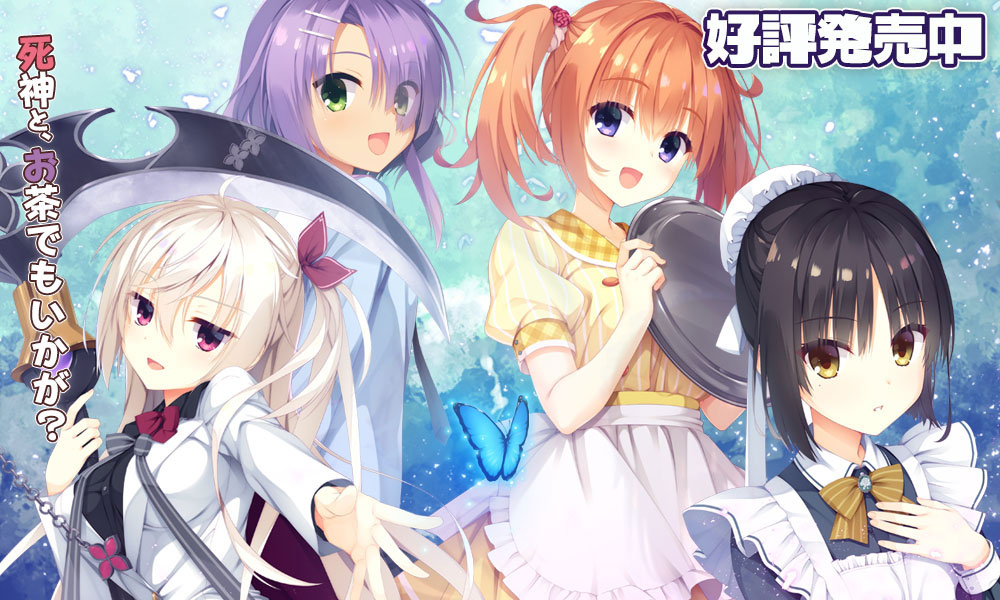

`作者：桐遠暮羽`

玩太多沉痛的 Galgame，大腦要降級啦。今天玩點輕鬆愉快的，歡迎來到死神咖啡店！



苦逼的處男大學生，走在街上慘遭泥頭車創死了。然後就被死神拉去了自家咖啡店強制打工，結果發現咖啡店裏除了死神還有人外。

| 資訊一覽     |                                                              |
| :----------- | :------------------------------------ |
| **作品名稱**   |  喫茶ステラと死神の蝶   |
| **開發商**   | 柚子社 |
| **遊戲時長** | 30 小時                     |
| **類型**     | 戀愛 搞笑                |
| **難度**     | 低（使用路線圖直接跳轉） |
| **分級**     | R-18（性行爲）      |

------

什麼，故事？柚子社的遊戲也要看故事？

## 故事

男主角高嶺昂晴，本來只是個普通大學生，還是處男。

他還沒破處就死了，被泥頭車給創的，當時簡直遺憾得要命，，，

結果他醒來的時候，發現時間倒回了當天早上，

而且發生的事情一模一樣，太哈人了！接下來豈不是又要死了，

然後路上被一隻會講話的貓帶走，見到了死神。

<br>

「你還沒有逃脫死亡的命運。」死神恐嚇道。

「要是想活命，就到我的咖啡店來打工。」死神強迫道。

<br>

昂晴就在咖啡店展開了打工生活，並且遇到了各種各樣的女孩子。

那麼他最後有沒有逃脫死亡的命運呢❓️


## 登場人物

<style>
#swipe {
    width: 100%;
    height: 100%;
    overflow-x: scroll;
    overflow-y: hidden;
    white-space:nowrap;
}
#swipe  .slide {
    display: inline-block;
}
#swipe  .slide img {
    max-height: 600px;
    background-color: transparent;
    border: none;
    }
#swipe  p {
   margin-right: 30px;
   display: inline-block;
}
</style>
<div id="swipe">
<div class="slide">
        
    </div>
    <div class="slide">
<p>
<strong>死神</strong><br><br>
看上去是個少女，實際上有一百多歲，<br>
在現代社會是土老冒，連智能手機都不會用，<br><br>
雖然是個永遠娘，但是不會擺架子，<br>
是個活潑可愛的少女（錯亂）<br><br>
<br><em>有的時候會露出長者的一面，因爲見得太多了。</em>
</p>
    </div>
<div class="slide">
        
    </div>
<div class="slide">
        
    </div>
</div>
<br>
<div id="swipe">
<div class="slide">
        
    </div>
    <div class="slide">
<p>
<strong>同班的女生</strong><br><br>
也在死神的咖啡店打工，<br>
看起來很高冷，而且長得相當漂亮，<br>所以在學校裏面算是高嶺之花。<br><br>
開不起黃色玩笑，<br>馬上就會臉紅。<br>
<br>
<em>討厭很會籠絡人的現充人。</em>
</p>
    </div>
<div class="slide">
        
    </div>
<div class="slide">
        
    </div>
</div>
<br>
<div id="swipe">
<div class="slide">
        
    </div>
    <div class="slide">
<p>
<strong>青梅竹馬</strong><br><br>
...也在死神的咖啡店打工。<br>
是那種在各種 Galgame 中很常見，活潑可愛，<br>喜歡捉弄男主的青梅竹馬。<br><br>
比男主小一歲，家裏是開神社的，<br>所以算是巫女 JK。<br>
<br>
知道不少男主的黑歷史，<br><em>胸還很大。</em>
</p>
    </div>
<div class="slide">
        
    </div>
<div class="slide">
        
    </div>
</div>
<br>
<div id="swipe">
<div class="slide">
        
    </div>
    <div class="slide">
<p>
<strong>學妹</strong><br><br>
青梅竹馬的同學兼友人，<br>
...也在死神的咖啡店打工。<br>喜歡可愛的東西，比如毛絨公仔。<br><br>
喜歡游泳，是小麥色的肌膚，
<br><em>而且有曬痕。</em>
</p>
    </div>
<div class="slide">
        
    </div>
<div class="slide">
        
    </div>
</div>
<br>
<div id="swipe">
<div class="slide">
        
    </div>
    <div class="slide">
<p>
<strong>基友的姐姐</strong><br><br>
二十多歲，但是看上去很幼，老處女。<br>
蛋糕師。<br>做蛋糕的時候很認真，<br><br>
但是做家務很懶，所以老是找不到男朋友，<br>
基友如此罵道。<br><br>
<br><em>年上可攻略角色。</em>
</p>
    </div>
<div class="slide">
        
    </div>
</div>
<br>

人物插畫


../image/CafeStella/chars/a1.webp
../image/CafeStella/chars/a2.webp
../image/CafeStella/chars/a3.webp
../image/CafeStella/chars/a4.webp
../image/CafeStella/chars/a5.webp


## 遊戲 OP 動畫欣賞

都是萌萌人，，，


<video controls preload="metadata" width='100%' poster="../image/CafeStella/op.webp">
  <source src="https://bitbucket.org/sa-ya/g-static/raw/ec69262a87ddfec8aca250a4621e2f8b7036330f/CafeStella/op.mp4" type="video/mp4" >
<p> To view this video please enable JavaScript</p>
</video>


## 遊戲畫面


../image/CafeStella/cg/kan_02.webp
../image/CafeStella/cg/kan_05.webp

<br>

../image/CafeStella/cg/natu_01.webp
../image/CafeStella/cg/natu_02.webp
../image/CafeStella/cg/natu_05.webp

<br>

../image/CafeStella/cg/nozo_02.webp
../image/CafeStella/cg/nozo_04.webp
../image/CafeStella/cg/nozo_08.webp

<br>

../image/CafeStella/cg/mei_01.webp
../image/CafeStella/cg/mei_02.webp
../image/CafeStella/cg/mei_06.webp

<br>

../image/CafeStella/cg/suzu_01.webp
../image/CafeStella/cg/suzu_02.webp


## 一句話點評

引用一下 PARQUET 文章中的點評：

> **这里指的俱全是，本作拥有柚子社传统废萌的基本结构：**
>
> 第一步分别和女角色相识，
>
> 第二步由于某个原因和作品里的女角色们聚集到一起
>
> 第三步男主和女角色团一起解决一个重大的事件
>
> 第四步在事件结束后进入个人线路。

柚子社，典中典。很久以前俺就聽朋友經常提起某某社，什麼廢萌啦，劇情白開水啦，

當然俺都沒有聽進去，直到俺有一天隨便找遊戲玩，陰差陽錯看到了上面那張男主角
枕在死神膝蓋上的 CG，於是就把種子下了下來。

遊戲一開始，驚豔到俺的是精緻的畫面和很可愛，很有辨識性的畫風。
劇情就和上面說的廢萌四步曲一樣，就是在一個奇妙設定裏的戀愛日常。

即使是日常，但是穿插的搞笑橋段還是令人忍俊不繃，而且柚子社還很有特色地在
具體故事情節發生的時候，恰當地使用 Q 版作畫將現場的情況描繪出來，
這種方式很好地解決了光是利用立繪難以表現的現場狀況的問題，

要知道俺之前玩的 Galgame 遇上這種情況只能望向天空或者街道。

另外，喜歡戀愛故事的人應該會很喜歡這種風格，前期混臉熟的時候腳踏實地，
利用各種事件來刷各個女主角的好感度，

之後再發生的表白和初體驗事件就水到渠成，而且笨拙的兩人導致的節目效果也很有趣。

——歡迎來到輕鬆愉快的柚子社死神咖啡廳。


## 在猶豫是否要下載？

這裏有一個 8 分鐘的試玩實況。

本作的畫面非常精細所以我特別錄製了高清畫質，，，

劇情大意是青梅竹馬來叫你起床，順便煮早餐。

<video controls preload="metadata" width='100%' poster="../image/CafeStella/movie.webp">
<source src="https://bitbucket.org/sa-ya/g-static/raw/ec69262a87ddfec8aca250a4621e2f8b7036330f/CafeStella/8-min-know.mp4"  src-cn="https://pan.bilnn.cn/api/v3/file/sourcejump/P8d9v4TO/FklcOv0WChVgXIYpN7tqzgv2FCu-0Bf0DOKUk4mv3X8*" type="video/mp4" />
<p> To view this video please enable JavaScript</p>
</video>

## 資源與下載

### 日文原版

遊戲本體（無需破解）

```
magnet:?xt=urn:btih:c70d2386bef29b55966f459b214c3d8b0537de4d
```

文件名：[191220] [ゆずソフト] 喫茶ステラと死神の蝶 + Character Songs + Tokuten CD + Bonus + Update 1.1

該種子來自 Anime Sharing 論壇： [點此前往](http://www.anime-sharing.com/forum/torrents-47/5-%5B191220%5D-%5B%E3%82%86%E3%81%9A%E3%82%BD%E3%83%95%E3%83%88%5D-%E5%96%AB%E8%8C%B6%E3%82%B9%E3%83%86%E3%83%A9%E3%81%A8%E6%AD%BB%E7%A5%9E%E3%81%AE%E8%9D%B6-character-songs-tokuten-cd-bonus-update-1-1-%5Bh-game%5D-901428/)

遊戲有升級補丁，記得下載最新的來安裝。[點此前往官網](http://www.yuzu-soft.com/products/stella/download.html) 下載可能要翻牆。

如果想玩中文 請配合這個漢化補丁使用 


### 中文版

百度网盘秒传

```
2ccd4f43cbeecfc9007da3c2ccb3ae40#bc726811854b44fa6411bd4fd448248d#1623056246#星光咖啡馆与死神之蝶.7z.003
45da70412e797bb13844c2bc2afb0df7#b204e19fa1a2a5e6fc1cd8be8c9cb3b2#2621440000#星光咖啡馆与死神之蝶.7z.002
5ad1b28a1fc8f43f85f3e4537ac520eb#5c001f3d2e0efb0a9a5384550a6754f6#2621440000#星光咖啡馆与死神之蝶.7z.001
```

onedrive下载

<a class="btn btn-info" href="https://dl.galgamer.eu.org/%E6%98%9F%E5%85%89%E5%92%96%E5%95%A1%E9%A6%86%E4%B8%8E%E6%AD%BB%E7%A5%9E%E4%B9%8B%E8%9D%B6.7z.001"> 分卷1</a>	<a class="btn btn-info" href="https://dl.galgamer.eu.org/%E6%98%9F%E5%85%89%E5%92%96%E5%95%A1%E9%A6%86%E4%B8%8E%E6%AD%BB%E7%A5%9E%E4%B9%8B%E8%9D%B6.7z.002">分卷2</a>	<a class="btn btn-info" href="https://dl.galgamer.eu.org/%E6%98%9F%E5%85%89%E5%92%96%E5%95%A1%E9%A6%86%E4%B8%8E%E6%AD%BB%E7%A5%9E%E4%B9%8B%E8%9D%B6.7z.003">分卷3</a>

分卷解压请放在一个文件夹解压


------

這遊戲還出了不少週邊，小動畫，小漫畫，還有貼紙，，，

 

<a class="btn btn-info" href="tg://addstickers?set=Yuzusoft_CAFE_STELLA_Sticker">直達 Telegram 貼紙</a>
