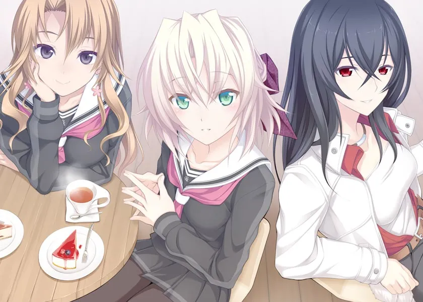
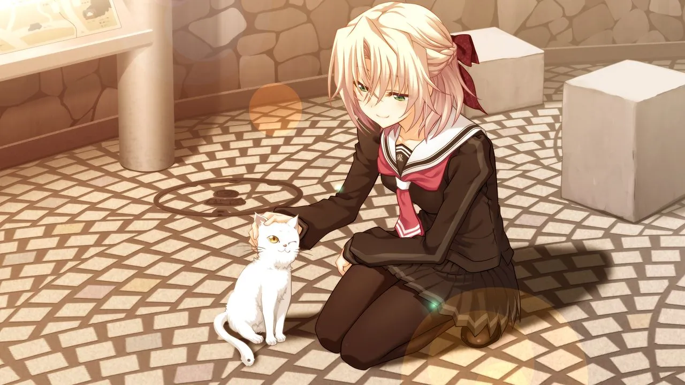
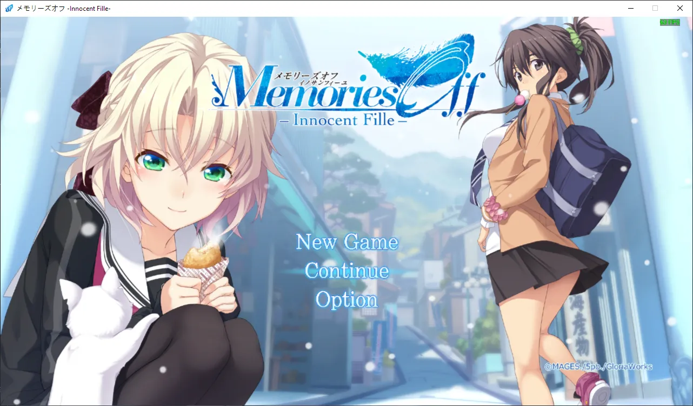

<p style="background-color: transparent; border:3px; border-style:solid;border-color:orange; padding: 10px">
由於 iPhone 瀏覽器技術過於中級，有些網頁視頻無法正常播放。<br>
電腦中級高手正在盡力搶救中，，，
</p>


`作者：相葉詞乃`

幼時的一場大火將四人玩伴的關係燒得四分五裂。多年後，身處事件中心的男主角成爲了交換生，玩伴四人組即將再會。


| 資訊一覽     |                                                              |
| :----------- | :------------------------------------ |
| **又名**   | 秋之回憶 8      |
| **開發商**   | MAGES; 5pb.（就是命運石之門那個公司）      |
| **遊戲時長** | 35 小時                     |
| **類型**     | 冒險                    |
| **難度**     | <span style="color:red">高</span>（路線圖和選項相當複雜，請適當借助攻略） |
| **分級**     | 15+ 輔導級（輕微暴力）      |

## 故事

在幼時經歷了那一場災難的男主角，阿累，從那以後就緊閉了心扉，養成了對周圍人際關係漠不關心的態度。

他認爲，過去之事已成定局，只有緊閉心門，自己才能擁有能從失去中解脫出來的堅強。

原就讀於札幌海陵高中的阿累，藉着交換生的機會，前往了神奈川的海陵高中，

和幼時玩伴莉一再會，也圓了「離開此處，前往遠方」的願望。

<br>

來到了新的環境，結識了新的朋友，同伴，找到了值得依靠的人，也邂逅了新的女孩，展開了美好的愛情。

然而，在回家的列車上，阿累在車窗外瞥見了**那個身影**，

那是本應永遠消失在大火中的女孩子，自己的初戀。

列車飛馳而過。

<br>

每個人身上都背負着自己的重擔，就連最純真，最無垢的少女，人生也不是都一帆風順。

況且，阿累仍然身處那場大火的陰影之中。



------

本作的故事大致上分爲兩條主線，並且具有劇情鎖。

新玩家首先體會到的是 Light Side，講述的是和女主角們**比較**輕鬆，**比較**單純的戀愛故事。

之後解鎖的 Heavy Side，將講述沉重而又痛苦的人際關係。

## 登場人物


<div class="sp-character">
  
  <h3 id={name}>{name}</h3>
  <p html={html}></p>
</div>


<style>
  .sp-character-container {
    display: grid;
    gap: 10px;
  }
  .sp-character {
    display: grid;
    grid-template:
      "name pic" auto
      "desc pic" 1fr / 1fr 40%;
  }
  .sp-character > img,
  .sp-character > .fancybox {
    grid-area: pic;
  }
  .sp-character > h3 {
    grid-area: name;
  }
  .sp-character > p {
    grid-area: desc;
  }
</style>

<div class="sp-character-container">

<sp-character no=1 name="嘉神川 諾艾爾">
  日法混血兒，<br>
  無論是以前，還是就讀於女子高中的現在，<br>
  她始终彷徨无措。<br>
  養了一隻小流浪貓。<br><br>
  有時候會講法語，<em>請自備法語字典。</em>
</sp-character>

<sp-character no=2 name="三城 柚莉">
  玩伴四人組之一<br>
  三兄妹中的二姐<br>
  運動全能，精力充沛，記憶力超羣，<br>
  在學校內人氣很高。<br><br>
  <em>人稱小柚子。</em>
</sp-character>

<sp-character no=3 name="三城 琴莉">
  玩伴四人組之一<br>
  三兄妹中的小妹<br>
  是阿累的初戀情人，<br>
  和柚莉不一樣，是一個乖巧的少女。<br><br>
  <em>胸是否也更大？</em>
</sp-character>

<sp-character no=4 name="三城 莉一">
  玩伴四人組之一<br>
  三兄妹中的哥哥<br>
  是阿累的好朋友，<br>
  在學校內過於妹控，<br>
  但是長相英俊所以很受女生矚目。<br>
</sp-character>

<sp-character no=5 name="志摩 壽奈櫻">
  諾艾爾的摯友，<br>
  曾經爲了考上同一所學校，兩人一起努力。<br>
  家裏面開神社，<br>
  號稱有個比自己年長的男朋友。。<br><br>
  <em>人稱娜歐醬。</em>
</sp-character>

<sp-character no=6 name="楠瀨 累">
  男主角<br>
  擁有着石硬的內心，<br>
  出衆的觀察力和敏銳的直覺，<br>
  以及很垃圾的體力。<br><br>
  <em>人稱累累。</em>
</sp-character>

</div>

## 遊戲 OP 動畫欣賞

動畫來自 Steam。



## 一句話點評

本作是秋之回憶（Memories Off，簡稱 MO）
系列的最終作，歷代 MO 的角色均有出現，
但是俺並沒有玩過幾部 MO，俺就不針對整個系列進行瞎指點，
只說說對這個遊戲的感受。

剛開始遊玩本作的時候，第一印象就是 MO8 雖然也和
其他一些 Galgame 一樣，具有良好的作畫和襯景的 BGM，
但是人物的形象並不像其他遊戲那樣是活潑快樂，
閃閃發光的，而能感覺得到每個角色
都有自己的煩惱和酸楚，
都有不願意被人觸碰的陰影。

隨着故事進行，勇敢阿累克服困難，
和女主角們跨越溝溝坎坎，
把胃疼的戀情修成了正果。

然後這個遊戲出現了兩個大字「Heavy Side」，
原來剛才那些煩惱和痛苦只是冰山一角，

接下來的故事有多沉重呢，那就像是狠狠地揭開阿累
和在座各位多年的傷疤，然後狠狠地一拳打在上面，
你卻要強顏歡笑地面對那四濺的鮮血。

<span style="color:red"><strong>勇敢累累，戰勝困難</strong></span>

## 遊戲畫面







## 在猶豫是否要下載？

這裏有一個 8 分鐘的試玩實況。

<video  controls  preload="metadata" width='100%'>
<source src="https://bitbucket.org/sa-ya/g-static/raw/ec69262a87ddfec8aca250a4621e2f8b7036330f/MO8/8min-know-h264.mp4"  src-cn="https://pan.bilnn.cn/api/v3/file/sourcejump/gMbWd1So/7e-JWz1RyiXfgrjaSaqaz1lXhkkNkgyifEA2vydKiNs*" type="video/mp4" />
<p> To view this video please enable JavaScript</p>
</video>


## 資源與下載



Steam 商店爲官方多語言版。

<br>

中文破解版下載：

```
magnet:?xt=urn:btih:8fc4c345297429dfaf3e4faf7d6d7280761ed9e7
```

文件名：Memories.Off.Innocent.Fille.CHS

種子來源： https://www.52pojie.cn/thread-1147911-1-1.html

下載速度可能較慢，請耐心等待，，，

<br>

攻略

http://www.mcneet.kxyun.net/53/

<div id="hot_patch"></div>

<script src="../image/MO8/patch.js"></script>