`作者：和風少女桐遠暮羽`

## At A Glance

高中生少年 有地將臣 把老家神社裏的遠古文物寶刀給弄斷了，於是他被判處肉償。

<p id="coverimage-warp">
  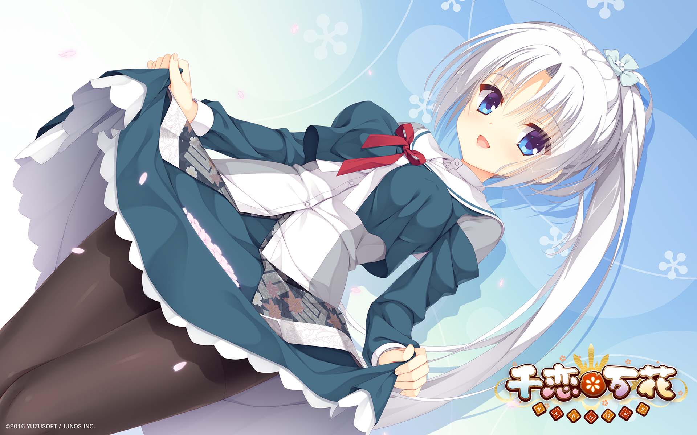
</p>
<p id="changesrc">
  <a href="javascript:loadbigimg();" id="changebtn" class="btn btn-primary btn-sm" role="button">加載原圖（2560x1600, 3.3M）⬆️️</a>
<p>
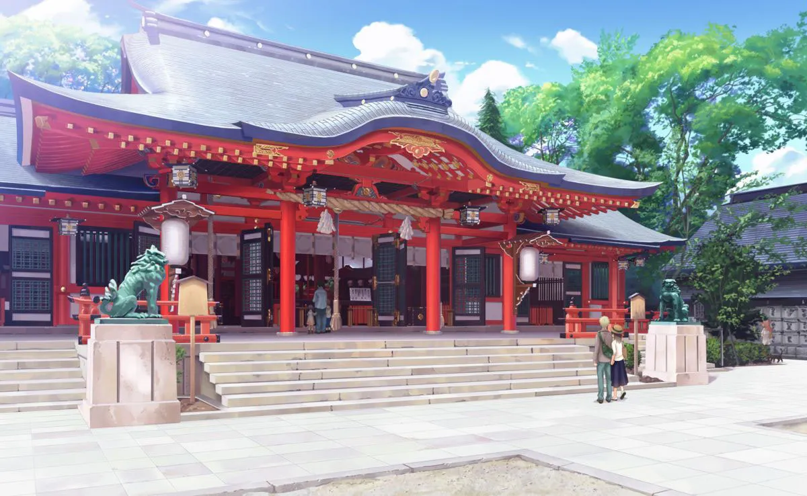

| 資訊一覽     |                 |
| :----------- | :------------------------------------ |
| **開發商**   | 柚子社           |
| **遊戲時長** | 35h                     |
| **攻略人數** | 6                     |
| **類型**     | 奇幻，搞笑，和風          |
| **難度**     | 中（選項挺多但是有路線圖）    |
| **分級**     | R-18（性行爲）      |
| **遊戲引擎** | KIRIKIRI Z      |

校服，包得比粽子還厚，，，

## 故事

高中生 **有地將臣** 有一天接到了老媽的神必來電，

<p class="text-danger">
將臣，你快點去你外公的旅館幫忙，<br class="d-md-none">
旅遊旺季要來了！
</p>
<p class="text-primary">
蛤？平時不都是你去嗎？<br class="d-md-none">
你快去，不用給我帶禮物了。
</p>
<p class="text-danger font-weight-bold">
我和你爹買了機票要去歐洲度假了掰
</p>

被老媽狠坑一頓的將臣，忿忿不平地回到了闊別多年的老家鄉間小鎮，**穗織**。

穗織 是個一天連公交車都沒幾趟的邊遠小鎮，
但是其獨特的和風建築、和風文化甚至是和風溫泉...吸引了許多外國人來旅遊，
所以街上都是外國人。

尋找着外公的去向，將臣來到了鎮上的神社⛩️
那裏正在舉行名爲 春日祭 的盛大慶典，
神社裏面正在舉行「誰能拔出這把刀？」的挑戰活動，
許多遊客都是衝着這兩個活動慕名而來，爲穗織貢獻了不少 GDP，，，

和外公見面後，將臣受到了外公的邀請，也試着去參加那個從岩石中拔出寶刀的活動。
因爲傳說那把刀具有神力，反正都是拔不出來，將臣決定稍微演一下就完事。

<p>
  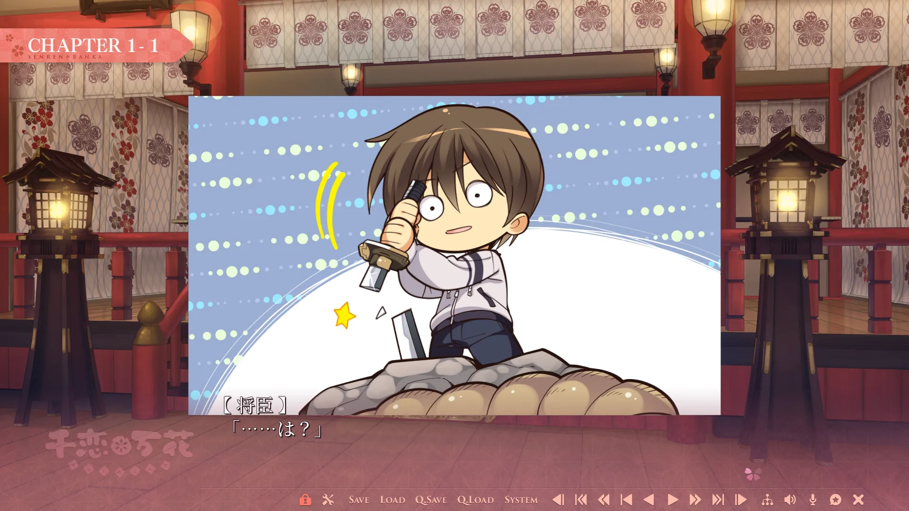
</p>

將臣簡單演了一下，神刀沒繃住，裂了

然後聞訊而來的男主外公，決定把男主賣給神社，用身體償還牠破壞文物的罪行，，，

## 登場人物

<style>
  .charname {
    font-size: 150%;
  }
  .namearea hr {
    margin: 1.5rem 0;
  }
  .sp-character img, .img-shade {
    filter: drop-shadow(0 0 6px #000c);
  }
  .sp-character {
    border-radius: 20px;
    overflow: hidden;
    box-shadow: 0 5px 11px 0 rgb(0 0 0 / 18%), 0 4px 15px 0 rgb(0 0 0 / 15%);

    /*-webkit-backdrop-filter: blur(1px);
    backdrop-filter: blur(1px);
    
    background-color: var(--chara-card-color);*/
    
    background-color: transparent;
    background-image: var(--this-bg);
    background-position: center;
    background-repeat: no-repeat;
    background-size: cover;

  }
  .sp-character .char-overlay {
    background-color: var(--chara-card-color);
    min-height: 450px;
    background-image: var(--right-bg);
    background-repeat: no-repeat;
    background-position: bottom 0px right calc(100% * 0.3 - 130px);
    background-size: 400px;

    margin: 0;
    padding: 0;
  }
  .sp-character.mako .char-overlay{
    background-size: 500px;
    background-position: bottom 0px right calc(100% * 0.3 - 80px);
  }
  @media screen and (max-width: 767px) {
    .namearea hr {
      margin: 1rem 0;
    }
    .pc-left {
      /*-webkit-backdrop-filter: blur(1px);
      backdrop-filter: blur(1px);*/
      
      background: var(--chara-card-color);
      transition: opacity 0.3s;
    }
    .pc-left.touch {
      opacity: 0.1;
    }
    .sp-character {
     background: unset;
      /*-webkit-backdrop-filter: unset;
    backdrop-filter: unset;*/
    }
    .sp-character .char-overlay {
      min-height: unset;
      background-size: contain;
      background-position: bottom 0px right 0px;
    }
    .sp-character.mako .char-overlay{
      background-size: contain;
      background-position: bottom 0px right 0px;
    }
    :root { /* 配色 */
      --chara-card-color: #ffffff87;
    }
    [data-user-color-scheme='dark'] {
      --chara-card-color: #1a1a1aa6;
    }
  }
  :root { /* 配色 */
  --chara-card-color: #ffffffb3;
  }
  [data-user-color-scheme='dark'] {
    --chara-card-color: #1a1a1aa6;
  }
</style>


<div class={`row sp-character ${uid}`} style={`--this-bg: url(../image/SRBK/chars/${no}.png)`}>
  <div class="col-12 char-overlay row" style={`--right-bg: url(../image/SRBK/chars/${no}-1.webp)`}>
    <div class="pc-left col-12 col-md-8">
      <div class="namearea col-12 pt-2">
        <div class="charname font-serif font-weight-bold font-italic">
          {name}
        </div>
        <div class="yomi font-italic">
          {yomi}
        </div>
        <hr />
      </div>
      <div class="infoarea col-12" html={html}>
      </div>  
    </div>
  </div>  
</div>


<sp-character no=1 name="芳乃" yomi="Cosplay 偶像巫女" uid="yoshino" >
  <p>
    神社裏唯一的巫女，每天下午都要登臺跳舞，<br>
    是全村人的偶像。
  </p>
  <p>
    不明所以的外國人則認爲她是個每天都要表演的敬業 Coser，<br>
    名聲越傳越廣的芳乃就成爲了超人氣 Cosplay 偶像。
  </p>
  <p>
    爲人嚴肅，所以當她聽說可以在神社裏<br>對男主的身體爲所欲爲的時候，<br>
    臉上直接出現了 你不要過來啊！！ 的驚慌神色。
  </p>
</sp-character>
<br>
<sp-character no=2 name="茉子" yomi="偶像貼身保鏢女忍者" uid="mako" >
  <p>
    茉子屬於忍者家族，由於一些歷史淵源，<br>
    她從小到大都一直護佑在巫女身邊，
  </p>
  <p>
    由於家族地位的關係，雖然兩人關係很好，<br>
    她還是沒辦法和巫女平等地做朋友。
  </p>
  <p>
    表面上活潑開朗平易近人，<br>
    實際上暗地裏看了很多（色情的）少女漫畫，<br>
    明明是處女，卻擁有六人之間最豐富的性經驗。
  </p>
</sp-character>
<br>
<sp-character no=3 name="叢雨（ムラサメ）" yomi="妖刀姬 Supervisor" uid="mrsm" >
  <p>
    自稱是神刀的管理員，<br>
    已經在小鎮上存活了 500 多年，<br>
    是神一般的存在，但是男主把妹的時候毫不含糊。
  </p>
  <p>
    自從男主拔出了神刀，<br>
    她就順理成章地把男主認作自己的主人，<br>
    要永遠效忠於他（誘騙成功）
  </p>
  <p>
    她沒有真正的身體，就如同幽靈一般，<br>
    所以不是每個人都能看見她，<br>
    會飛。
  </p>
</sp-character>

### 其他人物

<div class="row">
  <div class="row col-12 col-md-8">
    <div class="col-4 mx-0">
      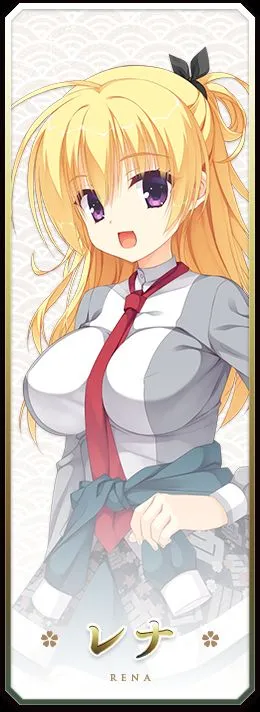
    </div>
    <div class="col-4 mx-0">
      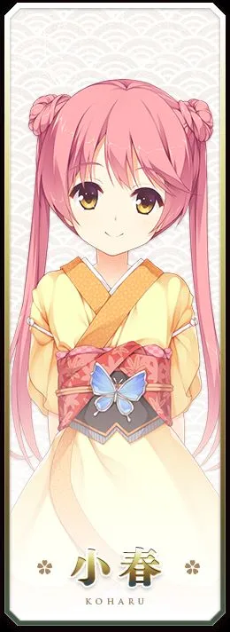
    </div>
    <div class="col-4 mx-0">
      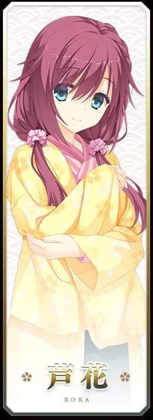
    </div>
  </div>
  <div class="col-12 col-md-4">
    <p>
      <strong><em>レナ</em></strong>：從歐洲遠道而來的留學生<br>
      <strong><em>小春</em></strong>：表妹<br>
      <strong><em>芦花</em></strong>：青梅竹馬的大姐姐
    </p>
    <p>
      <strong><em>男主角</em></strong>：你
    </p>
  </div>
</div>


## 遊戲 OP

動畫來自被牆的 Steam。



Galgame 金曲: <a href="/music/?id=25" target="_blank">🔗️恋ひ恋ふ縁</a>

我會告訴你在聽說過千戀萬花之前，我就已經聽過這首歌了嗎？

## 遊戲 CG

<p>
  
</p>

<p>
  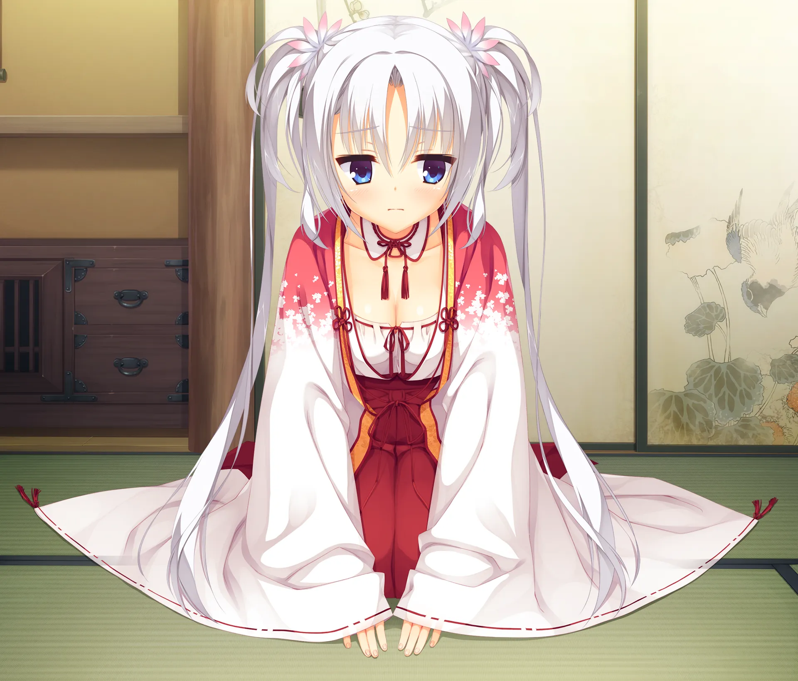
</p>

<p>
  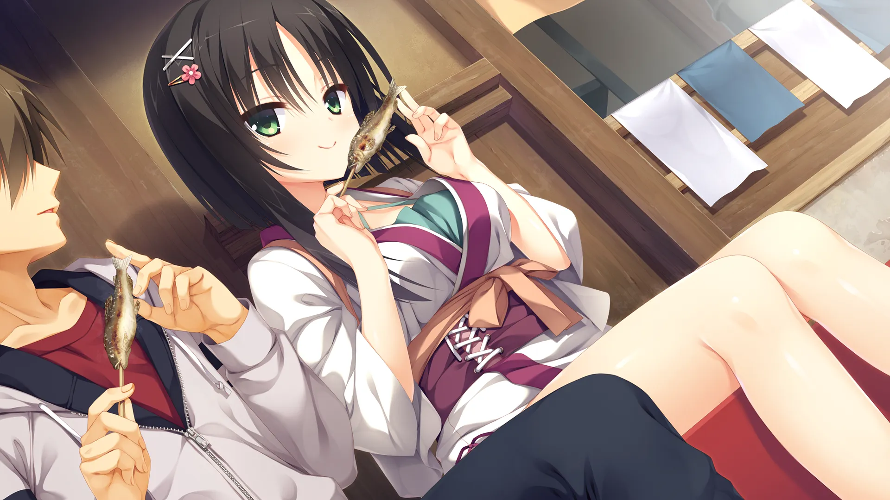
</p>

<p>
  
</p>

<p>
  
</p>

<p>
  
</p>

<p>
  
</p>

<p>
  
</p>

<p>
  
</p>

## 遊戲畫面


../image/SRBK/scn/0.webp
../image/SRBK/scn/1.webp
../image/SRBK/scn/2.webp
../image/SRBK/scn/3.webp



## 一句話點評

第一次打開這個遊戲的時候，我是歡呼雀躍的，
因爲這個遊戲充滿和風的氛圍、人物設定<br class="d-md-none">和 BGM 都太對我口味了。
之前介紹過的四目之神雖然也和風，
但是那個劇情太沉重了，所以歡樂的千戀萬花給我留下了非常好的第一印象。

又見柚子社，小心柚子廚，不過我才不是柚子廚，我只玩過兩部柚子的遊戲，
一部是星光咖啡館，一部就是千戀萬花。
比較一下千戀萬花和咖啡館兩部作品，咖啡館每天打工打爆，才是真白開水，
還是千戀萬花的故事比較有趣，算是加了糖的日本抹茶。

千戀萬花的故事節奏舒服，
每一個章節都不拖沓，都有及時給玩家新的刺激來保持興趣。
與此相對，之前玩的另一個 Galgame，<br class="d-md-none">開局大量專有名詞直接突臉，連講三十分鐘，
把我人都沖傻了，，，

輕鬆的氛圍，美麗的作畫，令人憐愛的角色，是我喜歡千戀萬花的理由。
（別誤會，我依然不是柚子廚）

## 還在猶豫是否下載？

有一個試玩錄像，很短，請欣賞裏面的和風 BGM！

<video controls preload="metadata" width='100%' poster='../image/SRBK/movie.webp'>
<source src="https://s3static-zone0.galgamer.eu.org/video-2d35/SRBK/4min-know.mp4" type="video/mp4">
</video>

BGM 曲名叫做：***今昔の街***


## 攻略順序

按照這裏的順序獲得最好的遊戲體驗。

<style>
.imgwrap {
  border-radius: 10px;
  overflow: hidden;
  display: inline-block;
  box-shadow: 0 5px 11px 0 rgb(0 0 0 / 18%), 0 4px 15px 0 rgb(0 0 0 / 15%);
  padding: 0;
  margin-right: 10px;
}
.imgwrap > img {
  background: transparent;
  width: 100%;
  height: auto;
}
.textwrap, .arow * {
  padding: 0;
}
</style>
<div class="container">
  <div class="my-3 row arow align-items-center">
    <div class="col-5 col-md-3">
      <div class="imgwrap">
        
      </div>
    </div>
    <div class="col-7 col-md-9 textwrap">
      先把眼前的難題解決吧！
    </div>
  </div>
  <div class="my-3 row arow align-items-center">
    <div class="col-5 col-md-3">
      <div class="imgwrap">
        
      </div>
    </div>
    <div class="col-7 col-md-9 textwrap">
      瞭解神社的歷史和巫女身上背負的重擔吧！
    </div>
  </div>
  <div class="my-3 row arow align-items-center">
    <div class="col-5 col-md-3">
      <div class="imgwrap">
        
      </div>
    </div>
    <div class="col-7 col-md-9 textwrap">
      神社的事情先放在一邊，去找可愛的姐妹談戀愛吧！
    </div>
  </div>
  <div class="my-3 row arow align-items-center">
    <div class="col-5 col-md-3">
      <div class="imgwrap">
        
      </div>
    </div>
    <div class="col-7 col-md-9 textwrap">
      和不遠萬里特地跑來的留學生揭開小鎮的謎團吧！
    </div>
  </div>
  <div class="my-3 row arow align-items-center">
    <div class="col-5 col-md-3">
      <div class="imgwrap">
        
      </div>
    </div>
    <div class="col-7 col-md-9 textwrap">
      幫女忍者分擔繁重的日常工作吧！
    </div>
  </div>
  <div class="my-3 row arow align-items-center">
    <div class="col-5 col-md-3">
      <div class="imgwrap">
        
      </div>
    </div>
    <div class="col-7 col-md-9 textwrap">
      <span class="text-danger font-weight-bold">請最後再來攻略</span><br>實現小叢雨五百年來的心願吧！
    </div>
  </div>
</div>

## 資源和下載

### Steam 版（可切換多種語言）



Steam 商店版需要額外安裝 R-18 補丁。

網友發的資源： 
（已安裝 R-18 補丁）

備註：Hikari Field 警告

### 原版光盤鏡像（日文）

遊戲本體：

```
magnet:?xt=urn:btih:81ab791e4970096b5e86fe66378055d6fe99fbe4
```

文件名：	(18禁ゲーム) [160729] [ゆずソフト] 千恋＊万花 + Update 1.10 + Character Song CDs + Mini Drama CD + Drama CD + Scans
這個種子還包含了一些音樂和小故事的錄音。

或者：

```
magnet:?xt=urn:btih:8223a51b7d60e9837f87f1afe27ad87863b48537
```

文件名：千恋＊万花 + 修正パッチ

安裝遊戲後，請在 [🔗️柚子社官網](http://www.yuzu-soft.com/products/senren/download.html) 下載升級補丁。

漢化：別漢化了，請直接玩日文，中文版直接找 Hikari Field，，，


## 花絮

柚子社太出圈了，不僅是 Galgame 玩家，就連一般通過路人都知道柚子社，
所以千戀萬花知名度也高到離譜，看看 Steam 上的盛況就知道了，，，

接下來我要放一些在收集本文素材的時候偶遇的文件👀️

### Analog 作畫

<div class="row">
  <div class="col-12 col-md-9">
    
    ../image/SRBK/misc/Bonus01.webp
    ../image/SRBK/misc/Bonus02.webp
    ../image/SRBK/misc/Bonus03.webp
    ../image/SRBK/misc/Bonus04.webp
    
  </div>
</div>
<br>

和風就是要有曼珠沙華，沒有彼岸花就不叫和風，，，（圖 3）

### 掛畫

<p>
  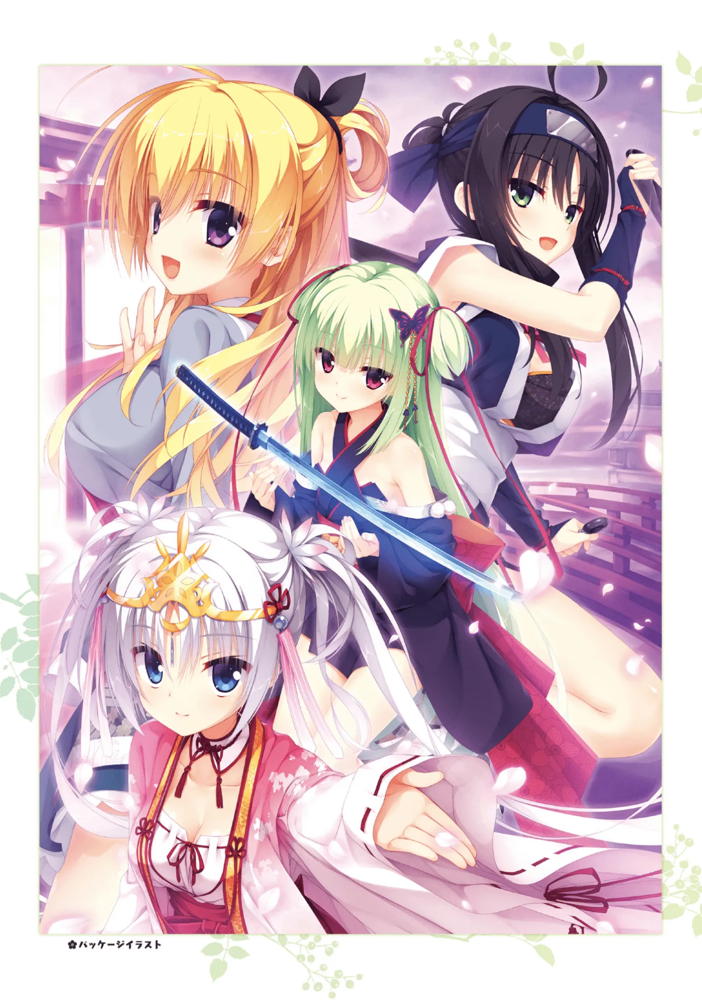
</p>

<p>
  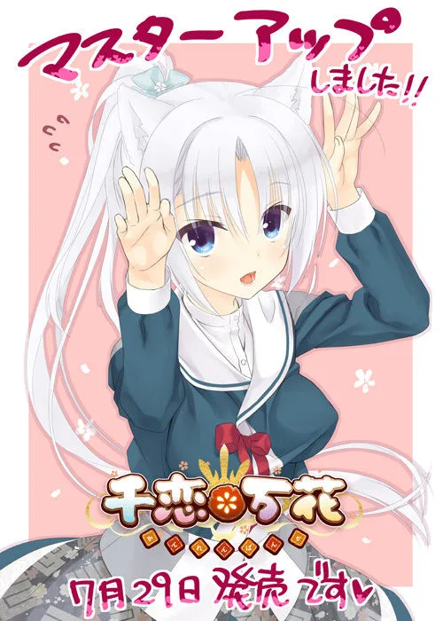
</p>

快看芳乃的貓耳，遊戲裏就沒出現過幾次，柚子社就是喜歡放着重要的設定不用。

### Galgame 聯動

<p>
  
</p>

太搞了，我就沒見過幾次 Galgame 聯動，但是千戀萬花已經是聯動麻了屬於是。

### 角色歌光盤

連聲優訪談都附在裏面

<p>
  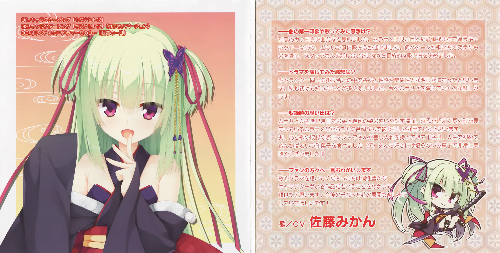
</p>

還有

<div class="row">
  <div class="col-6">
    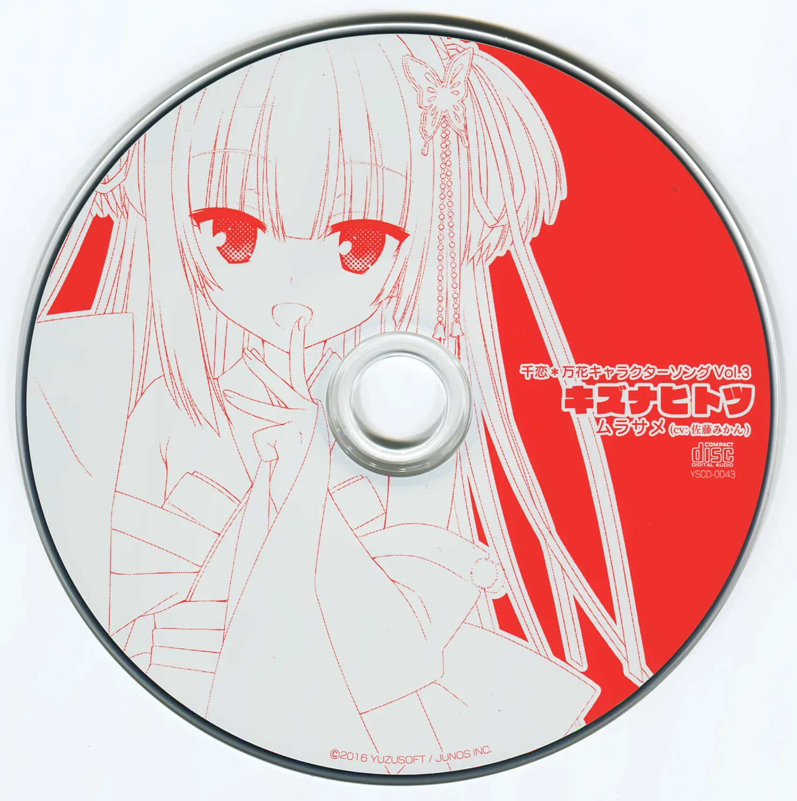
  </div>
  <div class="col-6">
    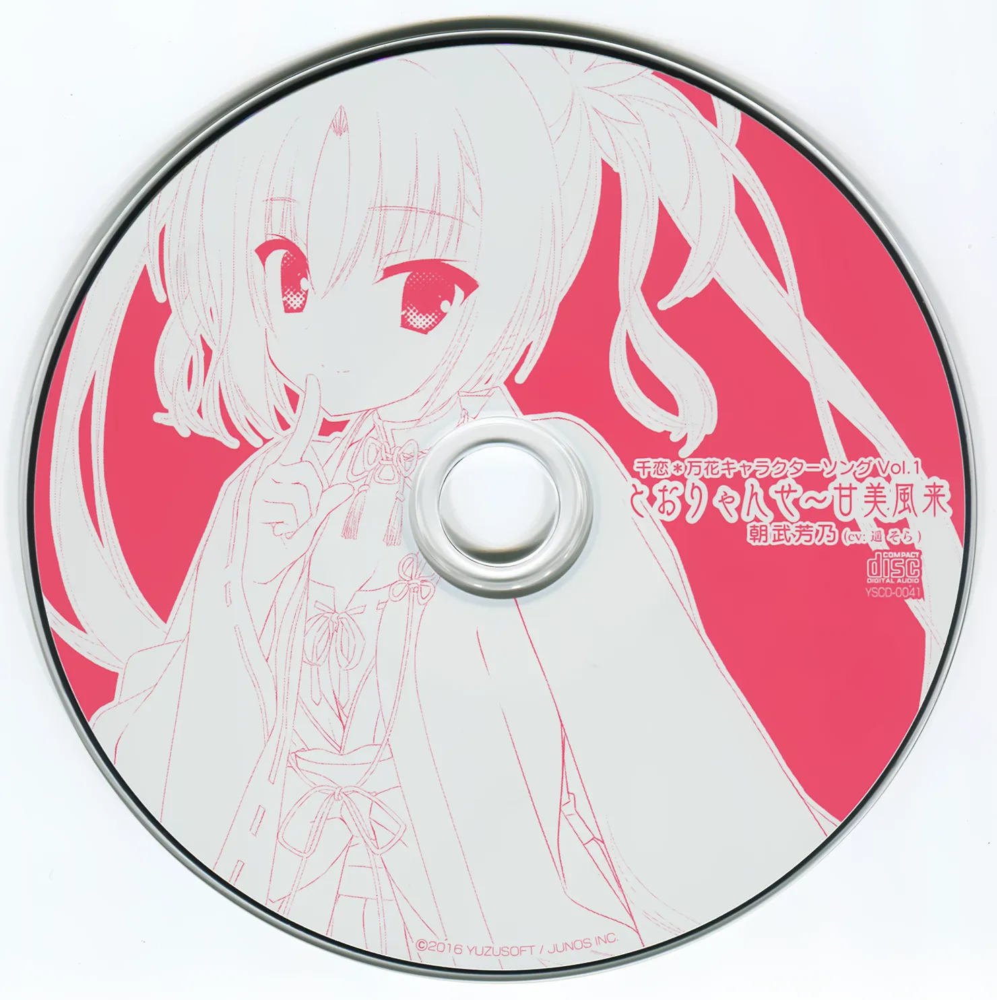
  </div>
  <div class="col-6">
    
  </div>
  <div class="col-6">
    
  </div>
</div>

角色歌我有傳到 <a href="/music/?id=24" target="_blank">🔗️Galgame 金曲</a>（在新頁面打開）

然後光盤後面還附有一些遊戲裏面沒有的小故事，
比如說神社的各位在討論要去哪裏賞花或者泡溫泉之類的。

那些光盤在上面的 BT 種子裏面有。

### 系統提示音，推特頭像，千戀萬花時鐘 APP...

啥都有我就不發這裏了，群裏有群友發過，，，

### 二次創作

多如牛毛！上 e-hentai 簡單查查就能找到，有漫畫有小說啥都有

### 聊天室貼紙

阿這其實是官方放 Line 上面賣的，但是 Telegram 的也有，都被群友用爆了

<a href="tg://addstickers?set=senrenbanka_sticker">🔗️直達 Telegram 貼紙</a>

### 迫害小叢雨

你看那個綠色頭髮的，有沒有覺得眼熟？
沒錯，就是那個...就是那個曾經在 YouTube 上做直播的，，，

> 開始進行 AI 識圖。。。
> 頭髮顏色：綠色
> 眼睛顏色：紅色
> 胸部：未發現
> 髮飾：蝴蝶
> 識別成功！準確率 89.64%
> 結果：

結果是什麼❓️❓️❓️

這就導致我一個不玩 Galgame 的二次元朋友，一提到千戀萬花，就是那個

~~粽子精...~~

### 熱愛小叢雨❤️

別煉啦別煉辣！人家已經 500 歲辣！！
甚麼你說你更興奮了？沒救啦！！！

突開ムラサメ角色歌的網易雲音樂評論區，一下子噴出 5,000 多條評論，
嚇得我閉上眼睛趕緊退出😅

<style>
.ar16x9{
  aspect-ratio: 16/9;
}
body {
    background: var(--bg-url) no-repeat fixed center;
    background-size: cover;
    /*-webkit-font-smoothing: unset;*/
}
#banner {
    background: url('')!important;
    background-color: transparent!important;
}
#toc {
     background-color: var(--board-bg-color);
     padding: 20px 10px 20px 20px;
     border-radius: 10px;
}
#board {
    backdrop-filter: blur(5px);
    -webkit-backdrop-filter: blur(5px);
   /* background-color: #3337 !important;*/
}
.full-bg-img > .mask {
  background-color: rgba(0,0,0,0) !important;
}
.page-header  {
  background-color: rgba(0,0,0,0.5);
  padding: 3px;
  border-radius: 5px;
}
:root {
  --board-bg-color: rgba(255,255,255,0.7);
  --bg-url: url('../image/SRBK/bg-0.webp')
}
[data-user-color-scheme='dark'] {
  --board-bg-color: rgba(0,0,0,0.85);
  --bg-url: url('../image/SRBK/bg-1.webp')
}
::selection {
    /*background-color: #f00;*/
}
.page-header .mt-1 span.post-meta {
    /* 隱藏嚇人的字數統計 */
    display: none;
}
</style>

<script>
  //document.documentElement.setAttribute('data-user-color-scheme', 'dark');
  function loadbigimg(){
    let cover = document.getElementById('coverimage');
    let btn =  document.getElementById('changesrc');
    let bigurl = cover.getAttribute('originimg');
    cover.setAttribute('src', '');
    cover.setAttribute('src', bigurl);
    cover.parentElement.setAttribute('href', bigurl);
    btn.parentElement.removeChild(btn);
  }
  document.addEventListener("DOMContentLoaded", function(){
    let pclefts = document.querySelectorAll('.pc-left');
    pclefts.forEach((el) => {
      el.addEventListener('touchstart', function(){
        el.classList.add('touch');
      })
      el.addEventListener('touchend', function(){
        el.classList.remove('touch');
      })
    });
    setTimeout(() => document.documentElement.setAttribute('data-user-color-scheme', 'light'), 1000)
  })
</script>
