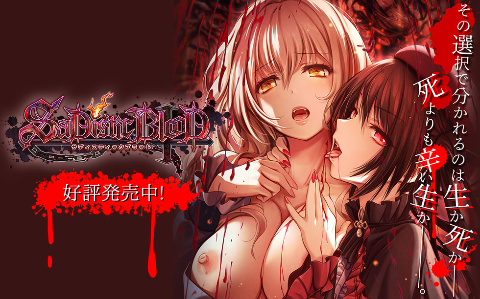
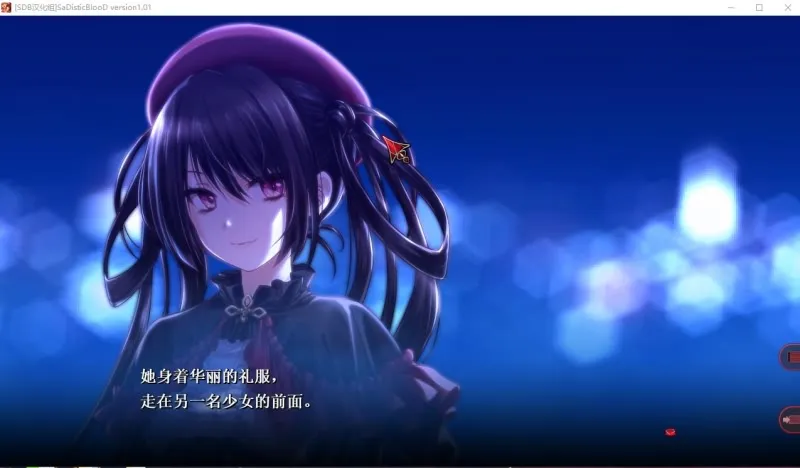
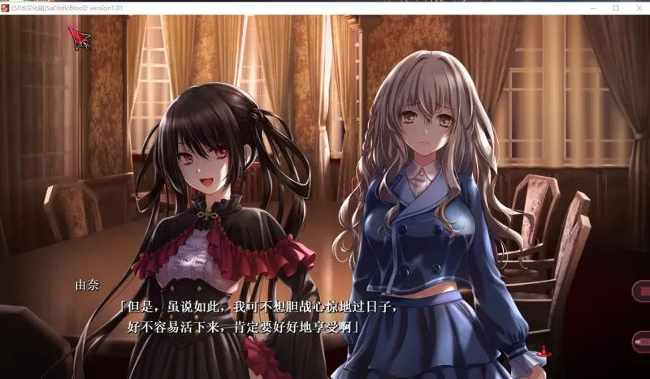
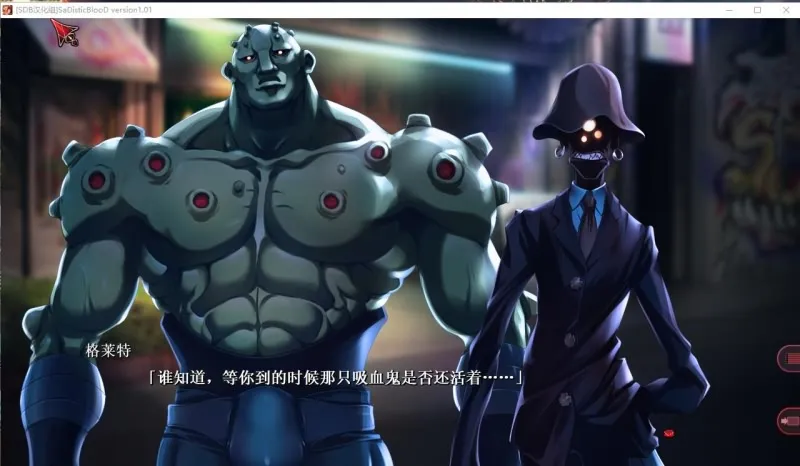
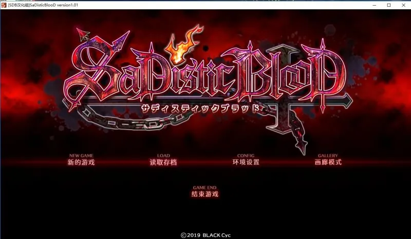
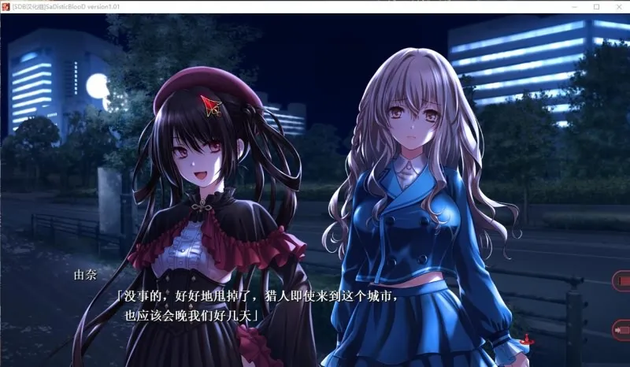
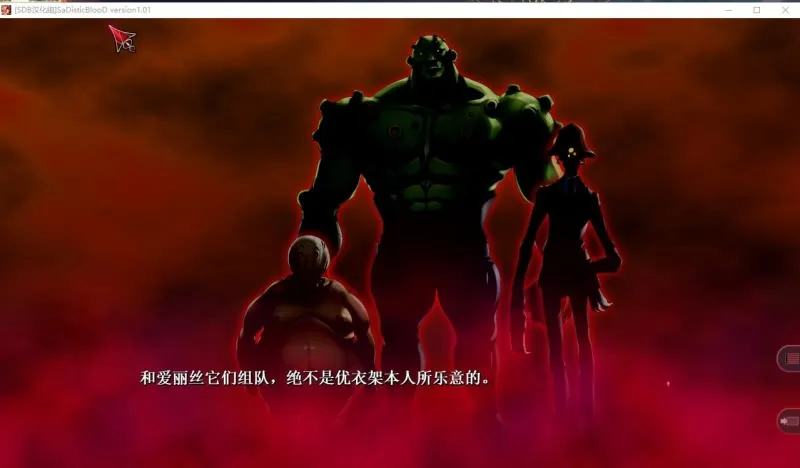
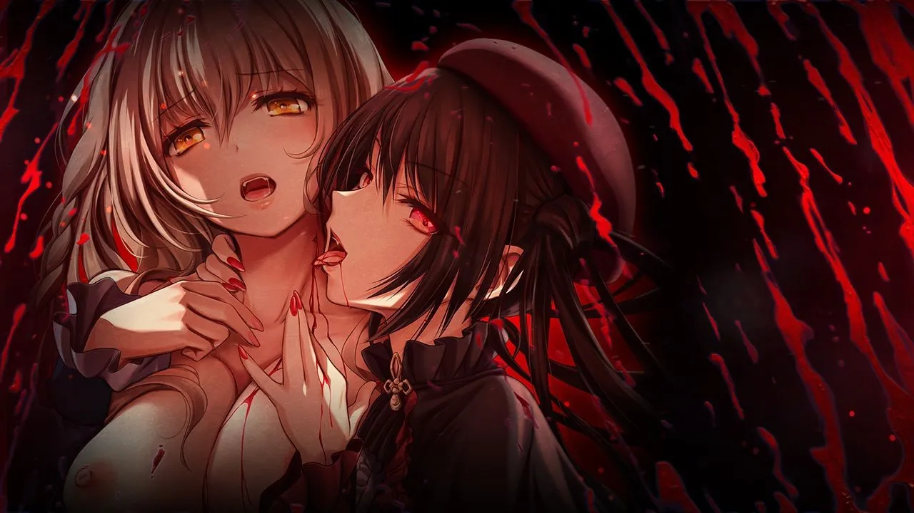
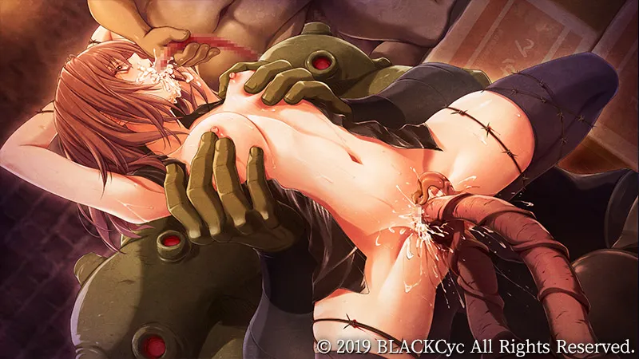

`作者：木衛一`

吸血鬼情侶園原由奈和七瀨靜羽逃入人工島，在吸血鬼獵人和生化兵的追獵下艱難求存。

| 資訊一覽     |                 |
| :----------- | :------------------------------------ |
| **開發商**   | black cyc|
| **編劇**     |和泉 万夜|
| **遊戲時長** | 4 ~ 8 小時                     |
| **類型**     | 獵奇 血腥                |
| **難度**     | 低 |
| **分級**     | R-18G（大部分場景都很激烈）      |

## 故事梗概

在經過長達一年的逃亡生涯以後，吸血鬼情侶 **園原由奈** 和 **七瀨靜羽** 輾轉流亡到了千咲楽鎮。

千咲楽鎮是一個平靜的人工島，僅僅依靠一座橋梁和主大陸相連。
這也許可以成爲我們漫長逃亡生活的盡頭，抱著這樣的想法，她們鬆懈下來。

滿月之夜，吸血鬼性欲最旺盛的時刻，在豪宅的大床上，她們極盡纏綿。
可就在這時，僕人的人頭被丟盡房間，而後立刻爆炸。

“將吸血鬼一個不留的全部消滅！”

原來，教會所屬的吸血鬼獵人 **榊優衣架** 早已把握到了吸血鬼二人的行蹤。
如今，她和她所帶領的三個教會對吸血鬼生化兵器已經包圍了大宅。

慌亂中，園原由奈拉著七瀨靜羽勉力逃出生天。可是在這孤立的人工島上，她們又應該如何躲避吸血鬼獵人們接下來的圍捕？

海水是吸血鬼的大敵，要逃出人工島，只能靠那唯一一座和大陸相連的橋梁。還是說，應該利用千咲楽的地勢，在這裏將吸血鬼獵人一行全部埋葬？

與此同時，吸血鬼獵人榊優衣架也開始隱隱感覺到不安。
儘管對自己千錘百煉的技藝有絕對的信心，也從未動搖過為被吸血鬼殺害的家人復仇的決心，

但鷹眎狼顧的生化兵器三人組卻令她開始擔憂自己能否全身而退......

## 登場人物

</img>

</img>

<mark>在日本各地旅行的吸血鬼.</mark> 
穿著紅黑洋裝的嬌小美人，性格高傲强勢，是一個捨棄人性的完完全全的吸血鬼。 
必要時可以毫不猶豫的把人類轉換為吸血鬼做為棋子使用。  
由於教會的追捕，她避免做出任何可能會被教會發覺的舉動， 
將吸血頻率也壓到滿足基本需求的程度。然而在被教會獵人發現時， 
她也會大範圍的吸血來增强自己的力量。 
吸血鬼依靠指甲生長而成的長爪自衛，這點對由奈也是一樣。她的爪子就如同匕首一樣鋒利。  
<mark>自從和七瀨靜羽相遇后，她們已經形影不離的相伴彼此一年了。對於兩人而言，對方都是不可或缺的存在.</mark>

  

</img>

</img>

<mark>和由奈一起周流日本各地的吸血鬼。</mark> 
身材豐滿的美人，性格软弱，不願意吸人血。 
比起吸血鬼，靜羽表現的更像一個人類。  
她非常讨厌战斗，每次被吸血鬼猎人发现時都会選擇逃跑， 
即使被逼到绝路，也會讓由奈去面對战斗。 
<mark>在故事發生的月圆之夜，靜羽的吸血冲动不停的湧上來， 她不斷的向由奈索求，籍由兩人的性和由奈的血來壓抑吸人血的冲动。</mark>

  

</img>

</img>

<mark>教會所屬的吸血鬼猎人之一。</mark> 
过去她的家人被吸血鬼杀害，因此她為仇恨所驅動， 
加入教會刻苦磨練，成爲一名優秀的吸血鬼獵人。  
教會配給她的裝備也十分優良。迄今为止， 
依靠著自己的技藝和教會的資源，她已经獵杀了許許多多的吸血鬼。  
在教會的命令下，她帶著三个教會改造的生物兵器周游全国， 
獵殺或捕獲潛伏在日本的吸血鬼。  
在故事發生的月圓之夜，她追尋著主角來到千咲楽， 
出於對自己絕對的信心，她對獵殺吸血鬼二人并無憂懼。 
<mark>但難以控制的生化兵器三人組卻讓她感到自己身處極大的危險之中。</mark>

  

  <ol class="carousel-indicators">
    <li data-target="#carouselExampleIndicators" data-slide-to="0" class="active"></li>
    <li data-target="#carouselExampleIndicators" data-slide-to="1"></li>
    <li data-target="#carouselExampleIndicators" data-slide-to="2"></li>
  </ol>
  

    

    

    

      
    

      

<strong>生化兵器 Rapunzel</strong>  
教會為對付吸血鬼而改造的生化人。 
由於常年被作爲獵殺工具使用， 
根本毫無人性可言， 
熱衷于從折磨凌辱吸血鬼中獲得快感。  
性格病態，内心深處非常厭惡自己受制於人這個事實，  
對於要被優衣架命令這件事感到非常痛恨。 
因此優衣架對他極爲防範。 
主要依靠改造的身體中生長出來的觸手和吸血鬼搏鬥。 
但似乎對於有利爪的吸血鬼而言， 
觸手在戰鬥中并無優勢

    

    

    

    

      
    

      

<strong>生化兵器 Alice</strong>  
Alice 是絕對的力量派，只願意服從比自己强的人。 
因此對於精通各種戰鬥 
技術的優衣架勉强還有點尊重。  
這讓優衣架稍感安慰又覺得不安， 
<mark>畢竟沒人能保證如果某一天 
自己在力量上勝不過 Alice 的話 
會淪落到何種下場。</mark>

    

    

    

    

      
    

      

<strong>生化兵器 Gretal</strong>  
他對優衣架有一種狂熱的崇拜和熱愛， 
説是奉為神明也不爲過。  
優衣架一定程度上也倚靠著他才能控制住另外兩個生化兵器。 
但這不意味著優衣架對他有任何的好感。 
儘管説不出原因，優衣架也能隱隱約約的意識到， 
<mark>怪物的崇拜和傾慕，絕不是人類理解的那種。</mark>

    

  

  <a class="carousel-control-prev" href="#carouselExampleIndicators" role="button" data-slide="prev">
    
    Previous
  </a>
  <a class="carousel-control-next" href="#carouselExampleIndicators" role="button" data-slide="next">
    
    Next
  </a>

## 遊戲截圖

  <ol class="carousel-indicators">
    <li data-target="#carouselExampleIndicators-screen" data-slide-to="0" class="active"></li>
    <li data-target="#carouselExampleIndicators-screen" data-slide-to="1"></li>
    <li data-target="#carouselExampleIndicators-screen" data-slide-to="2"></li>
    <li data-target="#carouselExampleIndicators-screen" data-slide-to="3"></li>
    <li data-target="#carouselExampleIndicators-screen" data-slide-to="4"></li>
    <li data-target="#carouselExampleIndicators-screen" data-slide-to="5"></li>
    
  </ol>
  

    

      
    

    

      
    

    

      
    

    

      
    

    

      
    

    

      
    

  

  <a class="carousel-control-prev" href="#carouselExampleIndicators-screen" role="button" data-slide="prev">
    
    Previous
  </a>
  <a class="carousel-control-next" href="#carouselExampleIndicators-screen" role="button" data-slide="next">
    
    Next
  </a>

 

## CG

R-18G 慎滑

  <ol class="carousel-indicators">
    <li data-target="#carouselExampleIndicators-cg" data-slide-to="0" class="active"></li>
    <li data-target="#carouselExampleIndicators-cg" data-slide-to="1"></li>
    <li data-target="#carouselExampleIndicators-cg" data-slide-to="2"></li>
    <li data-target="#carouselExampleIndicators-cg" data-slide-to="3"></li>
    <li data-target="#carouselExampleIndicators-cg" data-slide-to="4"></li>
  </ol>
  

    

      
    

    

      
    

    

      
    

    

      
    

    

      
    

  

  <a class="carousel-control-prev" href="#carouselExampleIndicators-cg" role="button" data-slide="prev">
    
    Previous
  </a>
  <a class="carousel-control-next" href="#carouselExampleIndicators-cg" role="button" data-slide="next">
    
    Next
  </a>

 

## 介紹動畫

<video controls preload="metadata" width='100%'>
<source src="https://bitbucket.org/sa-ya/my-static/raw/f54b8747c16559187743b445c48f320cdc8ab659/SadisticBlood/Sadistic%20Blood.mp4" type="video/mp4"/>

 To view this video please enable JavaScript

</video>

## 簡評

很容易從標題上意識到本作和 MinDeaD BlooD 的联系。
兩者的世界观也相差極微。吸血鬼和
帶著生化兵器的教會獵人直接爭鬥故事設計似乎非常久遠，
至少在我印象中是10年前就已經是
爛大街的地攤文學都會出現的設定。

國内愛歐的漫畫《血族》也是這種世界觀的產物。
所以本作單單看世界觀并不出彩，
但對於一個時間如此短的游戲而言，
一個已經耳熟能詳的世界觀似乎能省略介紹和引入的文字，
有助於把大部分的文本集中在故事人物的衝突上。

人物少，地點封閉，世界觀簡單，
這使得作者更容易在一個較小的篇幅内講完一個好故事。

既然是和泉萬夜出品的gal，那麽有非常過激的性愛
和虐待場景肯定不值得驚奇。

出於不劇透的理由不能過多的討論這些内容
究竟過激到何種程度。
因此還請有興趣的朋友掂量好自己的生理承受能力。

值得一提的是這部gal中出現的選項。
我們知道gal中的分支選項往往用於決定
事件的走向或者塑造主人公的喜好，
最有名的莫過於DR中工口娜問男主角
是喜歡巨乳貧乳還是美乳。

而在這部gal中，選項塑造了兩位吸血鬼情侶閒
對彼此的依賴程度。如果由奈對靜羽索取過多，
就會導致靜羽失陷。

而如果由奈自己奉獻太多，自己就會遭遇不幸。
在Sadistic Blood中，一部分選項決定了故事中的事件，
這決定了大方向的劇情分支。

而另一部分選項則塑造了吸血鬼情侶閒的
給予—索求關係，這決定了大劇情分支中的細小分支走向。

健康的愛情關係需要給予和索取的平衡，
我想這是作者通過這種選項設置想要傳遞給讀者的信息。

## 還在猶豫是否下載？

這裏有一個 9 分鐘的試玩。

<video controls preload="metadata" width='100%'>
<source src="https://bitbucket.org/sa-ya/my-static/raw/00d563ceb27caebf74d4e0886ead2a2dbfa029fe/SadisticBlood/9min-know.mp4" type="video/mp4"/>

 To view this video please enable JavaScript

</video>

## 資源與下載

請看評論區。

