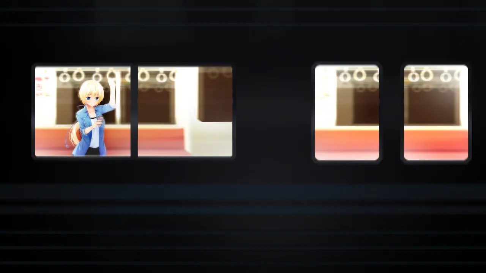
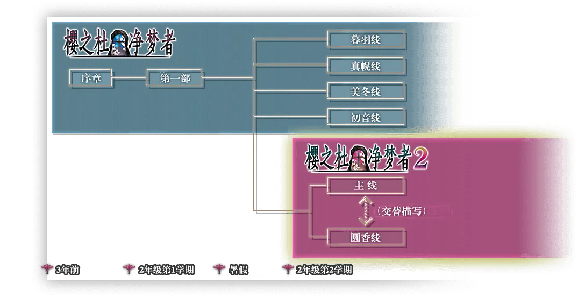
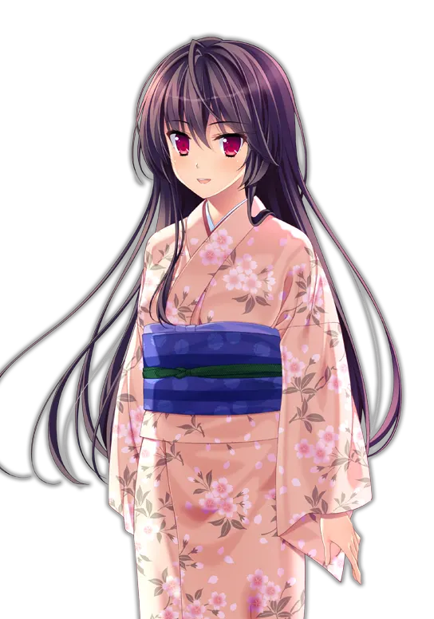
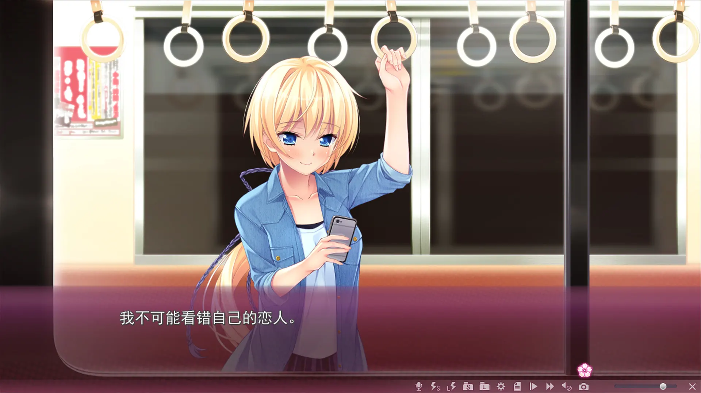
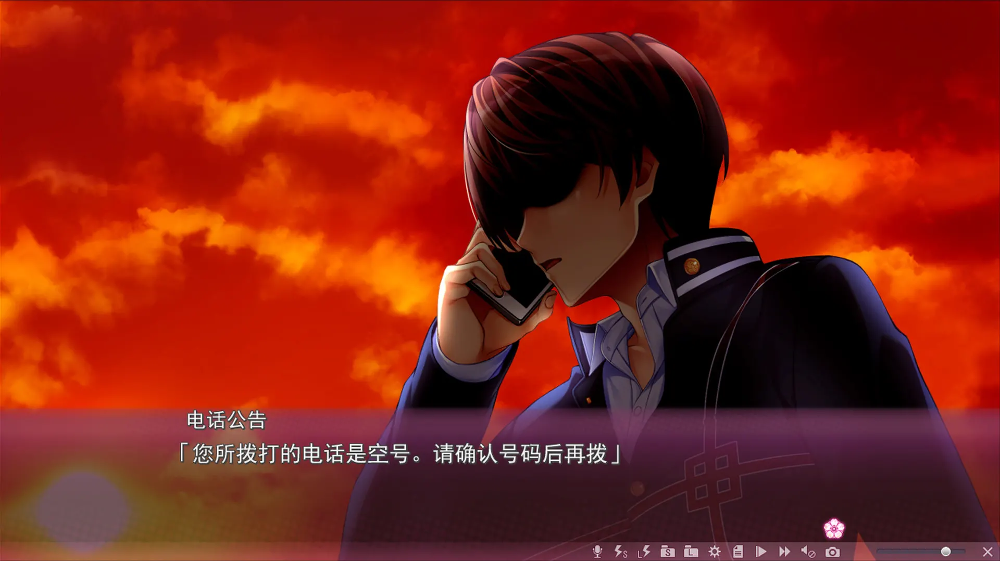
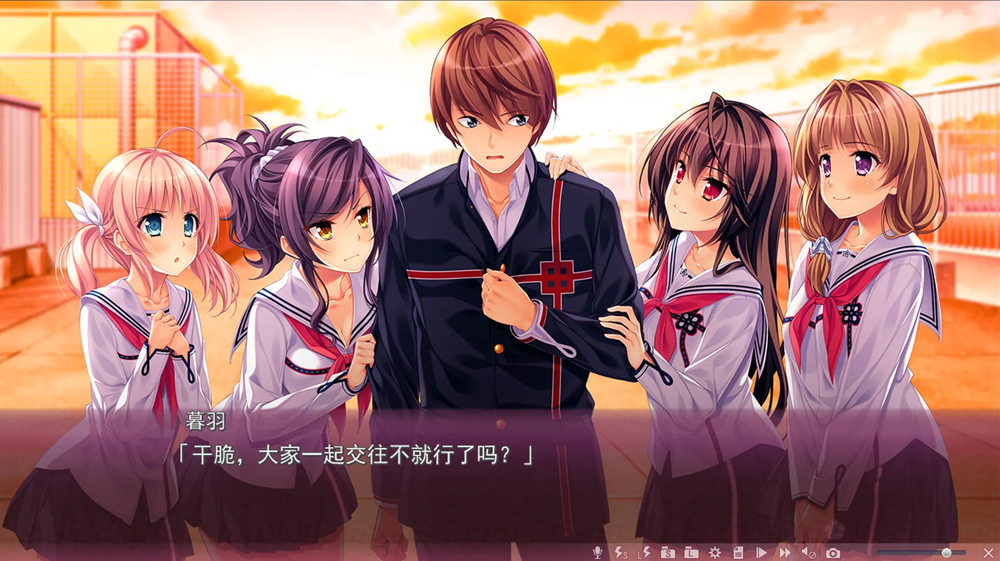
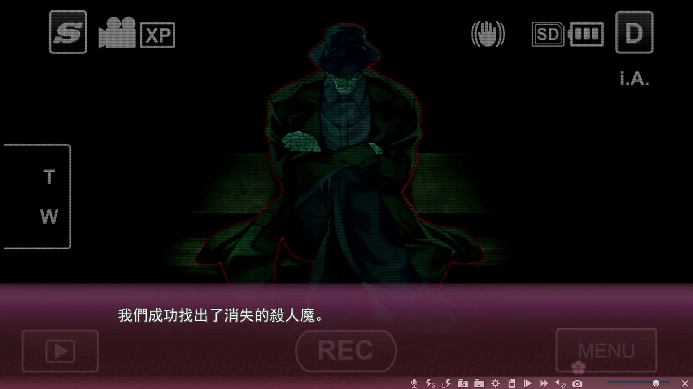
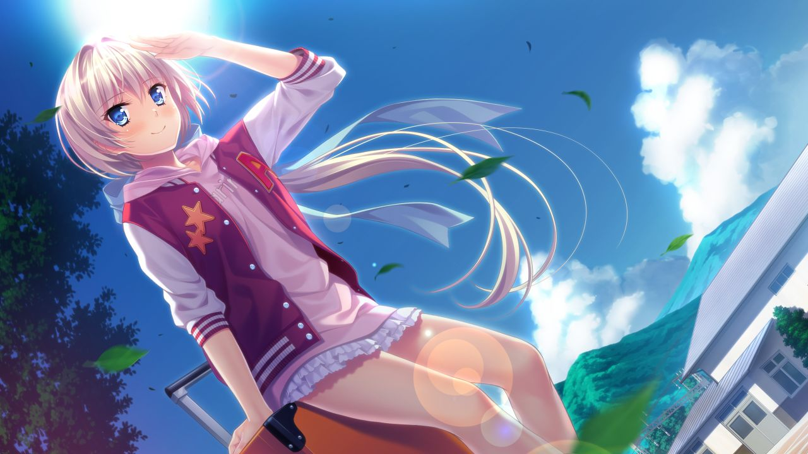
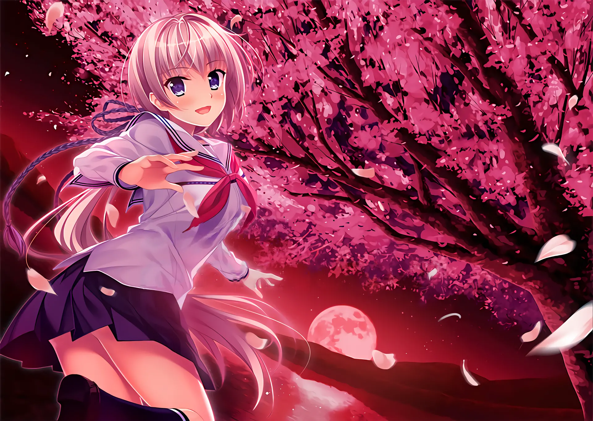

`作者：桐遠暮羽`

> 從殺人魔手中倖存的秋津圓香和青梅竹馬的慎司揭開了可怕的謎團，給身處另一個世界中深陷夢魘的櫻之杜†凈夢者小隊帶來了希望。


溫馨提示：本文介紹的是懸疑遊戲系列『櫻之杜†凈夢者』的續集，是評測的第二部分。如果您第一次聽說本系列遊戲，建議先閱讀本文的第一部分「[櫻之杜†凈夢者（一）：遇害的青梅竹馬，夢魘的開始](/article/56863)」。

| 資訊一覽     |                              |
| :----------- | ---------------------------- |
| **開發商**   | MOONSTONE（月石社）          |
| **編劇**     | 吳（人稱月石社腦洞編劇老吳） |
| **遊戲時長** | 20 小時                      |
| **難度**     | 低（沒有複雜的選項和路線圖） |
| **分級**     | R-18（性行爲描寫，恐怖）     |


## 故事 - 上接櫻之杜†凈夢者（一）

表白的那一天，慎司確信能和圓香**永遠**在一起，直到第二天圓香搬去了東京。

雖然說兩人遠隔異地，但這實在算不上太壞，和**遭遇殺人魔**比起來的話。

三年後，耐不住寂寞的圓香回到櫻之社，想要和慎司一起讀高中。

來到車站迎接的慎司發現，自己的女朋友還是這麼的美麗開朗，

兩人進了同一個班，沒有惡魔，也沒有自稱屬於**櫻之杜†凈夢者**的神必女生。

兩人似乎即將共度一段**甜蜜時光**。

**如果櫻之社幾年前發生的那些事件已經結束了的話。**

<br>

流逝的時間就像一輛一路向前的火車，軌道分岔的地方，可能就通往擁有你或失去你截然不同的兩個世界。我卻只能坐在一頭，看着坐在另外一頭的你漸行漸遠。



------

打倒了殺害圓香的殺人狂魔，回歸和平日常的慎司，再一次撥通了已故青梅竹馬的電話。

嘟——您撥打的電話是空號...

尚未從悲傷中解脫出來的慎司，卻不能再消沉下去了。

因爲**和平安寧，風景優美**的海邊小鎮，櫻之社，並沒有恢復以往的日常..

新的惡夢再次籠罩櫻之社，潛伏在其中的，有惡靈，有怪物，甚至還有殺人狂魔。

在惡夢中死去的人，在現實中也會死去。能夠守護小鎮的最後希望，就只有**我們**。

**這場惡夢的盡頭，會不會通往有你存在的世界呢。**



## 一句話點評

續集的劇情依然繼承了劇本家老吳的巨大腦洞，構造的懸疑設定依然是層層展開令人上癮。本作中利用令人顫抖的 BGM 和陰森的作畫對惡夢的恐怖氛圍進行了徹底的渲染，使得晚上獨自一人戴上耳機遊玩該遊戲成爲絕妙的享受（好幾次嚇到直接登出桌面俺會亂說？）。本作還加入了一些穿越元素，令邏輯更加錯綜複製，最後的無漏洞完美解答也是讓人醍醐灌頂。

此外，本作中青梅竹馬圓香成爲了可攻略角色，而圓香故事線在瘋狂膩歪做愛和哈人恐怖探險中的反覆橫跳令玩家徹底破防，這正是對「一成不變的甜蜜發糖就是死水一潭」的真實證明。

綜上所述，櫻之杜†凈夢者 2 是一個具備不亞於前作精彩程度的完整作品（而不是什麼恰爛錢的 DLC！），是能當之無愧作爲前作續集的絕美故事。

~~`解謎完成後，將是和各大女主的瘋狂做愛時間。`~~

## 遊戲 OP 動畫欣賞

請欣賞世界名曲：**主題歌『繋がらない世界』**

作詞：華憐

作編曲：電気

歌：電気式華憐音楽集団 

<video controls width='100%' preload="metadata" poster="../image/SakuraNoMori-Dreamers-2/CG6.jpg" >
<source src="https://cdn.cloudflare.steamstatic.com/steam/apps/256744846/movie480.webm" src-cn="https://media.st.dl.pinyuncloud.com/steam/apps/256744846/movie480.webm" type="video/webm"/>
<source  src="https://cdn.cloudflare.steamstatic.com/steam/apps/256744846/movie480.mp4" src-cn="https://media.st.dl.pinyuncloud.com/steam/apps/256744846/movie480.mp4" type="video/mp4"/>
<p> To view this video please enable JavaScript</p>
</video>

動畫來自 Steam。

還有，本作的 ED **さくら雫** 也是世界名曲，我是真喜歡電氣華憐的歌。

<video controls width='100%' preload="metadata">
<source src="https://bitbucket.org/sa-ya/my-static/raw/96fea2e8391e89fa19507b9905e167924b1e3ad6/SakuraNoMori-Dreamers-2/Sakura-2-Ed-Sakurashizuku-1.mp4" type="video/mp4"/>
</video>

## 登場人物

和前作一致，因此就移到下面來了。這裏放上另一套不同的服裝。

### 吹上慎司

  

**男主角，能看到惡靈和幽靈，**

投身櫻之杜†凈夢者事業，爲了小鎮而奔走。

`格言：這個小鎮就由我來守護！`

 *  並沒有很想開後宮。

<!--- 這是爲了讓新的段落出現在圖片下面 -->
<div style="clear: both;"/>

### 秋津圓香

  

**慎司的青梅竹馬兼女友，**

時隔三年回到慎司身邊，感覺更有女人味了。

她自己這麼覺得，，，

`格言：要永遠在一起喔`

 * 穿上衣服感覺像是平胸。
<div style="clear: both;"/>

### 桐遠暮羽

 

 **櫻之杜†凈夢者頭目，擁有斬殺異形的能力，**

 **戰鬥少女，平時喜歡穿和服**

 `格言：和你在一起我就能夠一直幹下去`

  * 那當然指的是櫻之杜†凈夢者的大家。
<div style="clear: both;"/>

### 閑宮真幌

 

 **學姐，**

 **櫻之杜†凈夢者成員，不善打架。**

 **但是身懷特別好用的技能。**

  `格言：這次的戰鬥會很哈人喔`
 <div style="clear: both;"/>

 ### 衿坂美冬

  

  **畫家，桐遠暮羽的好朋友，**

 **櫻之杜†凈夢者成員。**

   `格言：我幹，我幹還不行嗎`

 * ~~神筆馬良~~
 <div style="clear: both;"/>

 ### 吹上初音

   

   **慎司的妹妹**

**加入了櫻之杜†凈夢者**

`格言：這下我也要來發揮發揮了`

 * 不是實妹。
 <div style="clear: both;"/>

## 遊戲畫面（含有 R-18 畫面）














## 資源與下載

<iframe src="https://store.steampowered.com/widget/983150/" frameborder="0" width="100%" height="200" ></iframe>

Steam 商店爲官方中文版，也有免費試玩版。

R-18 補丁官網下載連結如下：

http://appendingpulse.jp/dl/sakura_no_mori_2_patch/

本站暫無漢化補丁資源，日文原版資源如下（無需破解）：

```
magnet:?xt=urn:btih:b6566c8bebd2b555893915b1d115b1b7cce611c0
```

文件名：[170728] [MOONSTONE] サクラノモリ†ドリーマーズ2 + Sofmap + Drama CD + Manual