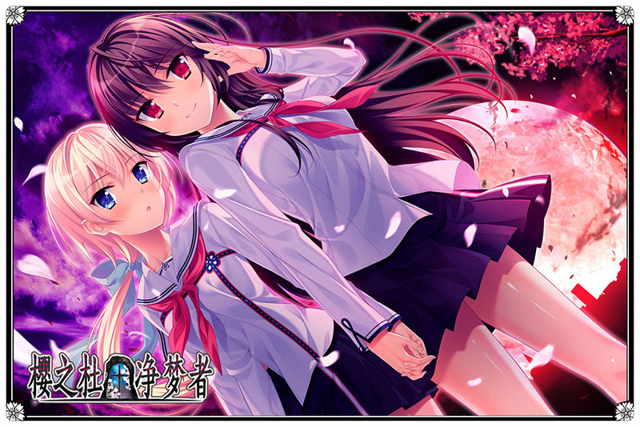
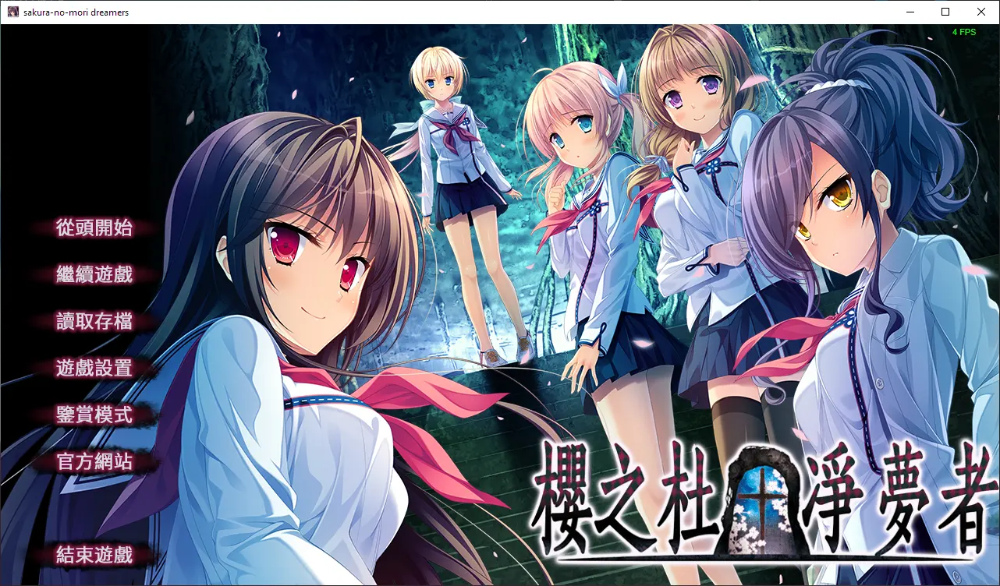
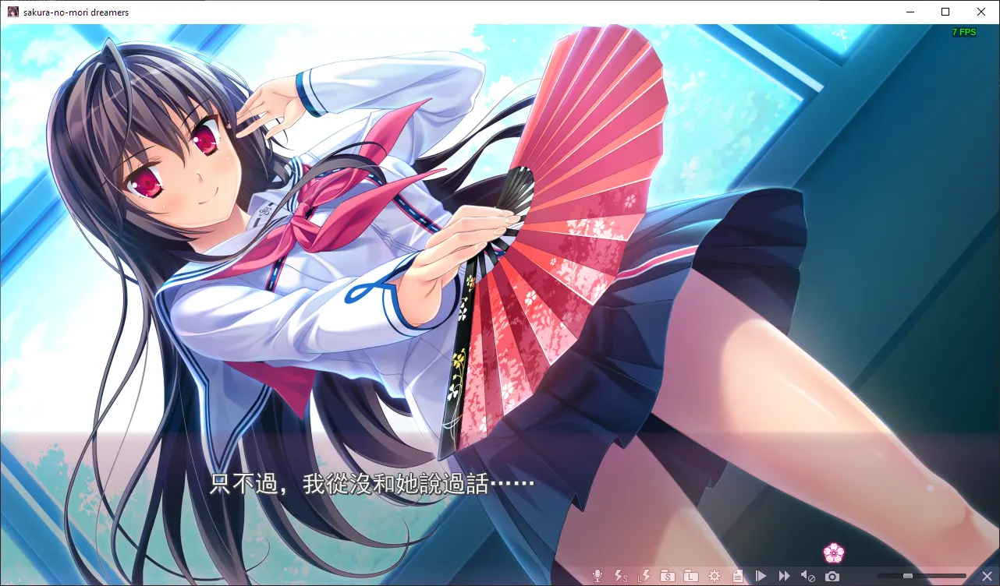
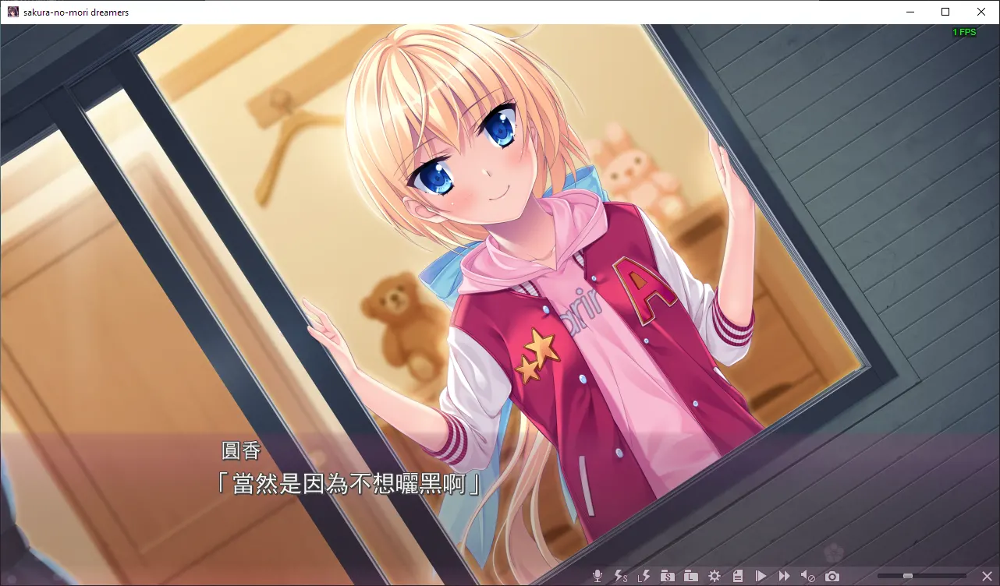
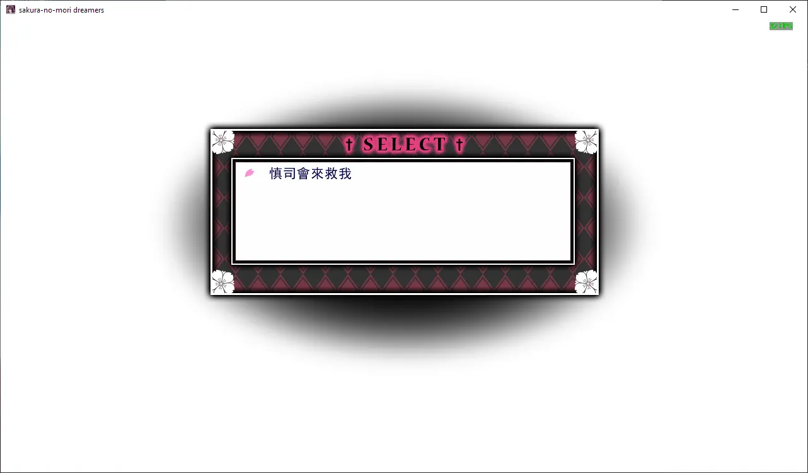
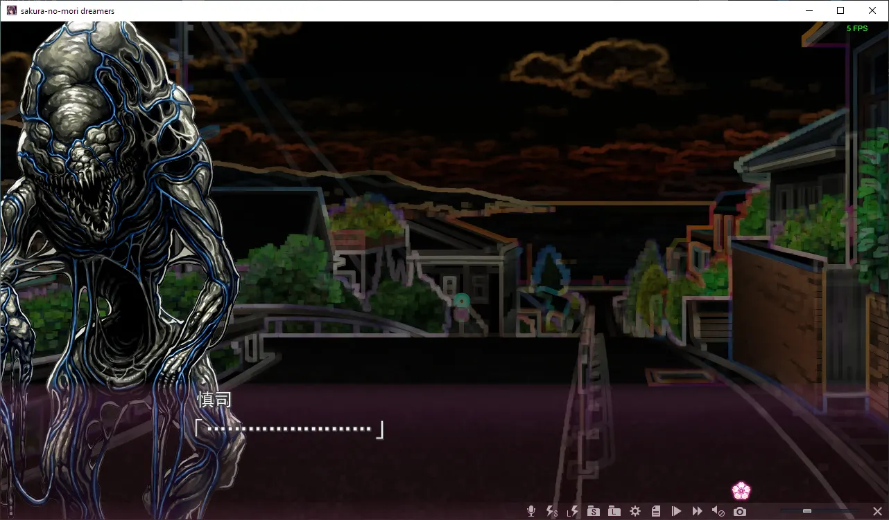
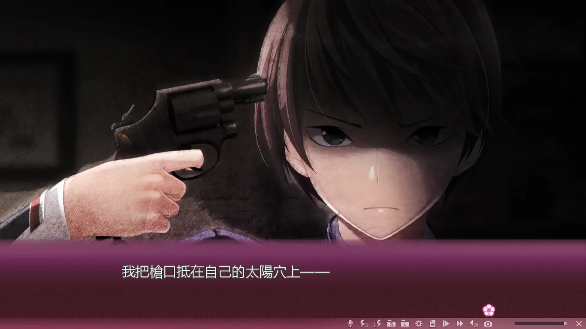
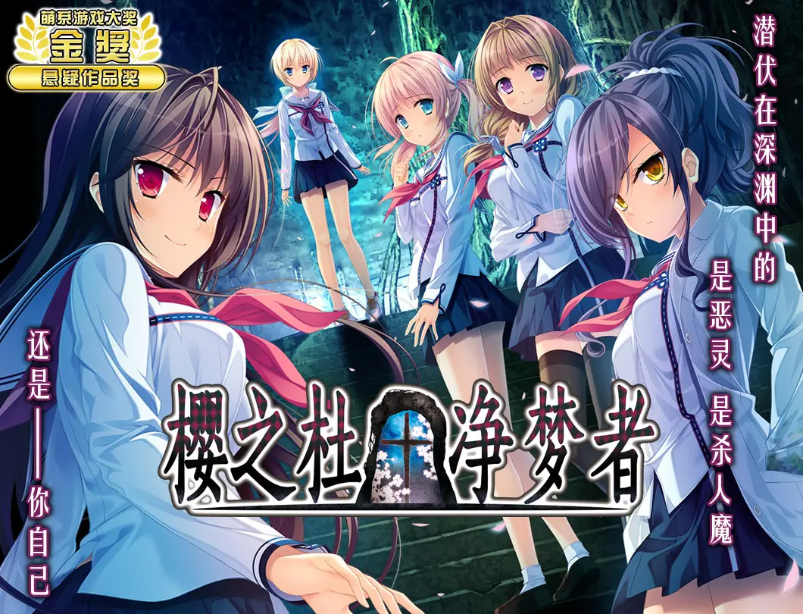
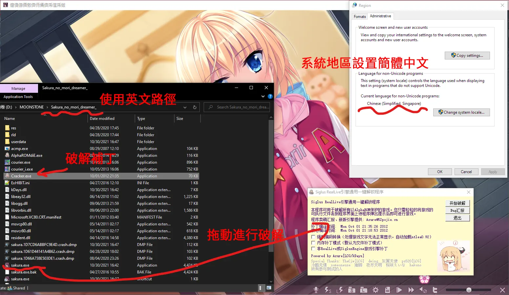

<!--- excerpt 是用來顯示在網站首頁上的本文摘要 -->

`作者：桐遠暮羽`

> 擁有能看見即將發生的不幸的能力的男主角，吹上慎司，發誓要找出至愛的青梅竹馬慘遭殺害的真相。




|      資訊一覽      ||
| :--- | ---- |
| **開發商** |  MOONSTONE（月石社）    |
| **編劇** |  吳（人稱月石社腦洞編劇老吳）    |
| **遊戲時長** | 20 小時     |
| **難度** | 低（沒有複雜的選項和路線圖）     |
| **分級** | R-18（性行爲描寫，恐怖）   |


## 故事（包含官方提供的介紹）

**和平安寧，風景優美**的海邊小鎮，櫻之社。如果不算上幾年前發生的**那些事件**的話。

幾年前，還年幼的男主角吹上慎司一家三口，受友人之邀請乘飛機前往海外旅行的途中發生空難。

在飛機失事前，慎司看到了，那些面目猙獰的**惡靈**成羣結隊地涌上飛機。

只有三人活了下來。  

  <!--- 爲甚麼我不能直接在中間空行？？？ -->
  <br>

慎司失去了父母，但不幸中的萬幸是，他還有一位青梅竹馬的女孩子圓香，就住在隔壁。

兩人的心越走越近，表白的那一天，慎司確信能和圓香**永遠**在一起，

直到人們發現了倒在湖中間的圓香。  

  <br>

那之後，雖然偶爾還會看到惡靈在街上遊蕩而過，  

但是這些都不重要，他的心已隨着圓香而去。

過了三年，慎司升上了高中，當他自認爲傷痛已被時間抹去的時候，遇到了三個神必的女生，

她們自稱屬於「**櫻之杜†凈夢者**」，而且關於惡靈好像知道些什麼。


這些離奇的命案，這瘋狂的宇宙，這小鎮一定不正常。

你要不要加入「**櫻之杜†凈夢者**」？

## 登場人物

### 吹上慎司

<!--- 只有把插入圖片寫成這屌樣才能實現左靠邊和透明背景，拳頭硬了 -->
<!--- 而且你媽的不能帶 alt，不然會憑空出現在頁面中間 -->

  

**男主角，能看到惡靈，**

**並且認爲自己具有這種能力，就應該爲櫻之杜做點甚麼。**

`格言：我才不事甚麼正義使者，，，`

 * 太慘啦！看到女朋友掛掉的時候俺眼淚都流下來了

<!--- 這是爲了讓新的段落出現在圖片下面 -->
<div style="clear: both;"/>

### 秋津圓香

  

**慎司的青梅竹馬兼女友，**

**兩人從小關係很好，逐漸日久生情**，

**特殊能力是騎公路自行車，**

**以及一開局就領便當。**

`格言：慎司一定會來救我的`

 * 性格率真可愛，我他媽舔爆。

<div style="clear: both;"/>

### 桐遠暮羽

 

 **~~本文作者。~~**

 **櫻之杜†凈夢者成員，擁有斬殺異形的能力，**

 **戰鬥少女，平時喜歡穿和服**

 `格言：爲甚麼我沒有男朋友`

  * 那當然是因爲你在不停地殺怪，，，

<div style="clear: both;"/>

### 閑宮真幌

 

 **學姐，**

 **櫻之杜†凈夢者成員，但是卻不能戰鬥。**

 **就像是觀戰玩家。**

 <div style="clear: both;"/>

 ### 衿坂美冬

  

  **畫家，桐遠暮羽的好朋友，**

  **如果沒有遇上那件事的話，她還是櫻之杜†凈夢者成員。**

   `格言：我不幹了！`

 * ~~神筆馬良~~

 <div style="clear: both;"/>

 ### 吹上初音

   

   **慎司的妹妹，在空難中存活下來**

`格言：歐尼醬這太危險了`

 * 不是實妹。

 <div style="clear: both;"/>

 ## 一句話點評

本作的故事出自月石社腦洞編劇老吳之手，隨着遊戲的進行，懸疑時而似乎變得明朗時而撲朔迷離。在破解青梅竹馬的懸案之前，遊戲使用大篇幅講述了櫻之社小鎮上的其他懸案，這不僅使得玩家心中的世界觀和設定隨着遊戲的過程逐漸豐滿起來，而且讓整個故事就像連續劇一般，一集一集地逐漸展開，令人上癮。

此外，遊戲中的女主角們各自獨具特色，性格上都具有迷人之處，畫風足夠可愛，少女們的戰鬥場面（沒錯，該 Galgame 有戰鬥場景！）的刻畫讓她們更加美麗。

綜上所述，本作是一部懸疑作品和美少女遊戲愛好者不可錯過的精彩佳作。

## 遊戲 OP 動畫欣賞

動畫來自 Steam。
<video width="100%" controls="controls" src="https://cdn.akamai.steamstatic.com/steam/apps/256700230/movie_max.webm" type="video/webm" muted preload="metadata"> 無法載入 Steam 動畫。   </video>

## 遊戲畫面

<div class="flexContainer" style="display:flex;">


</div>
<br/>
<div class="flexContainer" style="display:flex;">


</div>
<br/>
<div class="flexContainer" style="display:flex;">


</div>




## 資源與下載

<iframe src="https://store.steampowered.com/widget/749520/" frameborder="0" width="100%" height="200" ></iframe>

Steam 商店爲官方中文版，也有免費試玩版。

R-18 補丁官網下載連結如下：

https://www.moon-stone.jp/product/ms22/

本站暫無漢化補丁資源，日文原版資源和破解方法如下：

<details><summary>點此展開</summary>

1. 下載遊戲本體，磁力連結如下

```
magnet:?xt=urn:btih:0b9fafd5c0b207351ab4dc051c41e88dcd0803b4
```

文件名：(18禁ゲーム) [160527] [MOONSTONE] サクラノモリ†ドリーマーズ (mdf+mds+マニュアル+rr3).rar
2. 使用 ISO 虛擬光驅安裝遊戲，如果安裝程序介面出現亂碼導致無法安裝，請使用 Locate Emulator 轉區到日文。
3. 打開安裝目錄，修改安裝路徑僅包含英文（否則遊戲出現亂碼會無法引用資源文件）。
4. 下載破解補丁，地址：[anime-sharing 論壇](http://www.anime-sharing.com/forum/torrents-47/5-%E2%9D%80-bought-game%E2%9D%80-%5B160527%5D-%5Bmoonstone%5D-%E3%82%B5%E3%82%AF%E3%83%A9%E3%83%8E%E3%83%A2%E3%83%AA%E2%80%A0%E3%83%89%E3%83%AA%E3%83%BC%E3%83%9E%E3%83%BC%E3%82%BA-drama-cd-manual-%5Bh-game%5D-%5Bpatch%5D-496365/) ，找到樓主發的附件 Patcher-Build20121001.zip（40.2 KB）進行下載，殺毒軟件可能報毒。
5. 打開破解補丁，將遊戲主程序 sakura.exe 拖上去進行破解。
6. 運行破解後的 sakura.exe 開始遊戲。
7. 如果出現亂碼，按照下圖進行調整或使用轉區軟件。


</details>

請關注續集 **櫻之杜†凈夢者2**！

續集評測已發佈！「[櫻之杜†凈夢者（二）：鐵道分岔的另一頭，是有你存在的世界](/article/11451)」

