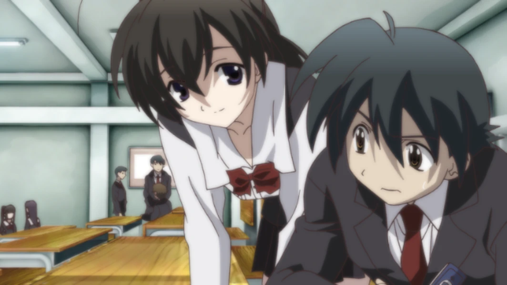
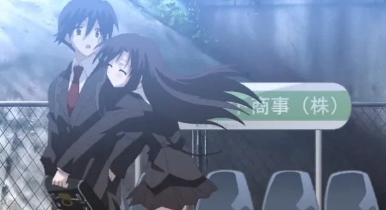
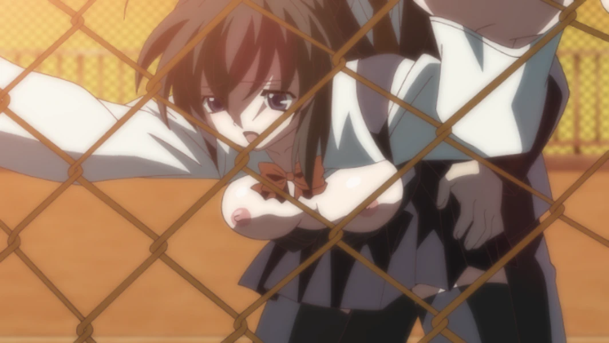
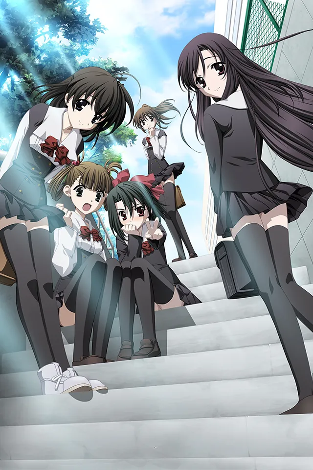
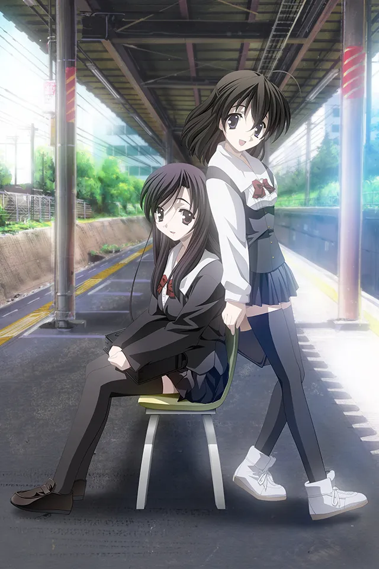
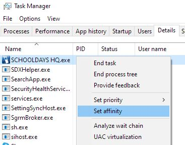

Galgamer 聖誕節特別篇，聖誕節快樂！

## At A Glance

活潑可愛的少女**西園寺世界**，決定幫助同班同學**伊藤誠**追求隔壁班的女神**桂言葉**，沒想到自己卻深陷其中。

<p></p>

| 資訊一覽     |                 |
| :----------- | :----------------------- |
| **劇本**     | STACK |
| **開發商**   | Overflow |
| **攻略人數** | 不止兩個      |
| **遊戲時長** | 。。。  |
| **類型**     | 學園 NTR 後宮 運動 歡樂 格鬥  |
| **遊戲畫面** | 全動畫 CG           |
| **分級**     | R-18      |
| **難度**     | 非常高  |

## 故事

<strong>你知道嗎？把喜歡的人的照片設爲手機屏保，<br class="d-md-none">然後三個星期沒被別人發現的話，
願望就能夠實現喔！</strong>

男主角 伊藤誠，從第二學期開始，注意到了<br class="d-md-none">總是搭乘同一班電車的隔壁班女生，
桂言葉。

心裏雖然在意，但是並沒有喜歡到想讓她當女朋友。<br class="d-md-none">只是覺得和她搭乘同一班電車，
上學之路就變得稍微快樂起來。

誠哥並不相信傳聞中的魔法真的靈驗，但是他還是偷偷拍下了桂言葉的照片。

<p></p>

然而誠哥剛來到學校，手機壁紙上的言葉就<br class="d-md-none">火速暴露給了新同桌，西園寺世界。

「抱歉！不小心看到了，魔法要不靈了！」

「要不我就幫你一把，直到她成爲你的女朋友爲止！」

世界提議道。

<p></p>

新同桌如此熱情，讓誠哥覺得很疑惑。<br class="d-md-none">但是他還是接受了提議，於是屬於三人的戀愛冒險開始了。

### “純潔的戀愛冒險”

<div class="route-map">
    <x-row start-from="3">
        <x-col src="../image/SchoolDaysHQ/map/0-3.webp"/>
        <x-col src="../image/SchoolDaysHQ/map/0-4.webp"/>
        <x-col src="../image/SchoolDaysHQ/map/0-5.webp"/>
    </x-row>
    <x-row>
        <x-col src="../image/SchoolDaysHQ/map/1-0.webp"/ default>
        <x-col src="../image/SchoolDaysHQ/map/1-1.webp"/>
        <x-col src="../image/SchoolDaysHQ/map/1-2.webp"/>
        <x-col src="../image/SchoolDaysHQ/map/1-3.webp"/>
        <x-col src="../image/SchoolDaysHQ/map/1-4.webp"/>
        <x-col src="../image/SchoolDaysHQ/map/1-5.webp"/>
    </x-row>
    <x-row start-from="2">
        <x-col src="../image/SchoolDaysHQ/map/2-2.webp"/>
        <x-col src="../image/SchoolDaysHQ/map/2-3.webp"/>
        <x-col src="../image/SchoolDaysHQ/map/2-4.webp"/>
        <x-col src="../image/SchoolDaysHQ/map/2-5.webp"/>
    </x-row>
    <x-row start-from="3">
        <x-col src="../image/SchoolDaysHQ/map/3-3.webp"/>
        <x-col src="../image/SchoolDaysHQ/map/3-4.webp"/>
        <x-col src="../image/SchoolDaysHQ/map/3-5.webp"/>
    </x-row>
    <p> JavaScript 錯誤，無法顯示路線圖</p>
</div>

## 人物介紹

<style>
#chars .row {
    background-color: #0f3460;
}
#chars .imgbox {
    max-width:40%;
    min-width:33%;
    vertical-align: bottom;
    min-height: 275px;
    position:relative;
}
#chars .imgbox img{
    background-color: rgba(0, 0, 0, 0);
    width: auto;
    height: auto;
    max-height: 275px;
    max-width: 100%;
    position:absolute;
    bottom:0px;
    left:0px;
}
</style>
<div id="chars">
<div class="row text-light">
    <div class="imgbox col-sm-4 col-lg-3">
        
    </div>
    <div class="textbox col-7 col-lg-8">
    <span style="font-size:170%">桂 言葉</span>
    <hr class="my-1">
    隔壁班的女生，<br class="d-md-none">美好的外表過於引人注目，<br>
    導致她從小性格就內向，<br class="d-md-none">甚至還被同班同學欺凌<br>（校園霸凌！）<br><br>
    屬於深閨大小姐的一種。
    </div>
</div>
</div>


<div id="chars">
<div class="row text-light">
    <div class="imgbox col-sm-4 col-lg-3">
        
    </div>
    <div class="textbox col-7 col-lg-8">
    <span style="font-size:170%">西園寺 世界</span>
    <hr class="my-1">
    主角的同班同學，<br class="d-md-none">性格開朗，<br>
    要是嘴巴不那麼羅嗦就可愛了。<br><br>
    據說前來告白的男生全部都被狠狠拒絕了。
    </div>
</div>
</div>


<div id="chars">
<div class="row text-light">
    <div class="imgbox col-sm-4 col-lg-3">
        
    </div>
    <div class="textbox col-7 col-lg-8">
    <span style="font-size:170%">伊藤 誠</span>
    <hr class="my-1">
    人稱誠哥，<br class="d-md-none">是個無趣的高中生，<br>
    膽小怕事，要是世界不去推動牠，<br>
    牠永遠不會和言葉說上話。<br><br>
    軟弱的性格就會猶豫不定，<br class="d-md-none">猶豫不定就會...
    </div>
</div>
</div>

每年的那個時候都要掛上誠哥的遺像。

<hr>

**其他角色**


## CG

<p></p>

<p></p>

<p></p>

<p></p>

<p></p>

<p></p>

<p></p>

<p></p>

<p></p>

<p></p>

爆血的 CG 請自己打出來，我就不放了，，，

## OP 動畫

官方沒給我自己錄的

<video controls preload="metadata" width='100%' poster="../image/SchoolDaysHQ/movie.webp">
      <source src="https://bitbucket.org/sa-ya/g-static/raw/ec69262a87ddfec8aca250a4621e2f8b7036330f/SchoolDaysHQ/SDHQ-OP.mp4" type="video/mp4">
<p> To view this video please enable JavaScript</p>
</video>

本作 OP 和 ED 已收錄到 Galgame 金曲，

OP <a href='/music/?id=8' target='_blank'>🔗️Still I Love You\~みつめるよりは幸せ\~</a>（新窗口打開）

ED <a href='/music/?id=9' target='_blank'>🔗️あなたが…いない</a>（新窗口打開）

## 一句話點評

相信這部作品早已名聲在外，不是 Galgame <br class="d-md-none">玩家的普通諤次元人也肯定知道「日在校園」
因爲該遊戲的改編的動畫由於過於殘酷的結局<br class="d-md-none">而一時名聲大噪，
所以一般第一反應就是被斷頭的渣男誠哥。

不過遊戲中並不存在頭被砍下來的結局，<br class="d-md-none">（被砍的是其他部位我會亂講？），
那純粹是動畫編劇的惡趣味。
不過本作作爲一個十幾年前就發佈的全動畫化的<br class="d-md-none"> Galgame，不得不說這是一個偉大的成就。
（請允許我使用用偉大二字）

話說回來，該遊戲本身就非常複雜，<br class="d-md-none">路線和結局也非常多，
不如說大部分人都打不出爆血的結局，<br class="d-md-none">一般都是和某個人最終走到一起的甜蜜（甜蜜？）結局。
所以那些一週目就把遊戲玩死的人，<br class="d-md-none">請受我一拜，你們才是真正的 NTR 人渣。

遊戲安排了那麼多結局，導致結局本身變得不那麼重要，
而那些兩人由於猜疑、嫉妒而糾纏不清；<br class="d-md-none">男主由於軟弱而左右搖擺，
導致其中一人趁虛而入給 NTR 了的<br class="d-md-none">劇情才是真正有意思的部分。

而且遊戲中經常出現那被落下的一人孤苦伶仃<br class="d-md-none">的畫面，再加上此時響起的遊戲插曲
（請重溫一下上面的金曲「あなたが...いない」），<br class="d-md-none">直接將牛頭人氣氛推到最巔峰，

讓本作成爲了聖誕節當天體會戀愛氣氛的絕佳不二之選。


## 還在猶豫是否下載？

試玩錄像在此，建議開 1.25 倍速觀看。

<video controls preload="metadata" width='100%'>
      <source src="https://bitbucket.org/sa-ya/g-static/raw/ec69262a87ddfec8aca250a4621e2f8b7036330f/SchoolDaysHQ/SchooldaysHQ.mp4" type="video/mp4">
<p> To view this video please enable JavaScript</p>
</video>

## 資源與下載

我找到了英文版和中文漢化版的資源，日文版沒有找到。

**中文版：**

[🔗️OneDrive 網盤](https://dl.galgamer.eu.org/SchoolDaysHQ_R0050_%E5%AF%86%E7%A2%BC_%E2%91%A8.rar)

**英文版：**

```
magnet:?xt=urn:btih:245d4f68096bd3e02790eb6c5a718c98955bd42b&dn=School%20Days%20HQ%20JAST%20English
```

資源來自 anime-sharing 論壇

**Win10 兼容性解決方案**

該遊戲較老，容易崩潰，請按照以下步驟進行優化：

 1. 安裝官方的 [🔗️DX9 補丁](https://0verflow.com/days_dx9.html)，把解壓出來的 DLL 放到遊戲目錄。
 
 2. 遊玩的時候使用任務管理器將遊戲進程設爲單核運行（如圖點進去，然後只勾上 CPU0）
 


## 關於遊戲難度

基於以下原因，我將本作難度確定爲「非常高」：

 * 極其複雜的路線圖
 * 出現選項時無法存檔
 * 由於是全動畫 CG，無法像普通 Galgame 一樣進行隨意 Ctrl
 * 選項有倒計時，你可能會錯過選項
 * 選項和路線圖上的圓點不是一一對應

然而，好消息是：

 * 你可以通過路線圖上的圓點直接跳轉
 
然而，壞消息是：

 * 路線圖有時候會卡死打不開
 
所以，我的遊玩建議是：

 * 一週目，反正你也沒辦法控制劇情走向，直接亂選比較好，說不定還能觸發出乎意料的結局
 * 使用路線圖跳轉來嘗試不同的選項
 * 看攻略
 * 多存檔以免遊戲卡死
