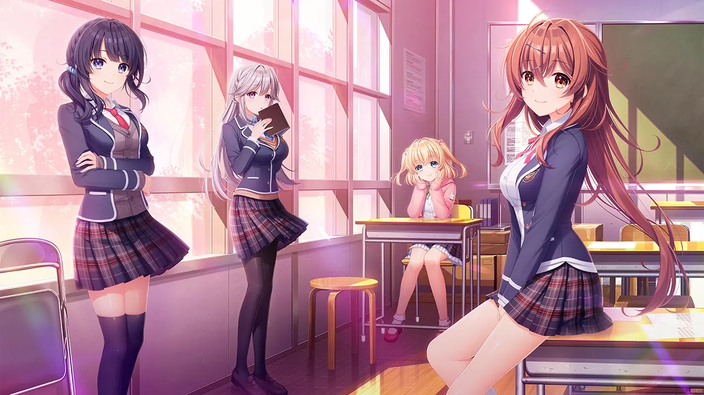
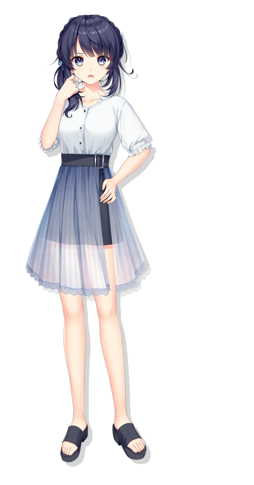
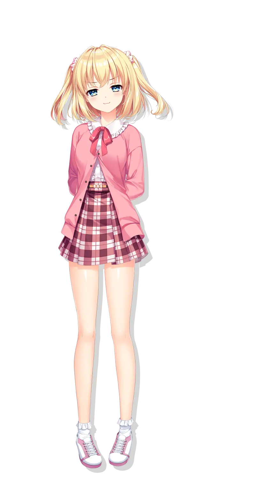
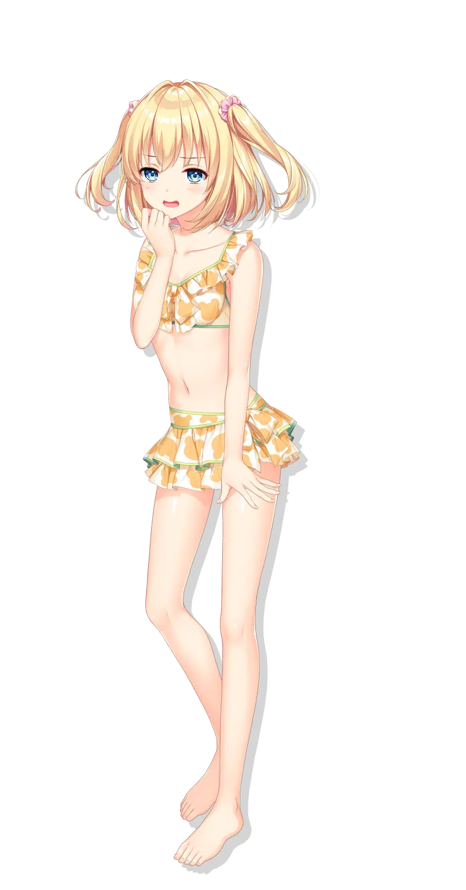
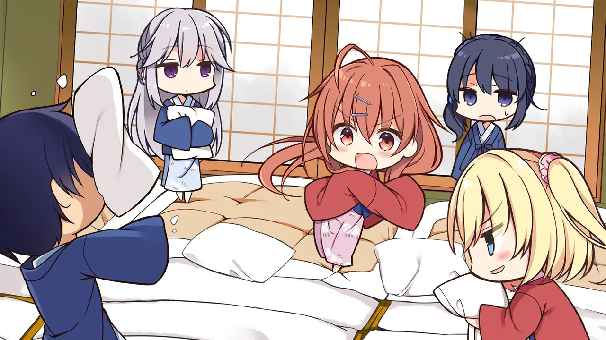
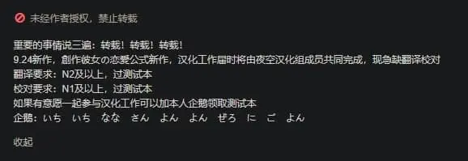

<style>
  :root {
    --my-bg-url: url('');
  }
  body {
    background-image: var(--my-bg-url);
    background-repeat: no-repeat ;
    background-position: left 0px top 75px;
    background-size: 50% auto;
  }
  @media screen and (max-width: 767px) { /* 手機版佈局 */
    body {
      background-image: unset;
      background-repeat: unset ;
      background-position: unset;
      background-size: unset;
    }
  }
  .page-header  {
    background-color: rgba(0,0,0,0.5);
    padding: 3px;
    border-radius: 5px;
  }
  .page-header .mt-1 span.post-meta {
    /* 隱藏嚇人的字數統計 */
    display: none;
  }
  .full-bg-img > .mask {
    background-color: rgba(0,0,0,0) !important;
  }
</style>


`作者：桐羽（簡稱桐遠暮羽）`
<code id="mail"></code>
<script>
let a = "a@galg";
let b = 'Kirih';
let c = 'amer.'
let d = 'eu.org'
document.getElementById('mail').innerHTML = b + a + c + d;
</script>


## At A Glance

普通的 JK 普通地魅力四射，但是魅力能射殺人的 才華橫溢創作 JK 找上你，要和你 譜寫創作、戀情和青春的樂章。

<p>
    
</p>


| 資訊一覽     |                 |
| :----------- | :-------------------- |
| **開發商**   | [🔗️AinoLinks](http://ainolinks.com/)          |   
| **原畫**     | 有葉 ([🔗️Twitter](https://twitter.com/alpha64cat))          |   
| **攻略人數** | 4                    |
| **遊戲時長** | 27h（計時）         |
| **類型**     | 校園 搞笑 純愛         |
| **難度**     | 低（直接選人） |
| **分級**     | R-18（性行爲）      |

這是該遊戲公司的第一部出道作品。

## 故事

陷入了困境，再也寫不出小說了的高中生小說家
**鏡 寿季**（簡稱小壽）爲了找到脫離困境的方法，
搬到了表姐家的小鎮上，準備入學 **才華學園**。

私立才華學園，是一所爲了培養創作者而生的學校，
爲想成爲 小說家、插畫師、聲優的學生 提供專業的培養。

<div class="alert alert-danger" role="alert">
  <span class="alert-heading" style="font-size: 150%;">好吧，我承認</span><br>
  這就是一所二次元高中，從裏面畢業的學生<br>
  將來都會去進軍 輕小說，Galgame 劇本、漫畫和聲優 等，<br>
  總之味兒可強了。。
</div>

然後，在開學之前，<br class="d-md-none">小壽在小鎮上偶遇了自己的青梅竹馬，
也就是那個從小一起長大，一起寫小說，<br class="d-md-none">發誓要永遠在一起，
卻又不知爲何 三年間一直音信不通的 充滿謎團的甜心女孩。

<p>
  
</p>

也要入學才華學園的她，
將要和學校裏那些奇妙深刻的女孩子們一起，

把男主角徹底捲進 強制譜寫創作青春樂章 的無厘頭日常之中。

## 登場人物

<!--- 前方 CSS 災難現場 --->

<style>
:root { /* 配色 */
  --chara-card-color: rgba(255,255,255,0.95);
  --chara-desc-card-color-aisa: rgba(233,196,159,0.75);
  --chara-desc-card-color-kiri: rgba(165,222,228,0.75);
  --chara-desc-card-color-yume: rgba(248,195,205,0.75);
  --chara-desc-card-color-erena: rgba(180,129,187,0.75);
  --sex-exp-header: #ff83ab;
  --sex-exp-body: #ffbfce;
}
[data-user-color-scheme='dark'] {
  --chara-card-color: rgba(0,0,0,0.95);
  --chara-desc-card-color-aisa: rgba(54,23,11,0.86);
  --chara-desc-card-color-kiri: rgba(33,30,85,0.86);
  --chara-desc-card-color-yume: rgba(98,41,84,0.86);
  --chara-desc-card-color-erena: rgba(74,34,93,0.86);
  --sex-exp-header: #7a518b;
  --sex-exp-body: #66327c;
}
.chara-card { /* 電腦端人物大框 */
  position: relative;
  width: 95vw;
  max-width: 1600px;
  min-height: 1000px;

  left: 50%; /* 往右半個父元素的寬度，再往左自己的半個寬度 */
  box-sizing: border-box;
  transform: translateX(-50%);
  border-radius: 20px;

  box-shadow: 0 5px 11px 0 rgb(0 0 0 / 18%), 0 4px 15px 0 rgb(0 0 0 / 15%);
  background-color: var(--chara-card-color);

  margin-bottom: 20px;

  overflow: hidden;
}
.chara-card::before { /* 插入背景用 */
  content: "";
  position: absolute;
  inset: -1000px;

  background-size: 250px;
  background-repeat: repeat;

  transform: rotate(45deg) translateZ(0); 
/*  animation: rotating 2s steps(10) infinite; */
}
.chara-card.aisa::before { /* aisa 插入背景用 */
  background-image: url(../image/SousakuKanojo/chars/1/bg.webp);
}
.chara-card.kiri::before { /* kiri 插入背景用 */
  background-image: url(../image/SousakuKanojo/chars/2/bg.webp);
}
.chara-card.yume::before { /* yume 插入背景用 */
  background-image: url(../image/SousakuKanojo/chars/3/bg.webp);
}
.chara-card.erena::before { /* erena 插入背景用 */
  background-image: url(../image/SousakuKanojo/chars/4/bg.webp);
}
.chara-card h2, .chara-card h3 {
  /*margin-top: 1px !important; /* 取消系統自帶的留白 */
  display: none;
}
.chara-card > .chara-area { /* 留點邊界不至於貼邊 上右下左*/
  padding: 10px 20px 10px 20px;
  /*box-sizing: border-box;*/
}
.chara-card .chara-ataglance { /* 人物 一言出道 */
  font-size: 200%;
  margin-bottom: 30px;
}
.chara-card img { /* 人物 一言道出 */
  background-color: transparent;
}
.chara-card .closet { /* 人物 換裝和名字區域 */
  position: relative;
}
.chara-card .closet .closet-list { /* 人物 換裝和名字區域 */
  position: relative;
  left: 30px;

  max-height: 1600px;
  height: calc(95vw * 0.55 * 1.9);
}
ul.closetimg { /* 抄襲 */
  list-style-type: none;
  list-style-position: outside;
  /*display: block;
  width: 100%;
  height: 100%;*/
}
ul.closetimg > li { /* 抄襲 */
  opacity: 0;
  will-change: opacity;
  transition: opacity 0.2s linear;
  display: block;

  position: absolute;
  top: 0;
  left: 0;
  bottom: 0;
}
ul.closetimg > li img { /* 抄襲 */
  /*width: 100%;*/
  height: 100%;
}
ul.closetimg > li.active { /* 抄襲 */
  opacity: 1;
}
/* ul.closetimg > li.active > img{ /* 抄襲 
  position: absolute;

} */
.chara-card .char-name { /* 人物名字外 col */
  position: absolute;
  padding: 35px 38px 35px 35px;
  border: 3px solid var(--post-text-color);
  /*margin-right: 1rem;*/
  z-index: 0;
  left: 0px;
  top: 50px;

  display: inline-block;
  text-align: center;
}
.chara-card .char-name .name-text { /* 人物 名字字符 */
  writing-mode: vertical-rl;
  font-size: 4rem;
  line-height: 4rem;
  letter-spacing: 1rem;
  display: inline-block;
}
.chara-card .char-name .name-comment { /* 人物 名字註釋*/
  font-size: 1.5rem;
  line-height: 1.5rem;
  /*letter-spacing: 5px;*/
  /*display: inline-block;*/
  white-space: nowrap;
  padding: 0px;
}
.chara-card .char-l { /* 左側人物立繪 */
  position: relative;
  right: -75px;
}
.chara-card .desc-r { /* 右側人物描述 */
  margin-top: 5rem;
  position: relative;
  left: -75px;
}
.chara-card .char-r { /* 右側人物立繪 */
  position: relative;
  left: -75px;
}
.chara-card .char-r .char-name { /* 人物名字外 col */
  left: unset;
  top: 50px;
  right: 0px;
}
.chara-card .desc-l { /* 左側人物描述 */
  margin-top: 5rem;
  position: relative;
  right: -75px;
}
.card.char-desc { /* 描述的 card 控件 */
  font-size: 115%;
  font-family: bold;
}
.card.char-desc.aisa { /* aisa 描述的 card 控件 */
  background-color: var(--chara-desc-card-color-aisa);
}
.card.char-desc.kiri { /* kiri 描述的 card 控件 */
  background-color: var(--chara-desc-card-color-kiri);
}
.card.char-desc.yume { /* yume 描述的 card 控件 */
  background-color: var(--chara-desc-card-color-yume);
}
.card.char-desc.erena { /* erena 描述的 card 控件 */
  background-color: var(--chara-desc-card-color-erena);
}
.card.sex-exp { /* SEX 體驗的卡片有 header */
  padding-left: 0;
  padding-right: 0;
  font-size: 115%;
  font-family: bold;
}
.card.sex-exp > .card-header { 
  background-color: var(--sex-exp-header);
}
.card.sex-exp > .card-body { 
  background-color: var(--sex-exp-body);
}
@media screen and (max-width: 767px) { /* 手機版佈局 */
  .chara-card {
    width: 100vw;
    border-radius: 10px;
    padding: 5px;
  }
  .chara-card .chara-ataglance { /* 人物 一言出道 */
    font-size: 175%;
    margin-bottom: -45px;
  }
  .chara-card .char-l { /* 左側人物立繪 */
    position: relative;
    right: 0px;
  }
  .chara-card .desc-r { /* 右側人物描述 */
    margin-top: 0rem;
    position: relative;
    left: 0px;
  }
  .chara-card .char-r { /* 右側人物立繪 */
    position: relative;
    left: 0px;
  }
  .chara-card .desc-l { /* 左側人物描述 */
    margin-top: 0rem;
    position: relative;
    right: 0px;
  }
  .chara-card .qchar { /* 手機版不要顯示 Q 版 CG */
    display: none;
  }
  .chara-card .closet { 
    padding: 0;
  }
  .chara-card .closet .closet-list { /* 人物 換裝和名字區域 */
    position: relative;
    left: 30px;
  }
  .chara-card .char-name { /* 人物名字外 col */
    position: absolute;
    padding: 25px 28px 25px 25px;
    border: 3px solid var(--post-text-color);
    /*margin-right: 1rem;*/
    z-index: 2;
    /*position: absolute;*/
    right: 10px;
    bottom: 10px;
    left: unset;
    top: unset!important;
    
    display: inline-block;
    text-align: center;
  }
  .chara-card .closet .closet-list { /* 人物 換裝和名字區域 */
    left: 0px;
    max-height: 1600px;
    height: calc(97vw * 1.9);
  }
  .chara-card .char-name .name-text { /* 人物 名字字符 */
    writing-mode: vertical-rl;
    font-size: 3rem;
    line-height: 3rem;
    letter-spacing: 0.75rem;
    display: inline-block;
  }
  .chara-card .char-name .name-comment { /* 人物 名字註釋*/
    font-size: 1.2rem;
    line-height: 1.2rem;
    /*letter-spacing: 5px;*/
  }
  .card.char-desc { /* 描述的 card 控件 */
    font-size: inherit;
    font-family: inherit;
  }
  .card.sex-exp { /* SEX 體驗的卡片有 header */
    font-size: inherit;
    font-family: inherit;
  }
}
</style>

### JK 鑑賞

<p class="d-md-none">
  JK 博物館 爲電腦版打造。。請使用電腦版打開本文，，，
</p>

<p class="d-none d-md-block">
  前方魔鬼排版，，，
</p>

<div class="chara-card aisa">
<div class="chara-area container-fluid">
  <div class="row justify-content-between"> <!--- 人物名字，一言出道 --->
    <div class="col-auto">
      <!-- <h3> 青梅竹馬 </h3> -->
    </div>
    <div class="chara-ataglance col-auto text-right font-serif font-weight-bold font-italic d-md-none">
      <p>無論季節，<br class="d-md-none">全劇裙子最短的人。</p>
    </div>
  </div><!-- end row -->
  <div class="row justify-content-center"><!-- chara 左右部分 -->
    <div class="char-l col-md-7 col-12"><!-- char-l 包含立繪和人物名字 -->
      <div class="row justify-content-end"> 
        <div class="closet col-12">
          <div class="char-name font-serif"><!-- 顯示名字那個框 -->
            <div class="name-text"> 青梅竹馬 </div>
            <div class="name-comment font-italic"> 彩瀬 逢桜 </div>
          </div>
          <a class="d-md-none position-absolute change-cloth btn btn-info mb-0" target-id="aisaCloset" style="bottom: 10px; left: 10px; z-index: 2;">👚 換衣服</a>
          <div class="closet-list"><!-- 換裝區域 -->
            <!--  -->
            <ul class="closetimg" id="aisaCloset">
              <li class="active"></li>
              <li class=""></li>
              <li class=""></li>
              <li class=""></li>
              <li class=""></li>
              <li class=""></li>
              <li class=""></li>
            </ul>
          </div>
        </div> <!-- end closet -->
      </div>
    </div><!-- end char-l -->
    <div class="desc-r col-md-5 col-12">
      <div class="row">
        <div class="chara-ataglance col-auto text-right font-serif font-weight-bold font-italic d-none d-md-block">
          <p>無論季節，<br class="d-md-none">全劇裙子最短的人。</p>
        </div>
        <div class="col-12 col-xl-10 char-desc aisa card shadow mx-lg-3 my-2">
          <div class="card-body">
            <p class="card-text">
              <strong>就讀於：</strong>&emsp;小說科 - 和你同班<br>
              <strong>筆名：　</strong>&emsp;這重要嗎？
            </p>
            <a class="change-cloth btn btn-info mb-0" target-id="aisaCloset">👚 換衣服</a>
          </div>
        </div>
        <div class="col-12 col-xl-10 char-desc aisa card shadow mx-lg-3 my-2">
          <div class="card-body">
            <p class="card-text">
            你的青梅竹馬，小說家，劇中最會上樹的人，<br>
            曾經的初戀情人，但還是心照不宣地繼續一起玩。<br>
            就像是前女友那樣微妙的關係。
            </p>
            <p class="card-text">
            和二次元不熟，但是被你拉去玩 Galgame<br>
            拉去漫展，拉去 cos...<br>
            導致她嘲諷你餓次元死宅真噁心。
            </p>
          </div>
        </div>
        <div class="card sex-exp col-12 col-xl-10 shadow mx-lg-3 my-2">
          <div class="card-header text-bold">
            SEX 體驗
          </div>
          <div class="card-body">
            <p class="card-text">
              甜心 buff 疊加，從小就心意相通，<br>
              舉手投足都好像看透了對方。<br>
              青梅竹馬就是應該永遠 Happy End 的生物！！
            </p>
          </div>
        </div><!-- end sex exp -->
        <div class="qchar col-9"><!-- Q 版人物 -->
          
        </div>
      </div>
    </div><!-- end desc-r -->
  </div><!-- end chara l r row -->
</div><!-- end chara area -->
</div><!-- end chara card -->


**桐遠暮羽注：**
請問，你要對陪伴多年的甜心女孩進行一個穿刺，會懷著怎樣的心情？
我和青梅竹馬關係非常疏遠，所以希望有相關經驗的朋友講給我聽，好奇

<p>
  
</p>

<p>
  
</p>


<div class="chara-card kiri">
  <div class="chara-area container-fluid">
    <div class="row justify-content-between"> <!--- 人物名字，一言出道 --->
      <div class="col-auto">
        <!-- <h3> 桐葉 </h3> -->
      </div>
      <div class="chara-ataglance col-auto text-right font-serif font-weight-bold font-italic d-md-none">
        <p>非常傲嬌的<br class="d-md-none">同級生</p>
      </div>
    </div><!-- end row -->
    <div class="row justify-content-center"><!-- chara 左右部分 -->
      <div class="order-md-1 char-r col-md-7 col-12"><!-- char-r 包含立繪和人物名字 -->
        <div class="row justify-content-end"> 
          <div class="closet col-12">
            <div class="char-name font-serif"><!-- 顯示名字那個框 -->
              <div class="name-text"> 桐葉 </div>
              <div class="name-comment font-italic"> 同級生 </div>
            </div>
            <a class="d-md-none position-absolute change-cloth btn btn-info mb-0" target-id="kiriCloset" style="bottom: 10px; left: 10px; z-index: 2;">👚 換衣服</a>
            <div class="closet-list"><!-- 換裝區域 -->
              <!--  -->
              <ul class="closetimg" id="kiriCloset">
                <li class="active"></li>
                <li class=""></li>
                <li class=""></li>
                <li class=""></li>
                <li class=""></li>
                <li class=""></li>
                <li class=""></li>
              </ul>
            </div>
          </div> <!-- end closet -->
        </div>
      </div><!-- end char-r -->
      <div class="orfer-md-0 desc-l col-md-5 col-12">
        <div class="row">
          <div class="chara-ataglance col-auto text-right font-serif font-weight-bold font-italic d-none d-md-block">
            <p>非常傲嬌的<br class="d-md-none">同級生。</p>
          </div>
          <div class="col-12 col-xl-10 char-desc kiri card shadow mx-lg-3 my-2">
            <div class="card-body">
              <p class="card-text">
                <strong>就讀於：</strong>&emsp;聲優科<br>
                <strong>還是：　</strong>&emsp;你的二次元偶像！
              </p>
              <a class="change-cloth btn btn-info mb-0" target-id="kiriCloset">👚 換衣服</a>
            </div>
          </div>
          <div class="col-12 col-xl-10 char-desc kiri card shadow mx-lg-3 my-2">
            <div class="card-body">
              <p class="card-text">
                作為專業聲優，她給很多著名二次元作品配音，
              </p>
              <p class="card-text">
                而且她美麗清純的外表，對誰都溫柔的性格，<br>
                讓她成為了所有人魂牽夢縈的夢中情人。
              </p>
              <p class="card-text">
                導致無論是在學校還是聲優業界<br>
                都有很多人去勾搭她。
              </p>
              <p class="card-text">
                但是只有你才知道她的真面目，<br>
                這個死傲嬌！甚至是 9 分傲 1 分嬌！！
              </p>
            </div>
          </div>
          <div class="card sex-exp col-12 col-xl-10 shadow mx-lg-3 my-2">
            <div class="card-header text-bold">
              SEX 體驗
            </div>
            <div class="card-body">
              <p class="card-text">
                最終自尊還是輸給了被穿刺的愉悅...<br>
                事後 積攢的所有傲嬌一瞬爆發，<br>
                觀賞傲嬌事後的口出狂言令人相當舒適，，，                
              </p>
            </div>
          </div><!-- end sex exp -->
          <div class="qchar col-9"><!-- Q 版人物 -->
            
          </div>
        </div>
      </div><!-- end desc-l -->
    </div><!-- end chara l r row -->
  </div><!-- end chara area -->
</div><!-- end chara card -->

<p>
  
</p>

<p>
  
</p>

<div class="chara-card yume">
  <div class="chara-area container-fluid">
    <div class="row justify-content-between"> <!--- 人物名字，一言出道 --->
      <div class="col-auto">
        <!-- <h3> 妹妹【偽】 </h3> -->
      </div>
      <div class="chara-ataglance col-auto text-right font-serif font-weight-bold font-italic d-md-none">
        <p>你的可愛害羞表妹。</p>
      </div>
    </div><!-- end row -->
    <div class="row justify-content-center"><!-- chara 左右部分 -->
      <div class="char-l col-md-7 col-12"><!-- char-l 包含立繪和人物名字 -->
        <div class="row justify-content-end"> 
          <div class="closet col-12">
            <div class="char-name font-serif"><!-- 顯示名字那個框 -->
              <div class="name-text"> 妹妹【偽】 </div>
              <div class="name-comment font-italic"> Yumemi </div>
            </div>
            <a class="d-md-none position-absolute change-cloth btn btn-info mb-0" target-id="yumeCloset" style="bottom: 10px; left: 10px; z-index: 2;">👚 換衣服</a>
            <div class="closet-list"><!-- 換裝區域 -->
              <!--  -->
              <ul class="closetimg" id="yumeCloset">
                <li class="active"></li>
                <li class=""></li>
                <li class=""></li>
                <li class=""></li>
                <li class=""></li>
                <li class=""></li>
                <li class=""></li>
              </ul>
            </div>
          </div> <!-- end closet -->
        </div>
      </div><!-- end char-l -->
      <div class="desc-r col-md-5 col-12">
        <div class="row">
          <div class="chara-ataglance col-auto text-right font-serif font-weight-bold font-italic d-none d-md-block">
            <p>你的可愛害羞表妹。</p>
          </div>
          <div class="col-12 col-xl-10 char-desc yume card shadow mx-lg-3 my-2">
            <div class="card-body">
              <p class="card-text">
                <strong>就讀於：</strong>&emsp;家裡蹲
              </p>
              <a class="change-cloth btn btn-info mb-0" target-id="yumeCloset">👚 換衣服</a>
            </div>
          </div>
          <div class="col-12 col-xl-10 char-desc yume card shadow mx-lg-3 my-2">
            <div class="card-body">
              <p class="card-text">
              你的可愛害羞表妹，混二次元圈的本子畫師，<br>
              家裡蹲，學也不去上，就在房間裡畫畫。
              </p>
              <p class="card-text">
              但是她居然是作畫的天才，<br>
              隨隨便便就能畫出令人社保的美少女。
              </p>
              <p class="card-text">
              很坦率地願意叫你歐尼醬，<br>
              然後和你扯二次元。
              </p>
            </div>
          </div>
          <div class="card sex-exp col-12 col-xl-10 shadow mx-lg-3 my-2">
            <div class="card-header text-bold">
              SEX 體驗
            </div>
            <div class="card-body">
              <p class="card-text">
                作為十八禁本子畫家，<br>
                SEX 的時候會想要學本子裡的玩法，<br>
                而且十分享受和哥哥做愛產生的背德感。
              </p>
            </div>
          </div><!-- end sex exp -->
          <div class="qchar col-9"><!-- Q 版人物 -->
            
          </div>
        </div>
      </div><!-- end desc-r -->
    </div><!-- end chara l r row -->
  </div><!-- end chara area -->
</div><!-- end chara card -->

<p>
  
</p>

<p>
  
</p>

<div class="chara-card erena">
  <div class="chara-area container-fluid">
    <div class="row justify-content-between"> <!--- 人物名字，一言出道 --->
      <div class="col-auto">
        <!-- <h3> 學姐 </h3> -->
      </div>
      <div class="chara-ataglance col-auto text-right font-serif font-weight-bold font-italic d-md-none">
        <p>天然呆系<br class="d-md-none">學姐</p>
      </div>
    </div><!-- end row -->
    <div class="row justify-content-center"><!-- chara 左右部分 -->
      <div class="order-md-1 char-r col-md-7 col-12"><!-- char-r 包含立繪和人物名字 -->
        <div class="row justify-content-end"> 
          <div class="closet col-12">
            <div class="char-name font-serif"><!-- 顯示名字那個框 -->
              <div class="name-text"> 學姐 </div>
              <div class="name-comment font-italic"> Elena </div>
            </div>
            <a class="d-md-none position-absolute change-cloth btn btn-info mb-0" target-id="erenaCloset" style="bottom: 10px; left: 10px; z-index: 2;">👚 換衣服</a>
            <div class="closet-list"><!-- 換裝區域 -->
              <!--  -->
              <ul class="closetimg" id="erenaCloset">
                <li class="active"></li>
                <li class=""></li>
                <li class=""></li>
                <li class=""></li>
                <li class=""></li>
                <li class=""></li>
                <li class=""></li>
              </ul>
            </div>
          </div> <!-- end closet -->
        </div>
      </div><!-- end char-r -->
      <div class="orfer-md-0 desc-l col-md-5 col-12">
        <div class="row">
          <div class="chara-ataglance col-auto text-right font-serif font-weight-bold font-italic d-none d-md-block">
            <p>天然呆系 <br class="d-md-none">學姐。</p>
          </div>
          <div class="col-12 col-xl-10 char-desc erena card shadow mx-lg-3 my-2">
            <div class="card-body">
              <p class="card-text">
                <strong>就讀於：</strong>&emsp;小說科<br>
                <strong>筆名：　</strong>&emsp;抖淫蕩碧池
              </p>
              <a class="change-cloth btn btn-info mb-0" target-id="erenaCloset">👚 換衣服</a>
            </div>
          </div>
          <div class="col-12 col-xl-10 char-desc erena card shadow mx-lg-3 my-2">
            <div class="card-body">
              <p class="card-text">
                美女學姐，家裡好像是歐洲的大地主。<br>
                天然呆的性格，經常 get 不到人家的笑點，<br>
                導致氣氛過於尷尬，所以沒朋友。
              </p>
              <p class="card-text">
                愛好是寫官能工口小說，<br>
                但是 H 場景寫得實在是太爛，讓你不得不懷疑<br>
                她這種作文中級高手是怎麼混進這所學校的。
              </p>
            </div>
          </div>
          <div class="card sex-exp col-12 col-xl-10 shadow mx-lg-3 my-2">
            <div class="card-header text-bold">
              SEX 體驗
            </div>
            <div class="card-body">
              <p class="card-text">
                反而是是學姐對你虎視眈眈。<br>
                你一邊被榨，還被迫聽實況解說，<br>
                你才是獵物。            
              </p>
            </div>
          </div><!-- end sex exp -->
          <div class="qchar col-9"><!-- Q 版人物 -->
            
          </div>
        </div>
      </div><!-- end desc-l -->
    </div><!-- end chara l r row -->
  </div><!-- end chara area -->
</div><!-- end chara card -->

<p>
  
</p>

<p>
  
</p>

<p>
  
</p>

### 你


### 其他人物

<details>
  <summary>點此展開</summary>


</details>

## 遊戲 OP


<div class='vidcontainer'>
   <select class='qualitypick' autocomplete='off'>
      <option selected>720p</option>
      <option>1080p（需翻牆）</option>
   </select>
   <video controls preload="metadata" width='100%' poster="../image/SousakuKanojo/movie-op.webp">
      <source label="720p" src="https://bitbucket.org/sa-ya/g-static/raw/3fdf26f7a4ab49d070c68f3cb7ef95c591e9042c/SousakuKanojo/OP-720p.mp4" type="video/mp4">
      <source label="1080p（需翻牆）" src="https://github.com/OPPO9008/galgamer/releases/download/20220115/SousakuKano-OP-1080.mp4" type="video/mp4" >
    <p> To view this video please enable JavaScript</p>
   </video>
</div>


## H 場景

<details>
  <summary>點此展開（R-18 內容）</summary>

  <p>
    
  </p>

  <p>
    
  </p>

  <p>
    
  </p>

  <p>
    
  </p>

</details>

## CG 鑑賞

剛才還沒看夠？？那我再放一張。

<p>
  
</p>

<hr>
<div class="row align-items-center">
  <p class="col" style="font-size:200%;">這遊戲好！好就好在：</p>
  </img>
</div>

## 推薦理由

一眼看過去，覺得這個畫風有點違和，不太習慣？
但是玩了一會兒習慣了以後，才會體會到它的精妙之處喔！
你看，她們的眼睛就像寶石一樣閃閃發亮，<br class="d-md-none">多樣的面部細微表情，
無論是歡樂😆、驚訝😲、羞恥😳，<br class="d-md-none">還是嘲諷🙄、戲謔😏、鄙視😒（還有😅），
還有流暢應景的肢體動作，都非常傳神，非常可愛！

而且，本作製作組還給每一位女主角<br class="d-md-none">準備了 7 套衣服（甚至更多），
隨着季節、環境的變化，她們還能散發出不同的魅力！

創作女友不是拔作，王道校園生活的共通線<br class="d-md-none">有 8 章，之後才是真正談戀愛的個人線。
和其他循序漸進刷好感度，再戀愛的 Gal 不同，
劇中一上來就發生各種狂暴意外把男主和女主們捲入戀愛漩渦之中，
各女主的感情線拉🉐️️超級長，Flag 直接插爆，
然後各種無厘頭事件把就像把男主的生活綁上過山車，
處處體現了製作組絞盡腦汁想要搞笑的小心思。

你問我爲甚麼知道？因爲我玩的時候繃爆！繃爆！！真繃不住啦！！！

就如劇中所述，生活中充滿了煩惱的玩家們，<br class="d-md-none">會更偏愛輕鬆愉快的作品。
而本作就是一劑優秀的幽默猛藥。


## 在猶豫是否要下載？

有一個十分鐘的試玩，翻譯是我自己加的

<div class='vidcontainer'>
  <select class='qualitypick' autocomplete='off'>
     <option selected>720p</option>
     <option>1080p（需翻牆）</option>
  </select>
  <video controls preload="metadata" width='100%' poster="../image/SousakuKanojo/movie.webp">
     <source label="720p" src="https://bitbucket.org/sa-ya/g-static/raw/b0bbd68d954982698fb0a73a7016bd1afed3ed08/SousakuKanojo/SousakuKanojo-720.mp4" type="video/mp4">
     <source label="1080p（需翻牆）" src="https://github.com/OPPO9008/galgamer/releases/download/20220115/SousakuKanojo-1080.mp4" type="video/mp4" >
   <p> To view this video please enable JavaScript</p>
  </video>
</div>

## 生肉閱讀難度

我在逼站上看到了這個：

<p>
  
</p>

坐等，如果有漢化放出來我就馬上竊取勞動成果發到群裏，，，
希望這次別是甚麼機翻屋，，，

本作沒有漢化，如果不想等漢化組，你可以嘗試。

|     |   所需日語級別              |
| :----------- | :------------------------------------ |
| **看懂 75%**   | 日語中級高手 |
| **看懂 95%** | 日語高手 - 中級摘帽      |

## 資源與下載

嗚嗚，我還是很喜歡這個遊戲的，有機會一定買正版，，，

購買如下：
🔗️https://www.amazon.co.jp/dp/B097D5FQVF ：8700 日元
🔗️https://dlsoft.dmm.co.jp/detail/akbs_0127/ ：9900 日元

遊戲本體

```
magnet:?xt=urn:btih:c71a43b132fbb8b7e40d0cd8ebf8bb665a2f1a95
```

文件名：1139361

或者從琉璃神社下載：[🔗️前往 Telegram 頻道](tg://resolve?domain=liuli_link&post=1778)

<style>
:root {
  --color-mode: 'light';
  --body-bg-color: #a5dee4;
  --board-bg-color: rgba(255,255,255,0.8);
  --text-color: #3c4858;
  --sec-text-color: #718096;
  --post-text-color: #2c3e50;
  --post-heading-color: #1a202c;
  --post-link-color: #0366d6;
  --link-hover-color: #30a9de;
  --link-hover-bg-color: #f8f9fa;
  --navbar-bg-color: #3a8fb7;
  --navbar-text-color: #fff;
}
[data-user-color-scheme='dark'] {
  --body-bg-color: #2c4058;
  --board-bg-color: rgba(7, 0, 0, 0.85);
  --text-color: #c4c6c9;
  --sec-text-color: #a7a9ad;
  --post-text-color: #c4c6c9;
  --post-heading-color: #c4c6c9;
  --post-link-color: #1589e9;
  --link-hover-color: #30a9de;
  --link-hover-bg-color: #364151;
  --navbar-bg-color: #3a8fb7;
  --navbar-text-color: #d0d0d0;
}
</style>
<script>
let target = document.querySelectorAll('.row.nomargin-x')[0];
//target.style['background'] = "url('../image/YoriteKonoha/bg2.webp') no-repeat fixed center";
//target.style['background-size'] = 'cover';
//document.documentElement.setAttribute('data-user-color-scheme', 'dark');
window.addEventListener('DOMContentLoaded', function() {

});
// 換衣服按鈕支持
let changeBtns = document.querySelectorAll('.change-cloth');
changeBtns.forEach(function(aBtn){
  aBtn.addEventListener('click', function(ev){
    let mTargetID = aBtn.getAttribute('target-id');
    let mTarget = document.getElementById(mTargetID);
    let theLis = mTarget.querySelectorAll('li');
    let liCount = theLis.length;
    for (let index = 0; index < liCount; index++) {
      const aLi = theLis[index];
      if(aLi.classList.contains('active')){
        aLi.classList.remove('active');
        if(index === liCount - 1){
          // 是最後一個
          theLis[0].classList.add('active');
          break;
        }else{
          theLis[index + 1].classList.add('active');
          break;
        }
      }
    }
  })
})
// 背景圖片人物
let urls = [
  '../image/SousakuKanojo/chars/1/0.webp',
  '../image/SousakuKanojo/chars/2/0.webp',
  '../image/SousakuKanojo/chars/3/0.webp',
  '../image/SousakuKanojo/chars/4/0.webp'
];
let url = urls[Math.floor(Math.random() * urls.length)];
document.documentElement.style.setProperty('--my-bg-url', "url('" + url + "')");
</script>