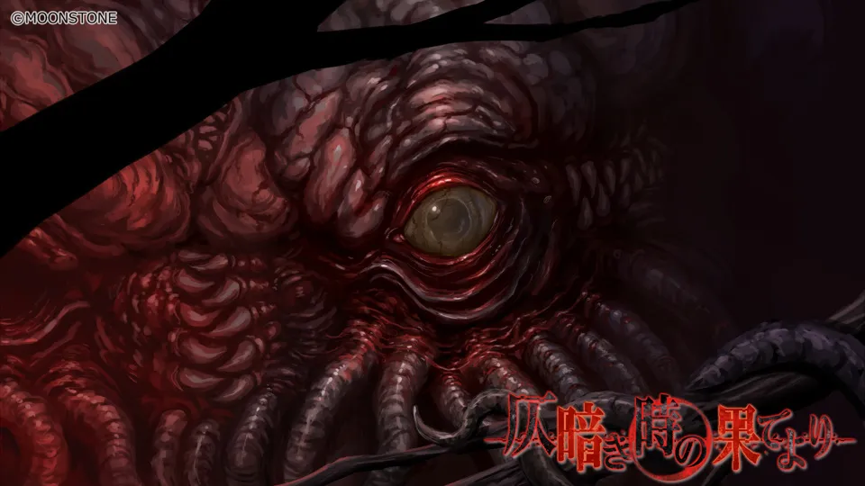
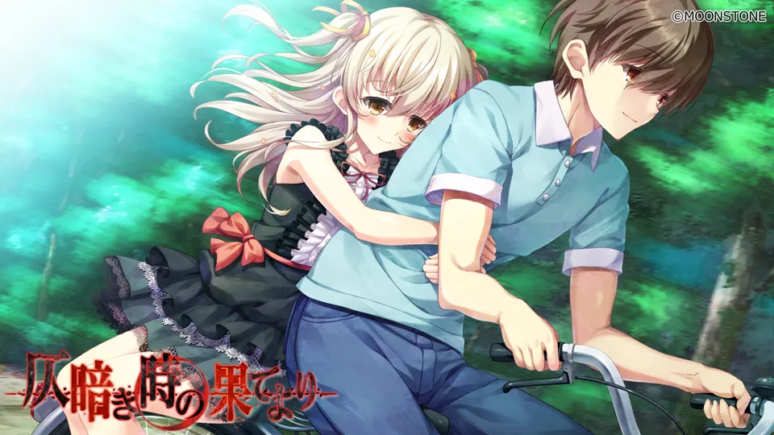
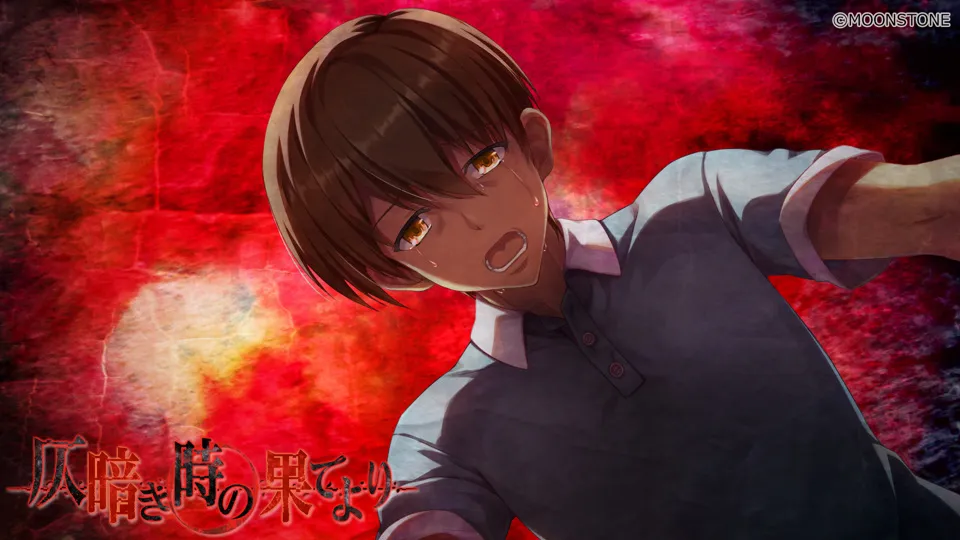
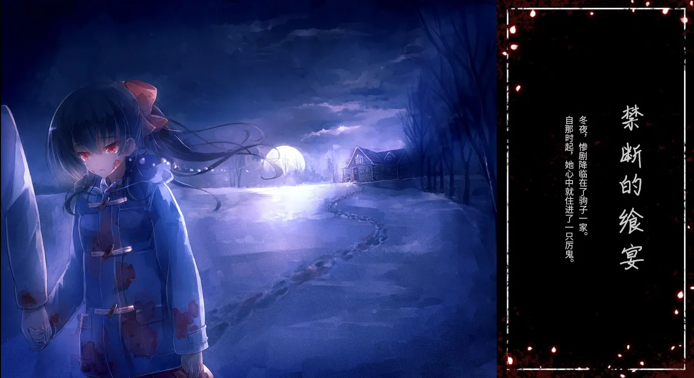
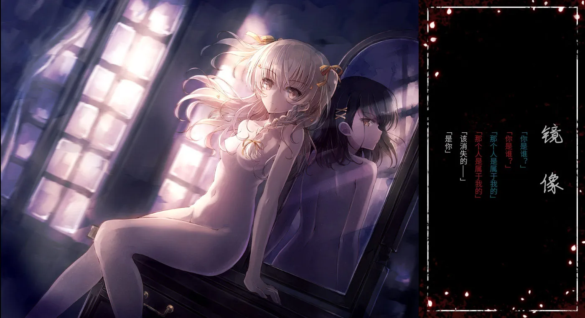
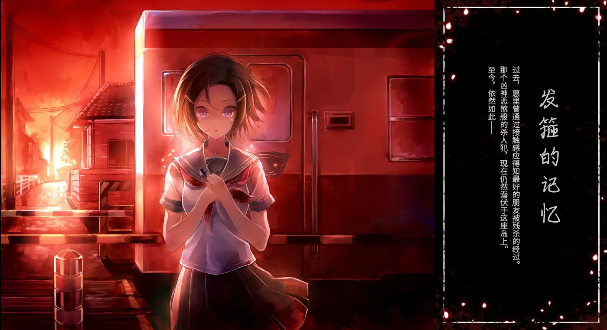
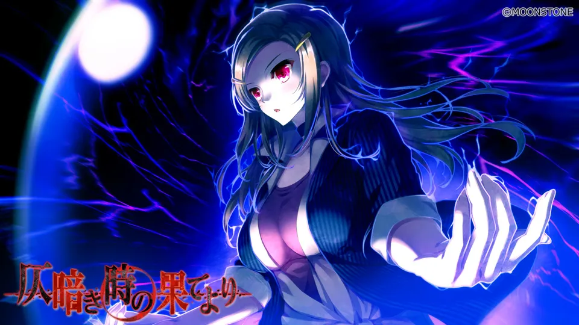
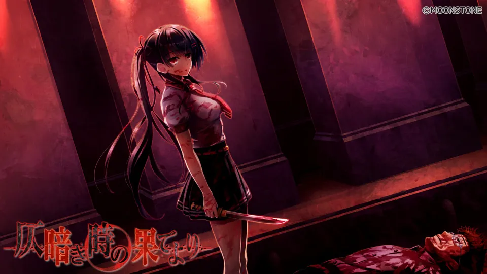
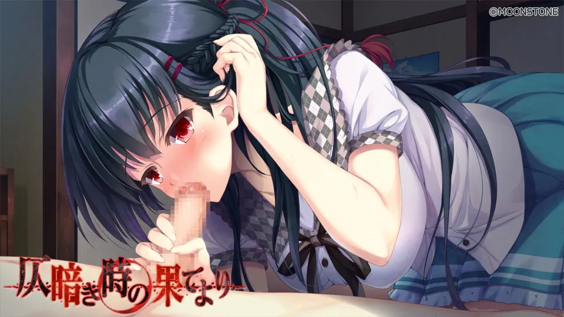
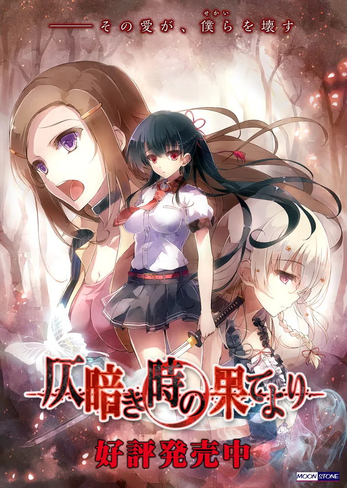

`作者：桐遠暮羽`

號稱尋人能“活必見人，死必見屍”的女偵探，真澀惠里，和助手兩人一起回到家鄉的小島上調查一起離奇的失踪案，然而卻以失敗告終。


| 資訊一覽     |                                                              |
| :----------- | :------------------------------------ |
| **作品名稱**   |  仄暗き時の果てより    |
| **開發商**   | <span style="color:red">MOONSTONE</span>（就是做了很多陽間遊戲的那個公司） |
| **編劇**   | 吳（就是寫了很多陽間劇本的老吳）      |
| **遊戲時長** | 30 小時                     |
| **類型**     | 穿越 恐怖 懸疑 獵奇                 |
| **難度**     | 中（具有一定數量的分支，但是還好） |
| **分級**     | R-18（性行爲，血腥，恐怖）      |

本文是介紹 MOONSTONE 陽間懸疑解謎遊戲系列的第三篇。

## 故事（官方的介紹）

这是一个禁断的——

<br>

夏日。

故事的主人公御城康一，回到了自己出生的小岛。

<br>

有妹妹在港口迎接。
有双亲经营的民宿。
还有那小镇的模样。

<br>

一切仿佛都和从前丝毫未变。
然而——

<br>

相传，岛上有“怪物”出没。
据说还有少女会每夜巡逻，试图亲手杀死那只怪物,



从没把这一切当真的康一，在某天夜里遭到“怪物”袭击，
千钧一发之时，被一名持刀少女·乾驹子救下。

<br>

康一终于目睹了一切。 
从黑暗中现身的怪物。
还有那浓浓夜色中蔓延的世界。 那是个人类决不可窥视的——

<br>

禁断的领域。

------

俺第一次看官方的介紹的時候，臉上的表情估計是不太好看。
這個介紹簡直十足地貫徹了日語的謎語風格，

什麼叫禁斷的夏日？夏日也能禁斷？
俺只聽說過禁斷的戀。

然後中間那幾句看起來有點風平浪靜的描寫，再加上結尾那一個
人類絕不可窺視的禁斷領域，
是不是想營造暴風雨前的寧靜感呢？

營造很成功，很哈人，哈🉐我都開始胡言亂語了

## 故事（我的介紹）

接下來我要稍微劇透一點序章的劇情，遊戲很長，不影響遊玩，，，

------

那是一個禁斷的——

<br>

暑假。（🤪錯亂

<br>

受到了神秘客戶的委託，偵探助手主人公康一，
和女偵探惠里一起回到家鄉的小島，調查一起失踪案，
順便完成每次放假回家必辦的某件事。



到了島上，惠里獨自前往會見委託人，
而康一就騎著單車，載著許久不見的妹妹，
回到了闊別已久的，御城老家開設的民宿。

<br>

在老家邊摸魚邊調查，吊兒郎當過了幾天，
由於委託人提供的線索實在過於有限，而且好像在特意隱瞞什麼，
就連號稱尋人能“活必見人，死必見屍”的惠里都沒能在期限內找到失踪的人。

<br>

兩人只能決定明天就啟程離開小島。

<br>

翌日，二人開著車前往港口時，
迎接他們的是

<span style="color:red">殭屍狂潮。</span>

小島陷入了毀滅。

<br>

為什麼？為什麼會發生這種事？
是因為我們的委託失敗了嗎？
還是因爲島上潛藏的那頭怪物？



無論如何，兩人的人生即將終結於此，
而那些謎團都如同煙一樣永遠消失在歷史中。

## 登場人物

<style>
#swipe {
    width: 100%;
    height: 100%;
    overflow-x: scroll;
    overflow-y: hidden;
    white-space:nowrap;
}
#swipe  .slide {
    display: inline-block;
}
#swipe  .slide img {
    max-height: 600px;
    background-color: transparent;
    border: none;
    }
#swipe  p {
   margin-right: 30px;
   display: inline-block;
}
</style>
<div id="swipe">
<div class="slide">
        
    </div>
    <div class="slide">
<p>
<strong>Komako</strong><br><br>
乾 駒子<br>
中文唸起來極其拗口，<br>所以叫 Komako。<br><br>
在島上上學的高二學生，<br>每天都拿着大刀和怪物搏鬥。<br>
不知爲何態度總是非常堅定。<br><br>
就算是暑假也穿校服，<br><em>算是制服戰鬥少女</em>
</p>
    </div>
<div class="slide">
        
    </div>
    <div class="slide">
<p>
<strong>御城 由乃</strong><br><br>
康一的妹妹<br>
是 Komako 的同學和好朋友，<br>
天真爛漫，看起來很幼。<br>
很粘哥哥，總是盼望着哥哥回家。<br><br>
</p>
    </div>
<div class="slide">
        
    </div>
    <div class="slide">
<p>
<strong>真澀 惠里</strong><br><br>
偵探，雖然很年輕，<br>但是已經獨自開辦事務所。<br>
算是所長。<br><br>
收到了來自小島的委託，<br>所以時隔久遠終於能回家鄉一趟。<br>
她具有一些特異能力，<br>使得她偵探業務很好辦。<br><br>
但是她不怎麼喜歡用特異能力。
</p>
    </div>
</div>

男主角這個王八蛋連插畫都沒有，就不介紹了

------

人物的印象插畫

<div id="carouselExampleIndicators" class="carousel slide" data-ride="carousel">
  <ol class="carousel-indicators">
    <li data-target="#carouselExampleIndicators" data-slide-to="0" class="active"></li>
    <li data-target="#carouselExampleIndicators" data-slide-to="1"></li>
    <li data-target="#carouselExampleIndicators" data-slide-to="2"></li>
  </ol>
  <div class="carousel-inner">
    <div class="carousel-item active">
      
    </div>
    <div class="carousel-item">
      
    </div>
    <div class="carousel-item">
      
    </div>
  </div>
  <a class="carousel-control-prev" href="#carouselExampleIndicators" role="button" data-slide="prev">
    <span class="carousel-control-prev-icon" aria-hidden="true"></span>
    <span class="sr-only">Previous</span>
  </a>
  <a class="carousel-control-next" href="#carouselExampleIndicators" role="button" data-slide="next">
    <span class="carousel-control-next-icon" aria-hidden="true"></span>
    <span class="sr-only">Next</span>
  </a>
</div>


## 遊戲 OP 動畫欣賞

動畫來自 YouTube，由知名諤諤次元歌手 霜月はるか 演唱，

我覺得這首歌挺不錯的。

<video controls preload="auto" width='100%' poster="../image/Tokihate/op.webp">
<source src="https://bitbucket.org/sa-ya/my-static/raw/1286dcad4850e614f859bf4a8c3ffcb47fa62998/Tokihate/op.mp4" type="video/mp4" />
<track default src="../image/Tokihate/op.vtt" label="日文">
<p> To view this video please enable JavaScript</p>
</video>

俺向你保證這個遊戲是陽間遊戲，你看 OP，多麼陽間，對吧

## 一句話點評

因爲我對那些神器魔器屬實不感興趣，所以本作算得上是我玩過的最陽間的遊戲了。
遊戲中的故事結構背景廣大，設定繁多，發生的事件之間看似毫無關聯，
但是實際上環環相扣。這就使得剛才上文的那些故事簡介，
看的人還以爲是生化危機，但是這是遊戲的全貌嗎？只能算是冰山一角。

話說回來，遊戲是陰間了點，但是劇本卻是充滿了編劇老吳的風格，毫不含糊，安排緊湊，
我覺得非常有趣；即使是恐怖遊戲，該和女主角們做愛的地方也毫不含糊。
我在前面劇透了序章會出現殭屍狂潮，然而這不影響序章的觀賞性，
主角們恐怖緊張的求生之路還是不容錯過。序章已是如此，則正片更令人期待。

寫在最後，所述<span style="color:red">從陰暗的時間盡頭而來</span>，到底是<span style="color:red">誰</span>從陰暗的時間盡頭而來，不如猜猜看。


## 遊戲畫面（含有 R-18 畫面）

<div id="carouselExampleIndicators2" class="carousel slide" data-ride="carousel">
  <ol class="carousel-indicators">
    <li data-target="#carouselExampleIndicators2" data-slide-to="0" class="active"></li>
    <li data-target="#carouselExampleIndicators2" data-slide-to="1"></li>
    <li data-target="#carouselExampleIndicators2" data-slide-to="2"></li>
    <li data-target="#carouselExampleIndicators2" data-slide-to="3"></li>
    <li data-target="#carouselExampleIndicators2" data-slide-to="4"></li>
    <li data-target="#carouselExampleIndicators2" data-slide-to="5"></li>
  </ol>
  <div class="carousel-inner">
    <div class="carousel-item active">
      
    </div>
    <div class="carousel-item">
      
    </div>
    <div class="carousel-item">
      
    </div>
    <div class="carousel-item">
      
    </div>
    <div class="carousel-item">
      
    </div>
    <div class="carousel-item">
      
    </div>
  </div>
  <a class="carousel-control-prev" href="#carouselExampleIndicators2" role="button" data-slide="prev">
    <span class="carousel-control-prev-icon" aria-hidden="true"></span>
    <span class="sr-only">Previous</span>
  </a>
  <a class="carousel-control-next" href="#carouselExampleIndicators2" role="button" data-slide="next">
    <span class="carousel-control-next-icon" aria-hidden="true"></span>
    <span class="sr-only">Next</span>
  </a>
</div>

<br>

海報



## 在猶豫是否要下載？

這裏有一個 10 分鐘的試玩實況。

由於手上只有日文版，我嘗試加了翻譯字幕。

<video controls preload="metadata" width='100%' poster="../image/Tokihate/movie.webp">
<source src="https://bitbucket.org/sa-ya/my-static/raw/a35823475fa2d49885381eb4cbfae443d4e3698f/Tokihate/Tokihate-2.mp4" type="video/mp4" />
<track default src="../image/Tokihate/tokihate.vtt" label="繁體中文">
<track src="../image/Tokihate/tokihate-sc.vtt" label="简体中文">
<p> To view this video please enable JavaScript</p>
</video>


## 資源與下載

### 日文原版和破解補丁

遊戲本體

```
magnet:?xt=urn:btih:36718d1709a58a55fe43a92f31fa10f5afe3cd62
```

文件名：(18禁ゲーム) [161222] [MOONSTONE] 仄暗き時の果てより (iso+mds+rr3).rar

資源來自 Mikocon 論壇： https://bbs.mikocon.com/thread-27927-1-1.html

破解補丁：進入上述連結的論壇帖子，下載樓主發的附件 「仄暗き時の果てより Crack (Mai).rar」(789.33 KB)，解壓到遊戲目錄的 /data 文件夾。可能會報毒，我已經試過了，應該沒毒。

### 中文版

截至目前，中文版仍未發佈。

但是某個漢化組應該有漢化，我見有群友發過截圖，想玩的話就去諮詢一下那個群友，問要資源。

<a class="btn btn-info" href="tg://resolve?domain=Galgamer&post=157483">直達群友</a>

<br><br>


<style>
.flex-container {
  display: flex;
  flex-direction: row;
  background-color: transparent;
  border:3px; 
  border-style:solid;
  border-color:pink; 
  padding: 10px;
}
.flex-container > div {
  background-color: transparent;
  margin: 5px;
  text-align: left;
}
</style>
<div class="flex-container">
  <div>
  <image src="../image/Tokihate/yoroshii.webp" width=150px height=150px style=" background-color: transparent;"/>
  </div>
  <div>
  <div class="card bg-dark" style="max-width: 300px">
  <div class="card-body">
    <p class="card-text text-white">Telegram Galgame 頻道突破七千訂閱 - 感謝你的喜歡！</p>
    <a href="tg://resolve?domain=Galgamer_Channel" class="card-link btn btn-primary">
    <span style="margin: 4px;">前往頻道</span>
    </a>
  </div>
</div></div> 
</div>
<br>