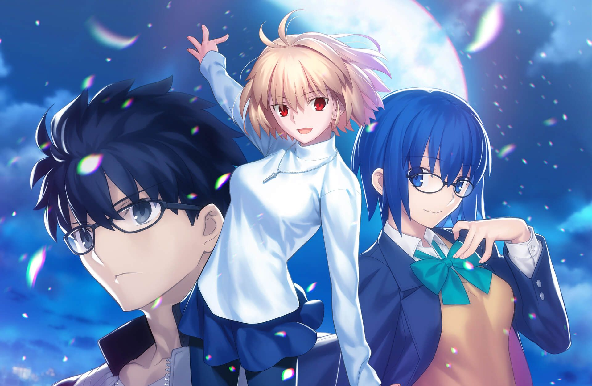
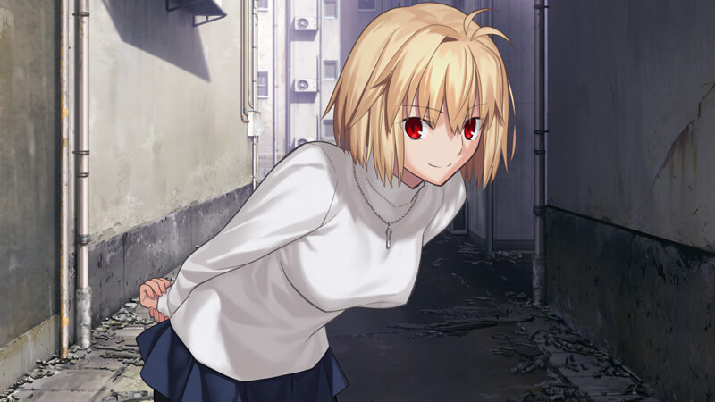
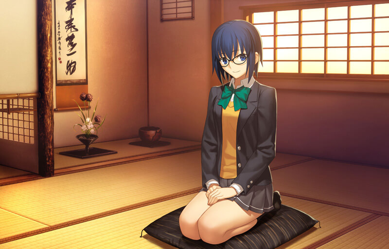
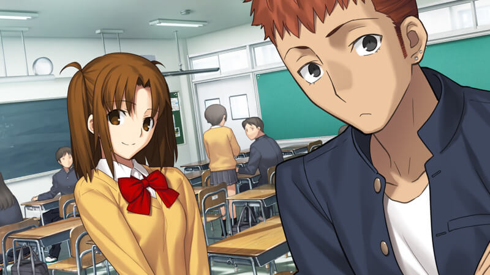
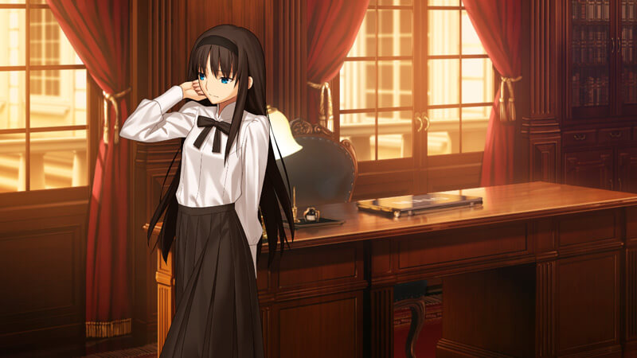
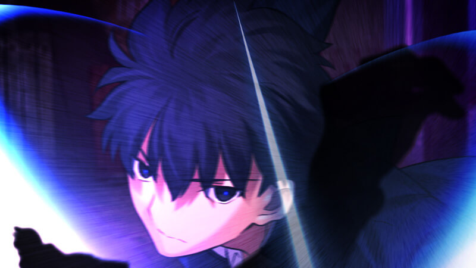

<style>
.navbar.scrolling-navbar {
    will-change: background, padding, box-shadow, backdrop-filter !important;
    box-shadow: 0 2px 5px 0 rgb(0 0 0 / 0%), 0 2px 10px 0 rgb(0 0 0 / 0%);
    transition: background 0.5s ease-in-out, padding 0.5s ease-in-out, box-shadow 0.5s ease-in-out;
    backdrop-filter: blur(0px);
}

.navbar.top-nav-collapse,
.navbar.navbar-col-show {
    box-shadow: 0 2px 5px 0 rgb(0 0 0 / 12%), 0 2px 10px 0 rgb(0 0 0 / 16%);
    background-color: #fffc !important;
    backdrop-filter: blur(20px);
}
#board {
    backdrop-filter: blur(10px);
    background-color: #3337 !important;
}
#toc {
    backdrop-filter: blur(10px);
}
.banner .mask {
    background: linear-gradient(to bottom, #0003 50%, transparent) !important;
}
.heimu {
    display: inline-block;
    background-color: #25252533;
    color: transparent;
    text-shadow: none;
    border-radius: 8px;
    padding: 4px 8px;
    transition: all ease .2s;
}
.heimu:hover, .heimu:active,
.heimu:hover .heimu, .heimu:active .heimu {
    color: white !important;
}
.heimu:hover a, a:hover .heimu,
.heimu:active a, a:active .heimu {
    color: lightblue !important;
}
.heimu:hover .new, .heimu .new:hover, .new:hover .heimu,
.heimu:active .new, .heimu .new:active, .new:active .heimu {
    color: #BA0000 !important;
}
</style>

`作者：sym1018`



没什么好说的,既然月姬重制版已经出了,也就不玩梗了<span class="heimu" title="你知道的太多了">天天催月姬R.</span>.

开头绝赞音乐复刻
放一首最喜欢的<月姫-re>
<audio preload="metadata" style="width: 100%" src="https://s3static-zone0.galgamer.eu.org/file/galaudio-zone0/%E6%9C%88%E5%A7%AB%EF%BC%9Are.mp3" controls="controls">

</audio>


| 資訊一覽      | |
| :----------- | :----------------------- |
| **作品名稱** | 月姬/Tsukihime/月姫 |
| **開發商**   | Type Moon |
| **遊戲時長** | 25h单线路(包括be),100h以上(全线通关包括be) |
| **類型**     | 奇幻 战斗 恋爱 |
| **難度**     | 高(不同选择不同线路,易进,可能需查看攻略) |
| **分級**     | R-18(血腥暴力, 性行为) |


## 游戏简介

远野志贵(我)在八年前的意外中,眼睛获得了神奇的能力(直死之魔眼)

那是可以看到纵横交错在事物身上的 **死线** 的能力.
即使是永生的吸血鬼,死线被切的部份都会坏死,不可能再还原.

又因为此次意外,他被托付于远亲的家中过着平静的日常生活,直至父亲去世的消息传达.
他被家主 **秋叶** 召回远野家,作为远野家的长子开始新的生活.
戏剧般的继承了古老的氏族,又住进一个与自己不相称的豪宅里,旧日的风景慢慢唤醒了志贵记忆的碎片.

就在生活突然发生巨大改变之时,在上学路上,
志贵突然跟随自己的本能,卸下眼镜跟踪并杀死了一位少女.
但第二天她又完好无损的出现在志贵眼前,笑着说

<p class='font-serif' style='font-size: 150%'>
你好啊,昨天可真是受你不少关照呢.
</p>

至此,故事正式展开.


## 主要人物


<div class="heimu" title="你知道的太多了" html={html} />


<div class="sp-character" style=%{ $color: color }%>
    <p html={html.replace(/\.\s*/g, ".<br>")}>
        <div class="note">{note}</div>
    </p>
    
</div>


<style>

.sp-character {
    display: flex;
}
.sp-character > .fancybox {
    max-width: 40%;
    min-width: 33%;
    filter: drop-shadow(0 0 6px #000c);
}

.sp-character > p {
    display: flex;
    flex-direction: column;
    gap: 16px;
    text-shadow:
        1px 1px 0 var(--color),
        -1px -1px 0 var(--color),
        -1px 1px 0 var(--color),
        1px -1px 0 var(--color),
        1px 0 0 var(--color),
        -1px 0 0 var(--color),
        0 1px 0 var(--color),
        0 -1px 0 var(--color);
}

.sp-character > p > strong:first-of-type {
    display: block;
}

.sp-character > p > .note {
    color: white;
    font-weight: 900;
    text-shadow: unset;
}

</style>

### 爱尔奎特·布伦史塔德(Arcueid Brunestud)

<sp-character name=Arcueid_Brunestud note="号称人气绝强的白姬,在《月姬》角色人气投票中四连霸,人气之高无人可挡." color="#80654e">
    这部游戏的第一女主角.
    一个神秘的女人,与优雅的外表相反,她天真,幼稚,但在任何方面都显得无可挑剔.
    <br />
    她怀揣着某种目的参观小镇,但在一次令人震惊的相遇之后(指被男主杀死了又复活),选择与志贵一起行动.
    <sp-heimu>
        身份是真祖,吸血鬼皇室不可或缺的存在.
        尽管她拥有压倒性的身体能力,也不畏惧阳光,但爱尔奎德并不像传说中那样吸血和杀人.
        她自己也不知道是为什么.
    </sp-heimu>
</sp-character>


### 希耶尔(Ciel)

<sp-character name=Ciel note="咖喱狂热者,三餐都吃咖喱,绝不允许有人说咖喱的坏话." color="#3762a6">
    志贵就读的学校的高年级学生.
    校服和微笑是她的标志,她性格温柔,礼貌地对待每个人.
    深受身边人们的信任,成为了志贵的可靠伙伴.
    <br />
    茶道部部长,午休和放学的时候进出茶道社的房间,<br />
    志贵也经常光顾这间茶室吃茶点,和希耶尔一点一点的商量和交谈,加深交流.<br />
    志贵最好的朋友有彦渴望的女人,似乎象征着平静的日常生活.<br />
</sp-character>

### 远野秋叶(Tohno Akiha)

<sp-character name=Tohno_Akiha note="傲娇姐姐谁不爱呢" color="#746c6c">
    志贵的妹妹.
    父亲死后继承名门远野家的年轻主人.
    <br />
    她代替志贵接受了贵族教育,几乎整天都困在房中学习,
    每天只有半小时的游戏时间,更没有交朋友的时间.
    她学会了名门家庭应有的的知识、行为和礼仪,但却失去了作为少女的快乐时光.
    <br />
    对疏远七年的哥哥志贵怀有复杂的感情,
    她似乎知道志贵魔眼的秘密……
</sp-character>

### 翡翠(Hisui)

<sp-character name=Hisui note="翡翠的另一个名字“洗脑侦探翡翠”则是因误植和同人效力催化下的产物,也算是月姬的另一种趣味." color="#cf5d68">
    为远野家服务的双胞胎仆人之一,双子之妹.
    姐妹俩关系很好,琥珀是做饭,翡翠是打扫卫生,互相弥补对方的不足.
    <br />
    穿着经典女仆式套装.她沉默寡言,缺乏情感表达,就像个机器人.
    志贵回到府邸后,她作为专属女仆照顾他,如果志贵的身体出现问题,她常能及早发现.
</sp-character>

### 琥珀(Kohaku)

<sp-character name=Kohaku note="太惨了,不忍吐槽." color="#cf5d68">
    为远野家服务的双胞胎仆人之一,双子之姊.
    其他员工都被解雇了,所以现在的豪宅的所有管理都留给了她们.
    <br />
    穿着和服、围裙等传统服饰,总是面带微笑的开朗女性.
    但是她也有可怕的地方,那就是她会以她自己的节奏捉弄对方.
    她的主人秋叶因为总是被戏弄而困扰.
</sp-character>

### 远野志贵(Tohno Shiki)

<sp-character name=Tohno_Shiki note="故事的主角, 特异的体质总会吸引其他怪异" color="#6c7aa0">
    本作的男主角,乍一看是个性随和的文学男孩.
    因为过去的经历,他与同年人相比有着比较奇特的生死观.
    <br />
    七年前,他卷入一场交通事故,从昏迷中恢复过来时,他的眼中出现谜一般的线条.
    这些线条与事物相连,切割这些线条就会毁坏事物.
    但通过与蒼琦青子的邂逅,他获得一副可以抑制该现象眼镜.
    <br />
    至此,他又回到了本该在的日常生活.
</sp-character>

## 游戏

### 遊戲 OP

<video controls preload="metadata" width='100%' poster="../image/Tsukihime/op.jpg">
<source src="https://s3static-zone0.galgamer.eu.org/video-2d35/Tsukihime/Tsukihime-op.mp4" type="video/mp4" />
</video>

### CG

下列cg为官网下载remake的全新cg,原cg因画质与画风还是不要放上来为好












## 总结

### 点评

**原版:**
好玩就完事了,型月制作,2000的AVG靠着剧情音乐大卖,歌月十夜和月姬PLUS-DISK的发出也证实受欢迎程度.与fSN相比,我觉得毫不逊色.
月姬共五条主线,分为吸血鬼篇(爱尔奎特、希耶尔)与远野篇(远野秋叶、翡翠、琥珀).
完成五线剧情后,在开始菜单可以进入“月蚀”内容.

新版:
音乐和CG大赞,保留原有音乐的同时,还新增大量音乐CG,旧的也复刻了一遍.
UI界面倒是感觉原版吧,不好也不差.
新加了流程图,算是吸收了gal界的优良传统吧.
剧本更加紧凑,仅有两条线的剧本也让选项更加直接,一定程度上降低了游戏难度.

月姬的剧情可以用凄美来形容<sp-heimu>(处处体现着蘑菇的心狠手辣),</sp-heimu><br>
游戏分为表里两线,表线较为热血,但里线的故事刻画人物的情感和过往经历描绘出一个栩栩如生的世界.虽没有优秀的立绘与cg,但角色与角色之间的情感碰撞足够令人动容.每当通过新的线路都了解到更多的心酸往事,从而了解角色是为何走上自己的道路.

<sp-heimu>
笔者个人最喜欢的是秋叶,唯一一个没有好结局的女主角,远野家族的诅咒易进让她背负了太多,尽管如此,她也一直在为志贵着想,最后牺牲了自己.
</sp-heimu><br>


### 攻略信息
可参考UP主秋刀魚glauque[🔗️月姬2000攻略](https://www.bilibili.com/read/cv12891996)
原版选项难度过高,不时就进入死亡循环,自己玩记得多存档,如果想体验主要剧情可参考攻略.
每条线路的难度都不相同,内容较多,耗时较长,还请耐心游玩

### 个人推荐月姬系列顺序
1.文字冒险游戏《月姬》 （这是原作）
2.漫画《真月谭 月姬》（《月姬》的漫画）
3.动画《真月谭 月姬》（《月姬》的动画）
4.《月姬plus-disc》（给《月姬》粉丝提供的额外内容）
5.文字冒险游戏《歌月十夜》（新作）
6.格斗游戏《MELTY BLOOD 逝血之战》系列（新作）
7.文字冒险游戏《月姬 -A piece of blue glass moon-》(这是月姬remake,目前仅生肉,NS与PS4平台)

## 试玩录像

本作较长, 这里有个 量子波动速读 试玩录像,
不需要阅读文字, 请简单体会意境.

<video controls preload="metadata" width='100%' poster="../image/Tsukihime/movie.webp">
<source src="https://s3static-zone0.galgamer.eu.org/video-2d35/Tsukihime/13min-know.mp4" type="video/mp4" />
</video>

## 资源

该游戏目前只有NS和PS4版本,需要使用Switch模拟器游玩.

### 正版资源

游戏内容可通过[🔗️Tsukihime wiki](https://typemoon.fandom.com/wiki/Tsukihime) 来查看更多

新版NS与PS4游戏购买在[🔗️官方网站](http://typemoon.com/products/tsukihime/)查看

### OST

[🔗️OST购买地址](https://anxmusic.lnk.to/eUubpH)

原生OST,由网易云电台带佬上传
链接地址:[🔗️月姫 -A piece of blue glass moon- Original Soundtrack](http://cloud.tsuasahi.com/Music/%E6%9C%88%E5%A7%AB%20-A%20piece%20of%20blue%20glass%20moon-%20Original%20Soundtrack%20FLAC.zip)

### 远古的原版游戏

原版游戏链接[🔗️google driver](https://drive.google.com/drive/folders/1YCL0KjZcflTDEpq39irOUKHoXk1JpLFZ)
密码(终点),用的终点论坛的链接.

也可以 

### 重点在此：高清重制版

汉化：目前还没弄好.
复刻版汉化进度可查看萌娘百科大佬百科[🔗️Letdo1945/月姬REMAKE汉化进度](https://zh.moegirl.org.cn/User:Letdo1945/%E6%9C%88%E5%A7%ACREMAKE%E6%B1%89%E5%8C%96%E8%BF%9B%E5%BA%A6)
进度查询[🔗️二线汉化中](https://www.91tvg.com/thread-260813-1-1.html)

啃生肉的话...

```
magnet:?xt=urn:btih:04a75cc42f3a9c989269ac1df6cf4551bf54eebc
```

文件名：Tsukihime - A piece of blue glass moon- [SWITCH].nsp

上面是游戏本体,需要配合[🔗️任天堂Switch模拟器](https://yuzu-emu.org/)来运行.
模拟器的使用教程请看一篇[🔗️B站教程](https://www.bilibili.com/read/cv7047342/),
文中提到的key文件在此 

<style>
body {
    background: url('../image/Tsukihime/bg.png') no-repeat fixed center;
    background-size: cover;
}
#banner {
    background: url('')!important;
    background-color: transparent!important;
}
#toc {
     background-color: rgba(0,0,0,0.5);
     padding: 20px 10px 20px 20px;
     border-radius: 10px;
}
</style>
<script>
window.addEventListener('DOMContentLoaded', function() {
setInterval(() => document.documentElement.setAttribute('data-user-color-scheme', 'dark'), 500);
});
</script>
