`作者：如月零`

> 被表妹如月零邀請，回到故鄉如月老宅參加「儀式」 的男主角，卯月誠一，在儀式上遭遇了一個看上去和如月零長得一模一樣的活人偶。

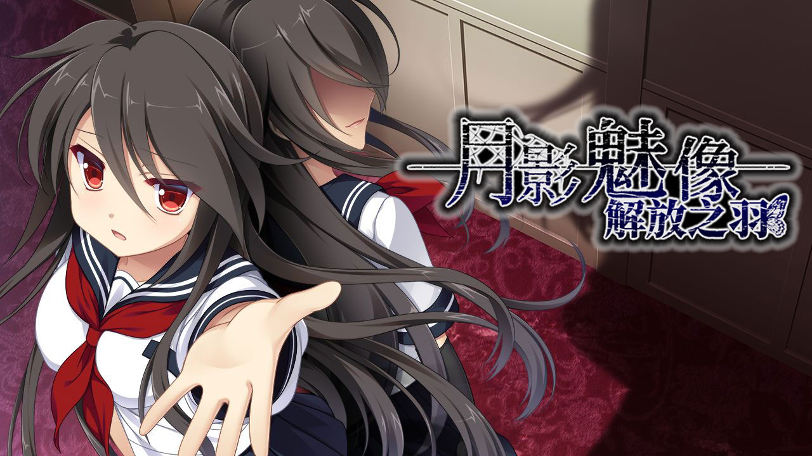

| 資訊一覽     |                              |
| :----------- | ---------------------------- |
| **開發商**   | Applique        |
| **遊戲時長** | 25 小時                      |
| **類型** | 懸疑，奇幻                      |
| **難度**     | 較低（能夠使用路線圖進行跳轉） |
| **分級**     | R-18（性行爲描寫，血腥）     |

## 故事

在外求學的卯月誠一，收到了算是表妹又算是青梅竹馬的女孩如月零的來信，

「父親想讓你給我們的儀式做個幫手。還有，你不想回來看看嗎？」

借着暑假，誠一回到了闊別三年的故鄉伊澤街。

<br>

回到如月家位於森林中的宅邸，前來迎接的如月零看起來還是一如既往的高冷。

誠一一開始還在擔心一無所知的自己能否勝任「儀式」的工作，

但是被告知只需要一直坐着就行之後，誠一便安下心來。

<br>

儀式上，誠一第一次認識到了如月家的家寶「活人偶」。

「什麼嘛，原來是你啊」誠一對眼前的如月零說道。

但是，事後誠一再向如月零詢問儀式的事情的時候，卻只得到了模棱兩可的回答，

就像兩人之間的關係隔了一層看不見的牆壁一樣。

## 登場人物

### 卯月 誠一

 

**本作男主角，**

**屬於如月家系分支的一族，**

**精通機械，一碰到就能知道其內部原理。**

`凡事都有其存在的意義，就像機器通過零件的組合才能運轉起來一樣。`

 * 俺不太喜歡他的長相，還好在遊戲裏面不會經常看到。
<div style="clear: both;"/>

### 如月 零

  

  **如月家的獨生女，**

  **因爲討厭捲入各個家系之間的政治鬥爭，**

  **對不熟的人都很冷淡。**

  `我已經做好準備了，我將在這裏死去。`

 * 有點傲嬌。
<div style="clear: both;"/>

### 水無月 一葉

  

  **如月家的少女女僕，**

  **也屬於如月家的旁系，**

  **年齡比誠一小，就像妹妹一樣。**

  `我會照顧好你的！`

  * 喜歡玩課金抽卡遊戲，這可不是個好兆頭。
<div style="clear: both;"/>

### 野上 美優

  

  **零和誠一的好朋友，曾經一起上學。**

  **和如月家沒甚麼關係，所以不會像某些媚權之人去跪舔如月家，**

  **只是覺得他們的宅子很大。**

  `你終於回來了~`

  * 明明很可愛，但是戲份較少。
<div style="clear: both;"/>

### 一條 忍

  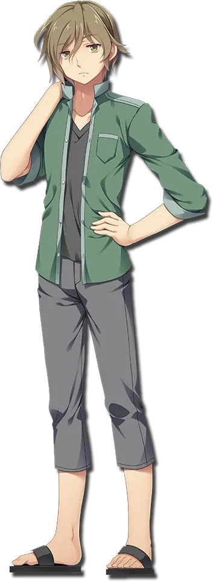

  **誠一的好朋友，**

  **對於誠一離開家鄉覺得很可惜。**

  **在以前的吸血鬼事件中失去母親，想要查明真相。**

  * 標準基友
<div style="clear: both;"/>

### 如月 紅

  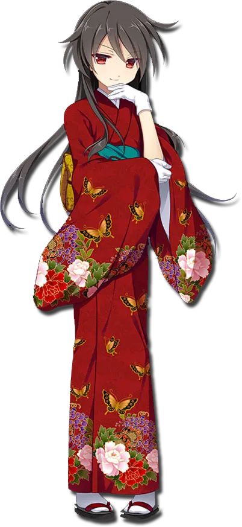

  **如月家的家寶，活人偶**

  **性格很隨意，態度也是。**

  `呵呵，有趣。`

  * 問就是零假扮的。
<div style="clear: both;"/>

## 遊戲 OP 動畫欣賞

俺覺得這首歌一般般，所以摺疊了。

<details><summary>點此展開 OP 動畫</summary>

<video width="100%" controls="controls"  preload="metadata" muted> 
<source src="https://cdn.cloudflare.steamstatic.com/steam/apps/256756829/movie480.webm" src-cn="https://media.st.dl.pinyuncloud.com/steam/apps/256756829/movie480.webm" type="video/webm"/>
<source src="https://cdn.cloudflare.steamstatic.com/steam/apps/256756829/movie480.mp4" src-cn="https://media.st.dl.pinyuncloud.com/steam/apps/256756829/movie480.mp4" type="video/mp4"/>
<p>無法使用  JavaScript。</p>  
</video>

動畫來自 Steam。
</details>

但是遊戲中的另一首插曲則是膾炙人口的諤諤次元世界名曲：

霜月はるか - **イノチの灯し方** 

*音訊來自網易雲音樂，自動加載已停用，播放時請注意音量。*

<audio controls="" style="width: 100%" preload="none" src="https://music.163.com/song/media/outer/url?id=473403622.mp3" type="audio/mp3"></audio>

歌詞唱出了遊戲中某個人物的內心，旋律也很有意境，這首歌是俺入坑遊戲的契機。

## 一句話點評

本作又是一部懸疑類劇情作品，但是並沒有之前介紹過的
櫻之社系列那麼恐怖獵奇，淡淡的恐怖氛圍恰到好處。

雖然遊戲時長約爲 25 小時，但是因爲結局和路線有十幾個之多，
所以遊玩起來給玩家的體驗更短，
更像是一個短篇故事集。

遊戲存在多個劇情鎖，解鎖後玩家可以
隨時通過路線圖在分支之間跳轉，就如同改變歷史一般，
隨着線路的改變，從不同的角度對故事進行
層層剝繭，最後解開謎團，整體安排十分優秀。

另一方面，遊戲中各個人物的設定其實各有深意，
希望遊玩的各位能體會到高冷傲嬌的如月零對你的愛。

## 遊戲畫面（含有 R-18 畫面）

<div class="flexContainer" style="display:flex;">
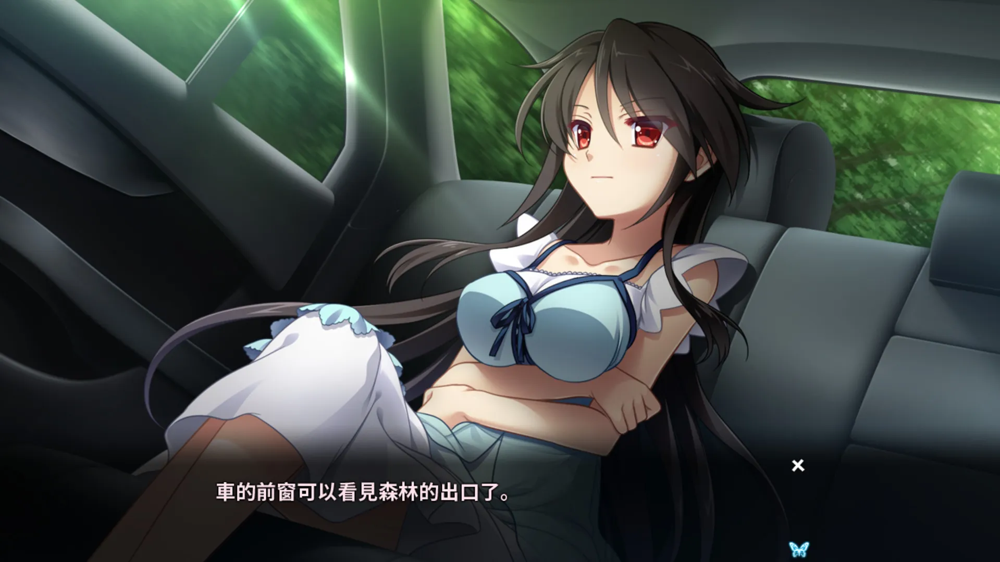
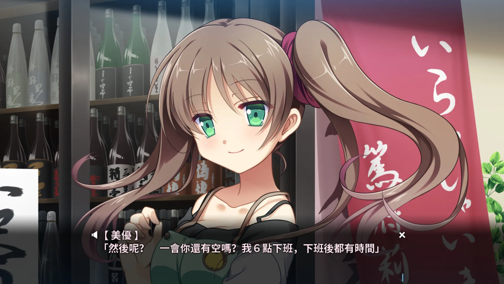
</div>
<br/>
<div class="flexContainer" style="display:flex;">
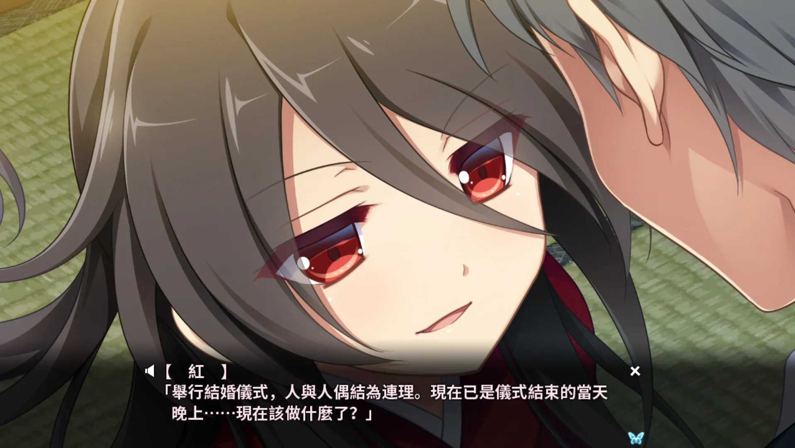
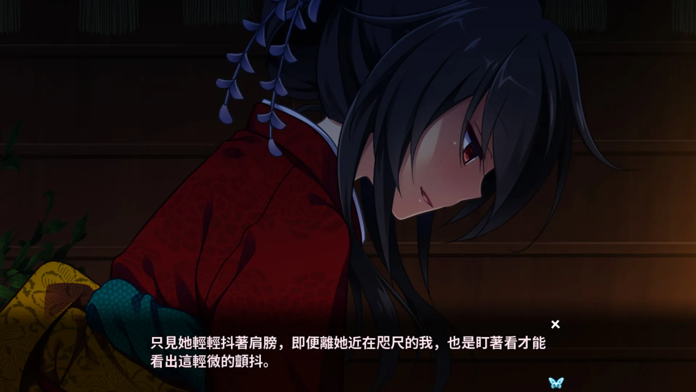
</div>
<br/>
<div class="flexContainer" style="display:flex;">
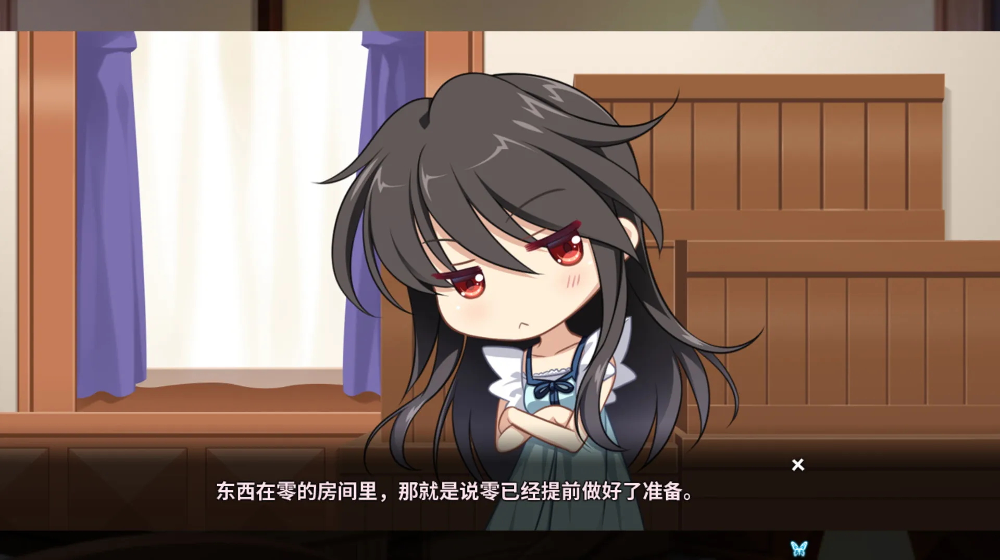
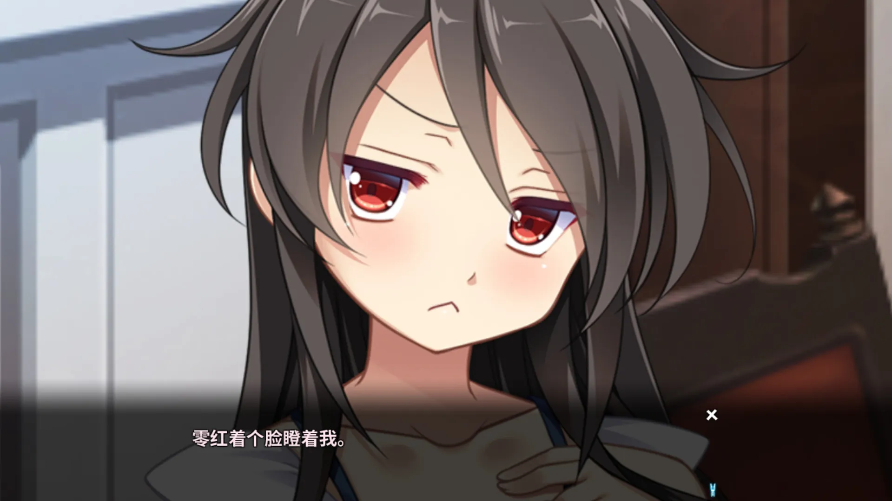
</div>
<br/>
<div class="flexContainer" style="display:flex;">
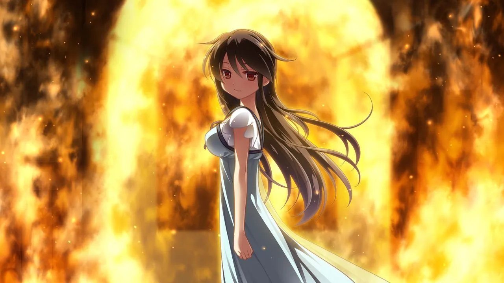
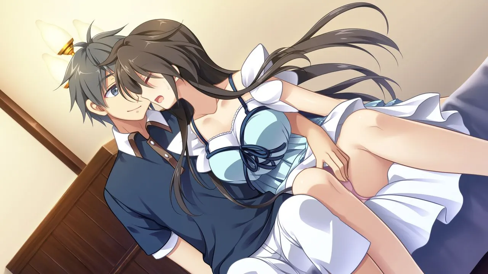
</div>
<br/>
<div class="flexContainer" style="display:flex;">
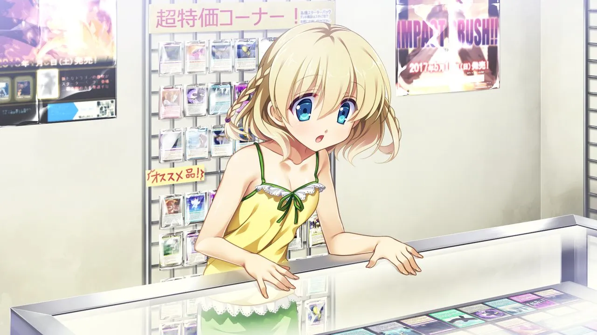

</div>


## 在猶豫是否要下載？

這裏有一個 5 分鐘的試玩實況。

<video width="100%" controls="controls"  preload="metadata"> 
<source src="https://bitbucket.org/sa-ya/my-static/raw/d19e1338d24101adb5cd52d0cf9ffcd235b5f15f/Tsukikage/5min-know.mkv" src-cn="https://pan.bilnn.cn/api/v3/file/sourcejump/pm4WKbFw/BMAfvf-dq4xX0rpZiiOJLJtlatl9B3NcoBo4gQJCARI*" type="video/webm"/>
<source src="https://bitbucket.org/sa-ya/my-static/raw/4f9e5f20d0c96abd0f71976ab355b0a1c4726f7d/Tsukikage/5min-know.mp4" src-cn="https://pan.bilnn.cn/api/v3/file/sourcejump/lmB48dcb/Px6uB8AlWA-4iv0ERUsC6Fph-aDOehv4Jbuq9PKx8nk*" type="video/mp4"/>
<p>無法使用  JavaScript。</p>  
</video>

錄像來自 Bitbucket。

## 資源與下載

<iframe src="https://store.steampowered.com/widget/1069230/" frameborder="0" width="100%" height="200" ></iframe>

Steam 商店爲官方多語言版。

R-18 補丁官網下載連結如下：

http://appendingpulse.jp/dl/tsukikage_patch/

<br>

日文原版資源（無需破解和 R-18 補丁）：

```
magnet:?xt=urn:btih:eb756a9d14690581a69ba320609a6d074db5749b
```

文件名：月影のシミュラクル -解放の羽- 初回限定版 + 初回特典

種子來源： https://bt.orzx.im/view.php?id=110476

下載速度可能較慢，請耐心等待，，，

<div id="hot_patch"></div>

<script src="../image/Tsukikage/patch.js"></script>

