`作者：Sakura Rain`

## At A Glance

25 歲的黑野奏汰，發 LINE 警告高二時那不知道喜歡的人是誰，弄不清楚心意的自己——「你會後悔的」

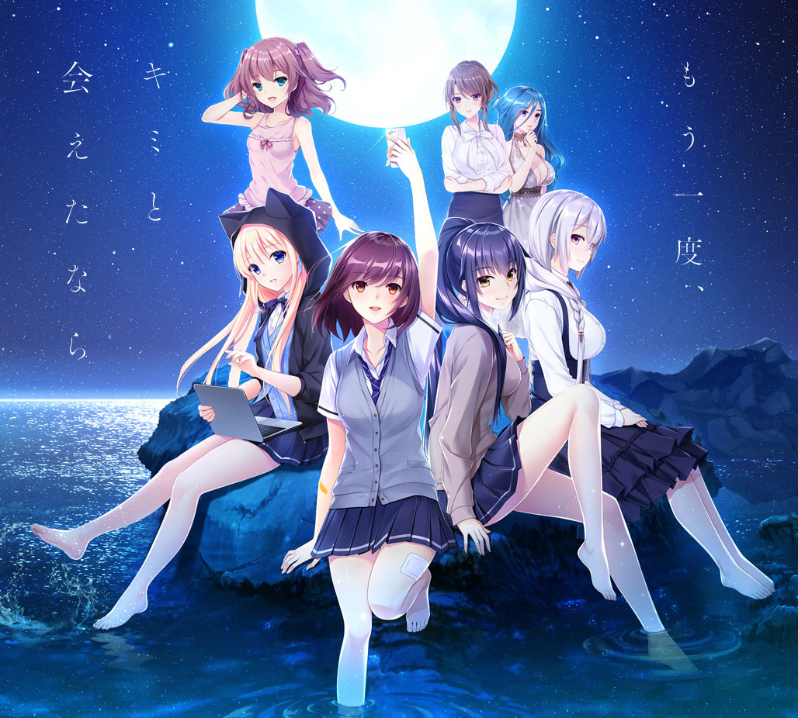


| 資訊一覽     |                 |
| :----------- | :------------------------------------ |
| **開發商**   | tone work's |
| **攻略人數** | 7                    |
| **遊戲時長** | 可能有 50 小時                     |
| **類型**     | 穿越 搞笑 純愛 學園 社會                |
| **難度**     | 中（需要攢好感度） |
| **分級**     | R-18（性行爲）      |

本作是 tone work's 系列的第 4 部作品。

## 故事

高中生黑野奏汰，夢想是成爲一位小說家。

自從自己的創作筆記被文藝部的學姐撿到送回來之後，
他就深深地被這位前輩所吸引，憧憬着她，加入了文藝部。

奏汰也不知道自己這種感情算不算喜歡，
但是他還是想寫出能讓前輩認可的小說。

同時，身邊的青春女孩子們散發的不同的氣息，
也在時不時地撩撥着他的心。

這是也許圓滿甜蜜，也許遺憾心酸的初戀故事，
就在這個高二的夏天。

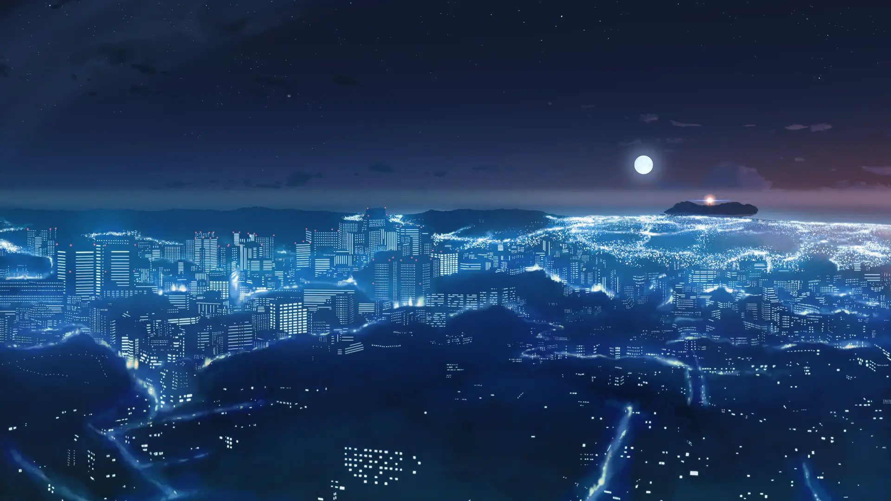

轉眼之間，到來的是 25 歲的夏天。

擡頭看到了那一輪明月，
學生時代的往事如夢似幻地浮現在眼前。

偶然之間，再拿起了學生時代用過的智能手機，
懷着複雜的心情，向着過去的自己，

**「你會後悔的。」**

送出了這樣的信息。

不知道失去的東西能否復得，
錯過的人能否再見，

這是你做出的命運的選擇。

### 路線圖 <span class="badge badge-secondary">Beta</span>

<div class="route-map">
    <x-row>
        <x-col src="../image/Tsukikana/RouteMap/0-0.jpg" default/>
        <x-col src="../image/Tsukikana/RouteMap/0-1.jpg"/>
        <x-col src="../image/Tsukikana/RouteMap/0-2.jpg"/>
    </x-row>
    <x-row start-from="2">
        <x-col src="../image/Tsukikana/RouteMap/1-2.jpg"/>
        <x-col src="../image/Tsukikana/RouteMap/1-3.jpg"/>
    </x-row>
    <p> JavaScript 錯誤，無法顯示路線圖</p>
</div>

## 登場人物

<style>
.text-outline {
    text-shadow:
    -2px -2px 0 #FFF,
    2px -2px 0 #FFF,
    -2px 2px 0 #FFF,
    2px 2px 0 #FFF;
}
.text-outline-black {
    text-shadow:
    -2px -2px 0 #151550,
    2px -2px 0 #151550,
    -2px 2px 0 #151550,
    2px 2px 0 #151550;
}
.verticaltext{
   width:1px;
   word-wrap: break-word;
   white-space:pre-wrap; 
}
</style>
<div class="card bg-transparent text-dark border-light col-lg-8 my-2 px-2 py-2">

<div class="card-img-overlay">
<div class="position-absolute" style="bottom:0;right:0">
<h5 class="text-right mr-4 text-light text-outline-black font-italic font-weight-light" style="font-size:200%;right:0">
新谷 燈華
</h5>
<p class="text-right mr-2 text-light rounded px-2 py-2" style="background-color: rgba(20, 20, 40, 0.80)">
<mark>夜晚在街上四處徘徊的少女。</mark><br>
是奏汰的同班同學，但是不好好上課。<br>
雖然是個活潑的人，卻好像有什麼祕密。<br>
喜歡捉弄男主。
</p>
</div>
</div>
</div>

<div class="card bg-transparent text-dark border-light col-lg-8 my-2 px-2 py-2">
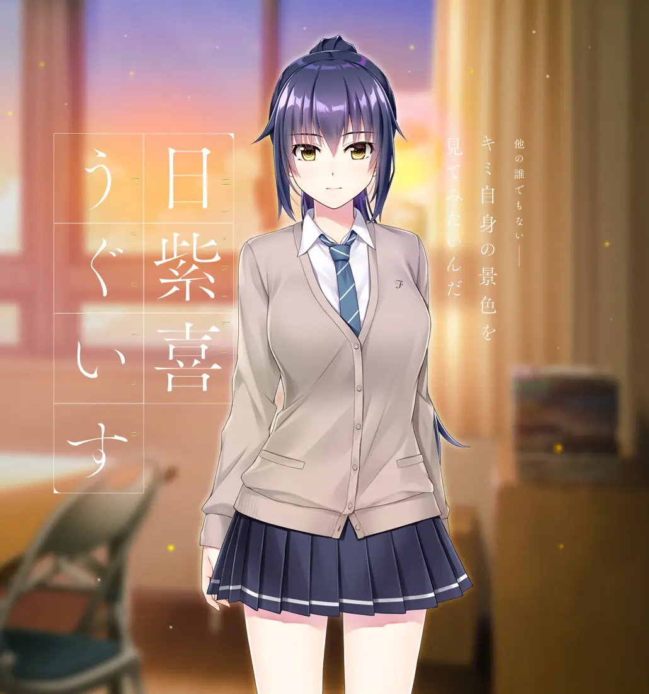
<div class="card-img-overlay">
<div class="position-absolute" style="bottom:0;right:0">
<h5 class="text-right mr-4 text-light text-outline-black font-italic font-weight-light" style="font-size:200%;right:0">
うぐいす學姐
</h5>
<p class="text-right mr-2 text-dark rounded px-2 py-2" style="background-color: rgba(255, 255, 255, 0.8)">
<mark class="bg-dark text-light">熱愛讀書的文藝部前輩。</mark><br>
凜然動人，沉靜優雅，很有人氣。<br>
讀了很多書，很博學。<br>
卻只想過着普通的日常。
</p>
</div>
</div>
</div>

</style>
<div class="card bg-transparent text-dark border-light col-lg-8 my-2 px-2 py-2">
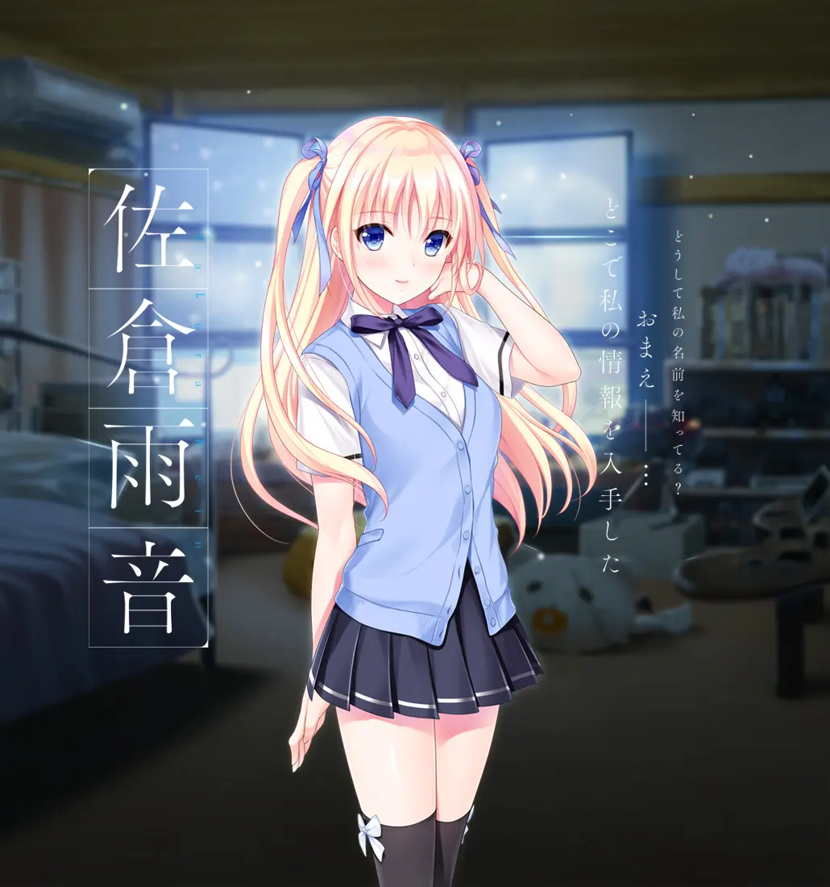
<div class="card-img-overlay">
<div class="position-absolute" style="bottom:0;right:0">
<h5 class="text-right mr-4 text-light text-outline-black font-italic font-weight-light" style="font-size:200%;right:0">
佐倉 雨音
</h5>
<p class="text-right mr-2 text-light rounded px-2 py-2" style="background-color: rgba(20, 20, 40, 0.80)">
<mark>金髮超級嗨客美少女</mark><br>
是奏汰的同級生，電腦高級高手，<br>
頭腦很聰明，但是有點中二<br>
有點傲嬌，實際上是個寂寞的人。
</p>
</div>
</div>
</div>

<div class="card bg-transparent text-dark border-light col-lg-8 my-2 px-2 py-2">
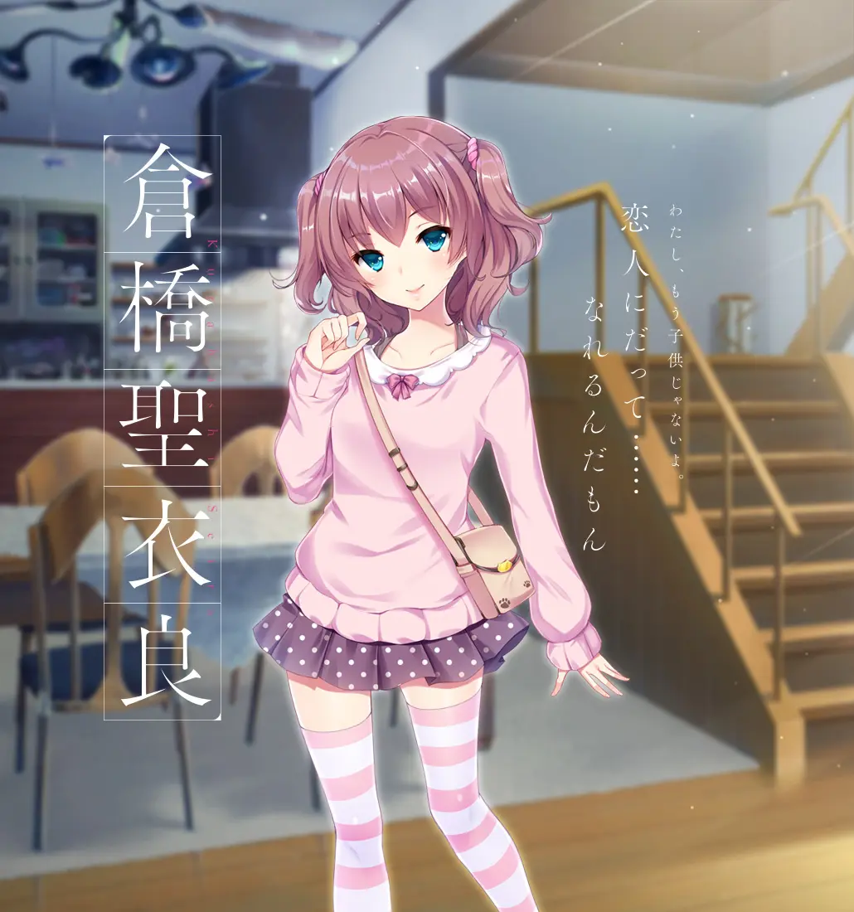
<div class="card-img-overlay">
<div class="position-absolute" style="bottom:0;right:0">
<h5 class="text-right mr-4 text-light text-outline-black font-italic font-weight-light" style="font-size:200%;right:0">
倉橋 聖衣良
</h5>
<p class="text-right mr-2 text-dark rounded px-2 py-2" style="background-color: rgba(255, 255, 255, 0.8)">
<mark class="bg-dark text-light">小惡魔 (戀愛方面上) 少女</mark><br>
男主的遠房親戚，思維有點成熟，<br>
講話很裝大人，很想成爲大人，<br>
天天打着約會的旗號拉着男主亂逛
</p>
</div>
</div>
</div>

<div class="card bg-transparent text-dark border-light col-lg-8 my-2 px-2 py-2">
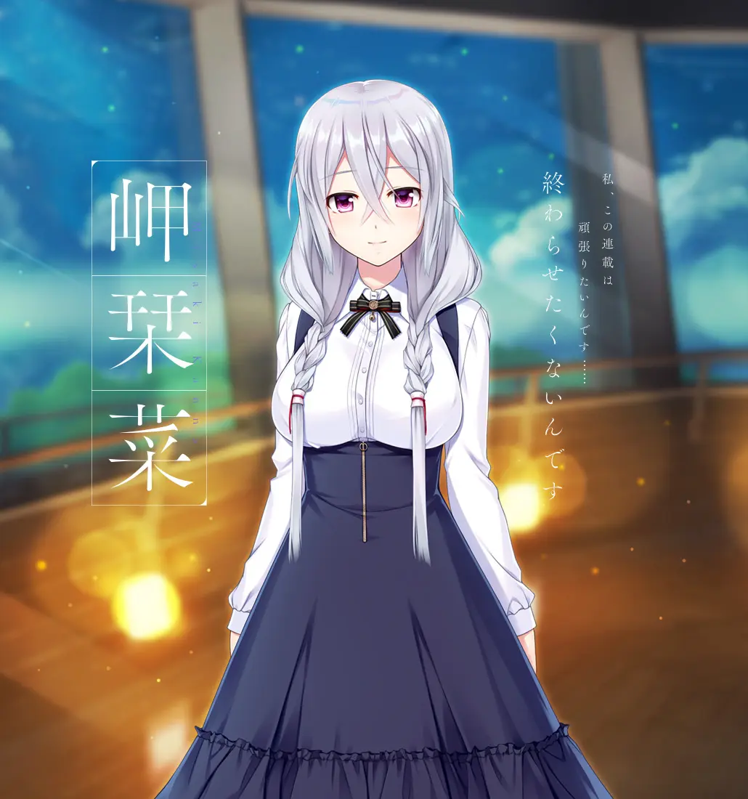
<div class="card-img-overlay">
<div class="position-absolute" style="bottom:0;right:0">
<h5 class="text-right mr-4 text-light text-outline-black font-italic font-weight-light" style="font-size:200%;right:0">
Misaki Kanna
</h5>
<p class="text-right mr-2 text-dark rounded px-2 py-2" style="background-color: rgba(255, 255, 255, 0.8)">
<mark class="bg-dark text-light">毫無戀愛經驗的少女漫畫家</mark><br>
從北海道遠道而來，作畫相當專業<br>
一直就讀女校，所以一和男人<br>
講話就緊張。<br>
急需戀愛經驗補充漫畫靈感。
</p>
</div>
</div>
</div>

<div class="card bg-transparent text-dark border-light col-lg-8 my-2 px-2 py-2">
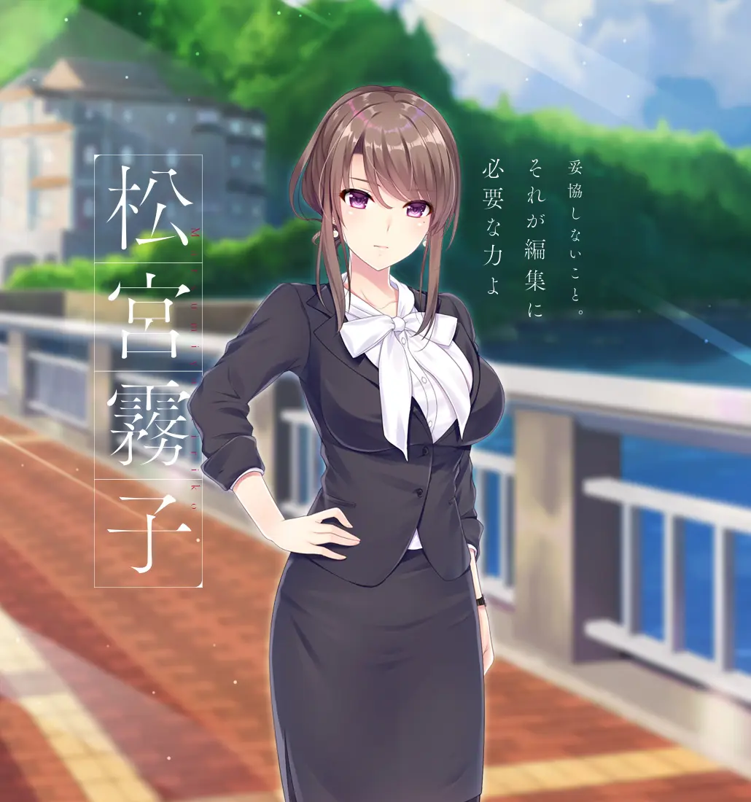
<div class="card-img-overlay">
<div class="position-absolute" style="bottom:0;right:0">
<h5 class="text-right mr-4 text-light text-outline-black font-italic font-weight-light" style="font-size:200%;right:0">
松宮 霧子
</h5>
<p class="text-right mr-2 text-dark rounded px-2 py-2" style="background-color: rgba(255, 255, 255, 0.8)">
<mark class="bg-dark text-light">毫不手軟的編輯主任</mark><br>
無論是指工作，還是戀愛。<br>
和男主在同一個出版公司，<br>
天天工作工作，工作狂魔，<br>
回過神來已經被催婚
</p>
</div>
</div>
</div>

<div class="card bg-transparent text-dark border-light col-lg-8 my-2 px-2 py-2">
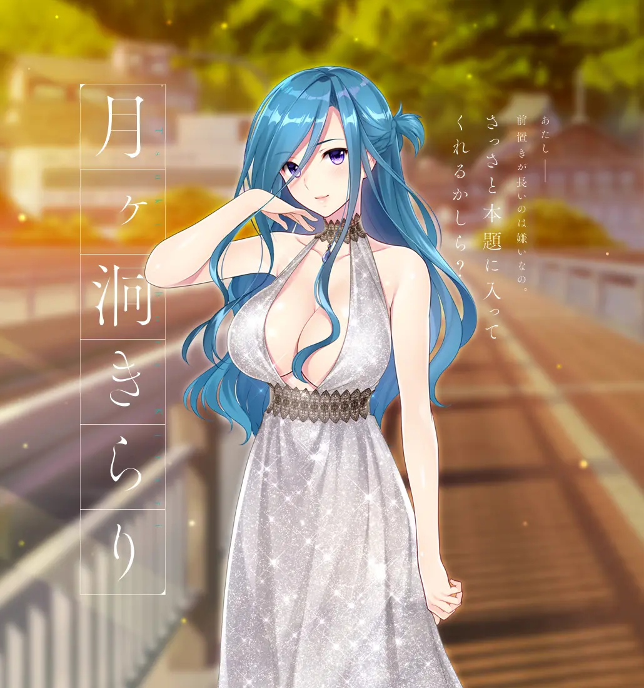
<div class="card-img-overlay">
<div class="position-absolute" style="bottom:0;right:0">
<h5 class="text-right mr-4 text-light text-outline-black font-italic font-weight-light" style="font-size:200%;right:0">
月ヶ洞 きらり
</h5>
<p class="text-right mr-2 text-dark rounded px-2 py-2" style="background-color: rgba(255, 255, 255, 0.8)">
<mark class="bg-dark text-light">作風自由的專業作家</mark><br>
大學就寫小說出道的超級美女，<br>
爲人隨性，自由奔放，<br>
玩弄男人不計其數，<br>
但是同一個男人不玩第二次
</p>
</div>
</div>
</div>

<div class="card bg-transparent text-dark border-light col-lg-8 my-2 px-2 py-2">
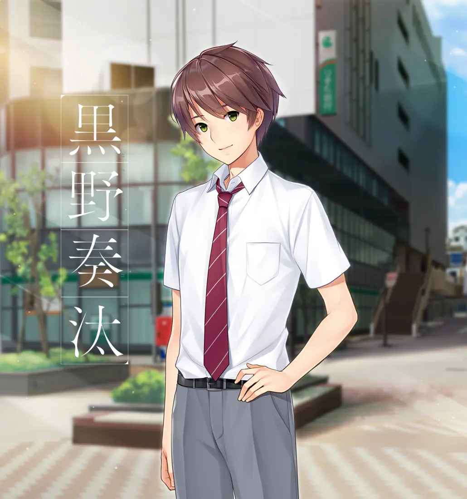
<div class="card-img-overlay">
<div class="position-absolute" style="bottom:0;right:0">
<h5 class="text-right mr-4 text-light text-outline-black font-italic font-weight-light" style="font-size:200%;right:0">
黑野 奏汰
</h5>
<p class="text-right mr-2 text-dark rounded px-2 py-2" style="background-color: rgba(255, 255, 255, 0.8)">
<mark class="bg-dark text-light">男主角</mark><br>
男主有什麼好介紹的，，，
</p>
</div>
</div>
</div>

## 遊戲 OP 動畫欣賞

動畫來自 YouTube

<video controls preload="metadata" width='100%' poster="../image/Tsukikana/movie.webp">
      <source src="https://bitbucket.org/sa-ya/my-static/raw/eaced2bf32ba63bc54e080a6bfe733c10980bf4d/Tsukikana/op.mp4" src-cn="https://pan.bilnn.cn/api/v3/file/sourcejump/mYg1NbCw/7qRp5BZJPffWUS6jsu57HFj3Z2V-Pp-ZPAw3W3LEXx0*" type="video/mp4">
<p> To view this video please enable JavaScript</p>
</video>

## CG

我很喜歡這些畫風

<p></p>

<p></p>

<p></p>

<p>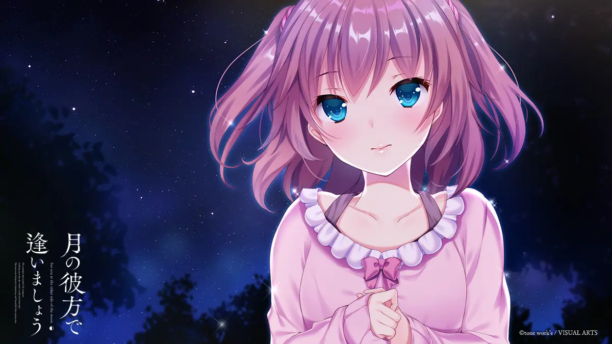</p>

<p></p>

<p></p>

<p></p>

<p></p>

## 屏幕截圖

<div id="carouselExampleIndicators-screen" class="carousel slide" data-ride="carousel">
  <div class="carousel-inner">
    <div class="carousel-item active">
      
    </div>
    <div class="carousel-item">
      
    </div>
    <div class="carousel-item">
      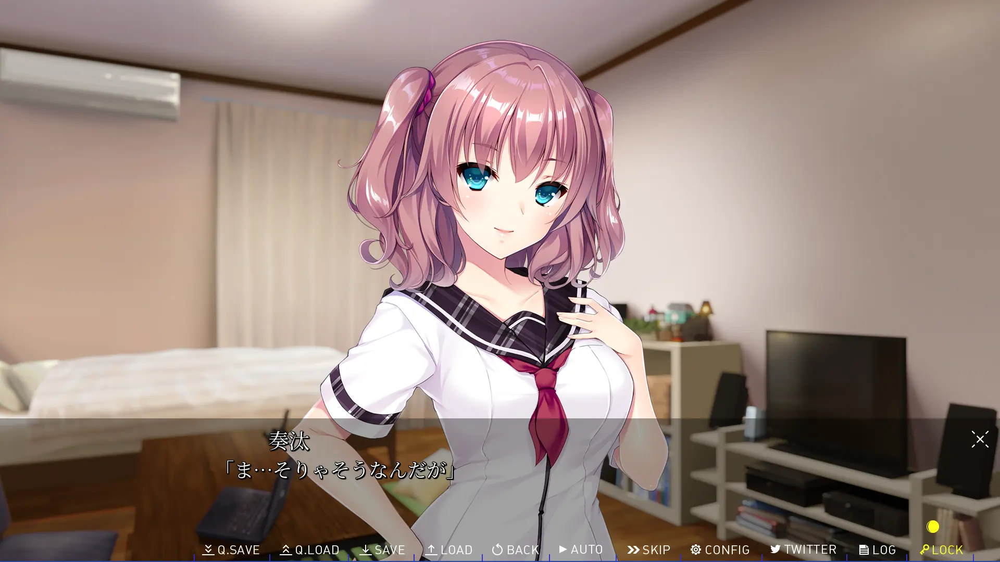
    </div>
    <div class="carousel-item">
      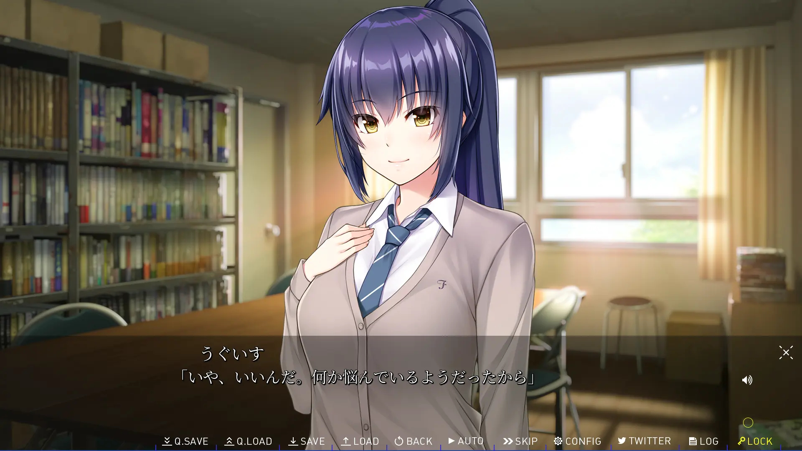
    </div>
    <div class="carousel-item">
      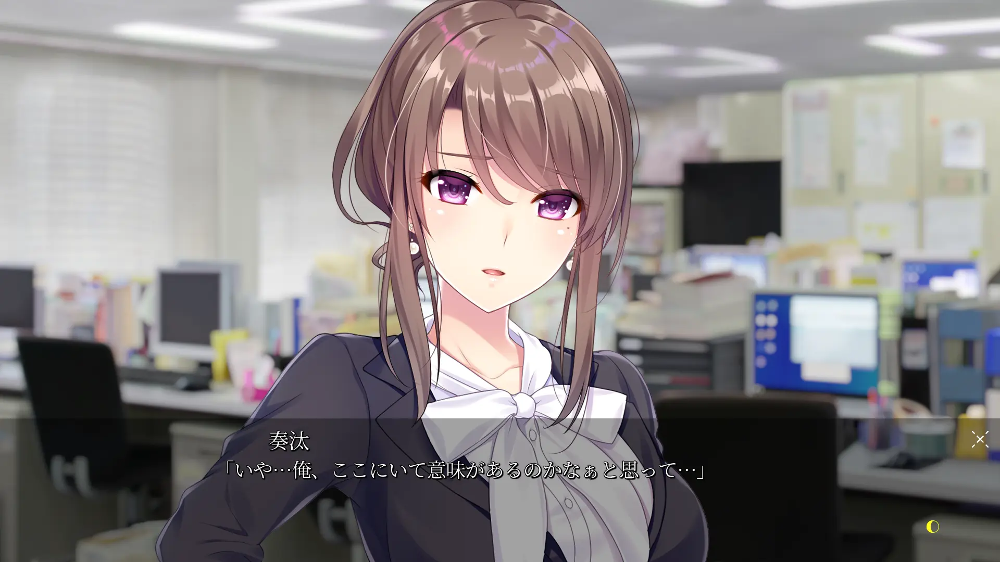
    </div>
    <div class="carousel-item">
      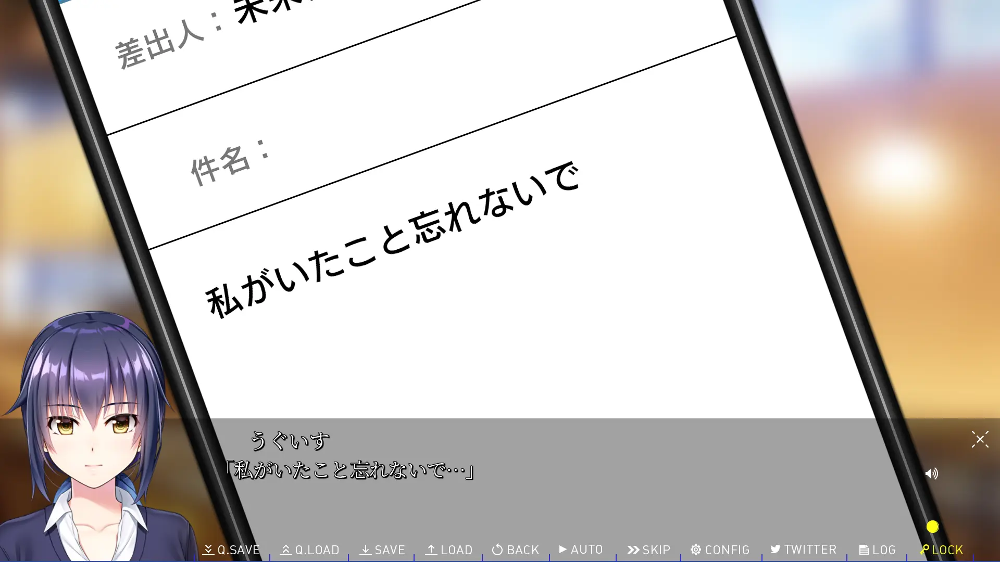
    </div>
    <div class="carousel-item">
      
    </div>
  </div>
  <a class="carousel-control-prev" href="#carouselExampleIndicators-screen" role="button" data-slide="prev">
    <span class="carousel-control-prev-icon" aria-hidden="true"></span>
    <span class="sr-only">Previous</span>
  </a>
  <a class="carousel-control-next" href="#carouselExampleIndicators-screen" role="button" data-slide="next">
    <span class="carousel-control-next-icon" aria-hidden="true"></span>
    <span class="sr-only">Next</span>
  </a>
</div>

## 一句話點評

tone work's 家的遊戲，都是長篇系列，
之前我玩過幾部，都沒玩完，太長了😅
本作我從兩年前入坑，時至今日才通關。

那麼，『在月之彼方再相逢』是一部好遊戲嗎？
我認爲是，並且覺得值得我發一篇文章。

本作在作畫上比以往更好，
女主角們的 CG 將她們的魅力全部展現，
而且似乎還能感覺到她們的心境。
你看那兩張編輯主任和 Seira 妹妹的，
多可愛，卻不廢萌。

遊戲中可攻略人數高達 7 人，這就使得
整個故事非常龐大。
故事既安排了有穿越劇情的線路，
也安排了普通地戀愛、生活的路線。
喜歡穿越或者只是喜歡甘酸的戀愛的
不同玩家們都能得到滿足。

戀愛過程的設計不只有甜蜜，還有委屈，
之後再給人一個小清新的結局，
大力烘托出男主角對女主角們堅定而又溫暖的愛。
讓遊戲結束後再回過頭來品味那些劇情的玩家，
會覺得有一股不可思議的光芒充滿着內心，
也許這就是這些戀愛故事感人的地方。

有點誇張了，總之 tone work's, yes!

## 在猶豫是否要下載？

試玩錄像在此。

<video controls preload="metadata" width='100%'>
      <source src="https://bitbucket.org/sa-ya/my-static/raw/eaced2bf32ba63bc54e080a6bfe733c10980bf4d/Tsukikana/13min-know.mp4" src-cn="https://pan.bilnn.cn/api/v3/file/sourcejump/6Wnp9dtg/0YDi2QOHgmcG7E3YO9Zk7vsdvPIIjypaZssF5__KGE8*" type="video/mp4">
<p> To view this video please enable JavaScript</p>
</video>

## 資源與下載

提供日文原版和漢化補丁。

遊戲本體

```
magnet:?xt=urn:btih:5AD08C2DD6DAC8925940CEAD8A550448DC7CC324&tr=http://sukebei.tracker.wf:8888/announce
```

文件名：[190628] [tone work's] 月の彼方で逢いましょう 初回限定版 + Original Soundtrack

資源來自 [anime-sharing 論壇](http://www.anime-sharing.com/forum/torrents-47/5-%E2%9D%80velka-bought-game%E2%9D%80-%5B190628%5D-%5Btone-works%5D-%E6%9C%88%E3%81%AE%E5%BD%BC%E6%96%B9%E3%81%A7%E9%80%A2%E3%81%84%E3%81%BE%E3%81%97%E3%82%87%E3%81%86-%E5%88%9D%E5%9B%9E%E9%99%90%E5%AE%9A%E7%89%88-original-soundtrack-%5Bh-game%5D-838224/)。

如果想玩日文原版，則按照以下方法進行破解地區驗證和 DVD 驗證。

 1. 安裝遊戲，路徑全部改爲英文
 2. 刪除遊戲文件夾內的 reg.ini
 3. 使用 010editor 或者別的二進制編輯器打開 SiglusEngine.exe
 4. 將 `0x16418E` 處的 `E8 9D AD 0B 00` 改成 `90 90 90 90 90 `
 5. 將 `0x22AD0F` 處的 `0F 85 B1` 改成 `E9 B2 00`
 6. 將 `0x22ADCD` 處的 `0F 85 BE` 改成 `E9 BF 00`
 7. 將 `0x22AE98` 處的 `0F 85 D2` 改成 `E9 D3 00`
 8. 大功告成！


如果想玩漢化版，直接將下面的漢化補丁複製到遊戲目錄運行即可。

<a class="btn btn-info" href="tg://resolve?domain=Galgamer&post=164629">群友發的漢化補丁</a>

<script>
window.addEventListener('DOMContentLoaded', function() {
    let target = document.querySelectorAll('.row.nomargin-x')[0];
    target.style['background'] = "url('../image/Tsukikana/night.webp') no-repeat fixed center";
    target.style['background-size'] = 'cover';
    let board = document.getElementById('board');
    board.style['background-color'] = 'rgba(20, 20, 40, 0.80)';
    setInterval(() => document.documentElement.setAttribute('data-user-color-scheme', 'dark'), 1000);
    insertToast('dark', '已啟用暗色模式', 2000);
});
</script>