`作者：冬馬和紗`

## At A Glance

奉行完美主義的高中生 北原春希，企圖完美地同時照顧兩位女生的感情，於是就被完美地捲進了長達六年的超級三角戀之中。

<p>
  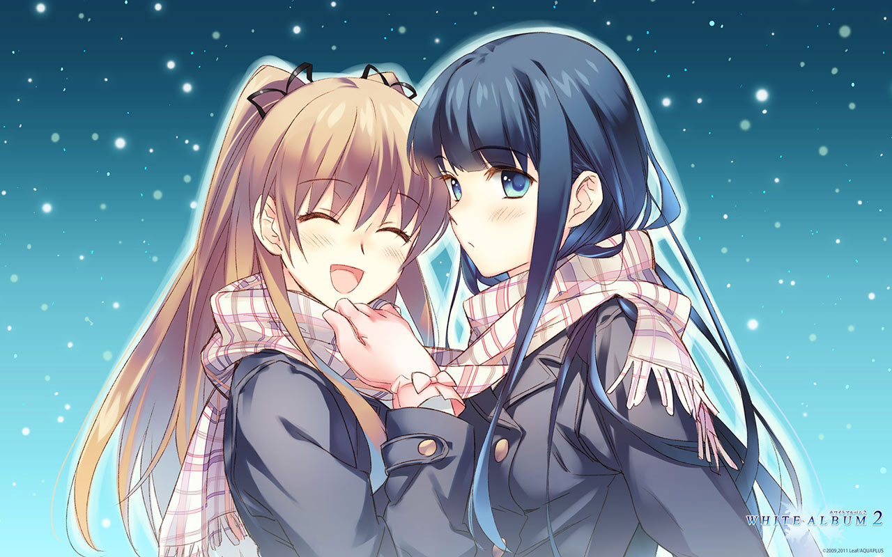
</p>

| 資訊一覽     |                           |
| :----------- | :------------------------------------ |
| **開發商**   | AQUAPLUS      |
| **章節數**  | 3                     |
| **總體難度**     | <span style="color:red">高</span>|
| **分級**     | R-18（性行爲）      |

您即將進入白學❄️現場。

> 明明是...我先來的...
> 第一次有了...喜歡的人...

白色相簿 2（WA2）共有三個章節，分別是：

起始之章：***📖️Introductory Chapter*** 講述了高中時代男主角遇到兩位女主角並捲進三角戀的故事；

結局之章：***📖️Closing Chapter*** 講述了其中一位女主角的離開，和剩下的兩人度過大學生活的故事。

最終章：***📖️Coda*** 講述了走進社會的三人命運般地再次相聚，並且不得不做出決斷的故事。

## 起始之章


<div class="row">
  <div class="col-12 col-md-6 my-2">
    <p class="d-block d-md-none">爲了準備文化祭上的表演，吉他手 <strong>北原春希</strong> 找到了兩位神必的女生，要和她們組成樂隊...</p>
    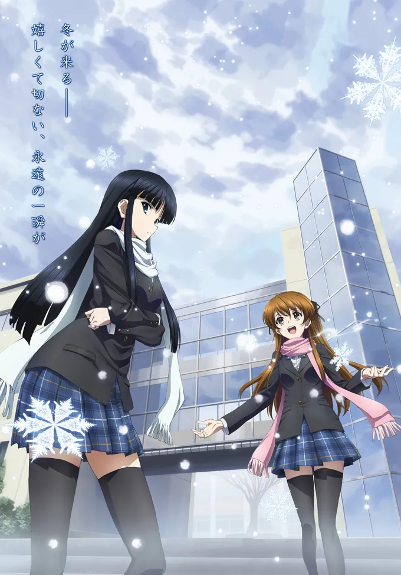
  </div>
  <div class="col-12 col-md-6">
    <p class="d-none d-md-block" style="font-size: 125%">爲了準備文化祭上的表演，吉他手 <strong>北原春希</strong> 找到了兩位神必的女生，要和她們組成樂隊...</p>
    <table>
      <thead>
          <tr>
              <th align="left">資訊一覽</th>
              <th align="left"></th>
          </tr>
      </thead>
      <tbody>
          <tr>
              <td align="left"><strong>攻略人數</strong></td>
              <td align="left"> 2</td>
          </tr>
          <tr>
              <td align="left"><strong> 遊戲時長</strong></td>
              <td align="left"> 大概 5-7H 吧</td>
          </tr>
          <tr>
              <td align="left"><strong> 難度</strong></td>
              <td align="left">低（不用選人）</td>
          </tr>
          <tr>
              <td align="left"><strong>分級</strong></td>
              <td align="left"> R-18（性行爲）</td>
          </tr>
      </tbody>
    </table>
    <p>這張圖是 WA2 電視動畫的海報，遊戲網站屬實過於遠古諤諤找不出好看的圖，，，</p>
  </div>
</div>

### 故事

男主角 北原春希 所屬的輕音樂社原本決定要在學園祭上表演，
結果社團內部發生了內訌，成員全部跑路了。。

爲了湊齊開樂隊所需要的成員，作爲學園祭執行委員的男主，
盡心盡責地踏上了獨自尋找樂隊成員之路。
（其實攤位安排、傳單印刷都是他幹，就是一背鍋俠）

他偶遇了學校校花，**雪菜**，她擁有着動聽的歌喉，
然後他又發現了經常在學校獨自彈琴的神必鋼琴女生，
就是自己的同桌不良少女 **和紗**。

<p>
  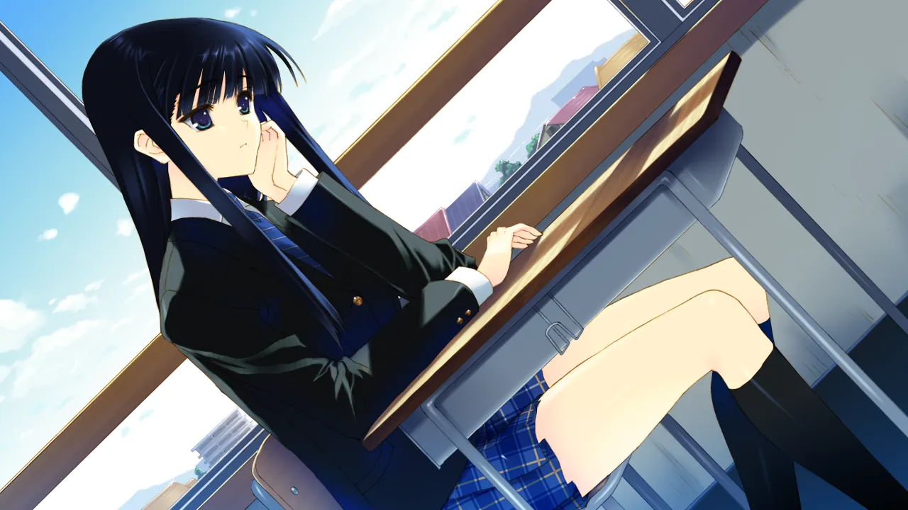
</p>

陰差陽錯之間，三人組了樂隊，結下了羈絆，
在爲學園祭進行的緊鑼密鼓準備過程中，兩位女生似乎對溫柔周到的老好人男主動了心...？


### 登場人物

<hr>

<style>
.nameb{
  color: rgb(0, 102, 255)
}
img.layer-border {
    /*-webkit-filter: drop-shadow(2px 2px 0px #aaa) drop-shadow(-2px -2px 0px #aaa) drop-shadow(2px -2px 0px #aaa) drop-shadow(-2px 2px 0px #aaa);
  filter: drop-shadow(2px 2px 0px #aaa) drop-shadow(-2px -2px 0px #aaa) drop-shadow(2px -2px 0px #aaa) drop-shadow(-2px 2px 0px #aaa);
*/}
img.img-fluid, .boxshade {
box-shadow: 0 5px 11px 0 rgb(0 0 0 / 18%), 0 4px 15px 0 rgb(0 0 0 / 15%);
border-radius: 10px;
}
.fancybox .layer-border{
    /*max-width: 40%;
    min-width: 33%;*/
    filter: drop-shadow(0 0 6px #000c);
}
</style>

<div class="row">
  <div class="col-6">
    <p class="font-serif font-weight-bold" style="font-size: 125%;">北原<span class="nameb">春</span>希</p>
    <p>男主角</p>
    <p>
      做什麼事都認真負責的背鍋俠，<br>
      對誰都善解人意的老好人。
    </p>
    <p>
      爲人十分成熟，做事非常老道，<br>
      面對校花和不良少女也底氣十足。
    </p>
  </div>
  <div class="col-6">
    
  </div>
</div>
<hr>
<div class="row">
  <div class="col-6">
    <p class="font-serif font-weight-bold" style="font-size: 125%;">小木曾<span class="nameb">雪</span>菜</p>
    <p>學校的校花</p>
    <p>
      雖然是校花，但是性格上是個細膩的女孩，<br>
      不喜歡引人注目，所以並不想去搞什麼 選美 表演。
    </p>
    <p>
      但是她在面對自己愛好的時候就會顯露出活潑的另一面，<br>
      愛好是唱歌，然後這個「另一面」就被男主發現了。
    </p>
  </div>
  <div class="col-6">
    
  </div>
</div>
<hr>
<div class="row">
  <div class="col-6">
    <p class="font-serif font-weight-bold" style="font-size: 125%;">冬馬<span class="nameb">和</span>紗</p>
    <p>同桌的不良少女</p>
    <p>
      每天上課遲到，頂撞老師，<br>
      沒事幹就會跑去自己一個人彈琴。
    </p>
    <p>
      老媽是著名鋼琴家，因此和紗具有相當的音樂素養，<br>
      在練習時化身 惡魔（魅魔？）鞭策男主。
    </p>
  </div>
  <div class="col-6">
    
  </div>
</div>
<hr>

**其他人物**

<div class="row align-items-center">
  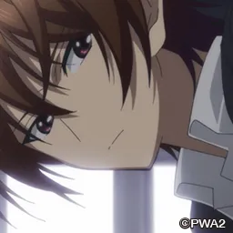
  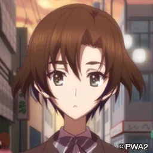
</div>


### 遊戲 OP

世界名曲 ***無法傳達的愛戀*** 通稱 屆不到的戀

<video controls preload="metadata" width='100%' poster="../image/WA2/1/op-1.webp">
  <source src="https://s3static-zone0.galgamer.eu.org/video-2d35/WA2/op-1.mp4" type="video/mp4" />
  <p> To view this video please enable JavaScript</p>
</video>

已收錄 <a href="/music/?id=14" target="_blank">🔗️Galgame 金曲</a>

### CG


../image/WA2/1/cg/1.webp
../image/WA2/1/cg/2.webp
../image/WA2/1/cg/3.webp
../image/WA2/1/cg/4.webp
../image/WA2/1/cg/5.webp

<br>

### 一句話點評

讓男主博得妹子好感的，是他溫柔體貼細緻周到的性格；
最終讓三人陷入痛苦的，也是他對誰都體貼周到的性格。

因爲不想傷害到任何人，所以無法選擇其中一個然後放棄另外一個。
（要是能的話這個故事還能拍三章？一章就結束了）

不過這才是第一章，整體氣氛輕鬆愉快，上課，彈吉他，
玩樂隊，逐漸靠近的三人，快樂的三人，充滿着戀愛的青春味。

<hr>

## 結局之章

隨着 冬馬和紗 的離開，戀情不了了之的 春希 和 雪菜 兩人踏上了大學生活。
大學裏半路殺出的女孩子 能打破這個三角戀嗎？但是擡頭不見低頭見的前女友（雪菜）似乎還...

<p>
  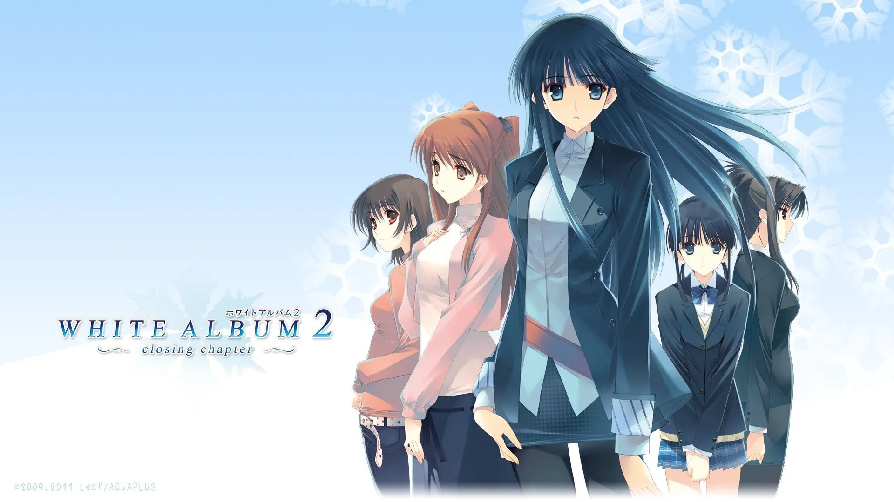
</p>

| 資訊一覽     |                           |
| :----------- | :------------------------------------ |
| **攻略人數**   | 4      |
| **遊戲時長**  | 約 20H      |
| **難度**     |   高   |
| **分級**     | R-18（性行爲）      |

### 故事

進入大學，春希就讀了文學系，雪菜雖說也在同一所學校，但是是在不同專業。
就這樣過去了兩年。

兩年的時光能洗掉甚麼？很抱歉，甚麼也洗不掉，
春希和雪菜的關係 雖然說是前任，但是卻不是我們常人能理解的那種，

<p>
  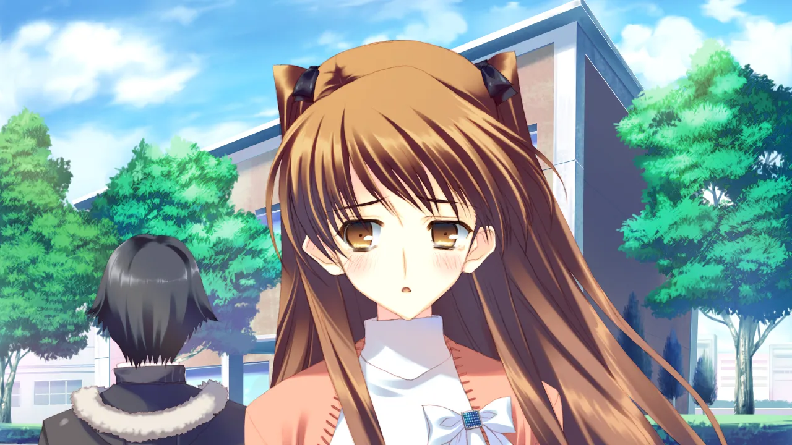
</p>

他們兩人關係實在是太好了，分手 還是 不分手，在我看來都一樣，，，
而且還有當年三人發過的誓，要永遠在一起的誓，

雖然和紗不在，但是她永遠活在兩人的心中（我猜的）。

不幸中的萬幸是，在學校、打工的地方還有各種各樣的女孩子，
春希似乎能夠擺脫三角戀的漩渦...？

### 登場人物

<hr>

<div class="row">
  <div class="col-12 col-md-6">
    <p class="font-serif font-weight-bold" style="font-size: 125%;">北原<span class="nameb">春</span>希</p>
    <p>男主角（大學）</p>
    <p>
      同時打兩份工的背鍋俠，<br>
      無論是在餐廳，還是在出版社，都是深受信任的員工。<br>
      做事過於認真周到，簡直比機器人還過分。
    </p>
    <p>
      爲人十分成熟，做事非常老道，<br>
      面對懶散的同班女生和前女友也底氣十足。<br>
      但是面對自己內心的時候就...
    </p>
  </div>
</div>
<hr>
<div class="row">
  <div class="col-6">
    <p class="font-serif font-weight-bold" style="font-size: 125%;">小木曾<span class="nameb">雪</span>菜</p>
    <p>大學的校花，和男主角有着微妙的關係</p>
    <p>
      上了大學，由於美麗的外表和溫柔的性格有了不少朋友，<br>
      但是她卻 不唱歌了。
    </p>
    <p>
      臉上也很少出現笑容，<br>
      這究竟是誰害的呢❓️
    </p>
  </div>
  <div class="col-6">
    
  </div>
</div>
<hr>
<div class="row">
  <div class="col-6">
    <p class="font-serif font-weight-bold" style="font-size: 125%;">冬馬<span class="nameb">和</span>紗</p>
    <p>音容猶在 的鋼琴家</p>
    <p>
      人在法國，沒有戲份。<br>
      除了彈鋼琴 啥也不幹。
    </p>
  </div>
  <div class="col-6">
    
  </div>
</div>
<hr>
<div class="row">
  <div class="col-6">
    <p class="font-serif font-weight-bold" style="font-size: 125%;">杉浦<span class="nameb">小</span>春</p>
    <p>大學附屬中學的 學妹</p>
    <p>
      因爲男主「玩弄女生感情」而跳出來找男主的麻煩。<br>
      和男主在同一餐廳打工。
    </p>
    <p>
      性格認真又周到，就像男主一樣，<br>
      人稱 小春希。
    </p>
  </div>
  <div class="col-6">
    
  </div>
</div>
<hr>
<div class="row">
  <div class="col-6">
    <p class="font-serif font-weight-bold" style="font-size: 125%;">和泉<span class="nameb">千</span>晶</p>
    <p>懶散無比的 同班同學</p>
    <p>
      和男主角同一個班級，上課 曠課 睡覺 掛科，差點留級。<br>
      很會撒嬌，很戳男主的弱點。
    </p>
    <p>
      似乎知道「三人組」的事情。
    </p>
  </div>
  <div class="col-6">
    
  </div>
</div>
<hr>
<div class="row">
  <div class="col-6">
    <p class="font-serif font-weight-bold" style="font-size: 125%;">風岡<span class="nameb">麻</span>理</p>
    <p>出版社的 頂頭上司</p>
    <p>
      男主打工的出版社的 編輯長。<br>
      一心工作，不問男女之事。
    </p>
    <p>
      （在 Galgame 裏面這種高冷的大人一般都會...）
    </p>
  </div>
  <div class="col-6">
    
  </div>
</div>
<hr>

**其他人物**

<div class="row align-items-center">
  
  
  
  
  
  
  
</div>


### 遊戲 OP

和紗戰歌 ***幸せな記憶***（但是這一章並沒有和紗，我很蒙古）

<video controls preload="metadata" width='100%' poster="../image/WA2/2/op-2.webp">
  <source src="https://s3static-zone0.galgamer.eu.org/video-2d35/WA2/op-2.mp4" type="video/mp4" />
  <p> To view this video please enable JavaScript</p>
</video>

已收錄 <a href="/music/?id=13" target="_blank">🔗️Galgame 金曲</a>

### CG

<p>
  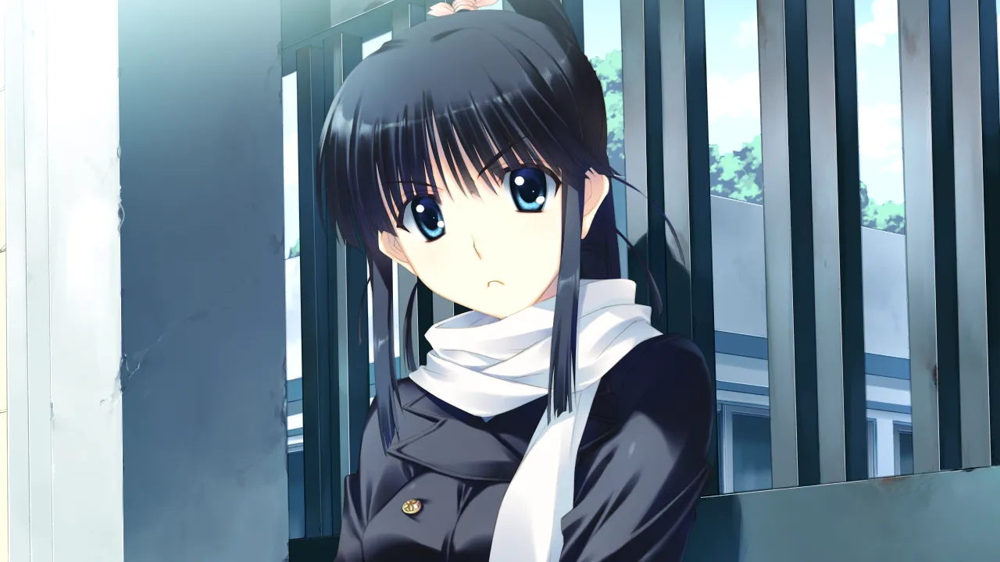
</p>

<p>
  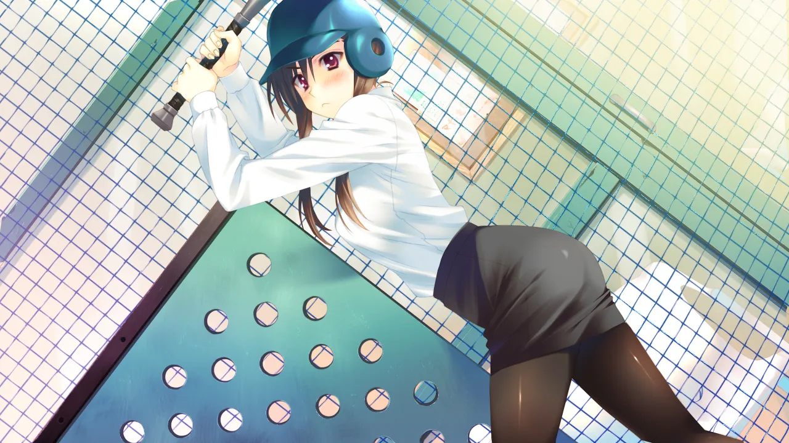
</p>

<p>
  
</p>

<p>
  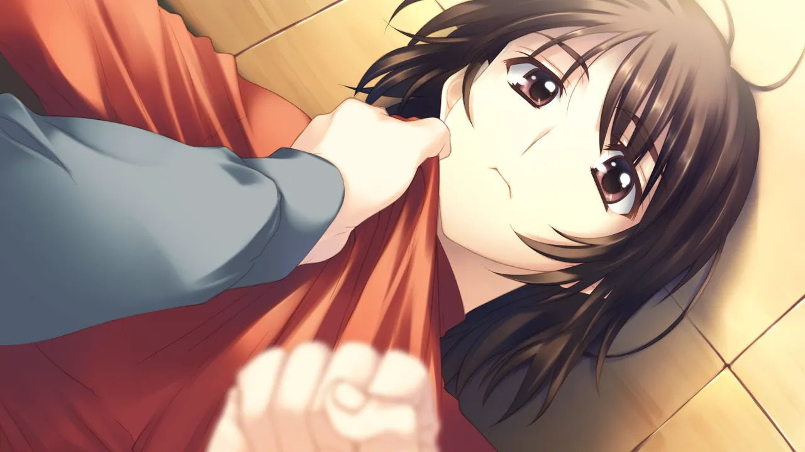
</p>

<p>
  
</p>

<p>
  
</p>


../image/WA2/2/cg/4.webp
../image/WA2/2/cg/5.webp
../image/WA2/2/cg/6.webp

<br>

### 一句話點評

場景來到了大學，人物也變得更多，世界觀一下就宏大了起來，
短暫離開是爲了更好的相遇，本章中冬馬的缺席是爲了更大的節目效果，，，

當然除了雪菜之外的可攻略角色各有各的魅力，也各有各的悲歡離合，
甚至還有不爲人知的一面。

你猜，冬馬在 春希 和 雪菜 準備怎樣的時候 回歸，節目效果最大？

<hr>

## 最終章

大學畢業，走進社會，修成正果的 春希 和 雪菜 兩人戀情漸入佳境，即將訂婚，但是...

<p>
  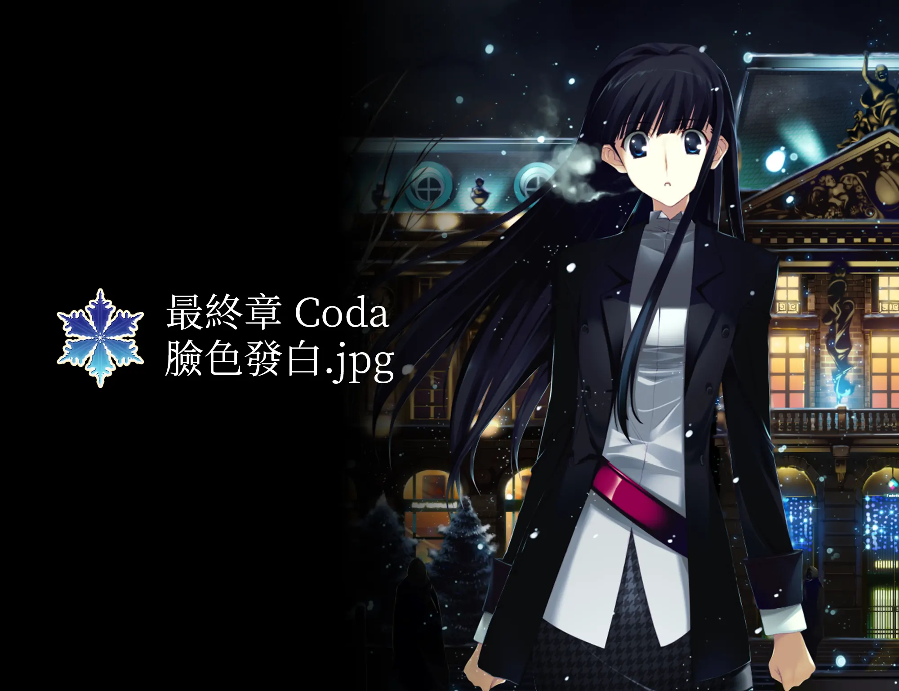
</p>

| 資訊一覽     |                           |
| :----------- | :------------------------------------ |
| **攻略人數**   | 2      |
| **遊戲時長**  | 約 20H      |
| **難度**     |   <span style="color:red">非常高</span>  |
| **分級**     | R-18（性行爲）      |

### 故事

畢業後，春希順理成章地成爲 一直在打工的出版社的 正式員工，
雪菜也就職於另一家音樂公司，兩人戀情漸入佳境，都過上了想要的生活。

春希 接到了一份工作，要前往法國 聖特拉斯堡 (Strasbourg) 採訪大鋼琴家 **冬馬和紗**，
作爲休閒旅行，也作爲和曾經好朋友的再會，雪菜買了稍微晚一點的機票，也跟着去了。

春希打算在 Strasbourg 的旅行中，向雪菜求婚，
但是在雪菜的飛機到達之前，街上亂逛的春希居然遭遇了 在寒風大雪中
生氣出走，渾身衣服都是破洞和傷痕的 冬馬和紗。

爲了給和紗療傷，春希翹了和 雪菜 的參加祭奠的約定，把和紗帶進了酒店...

### 登場人物

<hr>

<div class="row">
  <div class="col-12 col-md-6">
    <p class="font-serif font-weight-bold" style="font-size: 125%;">北原<span class="nameb">春</span>希</p>
    <p>男主角（會社員工）</p>
    <p>
      在出版社努力工作的背鍋俠，<br>
      作爲一個可靠的員工，他被分配了遠赴歐洲去<br>
      採訪鋼琴家的工作。
    </p>
    <p>
      爲人十分成熟，做事非常老道，<br>
      同時面對現女友和前女友也底氣十足。<br>
      但是面對自己內心的時候就...
    </p>
  </div>
</div>
<hr>
<div class="row">
  <div class="col-6">
    <p class="font-serif font-weight-bold" style="font-size: 125%;">小木曾<span class="nameb">雪</span>菜</p>
    <p>會社員工，男主角的未婚妻</p>
    <p>
      和男主角從大學畢業起就恩恩愛愛，<br>
      雪菜的家人 也都很喜歡男主角。
    </p>
    <p>
      和春希在一起的時候，總是充滿着笑容，<br>
      但是她仍沒有忘記三人永遠是好朋友的約定...
    </p>
  </div>
  <div class="col-6">
    
  </div>
</div>
<hr>
<div class="row">
  <div class="col-6">
    <p class="font-serif font-weight-bold" style="font-size: 125%;">冬馬<span class="nameb">和</span>紗</p>
    <p>大鋼琴家</p>
    <p>
      人在法國，有一個世界級鋼琴家的老媽。<br>
      本來技術已經成熟的她，卻因爲春希的到來而亂了陣腳。
    </p>
    <p>
      並不討厭日本，但是總是拒絕老媽前往日本表演的邀請，<br>
      也許是因爲日本就是她的傷心之地...<br>
      但是，和男主再會之後，她好像改變了主意。
    </p>
    <p>
      她也沒有忘記三人的約定。
    </p>
  </div>
  <div class="col-6">
    
  </div>
</div>

### 遊戲 OP

再放送 ***無法傳達的愛戀*** 終章 version

<video controls preload="metadata" width='100%' poster="../image/WA2/3/op-3.webp">
  <source src="https://s3static-zone0.galgamer.eu.org/video-2d35/WA2/op-3.mp4" type="video/mp4" />
  <p> To view this video please enable JavaScript</p>
</video>

### CG

<p>
  
</p>

<p>
  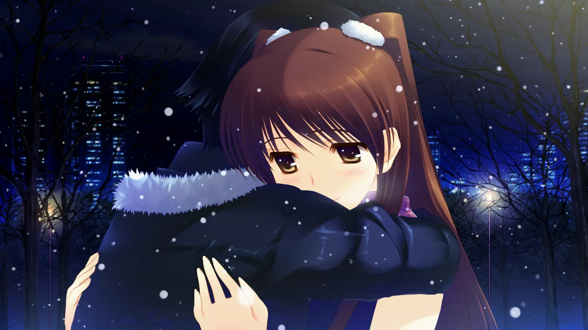
</p>

<p>
  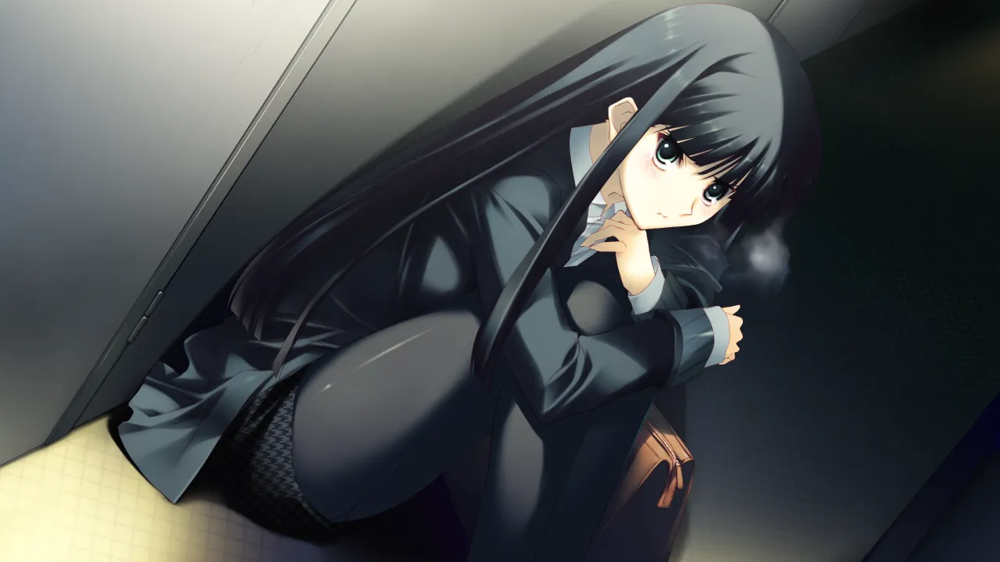
</p>

<p>
  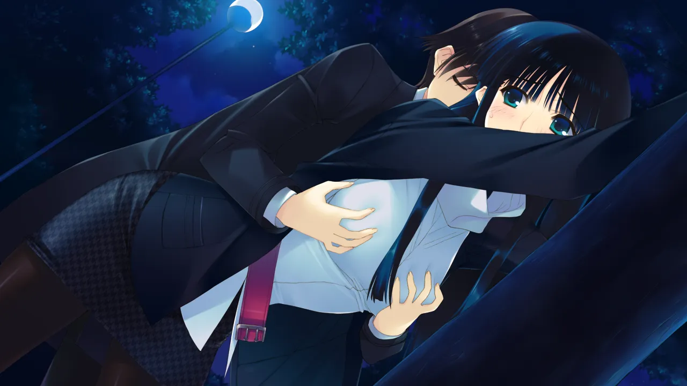
</p>

<p>
  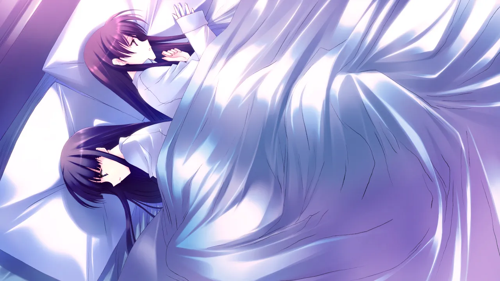
</p>

<p>
  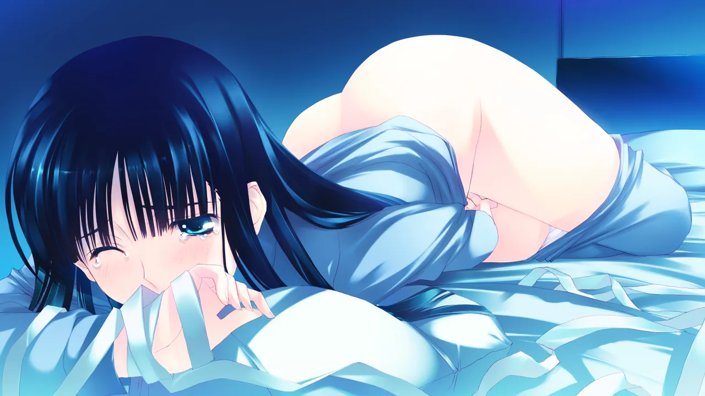
</p>

<p>
  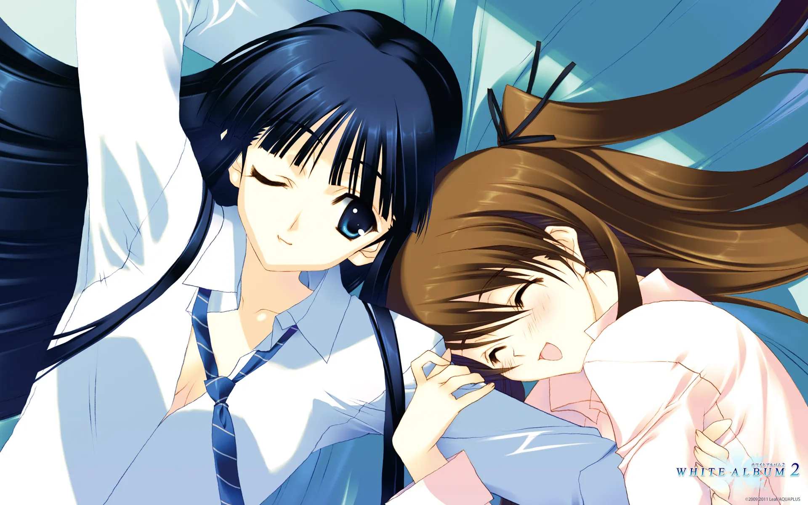
</p>

### 一句話點評

最終章是本作的高潮，也是難度最大的一章。

三人組的再會給男主和雪菜的關係帶來怎樣的衝擊，不難想象。
和紗和雪菜是永遠的好朋友，男主角也是無論如何也無法傷害其中一方的人。

爲了準備冬馬的鋼琴表演，三人又聚在一起，但是這會是像高中那時一樣嗎？
在這種情況下，三人的內心都在互相顧慮着，思索着
怎麼樣才能犧牲自己，讓剩下兩個人獲得幸福。
（這甚至導致選一方的選項會加另一方的好感度）

搖擺不定的 痛苦的抉擇，會在這裏結束嗎...？

## 還在猶豫是否下載？

請看 序章 試玩錄像

<video controls preload="metadata" width='100%' poster="../image/WA2/movie.webp">
  <source src="https://s3static-zone0.galgamer.eu.org/video-2d35/WA2/14min-know.mp4" type="video/mp4" />
  <p> To view this video please enable JavaScript</p>
</video>

## 資源

即將分別下載遊戲本體和漢化補丁。

### 本體

請先順序嘗試下面的下載方法，實在不行才用下一個。

1. 使用網上的資源

https://www.ryuugames.com/white-album-2-extended-edition-bonus-disc-free-download/

點擊上面網站，裏面有提供多種網盤的下載方法。
解壓密碼都是 `ryuugames.com`

2. 使用磁力連結

```
magnet:?xt=urn:btih:5cef07a405c77797bfb630f11b5e09c1fe0c03a8
```

3. 使用備用補檔



### 漢化補丁

本篇漢化補丁： 
複製到遊戲目錄 WHITE ALBUM 2 進行安裝。

番外篇小故事漢化補丁 

## 攻略

這遊戲太複雜了都給我整不會了，玩不過就看攻略吧。

https://www.3dmgame.com/gl/3710683.html

情人節快樂，祝各位都 臉色發❄️，，，

<style>
body {
    background: url('../image/WA2/bg.webp') no-repeat fixed center;
    background-size: cover;
}
#banner {
    background: url('')!important;
    background-color: transparent!important;
}
#toc {
     background-color: rgba(0,0,0,0.5);
     padding: 20px 10px 20px 20px;
     border-radius: 10px;
}
#board {
    backdrop-filter: blur(10px);
   /* background-color: #3337 !important;*/
}
.full-bg-img > .mask {
  background-color: rgba(0,0,0,0) !important;
}
.page-header  {
  background-color: rgba(0,0,0,0.5);
  padding: 3px;
  border-radius: 5px;
}
:root {
  --board-bg-color: rgba(255,255,255,0.75);
}
[data-user-color-scheme='dark'] {
  --board-bg-color: rgba(0,0,0,0.8);
}
#起始之章, #結局之章, #最終章 {
  background-image: url(../image/WA2/icon.webp);
  background-repeat: no-repeat;
  background-position: right;
  background-size: 135px;
  /*width: 100%;
  height: unset;
  aspect-ratio: 6 / 1;*/
  margin-top: 100px;
}
</style>