## At A Glance

在紅葉紛飛之地和有尾巴，有耳朵的少女們一起展開超越種族的和風戀愛故事吧！

<p>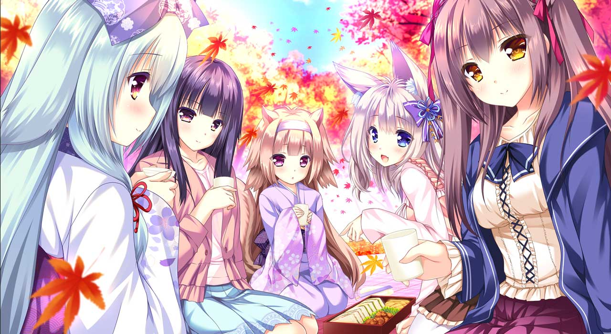</p>


| 資訊一覽     |                 |
| :----------- | :------------------------------------ |
| **開發商**   | Lump of Sugar |
| **攻略人數** | 4                    |
| **遊戲時長** | 35h                     |
| **類型**     | 搞笑 獸耳 奇幻          |
| **難度**     | 低（直接選人） |
| **分級**     | R-18（跨種族性行爲）      |

## 故事

這個世界上生存着兩個種族，
一種是擁有獸耳和尾巴的「幻夷」，
另一種是人類，
二者從幾百年前就已經共同生活。

男主角，清司，和妹妹兩人搬家回到了老家，
那是一個紅葉紛飛的，衆多幻夷生活在此的古都。

剛到的第一天，出門散步的清司走進一片樹林，
然後一個獸耳少女突然衝出來，對你喊道——

<p>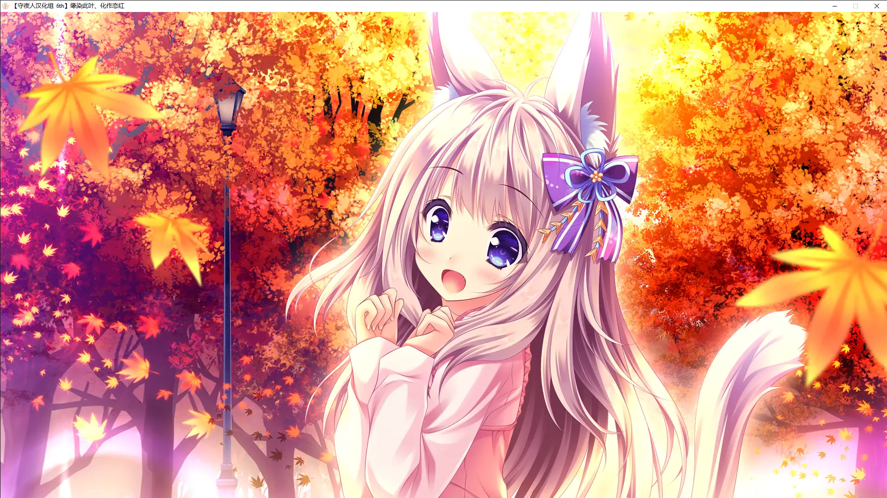</p>

<p style="font-size: 175%">「主人，我是你的寵物！！」</p>

講人話又不聽，解釋又不聽，繃不住了，
清司只能把少女帶回了家。

## 登場人物

<style>
#chars .row {
    background-color: transparent;
    vertical-align: bottom;
    margin-top: 10px
}
#chars .imgbox {
    max-width:40%;
    min-width:33%;
    min-height: 380px;
    max-height: 450px;
    position:relative;
    top:0px;
    left:0px;
    overflow-y: hidden;
    overflow-x: visible;
}
#chars .imgbox img{
    background-color: rgba(0, 0, 0, 0);
    width: auto;
    height: auto;
    max-height: 700px;
    max-width: 100%;
    position:absolute;
    top:0px;
    align: center;
}
</style>
<div id="chars" class="rounded">
<div class="row">
    <div class="imgbox col-sm-5 col-lg-4">
        
    </div>
    <div class="textbox col-6 col-lg-7">
    <span style="font-size:170%">🍁️Momiji</span>
    <hr class="my-1">
    突然跳出來說主人！<br class="d-md-none">我是你的寵物！的失憶少女<br>
    每天都活蹦亂跳，<br class="d-md-none">很黏人，<br>（就像是狗變的）<br><br>
    有尾巴和大耳朵。
    </div>
</div>
<hr>
<div class="row">
    <div class="imgbox col-sm-5 col-lg-4">
        
    </div>
    <div class="textbox col-6 col-lg-7">
    <span style="font-size:170%">🍁️玲奈</span>
    <hr class="my-1">
    無比兄控的黏人妹妹，<br class="d-md-none">幹啥啥不行，<br>
    性暗示第一名，<br class="d-md-none">天天對哥哥進行性暗示<br>（胸很大）<br><br>
    啥事都不幹喜歡當甩手掌櫃。
    </div>
</div>
<hr>
<div class="row">
    <div class="imgbox col-sm-5 col-lg-4">
        
    </div>
    <div class="textbox col-6 col-lg-7">
    <span style="font-size:170%">🍁️Konoha</span>
    <hr class="my-1">
    合法有耳朵有尾巴蘿莉，<br class="d-md-none">長者中的長者，人生的經驗<br>
    是新家的主人，<br class="d-md-none">非常溺愛男主<br>（你猜她身高多少）<br><br>
    喜歡自稱 Onee 醬。
    </div>
</div>
<hr>
<div class="row">
    <div class="imgbox col-sm-5 col-lg-4">
        
    </div>
    <div class="textbox col-6 col-lg-7">
    <span style="font-size:170%">🍁️和羽</span>
    <hr class="my-1">
    Konoha 家的女僕，<br class="d-md-none">實際上是 JK，<br>
    性格是無比謎之自信，<br class="d-md-none">講話非常長者，<br>（看似有很多人生經驗）<br><br>
    實際上也是幹啥啥不行。
    </div>
</div>
</div>

<p></p>

### 其他人物


## 遊戲 OP

<video controls preload="metadata" width='100%' poster="../image/YoriteKonoha/movie.webp">
      <source src="https://bitbucket.org/sa-ya/g-static/raw/ec69262a87ddfec8aca250a4621e2f8b7036330f/YoriteKonoha/ykop-2.mp4" type="video/mp4">
<p> To view this video please enable JavaScript</p>
</video>

## CG

<p>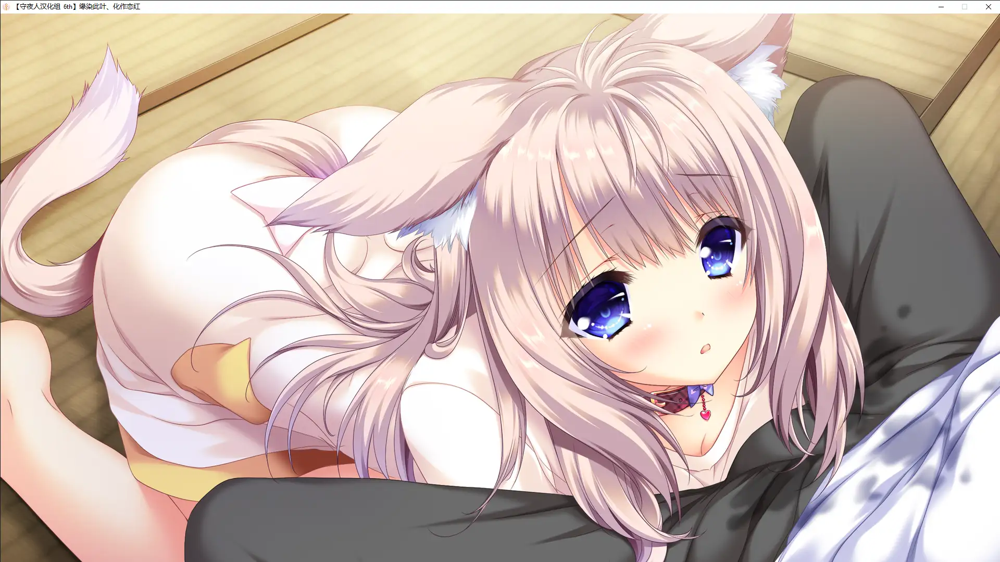</p>

<p></p>

<p>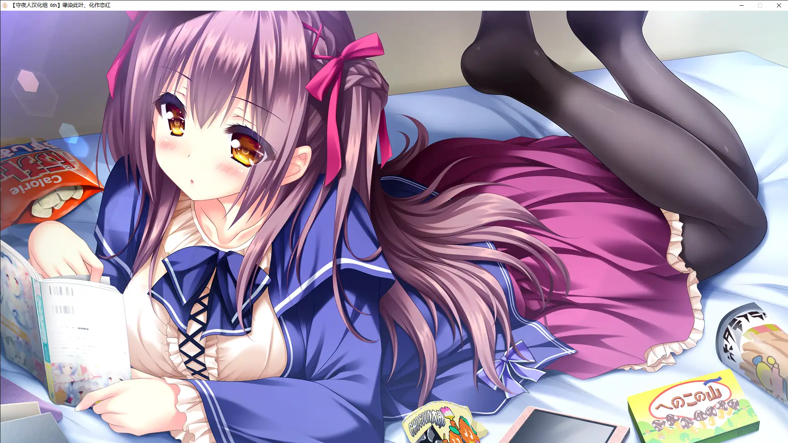</p>

<p>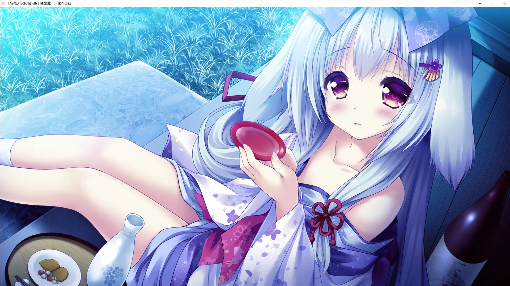</p>

<p>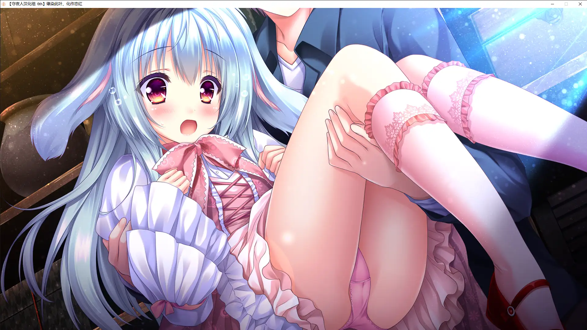</p>

<p>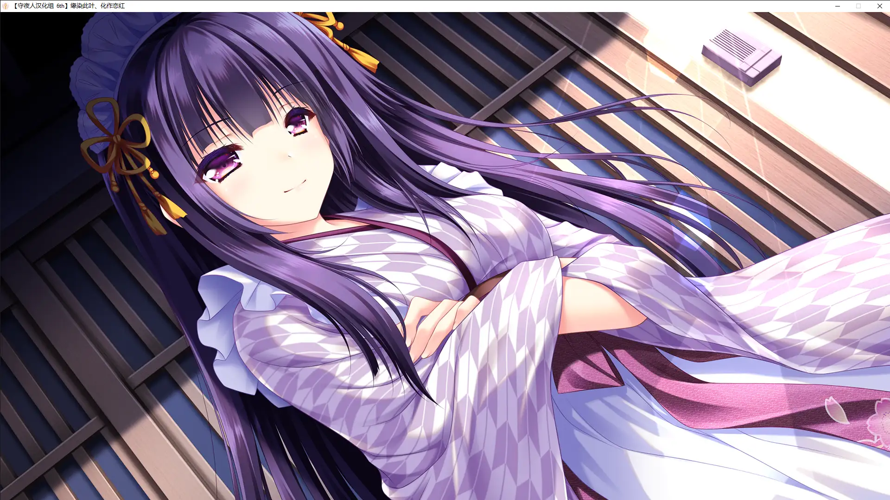</p>

<p>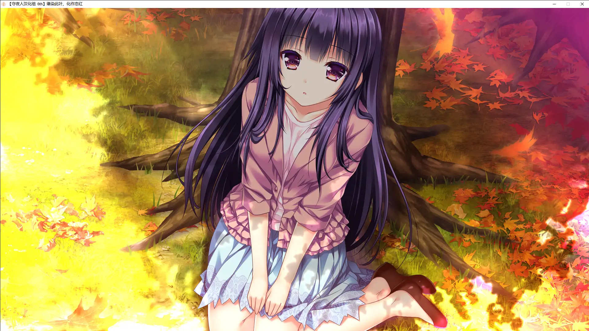</p>

<p>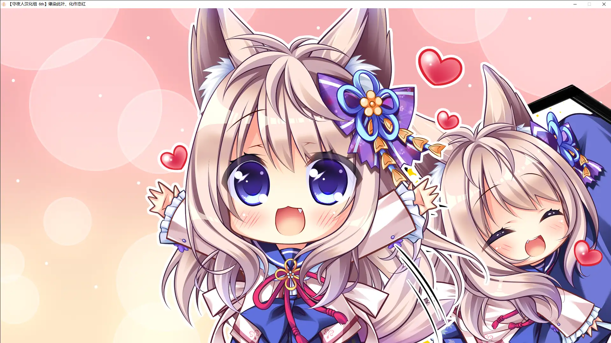</p>

<p></p>

## 屏幕截圖

<div id="carouselExampleIndicators-screen" class="carousel slide bg-transparent" data-ride="carousel">
  <div class="carousel-inner bg-transparent">
    <div class="carousel-item active">
      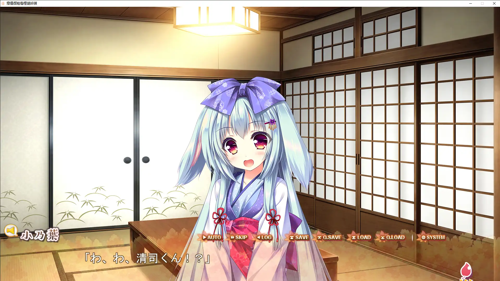
    </div>
    <div class="carousel-item">
      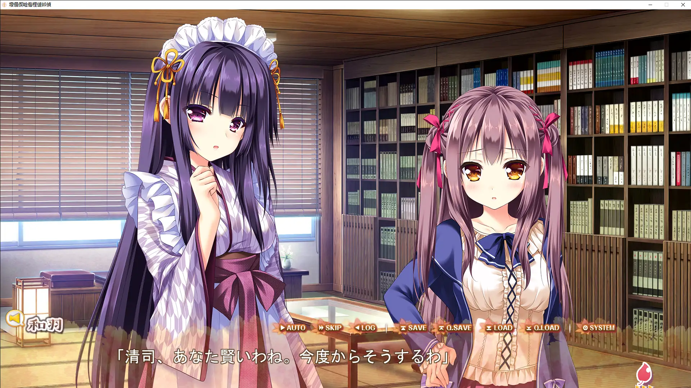
    </div>
    <div class="carousel-item">
      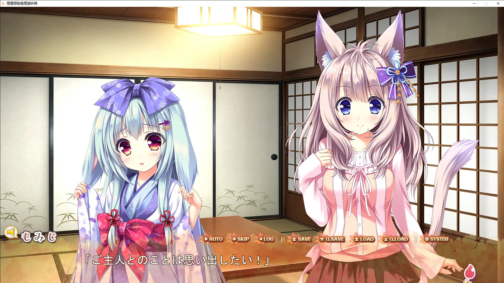
    </div>
  </div>
  <a class="carousel-control-prev" href="#carouselExampleIndicators-screen" role="button" data-slide="prev">
    <span class="carousel-control-prev-icon" aria-hidden="true"></span>
    <span class="sr-only">Previous</span>
  </a>
  <a class="carousel-control-next" href="#carouselExampleIndicators-screen" role="button" data-slide="next">
    <span class="carousel-control-next-icon" aria-hidden="true"></span>
    <span class="sr-only">Next</span>
  </a>
</div>

## 一句話點評

<div class="row align-items-center">
  <p class="col" style="font-size:200%;">這遊戲好！好就好在：</p>
  </img>
</div>

 * 有小動物
 * 有永遠娘
 * 有大家都喜歡的 方糖社 別緻畫風
 * 有大家喜聞樂見的 扭捏的兩人小心翼翼互相試探着靠近的 暗戀情節
 * 有搞笑的戀愛和甜美的戀愛
 * 和風 BGM / CG 獨具意境
 
<div class="row align-items-center">
  <p class="col" style="font-size:200%;">這遊戲垃圾，他垃圾在：</p>
  </img>
</div>

 * 居然敢日小動物
 * 居然敢日永遠娘
 * 居然敢翹課做愛
 * 居然敢日親妹妹

## 在猶豫是否要下載？

有一個十分鐘的試玩（沒有小動物出現，建議快進）

<video controls preload="metadata" width='100%'>
<source src="https://bitbucket.org/sa-ya/g-static/raw/ec69262a87ddfec8aca250a4621e2f8b7036330f/YoriteKonoha/10min-know.mp4" type="video/mp4">
<p> To view this video please enable JavaScript</p>
</video>

## 資源與下載

遊戲本體

```
magnet:?xt=urn:btih:af11de1152608edc668ee6e286094371837727f5
```

文件名：	縁りて此の葉は紅に 初回限定版 + 同梱特典 + 修正パッチ

升級和漢化補丁：[🔗️前往 Telegram 討論組](tg://resolve?domain=Galgamer&post=169536)

（先裝升級補丁再裝漢化補丁）


<style>
:root {
  --color-mode: 'light';
  --body-bg-color: #f19483;
  --board-bg-color: rgba(255,255,255,0.8);
  --text-color: #3c4858;
  --sec-text-color: #718096;
  --post-text-color: #2c3e50;
  --post-heading-color: #1a202c;
  --post-link-color: #0366d6;
  --link-hover-color: #30a9de;
  --link-hover-bg-color: #f8f9fa;
  --navbar-bg-color: #c46243;
  --navbar-text-color: #fff;
}
[data-user-color-scheme='dark'] {
  --body-bg-color: #854836;
  --board-bg-color: rgba(0,0,0,0.8);
  --text-color: #c4c6c9;
  --sec-text-color: #a7a9ad;
  --post-text-color: #c4c6c9;
  --post-heading-color: #c4c6c9;
  --post-link-color: #1589e9;
  --link-hover-color: #30a9de;
  --link-hover-bg-color: #364151;
  --navbar-bg-color: #c46243;
  --navbar-text-color: #d0d0d0;
}
</style>
<script>
let target = document.querySelectorAll('.row.nomargin-x')[0];
target.style['background'] = "url('../image/YoriteKonoha/bg2.webp') no-repeat fixed center";
target.style['background-size'] = 'cover';
document.documentElement.setAttribute('data-user-color-scheme', 'dark');
window.addEventListener('DOMContentLoaded', function() {

    
});
</script>