`作者：和風少女桐遠暮羽`

單親家庭少女真依 跟隨父親回到了位於山中的老家四津村，在那裏有她所一直探求着的家庭和身世之謎的真相。

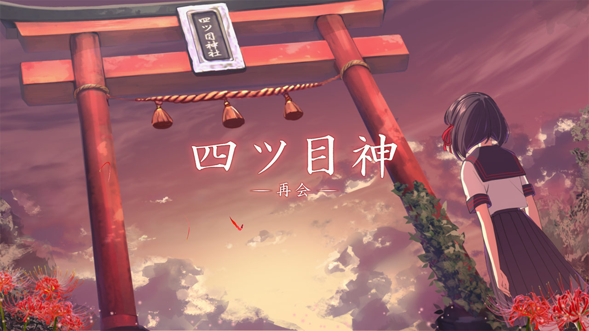

  <mark class="text-danger">沒人要的孩子...會被四目之神...帶走喔...</mark>

| 資訊一覽     |                 |
| :----------- | :------------------------------------ |
| **開發商**   | SEEC |
| **遊戲時長** | 7.5h                     |
| **類型**     | 解謎          |
| **難度**     | 前易後難    |
| **分級**     | 全年齡      |

備註：
本作 ***四目之神 -再會-*** 是 SEEC 在 2016 年推出的手機遊戲 ***四目之神*** 的高清重製版，
畫面和系統的重製使得本作和 Galgame 十分接近。
沒錯，四目之神 是 Galgame！

## 故事

單親家庭少女 **佐原真依**，一直以來都和父親兩人一起生活。
幼時的她，時常詢問父親，「爲甚麼別人都有媽媽，就我沒有？」
然而 父親總是眉頭緊皺，不肯回答她。

隨着年齡增長，升入中學的真依，開始漸漸體會到父親也有其苦衷，
就不再向父親追問有關自己身世的事情了。

然而有一天，放學回家的真依在家門口看到 父親在和另外一個男人大聲爭吵，
男人見到真依，自稱是真依爸爸的哥哥，也就是真依的 伯伯。

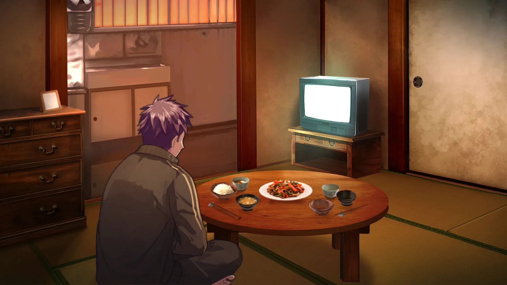

回到家後，父親的臉色十分難看，但是 第一次見到其他親人的真依，
心中揮之不去的謎團越來越大。

「要回老家看看嗎？」父親詢問道。

第一次知道自己還有 老家 的存在的真依，欣然接受了提議，和父親踏上了旅途。
真依的老家「相良家」雖然地處邊遠的小山村，但是卻有個寬大的宅院，
踏入大門的時候，真依聽到了來自某人的呼喚：

<mark class="text-danger">「你終於來了...我的...真依...」</mark>

## 登场人物



  

    

      

        {name}
      

      

        {yomi}
      

      

    

    

    
  
  

  

    

      
    

  



<sp-character no=0 name="佐原 真依" yomi="Mai">
  

    本作的主角，是中學生， 
    和父親兩人一起生活在東京的公寓內。
  

  

    似乎能看到或者聽到一些常人看不到的東西， 
    比如說幽靈。
  

  

    
  

  

    在老家跟着神必的聲音召喚來到一個神社， 
    然後就回不去了。
  

  

    屬於那種不含傲嬌成分的隨處可見的普通女生。
  

</sp-character>
 
<sp-character no=1 name="忌子" yomi="imigo">
  

    主角在神社裏遇到的少年， 
    他自稱自己是 imigo，一直生活在這裏。
  

  

    脾氣很臭，經常口出狂言黑屁女主， 
    但是被問及神社的問題時卻故意隱瞞甚麼。
  

  

    
  

  

    有傲嬌成分，，，
  

  

    臉上蓋着一塊布，不知道是爲甚麼。
  

</sp-character>
 
<sp-character no=2 name="タガタ" yomi="tagata">
  

    在神社裏遇到的男人， 
    長相英俊，自稱是神社的管理員，
  

  

    還是 imigo 的 長輩， 
    和 imigo 兩個人一起盡力想辦法幫助女主逃出神社。
  

  

    
  

  

    長得又帥，又不像 imigo 遮住臉， 
    身材又高， 
    說話又好聽，又不像忌子天天嘴臭， 
    又會照顧人，又不像忌子只會兇，，， 
  

  

    我擦，他中文名字怎麼寫，我不好說
  

</sp-character>

### 其他人物

神社裏的兩個小鬼

  

  

女主的父親

  

女主的伯伯（跟父親吵架的人）

  

## 游戏 OP

<video controls preload="metadata" width='100%' poster='../image/YotsumeGod/op.webp'>
<source src="https://s3static-zone0.galgamer.eu.org/video-2d35/YotsumeGod/op.mp4" type="video/mp4">
</video>

Galgame 金曲: <a href="/music/?id=17" target="_blank">🔗️神匿 -カミカクシ-</a>
歌詞： 

## 游戏 CG

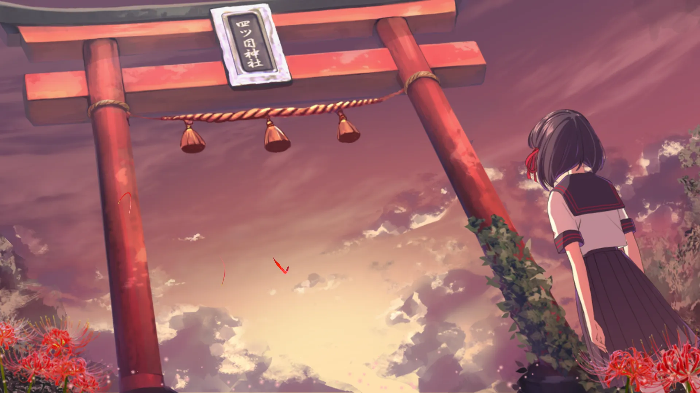

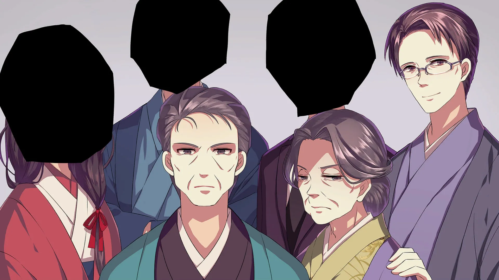

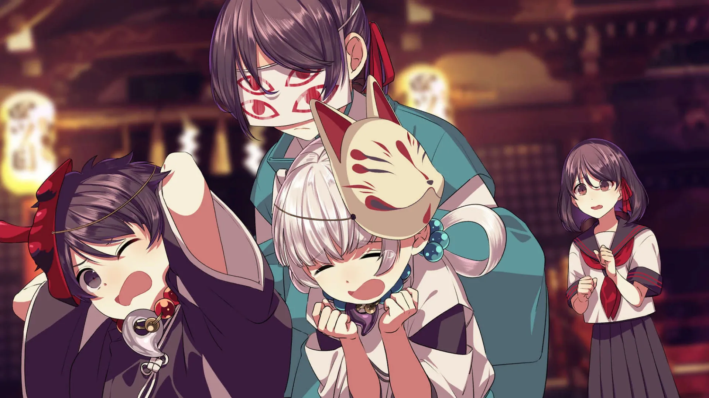

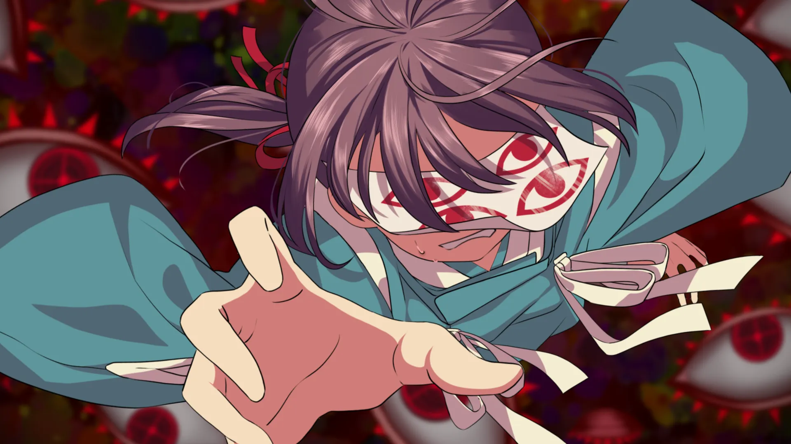

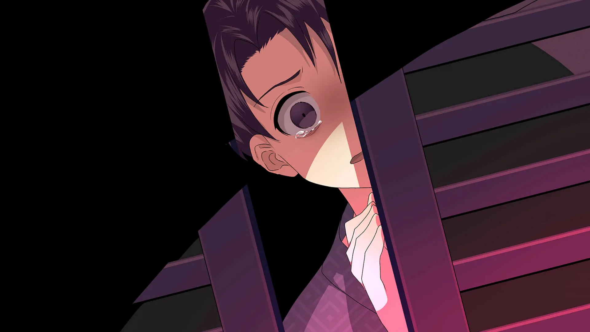

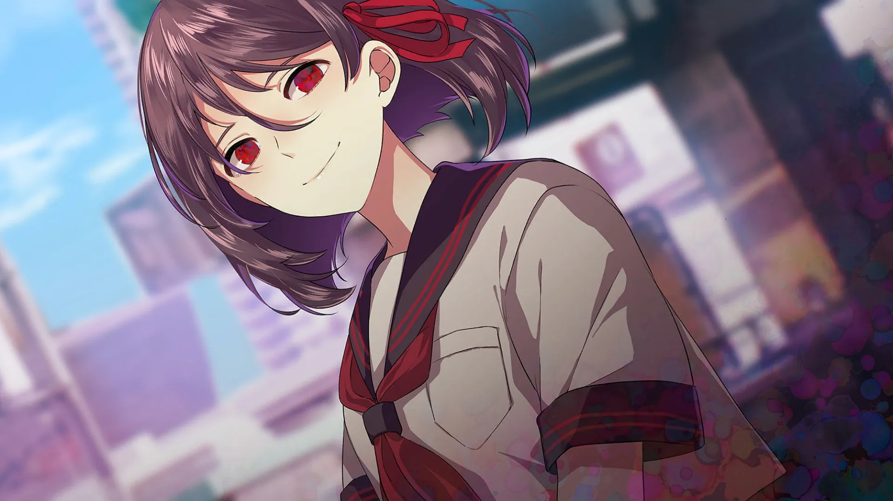

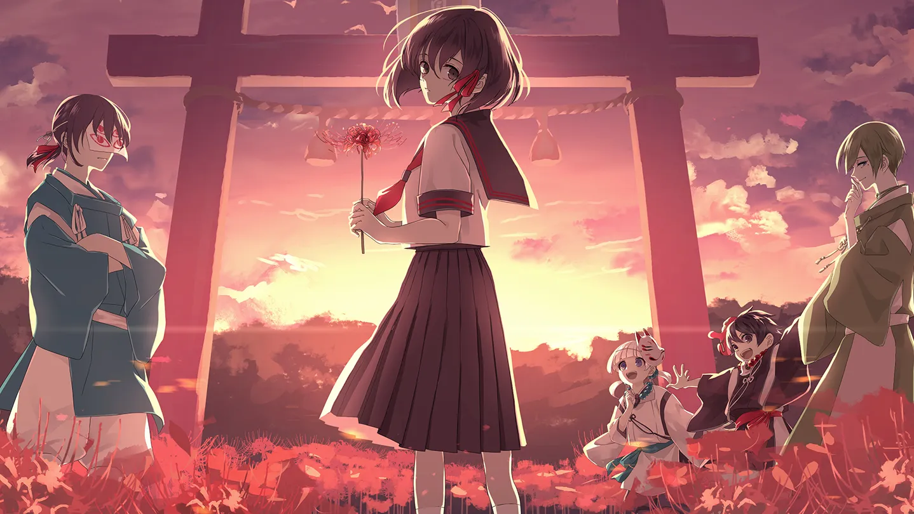

## 遊戲畫面


../image/YotsumeGod/scn/0.webp
../image/YotsumeGod/scn/1.webp
../image/YotsumeGod/scn/2.webp
../image/YotsumeGod/scn/3.webp
../image/YotsumeGod/scn/4.webp
../image/YotsumeGod/scn/5.webp

 
## 一句話點評

最近那種新聞很多啊，什麼 女大學生被綁架到小山村，什麼 少女被販賣給山區光棍做老婆，
甚至還有轉賣二手三手的，被鎖鏈捆綁的，瘋掉的...
這就導致我對四目之神的小山村總是會產生某種既視感，
碰巧這個遊戲題材也是講述邊遠山區的某種邪惡，然後玩起來屬實令人不安。

偏題了，，，接下來講講給新玩家的推薦理由。

本作是一邊解謎一邊推進故事情節，逐步揭開真相的那種遊戲，
途中有多個分支和結局，根據你的操作，真依有可能虎口脫險，回歸平靜的日常，
也有可能打破砂鍋，不倦地逼近事件的真相；
或者是好不容易進入 Good End，卻轉眼間發現事情絕沒那麼簡單，

整個故事設計十分精彩，所以當時 SEEC 發布了這個重製版的時候，老玩家都是一片歡呼聲。

解謎有一定的難度，為了讓你能輕鬆地享受故事，遊戲中內置了攻略，
當你實在解不開時，就可以點一下攻略看看思路，如果還是不行，再點一次就能直接公開謎題答案，
避免了卡關的事情發生，體現了遊戲公司真心希望大家享受這個故事的良苦用心。

此外，遊戲還加入了舊作中所沒有的特別篇全新故事，為整個世界觀畫下了完美的句號。
最終謎題沒有答案，如果你實在解不開，請上網搜索或者去群裏提問，，，

我在本文末尾附加了一些花絮，希望大家都能喜歡 四目之神 -再會-。

## 還在猶豫是否下載？

这里有一个试玩录像

<video controls preload="metadata" width='100%' poster='../image/YotsumeGod/movie.webp'>
<source src="https://s3static-zone0.galgamer.eu.org/video-2d35/YotsumeGod/12min-know.mp4" type="video/mp4">
</video>

你可能會想找 BGM：<a href="/music/?id=18" target="_blank">🔗️古都に咲く花</a>

還有一個別有韻味的鋼琴曲版本：<a href="https://youtu.be/fu-3jvB9SOs" rel="nofollow noopener" target="_blank">🔗️前往 YouTube</a>

## 資源和下載



Steam 商店爲官方多語言版，請考慮購買。

盜版：
我不建議你玩盜版，因爲這遊戲俄區三十多，阿根廷區才十幾，希望你能支持遊戲公司，
非要玩的話： 

注意：遊戲 ESC 鍵是直接退出，不要隨便按，，，

遊戲中有卡片收集內容，有些藏得比較隱蔽，請在遊戲通關後參照這裏的指南進行收集。
https://h1g.jp/yotsume_remake/?%E3%82%AE%E3%83%A3%E3%83%A9%E3%83%AA%E3%83%BC%E3%82%AB%E3%83%BC%E3%83%89

## 花絮

### 遊戲開頭的一大段謎語是甚麼意思？

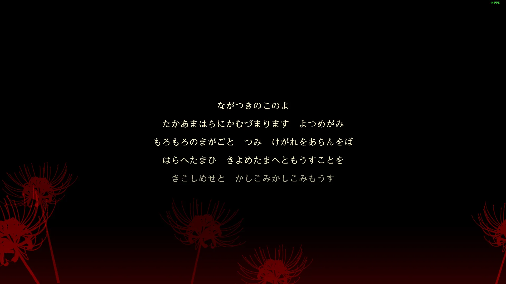

經過網上考察，我找到了：

<blockquote style="color: var(--text-color)">
  ・ながつき⇒長月（旧暦九月） 
  ・このよ⇒この世（俗世間） 
  ・たかあまはら⇒高天原（天上界） 
  ・かむ⇒神（） 
  ・づまり⇒留まり（いらっしゃる） 
  ・よつめがみ⇒四ツ目神（このゲームの神様） 
  ・もろもろ⇒諸々（いろんな） 
  ・まがごと⇒禍事（悪いできごと） 
  ・つみ けがれ⇒罪、穢れ（） 
  ・あらんをば⇒有らんをば（あったとしたら） 
  ・はらへたまひ⇒祓い賜え（取り去ってください） 
  ・きよめたまへ⇒清め賜え（きれいにしてください） 
  ・もうすこと⇒白すこと（申し上げること） 
  ・きこしめせ⇒聞こしめせ（聞き届けてください） 
  ・かしこみ⇒畏み（おそれおおいこと） 
  ・もうす⇒白す（申し上げます）
</blockquote>

### 考古學家請進：原版四目之神考古專區

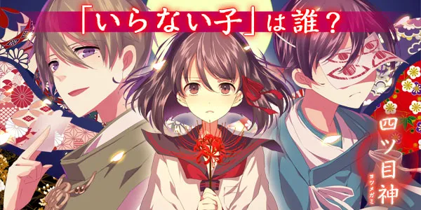

先放下載地址：
日文版：上應用商店（Play 商店或者 AppStore）搜索 ***四ツ目神*** 即可（可能需要日區帳號）
https://play.google.com/store/apps/details?id=tokyo.seec.yotumegami
https://apps.apple.com/jp/app/sitsu-mu-shen-mi-jieki-tuo/id1120022246

中文版：上網搜索 ***手談漢化組 四目之神***

先來看個遊戲 PV，裏面也有遊戲畫面和玩法的介紹（我插入了 YouTube 視頻，你可能需要翻牆）

<iframe id='y2b' loading="lazy" src="https://www.youtube-nocookie.com/embed/o3gW5HGMCXM" title="YouTube video player" frameborder="0" allow="encrypted-media; picture-in-picture" allowfullscreen></iframe>

你也可以複製這個視頻的連結：https://youtu.be/o3gW5HGMCXM

如你所見，舊作是豎屏手機遊戲，人物沒有配音，
但是當時我也玩得不亦樂乎，畢竟劇情有趣比甚麼都強。
然後重製版就變成了 Galgame，哈哈

原版玩的時候基本上免費，但是有體力限制，無法一下攻略太多的關卡，
但是可以充錢恢復體力。

來看一下遊戲介面。

<video controls width="100%" preload="metadata" poster='../image/YotsumeGod/old-movie.webp'>
  <source src="https://s3static-zone0.galgamer.eu.org/video-2d35/YotsumeGod/old-game.mp4" type="video/mp4">
</video>

要被 ***古都に咲く花*** 洗腦了嗎 :D

