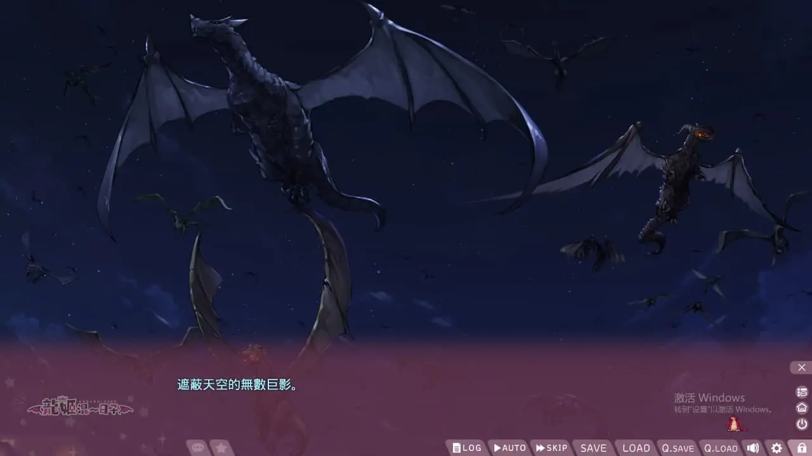
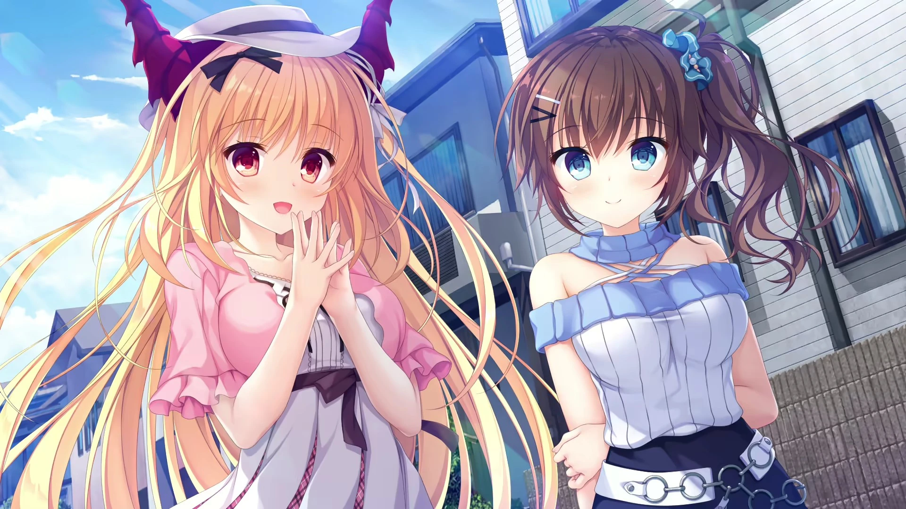
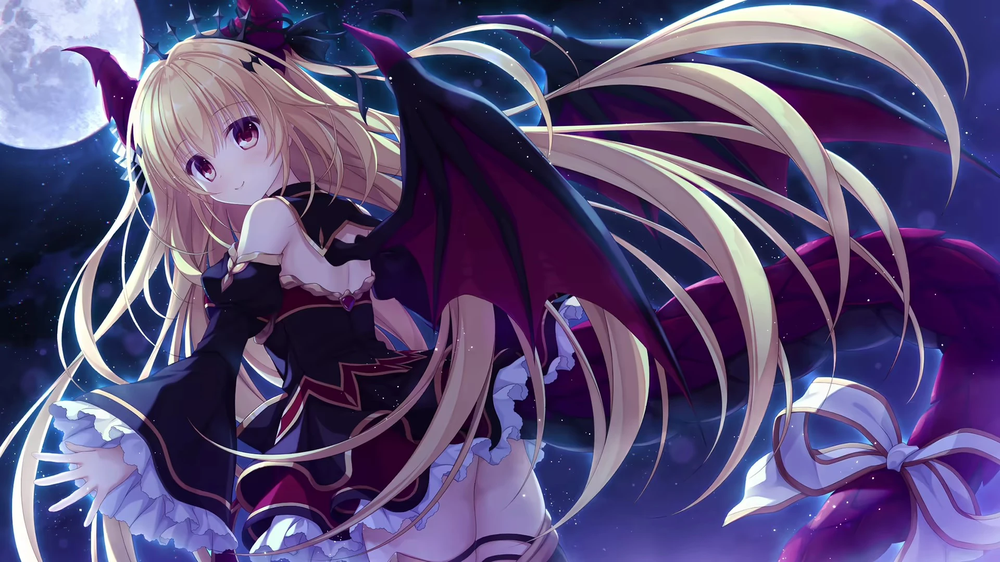
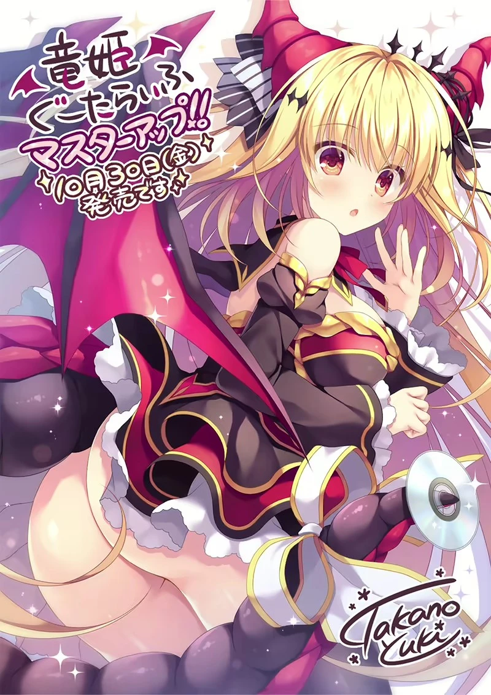

`作者：木衛一`

尼特族撿到龍族公主，吃青梅竹馬软饭安心躺平

| 資訊一覽     |                 |
| :----------- | :------------------------------------ |
| **開發商**   | whirlpool |
| **編劇**     |近江谷宥|
| **原畫**     |鷹乃ゆき、またたび丸|
| **遊戲時長** | 8 ~ 12 小時              |
| **類型**     | 廢萌      |
| **難度**     | 低 |
| **分級**     | R-18      |

## 故事開場

主人公 **宮本武** 是小鎮裏惡名昭彰的武道家的養子，
由於自家經營的道場極其凋敝，養父也沉迷武道不知體恤，
所以生活一直捉襟見肘。

堅稱武道家不應該浪費時間幹活的主人公既不工作也不上學，
心安理得地向和果子屋的青梅竹馬 **一之瀨·鈴夏** 乞食吃軟飯。

一天，主人公在路邊撿到一隻長翅膀的紅色小蜥蜴，
大喜過望的主人公本打算把它送上砧板給自己補一補，
卻被青梅竹馬· 鈴夏 阻止而作罷，
她將蜥蜴起名爲**「小春」**，收養爲寵物一同生活。

隨着兩人一起生活的時間越來越長，主人公和小春之間感情也越來越深厚。
可突然有一天，無數來自宇宙的巨龍飛掠過全世界的領空，

他們自稱是遠古就生活在地球的高等智能種族，
人類的歷史中的種種神話就是他們賜下恩惠的只爪片鱗，
如今他們從漫長的旅行中歸來，看到了人類支配的世界的醜陋模樣，
由於對於人類感到失望，他們決定重新支配人類。

「啊啊啊，這到底是怎麼回事！？」
青梅竹馬鈴夏被這超現實的展開嚇得手足無措，
「反正都要完蛋了，不如在死之前我先...」
看着在大庭廣衆之下脫衣服準備撲過來的鈴夏，男主角也手足無措了起來。

這時，小春突然變成少女，飛上天空向龍族展開勸說。
原來，小春其實是龍族的公主，當初因爲意外降落到地球上，
出於對異議的尊重，龍族接受了小春的提議，決定觀察一段時間再考慮如何處置人類...

萬幸之中，人類總算逃過了一劫，
但小春卻理所當然的以美少女的姿態，和主人公展開了閉門不出的尼特生活。
看着兩人親暱的姿態。青梅竹馬鈴夏只覺得有苦難言。
與此同時，在一般人的日常生活之中，也開始不時的出現形形色色的龍的身姿...

## 故事梗概[涉劇透]

點此展開

你覺得廢萌能有什麼梗概，無外乎是撿到龍妹妹之後就天天宅在家裏sex，sex，sex 
然後青梅竹馬來串門，看到色色，滿臉通紅的回家自慰了(是不是有股柚子味，怎麼回事呢) 
接下來青梅竹馬領悟到猶豫就會敗北，現在就是要白給，於是拉着男主角sex，sex，sex 
最後大家過上了幸福的三人後宮生活 

## 登场人物



  

    

      

        {name}
      

      

        CV: {cv}
      

      

    

    

    
  
  



<sp-character no=2 name="小春" cv="飴川紫乃">
  

    龍族的公主 
    由於受到武的照顧而主動幫忙勸退龍族。 
    現在正在和男主角同居
  

  

    由於奇妙的常識，絲毫不抗拒和男主sex，還有點主動... 
   她和男主十分親密，因此也越來越有男主角的neet氣質
  

</sp-character>
 
<sp-character no=3 name="一之瀨鈴夏" cv="桃山いおん">
  

    青梅竹馬， 
    隔壁和菓子店的獨生女。
  

  

    現在正在上大學，但還是一副不聰明的樣子， 
  從小就喜歡男主，對男主角的遲鈍感到惱怒， 
  現在更是因爲小春的出現而感到焦慮。
  

  

    看遊戲界面就知道她也可以變成龍
  

</sp-character>
 
<sp-character no=4 name="多拉美" cv="小波すず">
  

    趾高氣揚的龍族少女， 
  龍珠教的創立者。
  

  

    雖然一副盛氣凌人的樣子， 
  但力量似乎不怎麼強。
  

  

    她主要劇情在DLC中，之後會另開頁面介紹
  

</sp-character>
 
<sp-character no=5 name="一之瀨秋乃" cv="鳴瀬なごみ">
  

    鈴夏的母親 
  和菓子店的老闆
  

  

    無H內容，不可攻略角色， 
  所以不用有非分之想了。
  

</sp-character>

 
<sp-character no=1 name="宫本 武" cv="无">

本作的男主角 
跟隨養父習武，格鬥技巧相當不錯

十分貧窮，常常要去公園釣小龍蝦維生。

在龍族出現後，武道家父親爲了打倒龍而踏上修行之路， 
給主角和小春騰出了寶貴的同居空間。

</sp-character>

## CG

## 遊戲截圖


../image/drapri/scn/1.webp
../image/drapri/scn/2.webp
../image/drapri/scn/3.webp
../image/drapri/scn/4.webp
../image/drapri/scn/5.webp
../image/drapri/scn/6.webp


## OP



## 簡評

總體上看，龍姬是非常優秀的作品。畢竟whirlpool是老牌會社，系統用起來相比其他很多gal都舒服的多。立繪也非常精緻。總體上有龍形態，家居服，外出便服，和服四種形態。畫師在人物服裝設計上非常用心，可能是因爲女畫師的天性，衣服都很有設計感也很亮眼，比如青梅竹馬的豹紋內褲，這種內褲好像還挺少出現在gal中的。總體很精緻也很願意露出大片肌膚，不像千戀萬花一樣包的比糉子還厚。

有點令人無語的是遊戲直接將青梅竹馬的龍形態立繪放在界面上了，這似乎有點劇透的嫌疑了...好在遊戲劇情大多是無厘頭搞笑，並沒有什麼懸念，所以提前知道青梅竹馬會變成龍並不影響遊戲體驗。

雖然遊戲的長度只有12h左右，但總體劇情還是很完整的。我有點懷疑本作可能還是因爲武漢肺炎衝擊導致一部分內容沒有放上去，所以雖然表面上有一個選項，但是並沒有分支路線。也就是說不過是可選的讓你看兩個不同的小劇情的選項，小劇情結束後還是回到固定三人後宮結局。遊戲在發行幾個月之後補充了一個DLC，我還沒有玩過，不過看介紹應該是添加了多拉美的內容和H，DLC內容很短，只有20min左右。如果可能之後會另開一個頁面介紹DLC。

附帶一提，我很喜歡選項中選擇青梅竹馬選項的小劇情，有機會請務必讀讀看。

CG很精美，但我要悄悄講點壞話。總所周知日本的法律要求acg作品中出現的性器官是要打碼的，所以很多gal的Hcg裏，性器官部分不會畫的特別精緻。但是臺灣的法律是不要求打碼的，在臺灣能發售的gal大多都會使用無碼版本的cg。這時候偷工減料就表現出來了......

龍姬1就遇到了這個尷尬的問題。細心觀察無碼版本的Hcg，我們會發現女主角們的陰戶都畫得相當簡約。而男主角的陰莖簡直都違反人體解剖學了。衆所周知，男性的陰莖有三條海綿體，除了兩條陰莖海綿體以外，還有一條尿道海綿體，在日語裏又叫做裏筋。而龍姬裏，男主角的陰莖居然只有兩條陰莖海綿體，在本該有尿道海綿體的地方，居然內陷變成了一條凹陷......

我看到男主角這畸形的陰莖一下就懵逼了，不由得想到一個傳言。那就是在gal界有一些virgin女畫師，這輩子都沒見過真實的dick，所以在畫dick的時候都是憑藉想象隨便畫兩筆。

果不其然，查找了wiki後我發現，龍姬的畫師鷹乃ゆき，就是一個妹子...

龍姬1的官方網站：
https://whirlpool.co.jp/drapri/

## 還在猶豫是否下載？

這裏有一個 8分鐘的試玩。

由於故事採取的是倒敘的手法，先敘述龍族迴歸再倒敘進入人物介紹，所以幾分鐘的開頭錄製無法表現出連貫一致的劇情，可能會顯得很讓人困惑。

因此最終我決定錄製一小段extra劇情內容。

<video controls preload="metadata" width='100%' poster="../image/drapri/movie.webp">
<source src="https://s3static-zone0.galgamer.eu.org/video-2d35/Dorapuri/movie.mp4" type="video/mp4"/>

 To view this video please enable JavaScript

</video>

## 資源與下載



建議去ryuugames下載無碼版龍姬1

遊戲本體（設置內可切換英語和中文）
解壓密碼 `ryuugames.com`

https://www.ryuugames.com/eng-drapri-guu-ta-life-free-download/

DLC（LOVE＋PLUS，只有日文）

https://www.ryuugames.com/slobbish-dragon-princess-love-plus-uncensored-download/



<!--- 摺疊部分的邊框樣式 --->

