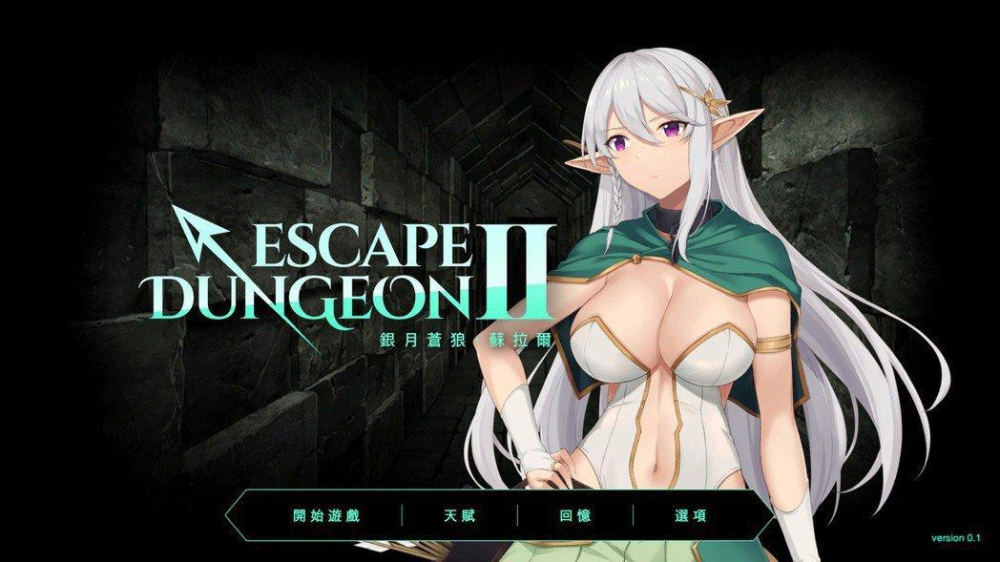
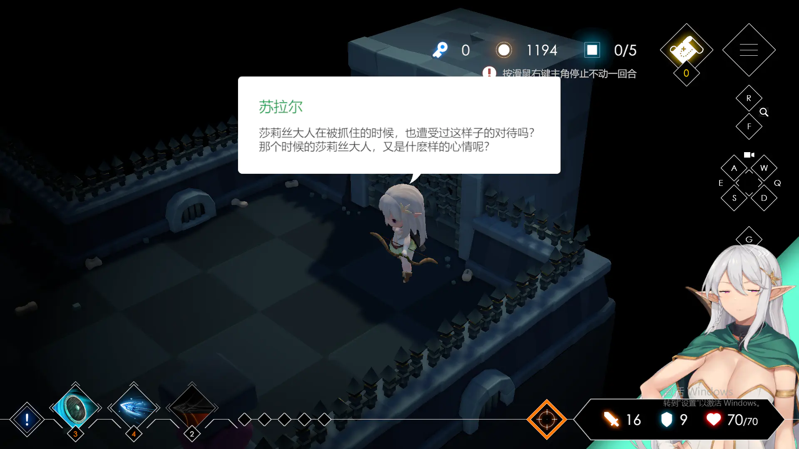
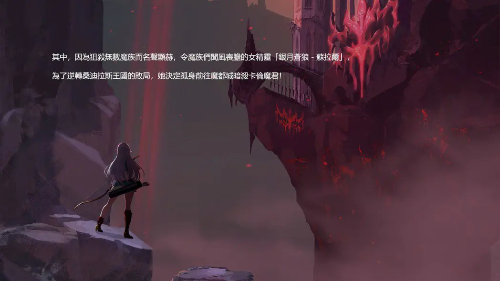
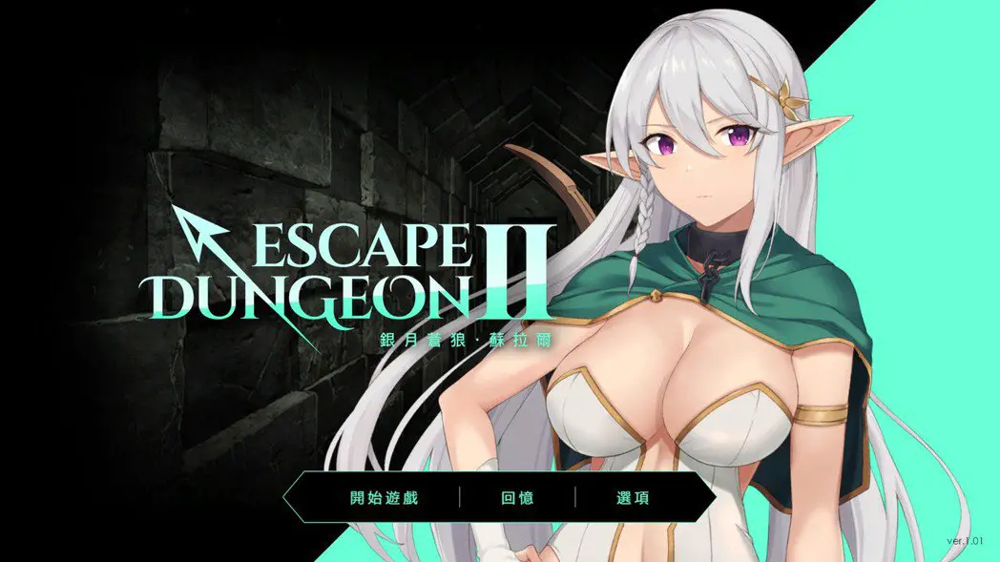
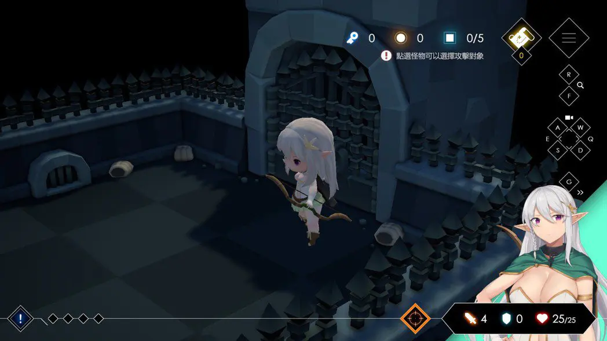
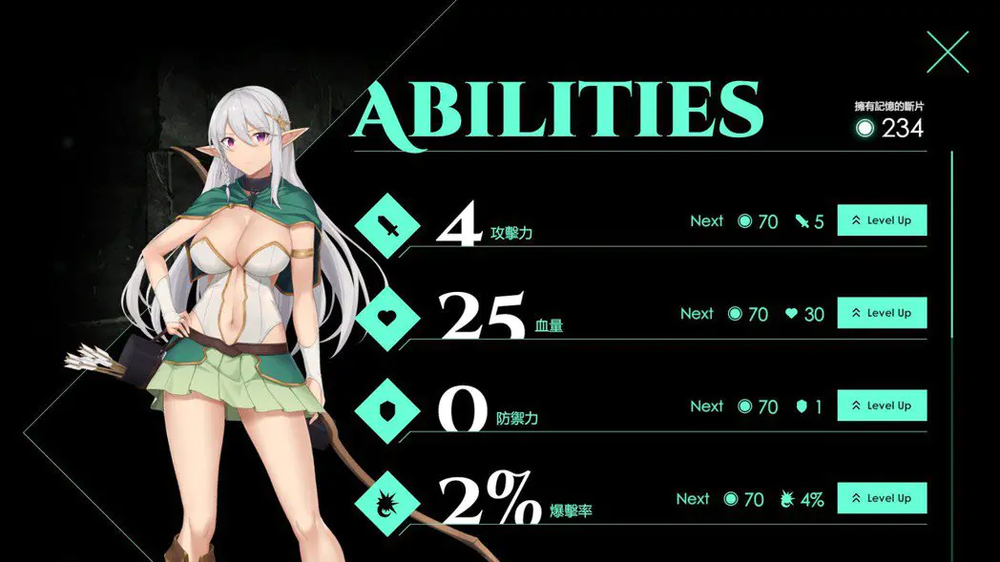
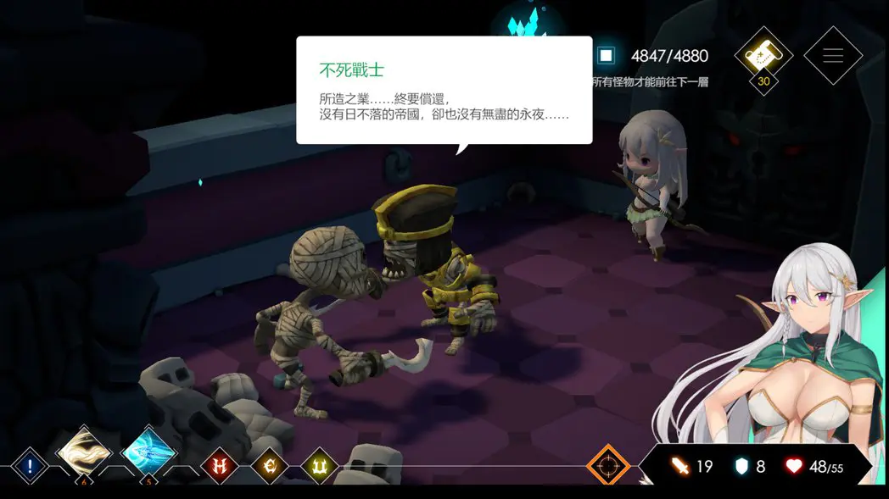
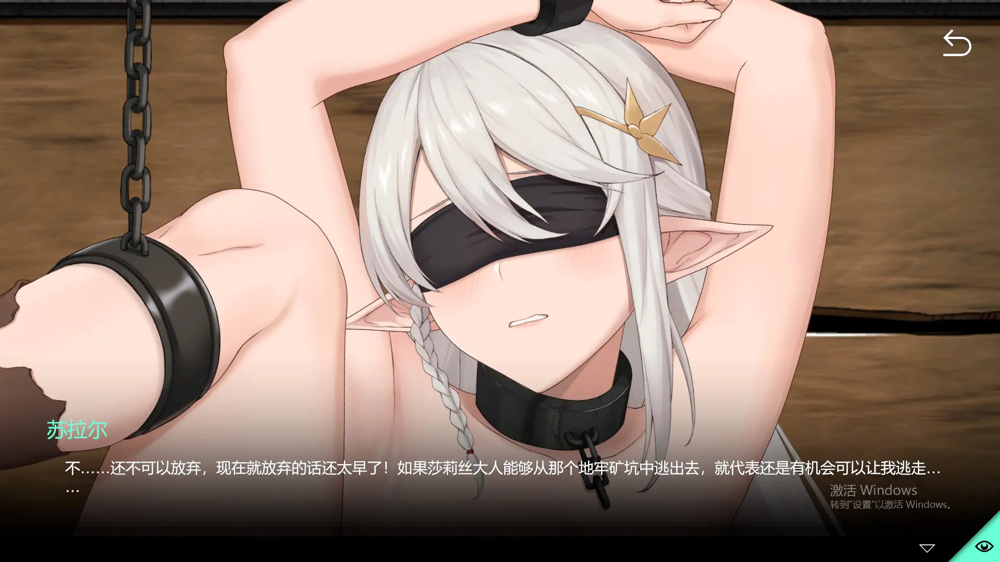

`作者：木衛一`

在王国被卡伦魔君攻陷后，王国女王伊利失踪，大法师莎莉丝沦为阶下囚。
为逆转桑迪拉斯王国的败局，女精灵「银月苍狼－苏拉尔」孤身前往魔都城刺杀卡伦魔君......

| 資訊一覽     |                 |
| :----------- | :------------------------------------ |
| **開發商**   | Hide games |
| **发行商** |PlayMeow Games|
| **结局数**     |2|
| **遊戲時長** | 1 ~ 3 小時              |
| **類型**     | 拔作，SLG        |
| **難度**     | 低 |
| **分級**     | R-18      |

## 故事開場

暗大陆－桑迪拉斯王国，与卡伦魔君数百年来的战争，已然落幕。
战争结局以卡伦魔君的胜利，也就是桑迪拉斯王国的崩毁结束。

性高潮后便可以逆转时空的桑迪拉斯王国女王，**伊利**，失踪，
王国最强的大法师，**莎莉丝**。沦为魔族俘虏，被关押在漆黑至极的矿坑地牢中。

但即使王国陷落，但残存的反抗军依旧在某个地方蓄势待发，等待着反击的狼烟。

其中，因为狙杀无数魔族而名声显赫，令魔族们闻风丧胆的精灵弓箭手「银月苍狼－苏拉尔」，
为了逆转桑迪拉斯王国的败局，她决定孤身潜入魔都城，刺杀卡伦魔君。

在哥布林和鼠人的窃窃私语里，在狼人和大鬼的高声叫骂中
女箭手苏拉尔发觉，这座城堡的诡谲阴森绝不仅仅只是因为地理位置
同时也深深的意识到，一旦自己被抓住，将会被凌辱的如何凄惨...

魔君卡伦的秘密，深深的隐藏在魔城的浓雾之中
似乎也在兆示着精灵女箭手这次冒险只会招致屈辱...

## 登場人物



    

      {name}
       cv: {cv}
      

    

    

        
    

    

      

        {name}
         cv: {cv}
        

      

        
    



<sp-character no=1 width="531" height="943" name="苏拉尔" cv="叶月ゆう">
    <mark>令魔族闻风丧胆的精灵弓箭手</mark>  
    有着瑰紫色的双眼和一头银白的长发 
    也因此获得了银月苍狼的称号 
    性格严肃而高冷 
    对妄想著蹂躪人类和精靈族的女性的魔族恨之入骨  
    <mark>在戰敗後，蘇拉爾便會遭到打倒自己的魔物侵犯</mark> 
    <mark>從性慾代名詞的哥布林到骷髏兵都能對蘇拉爾伸出魔爪</mark>
</sp-character>

<sp-character no=2 width="608" height="1080" name="伊利" cv="无">
    <mark>桑迪拉斯王国的女王</mark>  
    性高潮后便可以逆转时间，回到故事开始前 
    当女主角苏拉尔深陷敌手惨遭凌辱之后，就会因为女王的力量回到进入魔王城前 
    只在故事中蜻蜓点水的提及了一下  
    <mark>不过应该是本系列下一作的女主角</mark>
</sp-character>

## 遊戲截圖

## CG


../image/escapedungeon2/cg/cg1.webp
../image/escapedungeon2/cg/cg2.webp
../image/escapedungeon2/cg/cg3.webp
../image/escapedungeon2/cg/cg4.webp
../image/escapedungeon2/cg/cg5.webp


## 簡評

不知道为什么，这几年台灣的成人遊戲發展十分蓬勃，本作就是今年由台灣遊戲團隊「Hide Games 嗨遊戲數位工坊」製作的中文成人向地牢探險遊戲。其前作是2020年制作的成人遊戲**《莎莉絲．地牢脫出 Escape Dungeon》**，目前均已在Steam正式上架。前作和本作的CG都以Live2D無碼呈現。而相比前作，本作更加精细也更加艳情。

游戏CG比一般CG大三倍，超大张到可以放大你想看的任何地方。live2D微互动模式和超大张CG运镜共同作用，外加极其精美的艺术风格，绝对能让人射爆。HCG 部分因為加入了動態對應的關係，搭配聲優配音，成人要素相當實用。CG采用的是双重解锁方式，除了败北外，还可以通过积攒击杀数解锁H场景，因此不需故意死亡也可解锁CG。

因为是迷宫探索类游戏，所以劇情文字并不多，但能精準敘述故事大背景。女主角蘇拉爾不只是 HCG 部分，而是全程都有配音。立繪也是全程動態，包括 HCG 也一樣，能看到誘人的雙峰在眼前搖晃

《地牢脫出2》是採走格推進回合的玩法，主角又是弓箭手身份，因此玩家應該很快可以聯想到要與魔族保持距離並進行射擊戰鬥。為此遊戲預設了【自動攻擊】的開關，也就是玩家移動時，若攻擊範圍內出現敵人，則會移動後自動攻擊，玩起來非常流暢。

作為隨機地牢的 Rogue 部份，則是每次地牢探索結束（HP 歸 0）會收集截至結束為止的記憶碎片，並能以這些作為類似點數或金錢的概念，購買基本能力強化、擴展新技能種類等等，依照玩家喜好所選擇的成長，再進行下一次的探索。

在戰敗後，蘇拉爾便會遭到打倒自己的魔物侵犯，從近年來已經成為性慾代名詞的哥布林、鼠人、扶他惡魔...甚至到骷髏兵都能對蘇拉爾伸出魔爪，不得不說魔族們相當會玩，每次輪迴都有 3 到 5 種的新玩法，或者用打倒數量來解鎖 H 劇情。

魔物的对话往往会透露給玩家故事背景的內容。从王国战争到魔君的秘密都会涉及，不过只是点缀的趣味性对话，不看也不影响剧情推进。

总的来说，戰鬥玩法輕鬆好上手，不喜歡地牢 Rogue 的玩家也不会有困难。而全程包括動態的 HCG，只要喜歡蘇拉爾的話也絕對值回票價。

## 還在猶豫是否下載？

這裏有一個简短的試玩。

<video controls preload="metadata" width='100%' poster="../image/escapedungeon2/movie.webp">
<source src="https://bitbucket.org/phobosloreal/galvideo/raw/5f399de2e7523156bf47c792959a1b4487b43d7e/escapedungeon2/Escapedungeon2%202022-02-18%2003-10-52-1.mp4" type="video/mp4"/>

 To view this video please enable JavaScript

</video>

## 資源與下載



請考慮 Steam 購買。

盜版：https://www.ryuugames.com/eng-escape-dungeon-2-uncensored/

游戏内自带多种语言

mega：https://mega.nz/file/AAcXjYoQ#ranvM3XfQCdaX_J7MozU2Low9503sVf4nyE-SZMfTYg

Password: ryuugames.com


<!--- 摺疊部分的邊框樣式 --->

