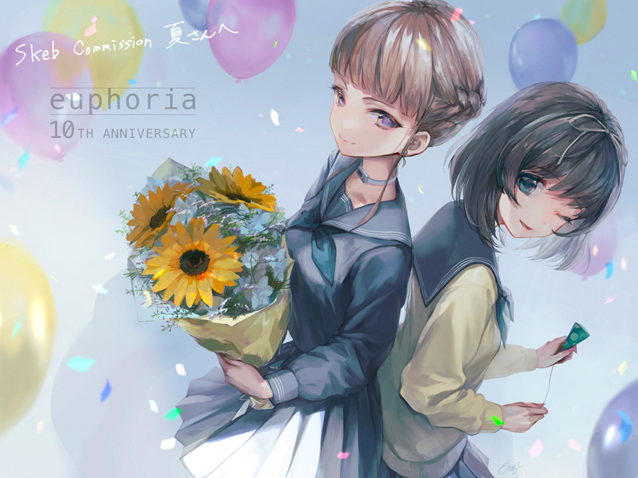
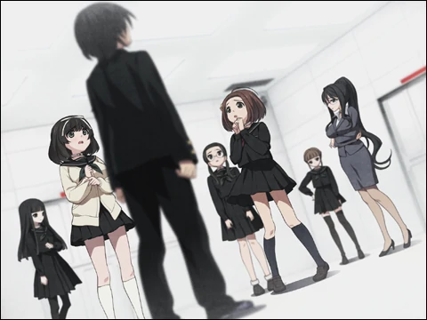
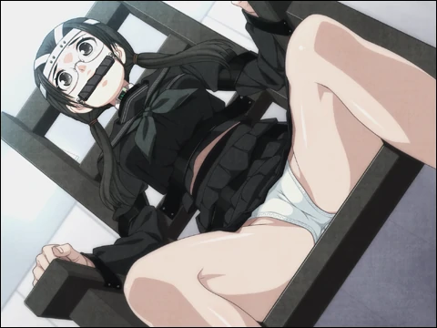
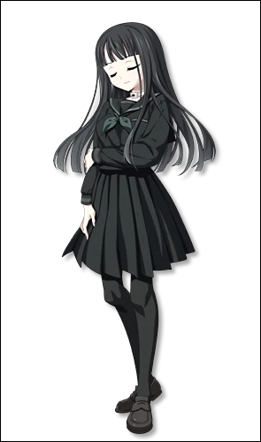
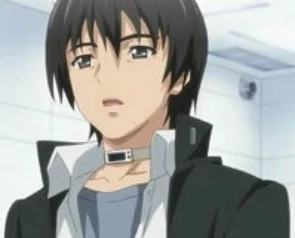

`作者: Patchouli Knowledge`

  白い闇を抱く　槛に囚われても 
  望む貴方に触れたい 
  燃える炎で 歪む愛の鎖に繋いで 

| 資訊一覽     |                  |
|:--------:|:---------------- |
| **開發商**  | CLOCKUP |
| **遊戲時長** | 15 - 20 H          |
| **類型**   | 凌辱 屎尿屁 黑深残 純愛        |
| **難度**   | 較高（強烈推薦按照攻略遊玩）                |
| **分級**   | R-18（注意大量硬核凌辱場景，無法接受請迴避）             |

## 故事梗概

男主惠輔在昏迷中醒來，發現自己身處一個完全白色的房間內，只有一扇門上面閃爍着綠色的光，男主來到門後的房間，發現了其他和他想同遭遇的人也都在這，她們分別是青梅竹馬帆刈葉、班長安藤都子、同社團的學妹蒔羽梨香、英語老師葵菜月、同年級的白夜凜音、以及同班真中合歡。大家都不清楚自己爲何會在這裏，就在詫異時廣播響了起來：

  “這是場遊戲，參與者一共七名，性染色體爲XY的個體，爲『解鎖者』；性染色體爲XX的個體，爲『鎖孔』” 
  “身爲『解鎖者』的男人，請用箱子裏的鑰匙，享受被設定爲『鎖孔』的女人的口、肉穴、乳、尻等部位” 
  “另外拒絕進行遊戲，或者違反規則的話，遊戲就會結束” 

一本正經的班長自然強烈反對廣播所說的話並當場表示要退出，在和廣播聲確認後，燈光突然便關了，當再度亮起時，班長已被綁在電椅上，然後立刻被當場電死，面對如此殘酷的處刑，衆人已無退路只能選擇參加遊戲……

在男主觀察班長遺體時，被真中合歡發現了男主不同尋常的xp並以此威脅立下誓約之吻，爲了保護青梅竹馬並逃出這個白色監獄，男主和女主們不得不按照廣播的指示，進行開鎖。

## 人物介紹

剛轉學來男主班級的蜜汁美少女，平時總孤身一人但長得好看被人稱之爲“高嶺之花”在男生中頗具人氣。 
觀察力十分優秀且腦子轉的很快，在白色設施中也可以很快的冷靜下來思考，危急時刻其大心臟也能保住團隊。  
但總是帶着意味深長的笑容且在抓住男主把柄後不停的玩弄男主，意圖解放男主內心深處的慾望。 

男主的青梅竹馬，是男主無論如何也要守護的對象，彼此十分的信賴。 
性格十分堅強，對所有人都十分亞撒西，是個不做作的聖母。  
有點介意別人把自己當小孩子來看，但胸部卻很大，最喜歡男主。 

校內的風紀委員，嚴肅認真重視紀律，標準的無口少女形象。 
對自己和旁人的要求都很高，一旦有觸犯規則的行爲都會馬上出警。  
看似是個獨行俠的風格，但意外的十分團隊，在白色設施中也在不停的爲團隊考慮而不是只顧自己。 

男主和青梅所在的天文社的後輩，就像個小動物一樣天天跟着男主在社團活動中。 
完全還是個小孩子性格，特別愛撒嬌愛哭，且容易受到他人影響和教唆。  
因爲其嬌小身材和性格，有着無論做什麼都會被原諒的體質（大概） 

剛來學校就職的英語老師，性格大方溫柔，十分受學生們的歡迎。 
明明是個老師，但威嚴可能還不如合歡和凜音足，擅長當個和事佬。  
是個抱着橋到船頭自然直的態度的樂觀主義者。 

標準的日系男主，遊戲中沒臉，左圖是OVA的截圖。 
朋友很多，無論是異性還是同性，喜歡天文，參加了天文社。  
每日都和青梅竹馬葉膩在一起但並不是戀人更多是親人的感覺，看起來是個老好人但內心一直壓抑着破壞、凌辱的衝動。 

## 遊戲 OP

動畫來自被牆的油管，請翻牆

<iframe id='y2b' loading="lazy" src="https://www.youtube-nocookie.com/embed/116zkTqCOhM" title="YouTube video player" frameborder="0" allow="encrypted-media; picture-in-picture" allowfullscreen></iframe>

## 簡評

鑑於這是本站第一個“十二神器”的介紹，所以我先放一個關於“十二神器”的[科普](https://zh.moegirl.org.cn/index.php?title=Galgame%E5%90%A7%E5%8D%81%E4%BA%8C%E7%A5%9E%E5%99%A8)在這裏。不過能找到本站的人想必對這個稱呼應該不陌生吧。（笑

  

    要想對此遊戲獲得最好的體驗，最好的做法就是看到這句話後立刻掛掉本頁面並且拒絕閱覽任何關於該遊戲的介紹（官網除外，本文上面介紹也是儘量模仿官網），一路遊玩此遊戲直到到達TE爲止。
  

回到正題，相信大多人瞭解該遊戲無非就是被別人安利或者對“十二神器”的好奇心，那麼筆者可以負責任的告訴你，該作絕對不會讓你失望的。這就是一部不折不扣的 ***拔作*** ，且其中的玩法十分鬼畜，相信大家看到筆者打得tag已經心知肚明。
但正是前期壓抑的劇情和玩家的情緒被劇情調動的跌宕起伏，整個劇情相對慢熱，雖然最後有些經不起推敲，最後揭示真相時也會讓人直呼過癮。
其他方面由於年代比較久遠，CG畫風看起來有點老舊，但勝在玩法多多，H巨多，保證有一款適合你，音樂方面OP很好聽，其他bgm則沒有能給人留下深刻的印象。
人設方面塑造可以給滿分，全篇所有角色在這種黑暗題材下都沒崩，行動都合乎邏輯且立體豐滿。（稍微說多就劇透了請大家自行進遊戲體會
本作由於被列爲“十二神器”且充斥這大量勸退萌新的劇情，已經被大衆輿論吹捧到了它不該屬於的高度，誠然這是一部優秀的作品，但遊玩是一定一定要放低期待值！（很多人說這是神作，但筆者認爲每個人對神作的判定標準都是不同的，我們只能推出大衆普遍認爲優秀的作品，一千個人心中有一千個哈姆雷特，無腦吹是大忌。）

| 評分        |      |
|:---------:|:----- |
| **人設**    | 10/10 |
| **立繪 & CG** | 8/10 |
| **劇情**    | 9/10 |
| **音樂**    | 7/10 |
| **綜合**    | 9/10 |

## CG鑑賞


../image/euphoria/sample03_b01.webp
../image/euphoria/sample04_b01.webp
../image/euphoria/sample05_b01.webp
../image/euphoria/sample07_b01.webp
../image/euphoria/sample08_b01.webp
../image/euphoria/sample09_b01.webp
../image/euphoria/sample10_b01.webp
../image/euphoria/sample11_b01.webp



../image/euphoria/sample12_b01.webp
../image/euphoria/sample13_b01.webp
../image/euphoria/sample14_b01.webp
../image/euphoria/sample15_b01.webp
../image/euphoria/sample16_b01.webp
../image/euphoria/sample17_b01.webp
../image/euphoria/sample18_b01.webp
../image/euphoria/sample19_b01.webp
../image/euphoria/sample20_b01.webp


## 遊戲資源

[🔗️盜版](https://t.me/RhineLibrary/4891)（最佳遊戲體驗爲按照文件裏的全CG存檔攻略，最後提醒一下無法接受凌辱和屎尿屁的別玩）
PS: 玩完一定要看附錄的 staff 採訪，很有趣。

