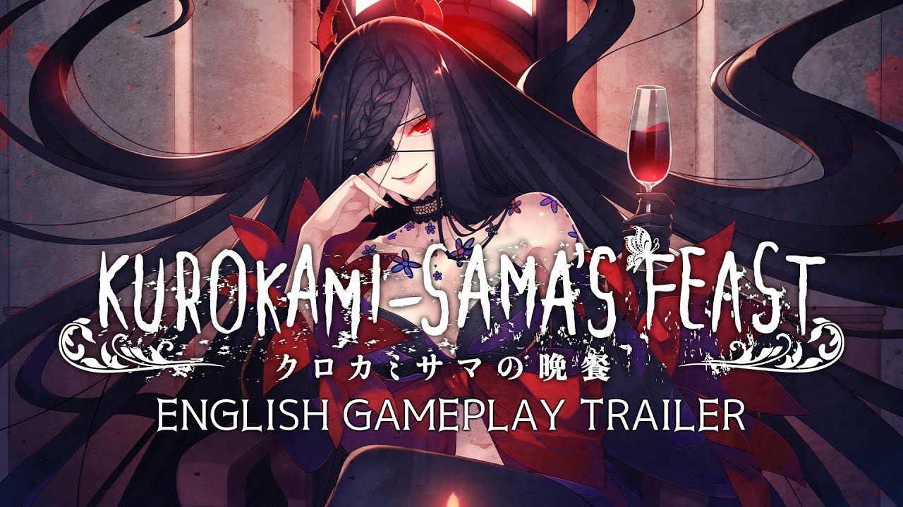
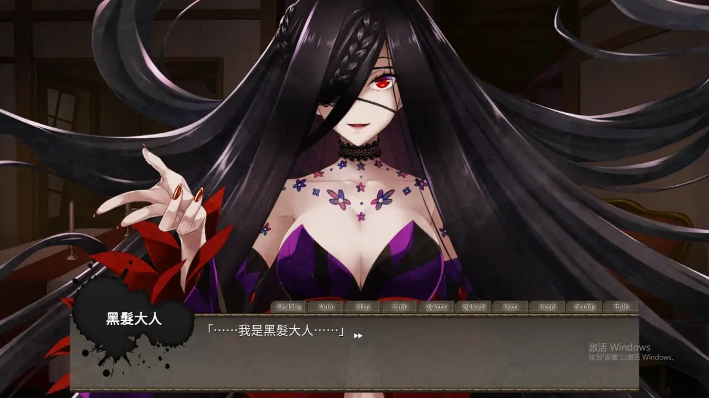
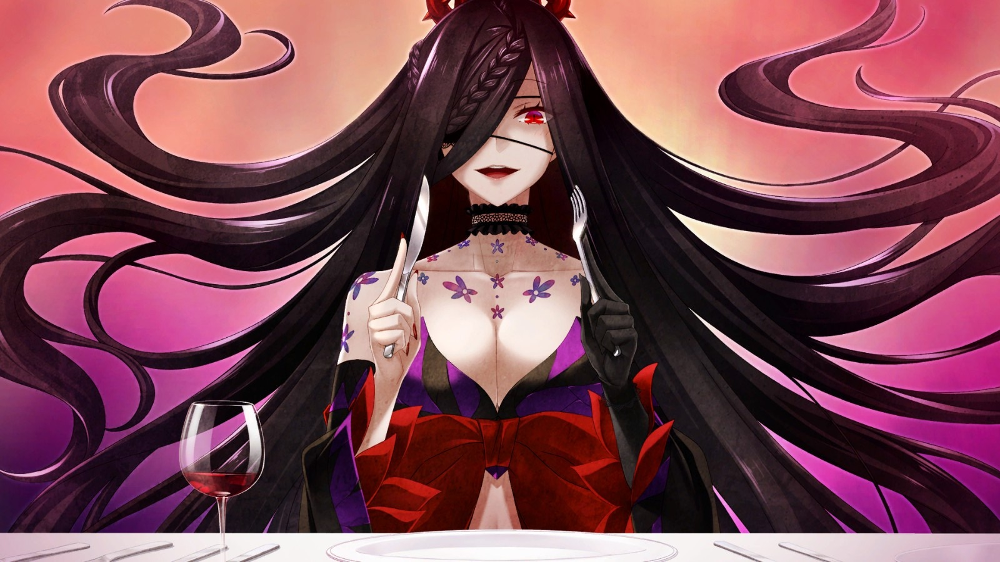
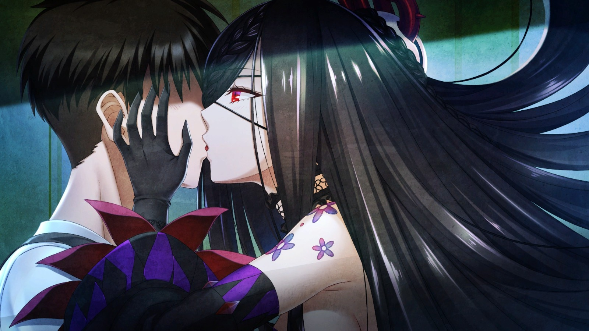
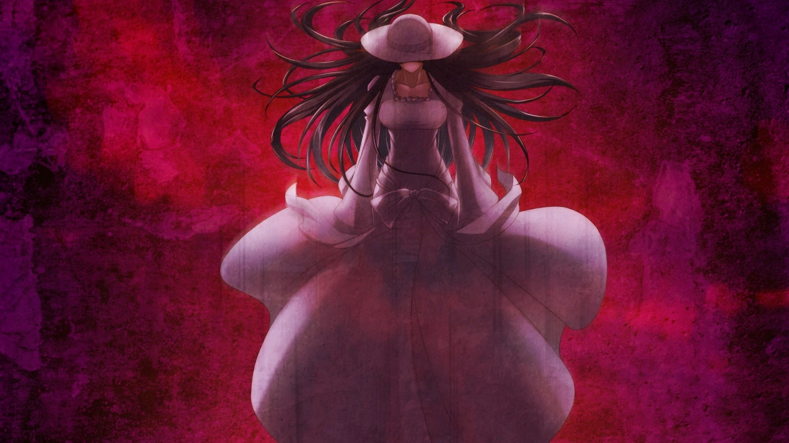
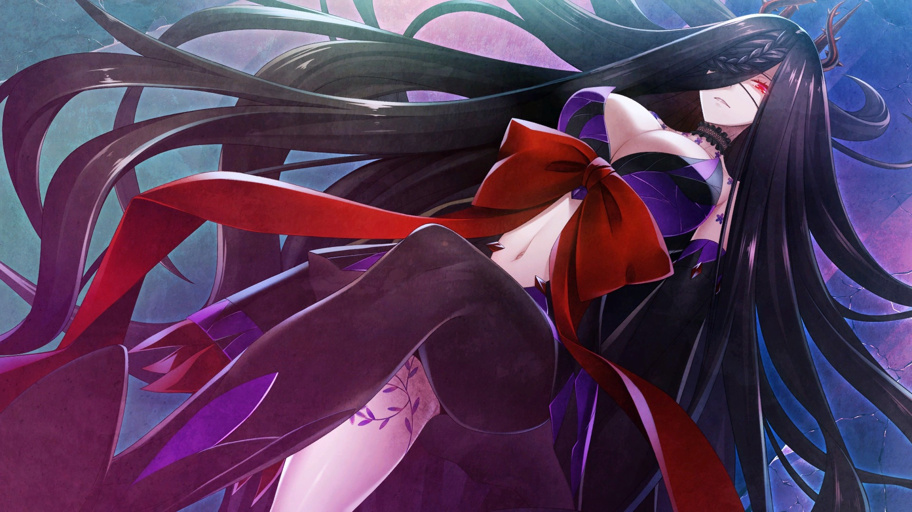
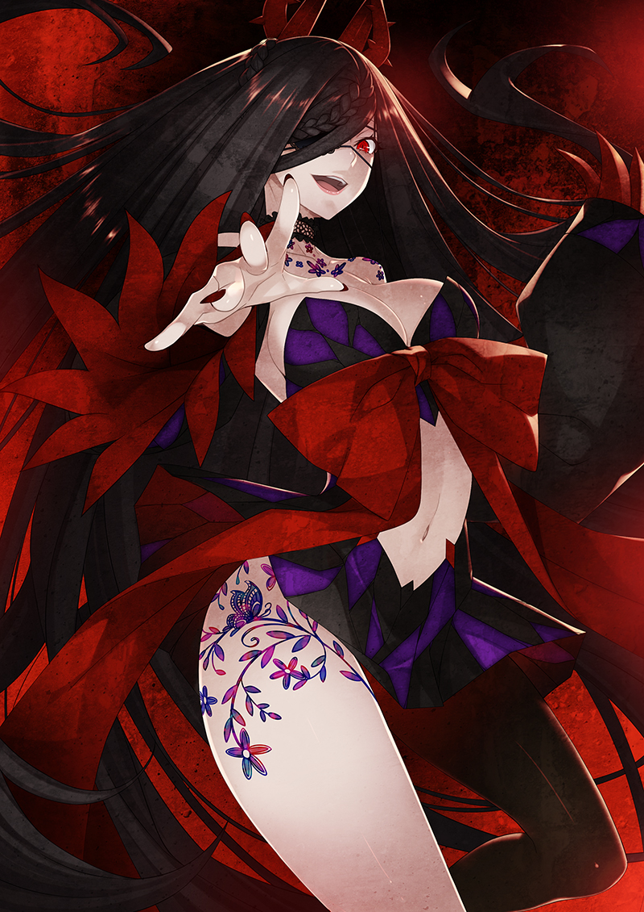
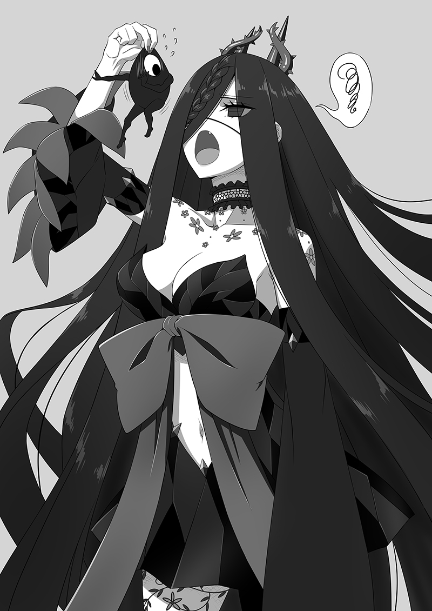

`作者：木衛一`

被青梅竹馬拉去廢墟探險的男主角意外被怪異「黑髮大人」控制，不得不獵殺怪異為黑髮大人恢復力量

| 資訊一覽     |                 |
| :----------- | :------------------------------------ |
| **開發商**   |みなとカーニバルworld  |
| **編劇**     |タカヒロ|
| **原畫**     |みこしまつり|
| **遊戲時長** | 2~ 4 小時             |
| **類型**     | 靈異&美食ADV |
| **難度**     | 中{解密類型} |
| **分級**     | 全年齡   |

## 故事開場

不賣座的漫畫家 **鐮倉·胴丸** ，在作品又一次被腰斬以後，決定應青梅竹馬 **比企·那須加** 之邀，和怪異探索會的會長 **朝比奈·鎮** 一起，去往傳説中有「怪異」發生的廢墟探索。

在廢墟中，一個模糊的鬼影突然出現，然後輕而易舉的就掃開了會長**鎮**，抓住了主角**胴丸**，扯下**胴丸**的手臂，撕下耳朵，挖出眼珠......

急忙趕來救助的青梅竹馬**那須加**也被鬼影舉起起，狠狠的往地上掄了好幾下，不知死活。

然而，鬼影卻沒有殺了主角**胴丸**，反而給主角換上了她的耳朵，眼珠和手臂。

藉著接上的鬼影的器官，**胴丸**這才發現，鬼影其實是一個妖艷綺麗的美人。

原來，鬼影其實是在久遠年代就被封印在這裏的怪異**「黑髮大人」**。

在過去，她響應復仇者的召喚，收取代價為他們殺掉他們的仇人。

可最終，人們畏懼她的力量，把她封印在這裏，無人問津，直到主角一行人的到來。

對著主角這幾個人不知天高地厚的闖入者，她決心利用他們擺脫封印，逃出樊籠。

她告訴主角一行人，如今她已經給他們下了詛咒，他們必須按照她的命令四處獵殺「怪異」，也就是游蕩在這個城市製作靈異現象的各種妖怪。每隔10天就把他們獵殺的戰利品帶來給她恢復力量。不聽從她的話結果就只有死路一條。

她又告訴主角一行人，青梅竹馬 **那須加** 身上其實混有「怪異」的血統，這賦予了她超強的格鬥能力和恢復能力還有看見「怪異」的能力。會長 **鎮** 有聰慧的頭腦和淵博的知識。原本是最沒用的男主，她也賦予了自己的一部分肢體，借此男主角可以看見「怪異」，聽見一般人的心聲，而**「黑髮大人」**的手臂更是可以發出致命一擊，輕易的擊倒任何「怪異」。如今他們一行人有足夠的力量為**「黑髮大人」**獵取怪異。

性命握于人手，主角一行人只能無奈的踏上了為**「黑髮大人」**獵取怪異的道路。但同時，不安也在他們的心中不停的滋生出來。

在**「黑髮大人」**回復完力量以後，他們的命運會將如何呢，這個世界又會如何？

最終，他們會不得不面對强大的**「黑髮大人」**，絞盡腦汁想方設法對付她嗎？

還是說，可以藉著這段時間的媾和，窺視**「黑髮大人」**的内心，化敵爲友呢？

在最後的最後，等待著他們的是死，混亂，還是——

## 登場人物

  



    

        
    

    

    



<sp-character no=1>
  
      鐮倉 胴丸
  
   無配音
  

  <mark>不賣座漫畫家</mark> 
  從高中以後就在從事漫畫行業 
  卻屢屢受挫，作品次次都被腰斬 
  平常的生活很受青梅竹馬那須加的照顧 
  甚至想著連錢包也交給那須加好了 
</sp-character>

<sp-character no=2>
  
      比企 那須加
  
   cv: 諏訪彩花
  

  <mark>胴丸的青梅竹馬</mark> 
  20嵗的女大學生 
  愛慕著男主角胴丸，經常在生活上照顧男主 
  在被黑髮大人點出自己具有妖怪血統后，堅信一定是雪女一類 
  但從那須加精通格鬥技來看，顯然沒那麽羅曼蒂克 
</sp-character>

<sp-character no=3>
  
      朝衣奈 鎮
  
   cv: 石谷春貴
  

  <mark>怪異研究會的會長</mark> 
  自小就對怪異深深着迷的男人 
  有著敏銳的頭腦和淵博的怪異知識 
  同時也收集了大量的驅魔道具 
</sp-character>

<sp-character no=4>
  
      黑髮大人
  
   cv: 名塚佳織
  

  <mark>過去爲人復仇的”怪異“</mark> 
  歷史可以追隨到平安年代的妖怪 
  在昭和年間被封印 
  現在她正在强迫主角一行爲她獵殺怪異恢復力量 
  並聲稱在破禁而出后就要為自己復仇，殺光封印她的人的子孫 
</sp-character>

## 遊戲截圖


../image/kurokamisama/scn/1.webp
../image/kurokamisama/scn/2.webp
../image/kurokamisama/scn/3.webp
../image/kurokamisama/scn/4.webp
../image/kurokamisama/scn/5.webp
../image/kurokamisama/scn/6.webp


## CG

## 宣傳PV

<video controls preload="metadata" width='100%'>
<source src="https://s3static-zone0.galgamer.eu.org/video-2d35/kurokamisama/kurokamisamaPV2.mp4" type="video/mp4"/>

 To view this video please enable JavaScript

</video>

## 簡評

《**黑髮大人的晚餐**（クロカミサマの晩餐）》是新遊戲品牌 みなとカーニバルworld 推出的首部作品。中日英文版已於2022年1月21日在 Steam 平台發售，NS版預定於1月內發售。

游戲的製作公司是製作過**《認真和我談戀愛！》**的遊戲公司 みなとそふと 新成立的子公司，因此這一作看起來更像是低成本試探市場的產品。目前steam上官方依舊在發佈補丁，修改UI系統的bug或者添加新功能。以第一個補丁爲例，添加的新功能有cg鑒賞等等。

游戲畫風總體上比較簡樸，主角團青梅竹馬那須加有觸手playCG。大部分CG都匯集在顔值擔當的黑髮大人身上了，她實在太大了。怪異的立繪有一些也很出彩。

本作是全年齡向，也就意味著基本上是沒有擦邊球或者軟色情内容了，偶爾有幾張CG可能有點挑逗意味，官方也很有自知之明的把這幾張都放在官網上欺詐消費者了。

表現系統比起一般的visual video還算不錯，作爲半個恐怖gal音樂確實有點嚇人，配上諸如對話框突然震蕩著實也嚇到了我一次。

在進入這游戲的前幾分鐘，我一度懷疑這是什麽小社團同人作或者像eden那樣的上古gal被放上steam要飯來了。最後發現這居然是正經公司的處女作的時候我著實是懵逼了...

劇本還是很優秀的，寥寥幾筆速寫怪談的時候確實讓我有點後背發涼，和黑髮大人戀愛的**隱藏路綫**（也就是你擺爛一隻怪異都不為黑髮大人殺，天天跑去和黑髮聊騷進入的路綫）也很可愛。

主角擁有名為「靈力」的數值，可以透過靈力值來聽到人的心聲，以及應付怪異的攻擊。每一個章節主角與同伴都需要在限定的時間內使用靈力去打倒怪異，從中取得食材送給黑髮大人。在每十天上繳怪異食材的時候，黑髮大人會把這些食材一一做成菜餚，讀起來也很有迷宮飯的趣味感。

就2-4個小時的游戲時間而言，單衝著這個劇本就值得一玩。

滿打滿算我寫這篇稿件的時候差不多是游戲在steam上發售一周

因爲發行時間還短，所以解謎部分的攻略只有很少一部分

因此我也不費心力自己去摸索事件全收集了

畢竟這個解謎還是有點頭痛的...

官網：🔗️http://www.minatocarnival.com/world/kurokami_bansan/index.html

## 感想

點此展開

談一點故事細節給我帶來的小感想

在first round最初的十天，玩家可以在特定地點探訪找到一隻**來自中國**的怪異：毛羽毛現

據説這是出自《列仙傳》的怪物，故事裏的毛羽毛現和原著裏的有細微差別。在故事中，毛羽毛現的母親是秦時的宮女，秦末大亂時逃入山中避禍，後來在山裏久了遍體生毛。之後生下的毛羽毛現在明朝正德年間被道士驅逐，於是輾轉來到日本

在中國傳説裏因爲長期像野人一樣住在山林裏而變體生毛的故事不少。以《蜀碧》中故事爲例，在張獻忠屠蜀時，一些蜀人逃入山林避難。之後蜀中兵禍饑荒綿延多年，直到清軍入蜀以後，才有人在樹林見到這些躲在山裏的蜀人。這些蜀人已經像猿人一樣，遍體生毛，脚板也硬的像鐵片一樣。他們遠遠的在樹林裏看見清軍，以爲又是張獻忠來殺蜀人了，嚇得在林間奔騰如飛，轉眼不見了。

類似的張獻忠屠蜀的衍生鬼怪故事還有很多，無怪乎會有國内游戲公司想著做一款以張獻忠屠蜀后蜀地各種詭異怪物為賣點的游戲了。雖然被人一眼識破創意來自血源而宣傳畫抄襲的是仁王。

理論上說中國各種神鬼筆記小説能整理出的怪異并不少，像閱微草堂筆記之類的都有很豐富的素材。過去十年中我有印象的整理類似怪物的出版物并不少，但似乎到現在也沒有類似日本百鬼夜行這樣的影響力。

不得不説，太拉跨了。

## 還在猶豫是否下載？

這裏有一個 15分鐘的試玩。

<video controls preload="metadata" width='100%'>
<source src="https://s3static-zone0.galgamer.eu.org/video-2d35/kurokamisama/Kurokamisama+2022-01-26+15-15-32-1.mp4" type="video/mp4"/>

 To view this video please enable JavaScript

</video>

## 資源與下載

steam有售:



可以于ryuugames下載：🔗️https://www.ryuugames.com/eng-kurokami-sama-no-bansan/

mega地址：🔗️https://mega.nz/file/FxdDDSwa#lj64s__yz52htAvMx__nfNrqihIlzEQEJsL8P3vC7Bc

密碼為ryuugames.com

<!--- 摺疊部分的邊框樣式 --->

