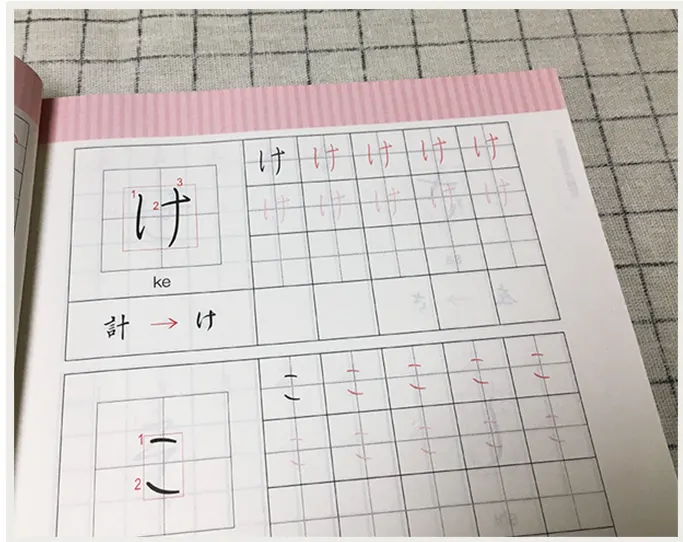
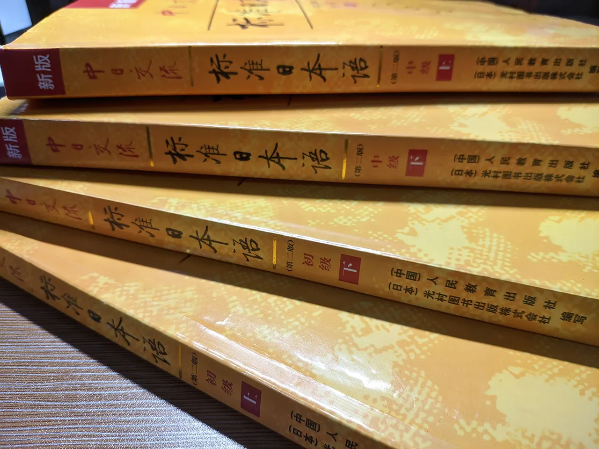

`作者: 桐遠暮羽`

*不再被語言所束縛，這是成爲自由且無可阻擋的 Galgamer 之路。*

<p></p>


| 資訊一覽     |                 |
| :----------- | :----------------------- |
| **攻略人數** | 1      |
| **時長**     | 每天 1 到 2 課  |
| **類型**     | 學園 文藝   |
| **畫面**     | 全紙質           |
| **分級**     | 全年齡      |
| **難度**     | 中        |

## 寫在前面

爲甚麼要學習日語？我相信在看這篇文章的人都是 Galgame 玩家，
心裏也明白，好處自然是不言而喻。

你可以通過捕捉細微的語感，捕捉無法翻譯成其他語言的細微氣息，
感受到人物的細膩心理，還有撲面而來的和風（簡稱二次元味兒）。

那麼，要怎麼學習呢？報班？找新東方？
我覺得不行，找新東方的行爲很不 Galgamer，
而且一個班裏有些人進度快有些人進度慢，報班的最後結果就是上課不停摸魚或者根本跟不上進度。

從我之前接觸過的日語班的教學來看，老師會花兩到三次課講五十音圖。
我很奇怪這有甚麼好講的，發一本練習冊，一盤磁帶，讓學生滾回去嗯背一個星期，效果不更好？

最後那個班我全蹺掉了。


## 在我們開始之前...

要事先準備好一些東西。

  1.    **多年餓次元文化的薰陶**
  
        多年諤次元文化的薰陶給你帶來了甚麼？你有沒有曾經覺得自己聽到動漫女孩一開口，似乎就已經從她的語氣和用詞猜到了她接下來要說甚麼，抱着甚麼樣的心情？

        這些耳濡目染的經驗將成爲你語感的支柱，雖然好像沒完全聽懂，但是心裏卻感受到了；而且在學習的時候，你會覺得這些語法，這些詞彙，這些句子都似曾相識，整個學習的過程就好像自己的日語技能樹已經大概成形，剩下的只是把拼圖塊放進形狀剛好合適的空位裏，非常快樂。

        這是不董二刺猿的人所不具有的高度優勢。

        <br>
     
  2.    一本 **五十音圖抄寫練習冊** 或者 **日語字帖**

        用來抄寫，跟讀，背誦，以便快速，牢固地記憶五十音。
        
        <p></p>

        五十音是一切的基礎，待會還會細說。

        <br>

  3.    **新標準日本語教材**（黃色書）的 **初級** 和 **中級** 部分，總共 4 冊。

        用來成爲日語中級高手的必備教材。故事劇情以商業爲主，但是牠涵蓋了所有日常用語，所以還算好用。待會還會細說。

        人教版的玩意，買二手，買盜版都可以，不怕良心不安。
        
        <p></p>

        **注意：**請務必購買紙質書，不要使用電子書學習。買了，牠的存在就會不停地提醒你快點學習日語；而如果不買，你可能永遠都不會開始。

        <br>

  4.    上述教材的配套音頻

        用來聽寫，跟讀。點此下載 [🔗️前往 Telegram 頻道](tg://resolve?domain=KiritouKureha&post=69)

        <br>

  5.    兩本 紙張可以方便地取出裝回的 **活頁本**

        一本用來記錄你的筆記，一本用來做 新標準日本語教材 的課後習題。
        
        <p></p>

        <br>

  6.    一個 用語比較簡單的 Galgame 生肉

        當你完成 **初級 下冊** 的學習之後會用到。
        
        我推薦你玩 ...

 <br>

除了二次元薰陶之外，剩下的可以上淘寶買，或者造訪新華書城。

 <br>

什麼？這些還不夠？

  7.    一些 日本語能力測試 的 備考練習

        當你完成 **中級 下冊** 的學習之後會用到。

​       

## 學習路線

讓我們開始吧！

首先，Galgamer 的日語學習路線和一般人的日語學習路線有甚麼區別呢？？
那就是，我們有 Galgame 這一有力武器（馬的智障），
各種 Galgame 的故事背景千奇百怪，劇本涉及世間萬物，遊玩需要閱讀大量文章，並且幾乎所有人物對話都有配音。

這意味着甚麼？

**意思是，一旦你的日語學習達到了能大概讀懂 Galgame 的水平，聽力達到了能聽清楚對話中的每一個字的時候，那麼**

**Galgame 將成爲你的日語老師，你將可以從 Galgame 中繼續學到大量的原汁原味的表達，接觸到許多你沒見過的詞彙，語法乃至日本文化；你將逐漸熟悉各種日語會話中的語氣，遣詞造句。**

你將被 Galgame 帶着前進，而不是繼續痛苦地在不知何時爲盡頭的道路上摸索。


### 目標 

說到這裏，我覺得應該給自己設定一個甚麼目標，已經呼之欲出了。

第一步，先自己進行勤奮地自學，直到能夠大概讀懂 Galgame 劇情，雖然有生詞不是很懂，但是查查就沒問題。此時，已經對日語的整體架構和語法規則有了較好的掌握。(1m ~ 2m)

第二步，降低通過書本自學的強度，打開 Galgame 生肉，在遊戲中高強度練習閱讀和聽力，高強度積累新的詞彙和表達。你會發現能看懂的東西越來越多。(4m ~ 5m)

最後，扔掉課本，去挑戰複雜的 Galgame。

### Stage 0 - 五十音圖（耗時 5d ~ 7d）

⚠️️五十音圖是一切的開始。

學習語言，如果連看懂它的字符都費勁，那無疑是事倍功半。

打開你的五十音圖練習冊（和配套的音頻如果有的話），一天十個符號，多多抄寫，多多朗讀，嗯背，直到——

你看到一句話，雖然意思不太清楚，卻能夠不假思索地讀出這一串假名。

* めんぼうをスティックにもちかえて、なんて♪
* そろそろエゴサタ～イム。「おんりーせんせいかみえし」だって！わかってるじゃない！
* ことり、かさねちゃんのところに…ばけてでちゃうんだから…

注意：片假名比較難背，你可以在精通了平假名而片假名還有點卡殼的情況下進入下一階段。


### Stage 0.5 - 標準日本語 初級 上冊 入門單元

這一單元講了日語的一些發音、語調等基礎知識，你可以簡單看下，也可以聽聽入門單元的配套錄音。

不過我覺得深諳諤次元文化的你應該會覺得這些內容早已司空見慣。


### Stage 1 - 標準日本語 初級 上冊 1\~24 課 （每課耗時 1h~2h）

⚠️️你需要認真地學習每一課的內容。

上冊的每一課中都是固定的內容安排，請參照這裏

<p></p>

<p></p>

<p></p>

<p></p>

<p></p>

辛苦了，像這樣認真地完成每一課的內容需要一到兩個小時，上冊總共有 24 課。
你可以安排一天學習一課，並且在忘記內容時隨時翻看筆記，這樣一個月可以完成上冊。

但是！這是寒假！你難道不覺得應該進行一下大躍進嗎？？上午一課，下午一課，晚上玩玩 Galgame，豈不美哉！

但是如此高強度的學習會導致心累，所以我執行這個計劃的時候，每星期安排了一天的休息，啥也不做。這樣就可以半個月完成上冊。上冊的最後有一套 N5 考試題，請花一天時間完成牠，並仔細批改糾錯。

整個 新標準日語 初級 上冊 的知識點摘要 如下：

<p></p>

<p></p>

<p></p>

恭喜你完成了 初級 上冊，但是很遺憾，你還是無法看懂 Galgame。這裏還不是終點，只是檢查點。

### Stage 2 - 標準日本語 初級 下冊 25\~48 課 （每課耗時 1h~2h）

⚠️️你需要認真地學習每一課的內容。

下冊和上冊相比，結構上相差不大，還是適用上面提到過的學習方法。
一天兩課，沖阿！

整個 新標準日語 初級 下冊 的知識點摘要 如下：

<p></p>

<p></p>

<p></p>

別忘了完成書末的 N4 考試題。

恭喜你，你已經幹爛所有日語初級課程，並且應該掌握了日語的大致語法框架，你會發現你可以讀懂一些生肉漫畫和一些 Galgame 了（大約 60%），你正在向日語中級高手的大門邁進。

雖然但是，這個階段還不能直接觀看動畫或者日劇，你會覺得他們說話超級快，還沒搞清楚他說的是哪個詞之前整句話都過去了，而且 Galgame 語音可能要多次播放才能聽清楚。


### Stage 3 - 日語中級高手 養成階段 （中級課文 每課耗時 3h）

看到這裏就有讀者要罵人了。說好的 Galgamer 之路呢？前面都是叫人在當做題家，一點 Galgame 都沒提到！

我很抱歉，，，但是這是事實，在 Galgame 中學習就像是站在巨人的肩膀上，但是若是境界不到，你還無法夠到那巨人的肩膀。
你需要先成爲一個高手——至少是中級高手，才能到達能用 Galgame 學習的水平。
因此對初級日語的硬啃是必經之路。

但是你現在已經成功站在了這裏，你離中級高手已經很近了！請進入 日語中級高手 養成階段，，，

如果是電腦上的編程語言，只需要學習一次語法，接下來就能一勞永逸地讀懂所有代碼。
但是日語不是這樣的，學完初級日語的所有語法的框架，還不夠，在框架之外還有很多特殊情況，習慣用法等零散的東西。
中級日語的學習，就是對上述零散的表達方法的積累，就像在沙灘上撿貝殼🐚️，在這個階段多年的諤次元薰陶會再一次成爲你的好朋友。

中級日語課本就是這樣一本貝殼書，當然 Galgame 也一樣，因此在這個階段，我建議對着課本和 Galgame 生肉同時學習。

先來看一下中級日語的課本結構。中級的上下冊共有 32 課，其中每一課中是長這樣的。

<div id="carouselExampleIndicators-one" class="carousel slide bg-transparent" data-ride="carousel">
  <ol class="carousel-indicators ">
    <li class="bg-dark" data-target="#carouselExampleIndicators-one" data-slide-to="0" class="active"></li>
    <li class="bg-dark" data-target="#carouselExampleIndicators-one" data-slide-to="1"></li>
    <li class="bg-dark" data-target="#carouselExampleIndicators-one" data-slide-to="2"></li>
    <li class="bg-dark" data-target="#carouselExampleIndicators-one" data-slide-to="3"></li>
    <li class="bg-dark" data-target="#carouselExampleIndicators-one" data-slide-to="4"></li>
    <li class="bg-dark" data-target="#carouselExampleIndicators-one" data-slide-to="5"></li>
    <li class="bg-dark" data-target="#carouselExampleIndicators-one" data-slide-to="6"></li>
    <li class="bg-dark" data-target="#carouselExampleIndicators-one" data-slide-to="7"></li>
    <li class="bg-dark" data-target="#carouselExampleIndicators-one" data-slide-to="8"></li>
    <li class="bg-dark" data-target="#carouselExampleIndicators-one" data-slide-to="9"></li>
  </ol>
  <div class="carousel-inner bg-transparent">
    <div class="carousel-item active">
      
    </div>
    <div class="carousel-item">
      
    </div>
    <div class="carousel-item">
      
    </div>
    <div class="carousel-item">
      
    </div>
    <div class="carousel-item">
      
    </div>
    <div class="carousel-item">
      
    </div>
    <div class="carousel-item">
      
    </div>
    <div class="carousel-item">
      
    </div>
    <div class="carousel-item">
      
    </div>
    <div class="carousel-item">
      
    </div>
  </div>
  <a class="carousel-control-prev" href="#carouselExampleIndicators-one" role="button" data-slide="prev">
    <span class="carousel-control-prev-icon" aria-hidden="true"></span>
    <span class="sr-only">Previous</span>
  </a>
  <a class="carousel-control-next" href="#carouselExampleIndicators-one" role="button" data-slide="next">
    <span class="carousel-control-next-icon" aria-hidden="true"></span>
    <span class="sr-only">Next</span>
  </a>
</div>

有沒有感覺中級課文超級長？一節更比兩節長，花的時間也是成倍增加，這就是給中級高手的試煉，呵呵。
目錄和大綱沒有特別明顯的知識點框架（都是零散的貝殼），我就不放了。

**終於到了玩 Galgame（學習）的時候了**，那麼我就來講講該怎麼做，，，

爲了確保學習的效果，我們需要一個沒那麼多複雜用語，專有名詞，也不故弄玄虛的 Galgame，首先 [🔗美好的每一天](/article/20008.html) 就被排除了😅；然後，故事劇情應該貼近生活，主題是高中生活之類的最好，這樣日常用語的表達也能更好地熟悉，於是 [🔗來自昏暗的時間盡頭](/article/67843.html) 就不要玩了，，，

最後的結論就是，我覺得我們應該玩 [🔗銀色、遙遠](http://toneworks.product.co.jp/ginharu/index.html)。（如果你有更好的選擇的話請告訴我）

<hr>

> 在銀雪之地，北海道，和懷揣不同夢想的女孩子們 一起走向那夢想成真的遠方。


| 資訊一覽     |                 |
| :----------- | :------------------------------------ |
| **開發商**   | tone work's |
| **攻略人數** | 沒玩通所以不知道           |
| **遊戲時長** | 可能有 50 小時                     |
| **類型**     | 純愛 學園 青梅竹馬 妹妹               |
| **難度**     | 中（生肉易懂程度） |
| **分級**     | R-18（性行爲）      |

遊戲本體

```
magnet:?xt=urn:btih:d716c886a3101910c25bbd3c37d868aac9511792
```

文件名：銀色、遥か 初回版 + 予約特典 + Sofmap特典 + ボーカルソング + 認証回避

如果種子有問題，就上網找漢化版「銀色、遙遠」，然後遊玩裏面的日文版。

<hr>

這個遊戲你將從初中開始陪伴女主角們，直到長大成人，去往遠方。所以日常用語肯定不會少，另外沒有陰間劇情，用詞肯定不會偏，而且語音語速適中容易聽懂，實在是適合聯繫的好材料。

劇中有加拿大人，所以她們故意講小兒科日語我會亂說？

遊玩的時候擺一隻手機在旁邊，打開谷歌，隨時準備查詢。
然後不要點太快，要聽清楚語音，快速掃一眼句子，嘗試對生詞進行猜測。
如果你無法讀懂一條句子，就使用手機查詢那個卡住你理解的生詞，一般谷歌搜索第一第二條都是日本 goo 或者 weblio 詞典的結果，點進去看日文解釋。
注意：嘗試用日文理解日文，不要直接使用谷歌翻譯。

你可以把搜索結果和學到的生詞發到自己的 Telegram 裏，作爲生詞本。

合理安排時間，不要玩太久，一開始玩生肉容易疲憊，累了就趕緊關機，以免出現厭學情緒。

綜合上面的 日語中級教材 和 Galgame 生肉，確實地，腳踏實地地加油吧！
你可以嘗試兩天完成中級教材的一課，也就是一天完成一半，然後晚上稍微玩一下 Galgame。

### Stage 3.5 - 問與答：中級自學高手 FAQ

**Q: 學完了初級下冊，準備開始 Stage 3 的時候，寒假結束了，怎麼辦！**
A: 把日語和 Galgame 帶到學校去，繼續你的計劃！大方地，在衆人面前，朗讀你的新標日課文，單詞！遊玩你的 Galgame 生肉！

**Q: 寒假結束了，我還沒有完成初級下冊！怎麼辦！**
A: 沒完成初級下冊不代表甚麼，每個人效率不一樣，只要你能在寒假搞定上冊，下冊開了個頭，我就不會罵你摸魚。

**Q: 我是上班族，我該如何安排時間？**
A: 和學生不一樣，會遇到沒有寒假的困難，但是，你應該可以在下班之後完成一課的初級課文。完不成也不要緊，可以花兩天的時間來完成一篇初級課文，第一天通讀全文，把沒見過的語法作筆記；第二天完成所有課後習題並複習語法和生詞。
如果你完成了所有初級課程，我敬佩你。接下來你可以嘗試花四天的時間完成一篇中級課文，並且每天玩二十分鐘的 Galgame 生肉。
進度慢不要緊，最重要的是不要中斷，你可以嘗試在 Galgame 交流群打卡。

**Q: 請告訴我背單詞的方法！**
A: 不需要拘泥於太生僻的單詞，在通讀每一課的課文的時候，你會自然地記住常見的單詞！你可以用紅筆標記你覺得重要的單詞，或者發到自己的 Telegram 生詞本。

**Q: 我還在猶豫要不要執行這些計劃！**
**Q: 我累了！我不想玩生肉了！玩生肉好累，不如漢化！**
A: 不再被語言所束縛，這是成爲自由且無可阻擋的 Galgamer 之路。

**Q: 你的計劃是在共三小！**
**Q: 你在騙錢！**
A: 😅

**Q: 學日語只是爲了玩 Galgame，是殺雞用牛刀，大材小用！**
A: 開始學日語可能只是因爲一個微不足道的理由，但是腳踏實地地堅持，你還可以做成其他偉大的事情。

**Q: 請告訴我關於 JLPT 日本語能力測試的事情！**
A: 你將在完成 Stage 4  的學習之後達到 N2 水平。之後你可以一邊使用備考練習（比如那本考前對策，考試真題）和 Galgame 生肉進行備考。
JLPT 考試在 7 月和 12 月舉行，報名時間是 3 月中旬和 8 月中旬，具體按照 [🔗教育部考試中心](https://jlpt.neea.cn/) 的網站通知。
注意：中國考區經常以“疫情”原因取消 JLPT 的考場，導致考位經常稀缺，報名時請不要猶豫，1 秒鐘可能就被搶光。具體搶號方法請多關注網上的帖子和新聞。
有了一個 JLPT 作爲目標，你也會更加勤勤懇懇地執行這些計劃吧。


### Stage 4 - 日語高手：中級摘帽計劃 （下冊中級課文 每課耗時 3h）

歡迎你，日語中級高手，你的日語水平正在漸入佳境，你可以輕鬆理解 Galgame 故事，輕鬆揣摩女主心情，但是離流暢 Galgame 還差一點點距離，面對長篇大論的複雜設定還是有點侷促。

沒甚麼好說的，繼續 Stage 3 的做法，積累新表達，你可以一邊遊玩你喜歡的 Galgame 名作，一邊完成 中級課本 下冊 的學習。
每次回顧，都能看到筆記本越來越厚，裏面的貝殼越來越多，Telegram 生詞本裏面拉出的清單越來越長。

中級下冊課本的結構和上冊一樣，學習方法也相同，就不再放圖了。
課文結束後，請完成書附的 N2 模擬題（大 Boss）。


### Stage 5 - 無可阻擋的 Galgamer（耗時 ♾️）

回過神來，你已經站上了巨人的肩膀，Galgame 正帶着你前進。
見過了幾乎所有的語法和表達，唯一的障礙就是時不時零星冒出的生詞。

Galgame 玩的越多，在你背後堆成的貝殼之山就越高，
只要你不停止玩 Galgame，你就永遠不會忘記學過的日語。

作爲最後的練習，我推薦你玩 [🔗在月之彼方再相逢](/article/95620.html)。


## 旅程在這裏結束了嗎？

開始學日語可能只是因爲一個微不足道的理由，但是腳踏實地地堅持，你還可以做成其他偉大的事情，追尋喜歡的東西，旅程才剛剛開始。

## 寫在最後

本文已經很長了，謝謝你能看到這裏。

如果你也是 Galgamer，我很樂意和你討論 Galgame 和日語學習；

但是如果你是批小將、紅衛兵，或者是站在自由、開放價值觀的對立面的人，
或者是沒把仇日的出廠設置洗掉，認爲學日語是“師夷長技以制夷”的人，
那請別稱自己爲 Galgamer，並且容我親切地對你全家進行一個問候。

