`原作者：BAHAROA`
`編輯：Yukina`

筆者是Galgame收藏家。自從鑒賞過tone works社的作品『[🔗️初恋1／1](http://toneworks.product.co.jp/hatsukoi/)』之後，就被該社的精良的作畫和社保的劇情和甜美的人設所吸引（我在説什麽呢），就一直在關注著該社是否有新作品發售。近日筆者托神秘人士從神秘渠道入手了tone works的另一作品 『銀色、遥か』 ，中文應該是叫做《銀雪，遙迢》吧。從封面上看，本作繼承了以往的高水平畫風的以上，甚至更進一步叻。

儅筆者終於在PC上安裝好游戲光碟，沐浴更衣準備開始和諤次元女孩子互動時，游戲卻一瞬罷工力。

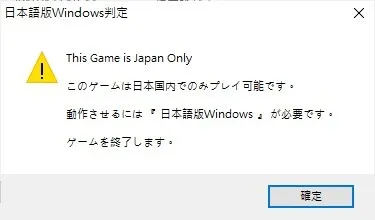

　　小問題小問題，筆者掏出了control panel，把PC地區換成了日本。

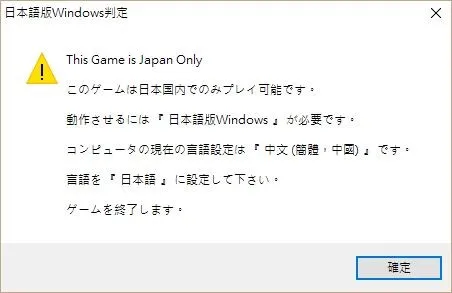

　　我諤諤，恁怎麽那麽囉嗦，日本人住在台灣不行嗎？？於是再次掏出control panel，把系統UI調成了日文。

　　於是，俺對著一整個control panel的日文片假名（英格老鼠音譯）陷入了沉思。尼瑪，我要把Microsoft的翻譯團隊拉出去玩坦克履帶！這麽翻譯恁是在消遣我呢？？玩游戲要緊，趕緊先打開游戲，，，

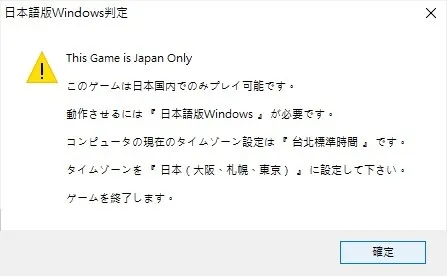

　　這開發壬是魔怔還是怎樣，，，，雖然説我用Locate Emulator來一瞬轉區也不是不行，但是要是我要把游戲拷貝給其他高雅人士的話他們該怎麽辦？我們得找一個更一步到胃的方法來橄欖這臭屁的驗證，，，

## 高雅方法

　　讓一個小粉紅在短時間内重獲思考能力的方法只有洗腦，把腦子接到完全潛行裝置NERvGEAR上，打開最大功率把update.img一瞬燒錄即可讓大腦快速升個114甚至是514級，程式也是一樣。當我看到高雅人士開著修改器對著Terraria狂改不止的時候俺就知道了，不就是直接把程式一瞬改爆嗎，，，於是就請高雅人士把修改器給我發了過來。
　　
## 工具

 * 🧠
 * Cheat Engine （高雅人士大吹特吹，説是全泰國最好用的修改器）
 * OllyDbg （用來生成修改版exe）

## 開始吧，奧利給！

　　任何程式的任何功能和執行階段在PC上面運行的時候都是極其地細分為一條條很細小的指令來指揮CPU動作的，這就叫彙編命令。一個典型的彙編命令事這樣子的。
　　
 * 相加 A坑 和 B坑 （坑裏面放有數字）
 * 從内存裏撈出 64號坑 到 B坑
 * 如果 A坑 等於 B坑
	 * 就跳轉到 114514號命令
 * 【114514號】幹點 什麽…

　　只要我們能在程式的彙編命令中找到判定地區的那一個，然後把他改掉，就可以實現我們的目的。

第一步：查看Galgame的彙編命令

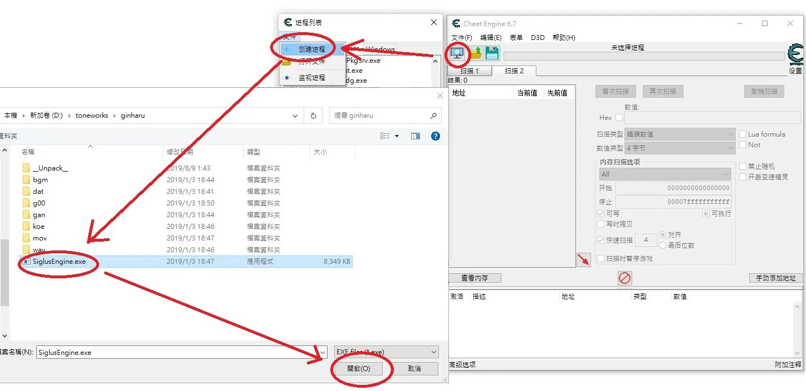

打開Cheat Engine，按照上圖步驟打開待修改的Galgame，操作后，很快我們就能看到下圖那樣的窗口。

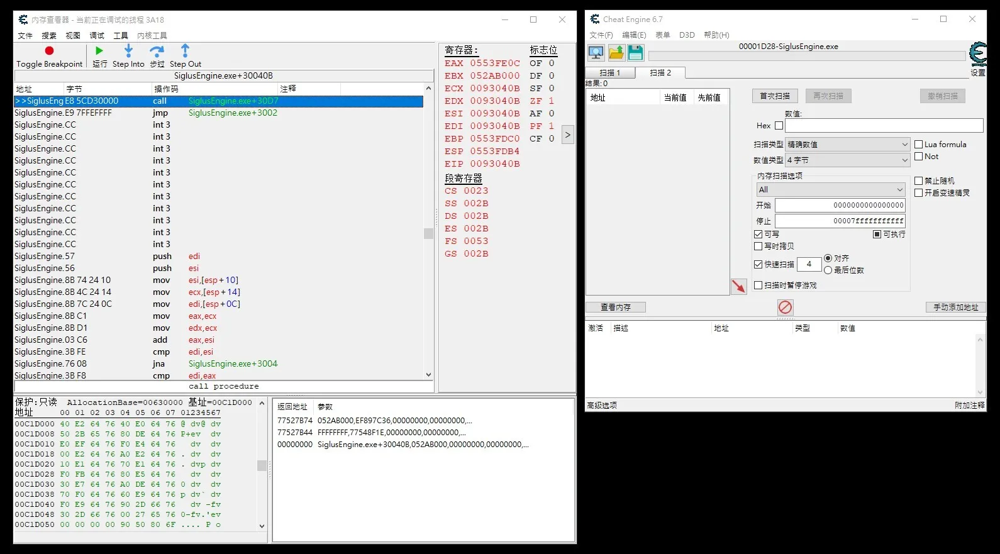

上圖中，右邊的窗口顯示的一行行的符號就是彙編命令力，現在我們要找出究竟是哪裏在判斷地區是否在日本。

　　彙編命令有成千上萬行，直接看肯定是看不懂的。我們意識到，在上圖彈出的錯誤提示框中，我們看到有一句話：
**“This Game is Japan only”**
或許我們可以通過搜索彙編命令中有沒有包含這一條字符串來確定彈出框的彙編命令的位置。

CE修改器自帶了字符串分析的功能，還能一并給出哪一行彙編命令使用了該字符串，十分方便。

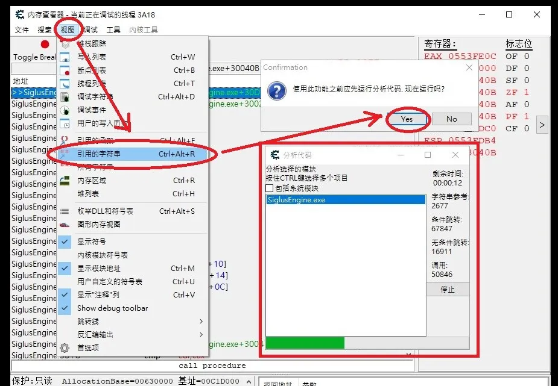

　　如上圖，開始查找字符串之前，CE要對整個彙編代碼進行胡亂分析。等進度條填滿后，會出現下圖的窗口。

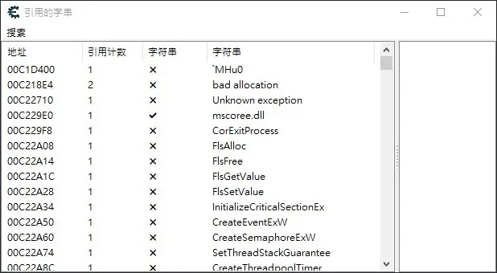

由於日文使用的Unicode編碼比ASCII編碼的英格老鼠文要複雜，并且很難在HEX瀏覽器中看到，
所以我們就只查找 **“This Game is Japan only” **。
看不懂這句話的就當我放屁，，，

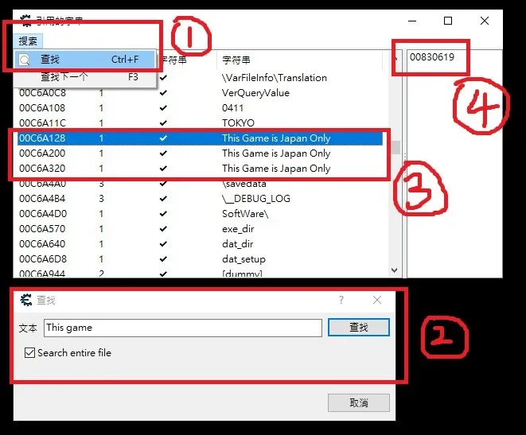

　　按照如圖步驟，我們要在搜索框中對“This game”進行全員搜爆，并且得到了三個結果（圖中央紅框），正好對應之前出現的三個報錯提示框。點擊其中一個，右上角就會顯示出在哪個位置使用過這個字符串。

我們得知是00830619號命令，雙擊牠，，，

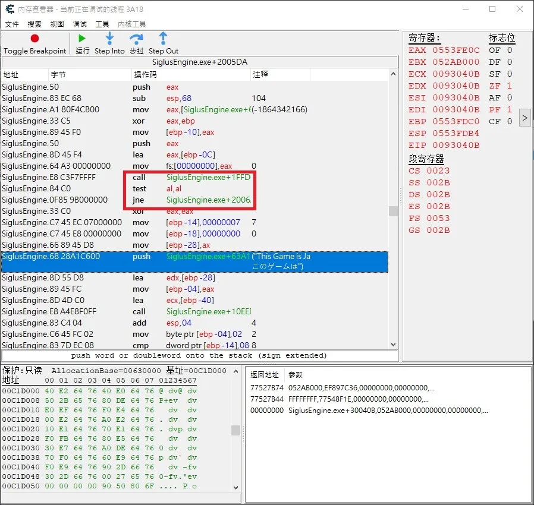

如圖，點擊后，CE自動定位到了引用到該字符串的位置，就是圖中藍色高亮処。翻譯成人話就是

 * 判斷是否在日本
    * 如果在日本，則直接跳過以下廢話，直接到114514號彙編命令
 * 把 “This Game is Japan only” 之類的字符串掏出來，準備好，奧里給！！
 * 通知該死的Windows系統，把這句話彈框顯示出來！！
 * 游戲告辭！
 * 【114514號】游戲繼續…

經過高雅觀察，起著判斷作用的命令就是紅框之中的命令，我們需要把第三行的JNE（判斷跳轉）改成JMP（無論如何全部都跳轉！）這樣子游戲就不會强退告辭力。

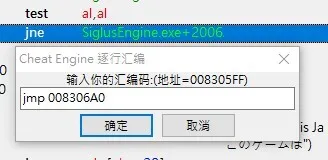

改成這樣子，按確定。

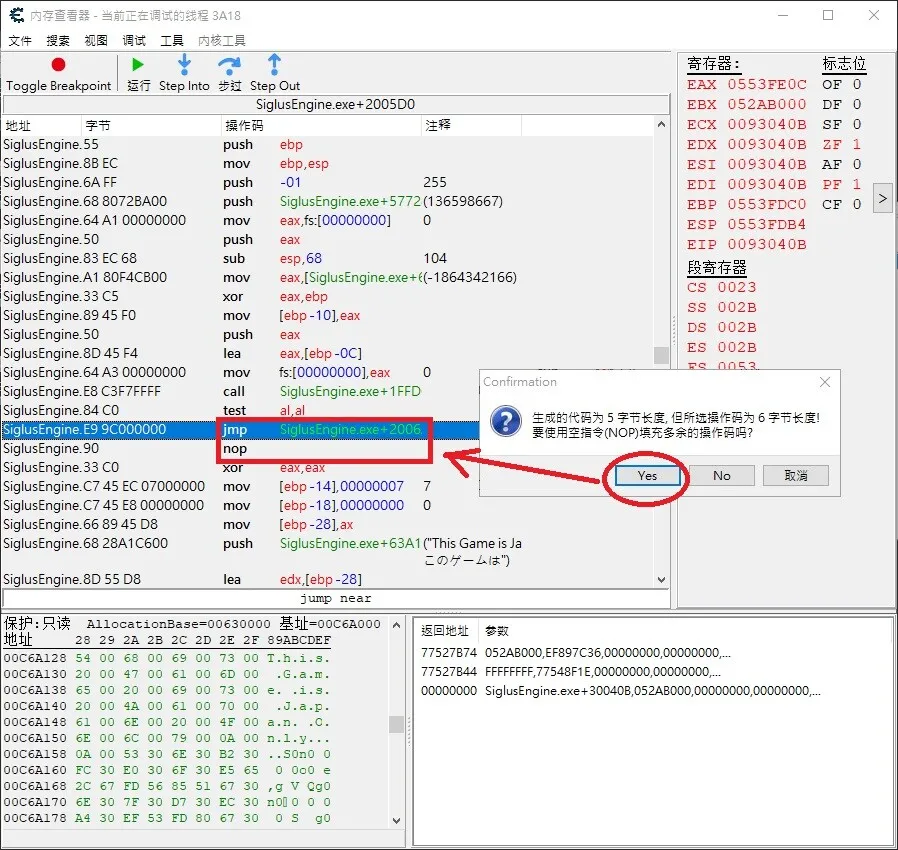

　　CE會提示恁，由於JMP和JNE在電腦裏面存放的時候大小空間是不一樣的，因此需要填充一個NOP（發呆），保證程式之後的彙編命令能夠繼續按序排列，，，此時點擊確定就好。

按照上面方法，繼續找到第二和第三処替換點，全部把JNE替換成JMP。

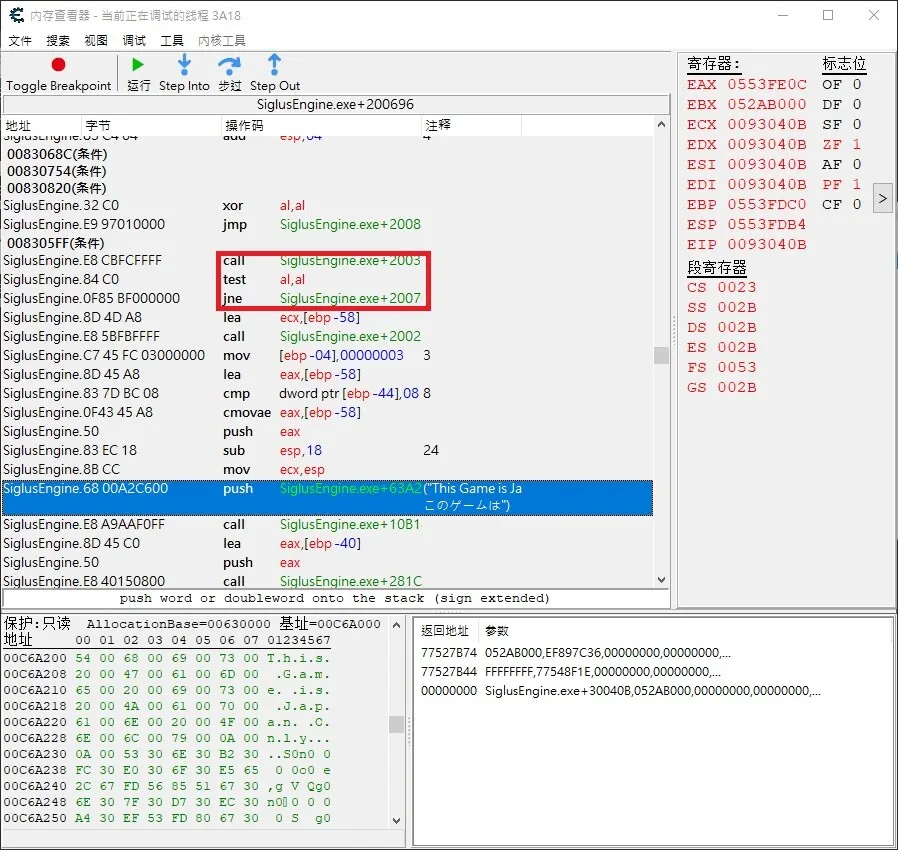

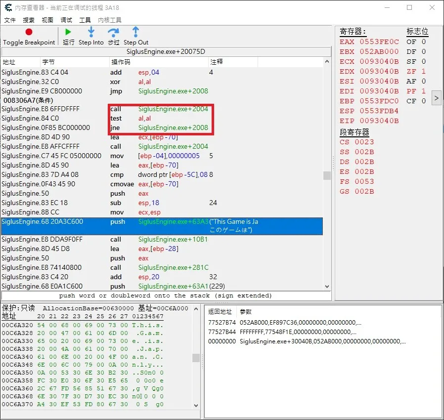

把以上三處改動點全部修改完畢以後，我們來嘗試運行程式。

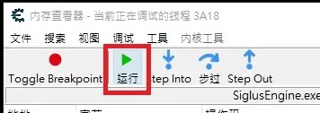

點擊這個運行按鈕。

奧利給，我們成功力！

　　以上方法修改完之後，效果只是在内存中，是臨時的，游戲一關閉就回歸虛無力。我們需要把修改好的彙編命令導出成exe文件，以便鑒賞和分享。

我們使用OllyDbg來生成修改的exe檔案。

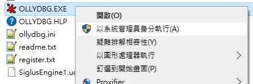

按照上圖用管理員打開OllyDbg（大概也念作奧利給Debug）。

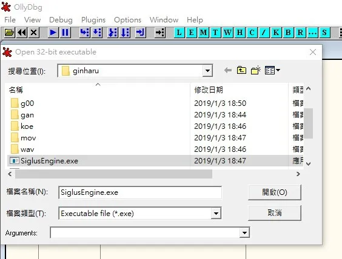

使用相似的方法打開要重建的exe。打開牠需要一點時間，請耐心等待進度條跑完。

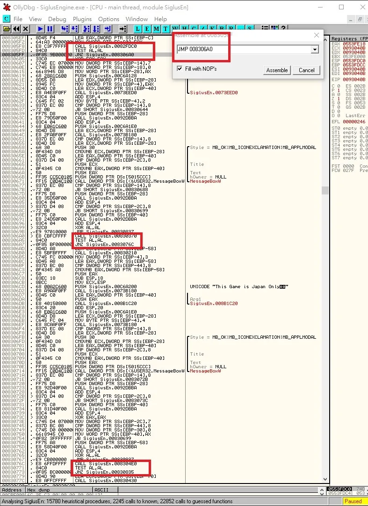

我們能夠看到和剛才相同的彙編命令，於是就在00830619號附近再次找到那三個修改點，進行同樣的修改。

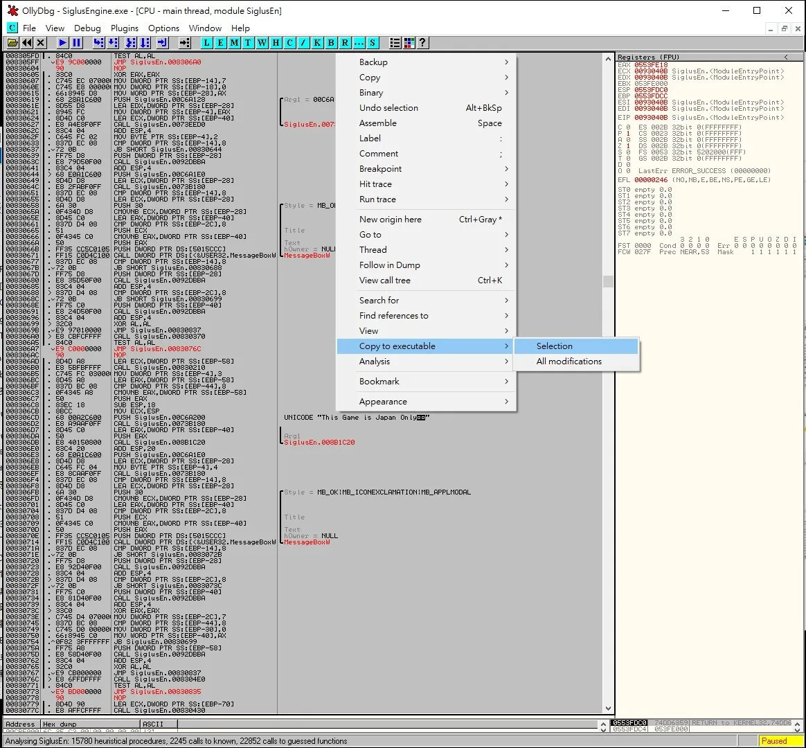

修改好后，滑鼠左鍵拖動選定修好的一大段彙編命令，右鍵點擊空白部位，選擇Copy to executable和Selection，，，

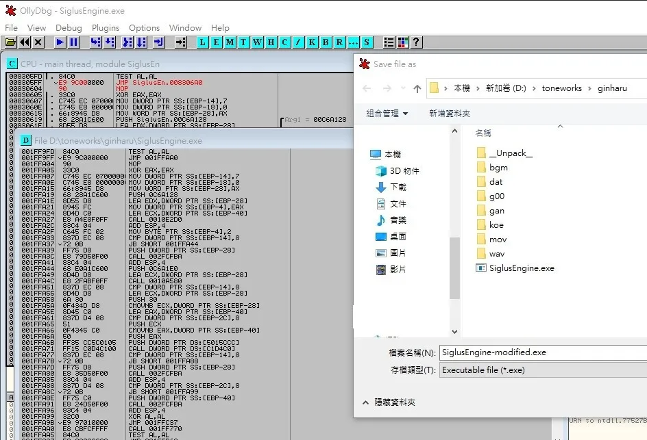

最後在新彈出的框框中右鍵空白処彈出菜單，點擊Save As，然後選擇一個地方（比如説原本的目錄）把修改版exe保存起來（記得名字不能和原來的一樣）。

嘗試運行修改過的exe檔，完全O寄霸K，，，

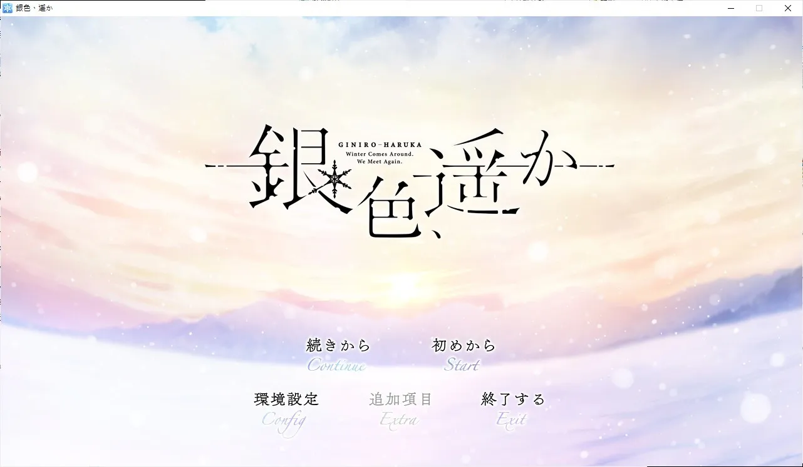

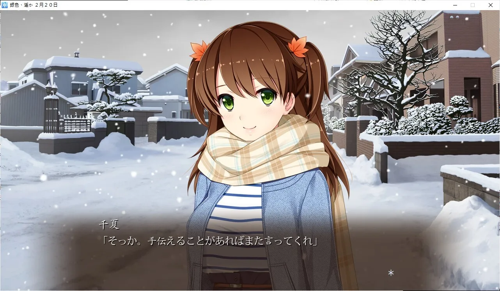

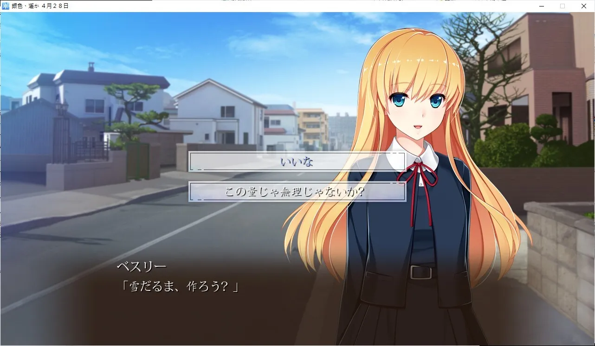

獨樂樂不如衆樂樂，和其他高雅人士一起分享真人快打的快樂吧！

## 後記

　　本教程對於 VISUAL ARTS 社的SiglusEngine脚本引擎是有效的，但是卻不是萬能的。由於碰巧本Galgame只有地區驗證沒有DVD驗證，所以能用雕蟲小技繞開，，，但是對於有光碟驗證的高雅新Galgame，比如『[🔗️月の彼方で逢いましょう](http://toneworks.product.co.jp/tsukikana/)』

之類的Galgame，技術力過於低下的俺事沒法攻略滴，，，這時候就請購買正版或者去找神秘人士發佈的補丁力。

奧利給，月的彼方也是一如既往地精緻嗷。

