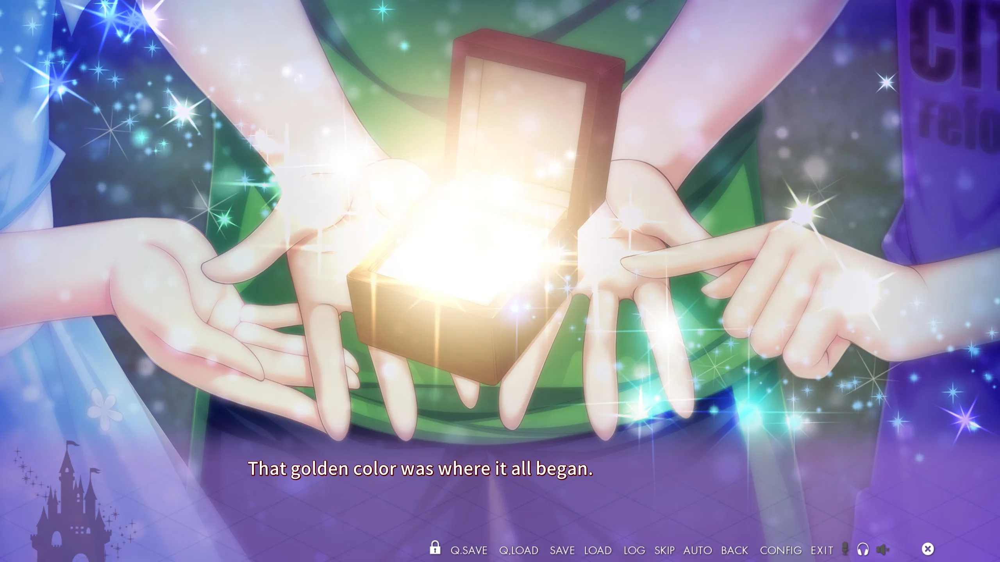

爲了讓文章更加的豐富多彩，我將用過的一些代碼片段，步驟等放在這裏，需要時可隨意 CV，，，


注意，寫文章要腳踏實地地組織文字，這裏的技巧不過是錦上添花。

## 1. HTML 代碼

本博客自帶 bootstrap 框架，合適的 bootstrap 用法都能用，

詳細請看 https://getbootstrap.com/docs/4.0/components/

不想看的話直接看下面。

### 只有手機版才換行

這段話講了那麼多，那麼長，<br class="d-md-none">要是不換行在手機上文字就會擠成一團，
但是電腦上還好，<br class="d-md-none">所以要使用僅限手機版換行。

用法：插入

```
<br class="d-md-none">
```

### 左右滑動圖片展示框

詳細 https://getbootstrap.com/docs/4.0/components/carousel/

<div id="carouselExampleIndicators-screen" class="carousel slide" data-ride="carousel">
  <ol class="carousel-indicators">
    <li data-target="#carouselExampleIndicators-screen" data-slide-to="0" class="active"></li>
    <li data-target="#carouselExampleIndicators-screen" data-slide-to="1"></li>
    <li data-target="#carouselExampleIndicators-screen" data-slide-to="2"></li>
    <li data-target="#carouselExampleIndicators-screen" data-slide-to="3"></li>
  </ol>
  <div class="carousel-inner">
    <div class="carousel-item active">
      
    </div>
    <div class="carousel-item">
      
    </div>
    <div class="carousel-item">
      
    </div>
    <div class="carousel-item">
      
    </div>
  </div>
  <a class="carousel-control-prev" href="#carouselExampleIndicators-screen" role="button" data-slide="prev">
    <span class="carousel-control-prev-icon" aria-hidden="true"></span>
    <span class="sr-only">Previous</span>
  </a>
  <a class="carousel-control-next" href="#carouselExampleIndicators-screen" role="button" data-slide="next">
    <span class="carousel-control-next-icon" aria-hidden="true"></span>
    <span class="sr-only">Next</span>
  </a>
</div>

寫法：注意 id 必須唯一，此處爲 carouselExampleIndicators-screen，若要修改出現的地方全都要修改。

```
<div id="carouselExampleIndicators-screen" class="carousel slide" data-ride="carousel">
  <ol class="carousel-indicators">
    <li data-target="#carouselExampleIndicators-screen" data-slide-to="0" class="active"></li>
    <li data-target="#carouselExampleIndicators-screen" data-slide-to="1"></li>
    <li data-target="#carouselExampleIndicators-screen" data-slide-to="2"></li>
    <li data-target="#carouselExampleIndicators-screen" data-slide-to="3"></li>
  </ol>
  <div class="carousel-inner">
    <div class="carousel-item active">
      
    </div>
    <div class="carousel-item">
      
    </div>
    <div class="carousel-item">
      
    </div>
    <div class="carousel-item">
      
    </div>
  </div>
  <a class="carousel-control-prev" href="#carouselExampleIndicators-screen" role="button" data-slide="prev">
    <span class="carousel-control-prev-icon" aria-hidden="true"></span>
    <span class="sr-only">Previous</span>
  </a>
  <a class="carousel-control-next" href="#carouselExampleIndicators-screen" role="button" data-slide="next">
    <span class="carousel-control-next-icon" aria-hidden="true"></span>
    <span class="sr-only">Next</span>
  </a>
</div>
```

### 視頻畫質切換菜單

在 mylib-async.js 實現

<div class='vidcontainer'>
   <select class='qualitypick' autocomplete='off'>
      <option selected>480p</option>
      <option>1080p</option>
   </select>
   <video controls preload="metadata" width='100%' poster="../image/Kinkoi/op.jpg">
      <source label="480p" src="https://cdn.akamai.steamstatic.com/steam/apps/256817690/movie480.mp4" type="video/mp4">
      <source label="1080p" src="https://cdn.akamai.steamstatic.com/steam/apps/256817690/movie_max.mp4" type="video/mp4" >
<p> To view this video please enable JavaScript</p>
   </video>
</div>

用法：請直接抄，放置多個 src

```
<div class='vidcontainer'>
   <select class='qualitypick' autocomplete='off'>
      <option selected>480p</option>
      <option>1080p</option>
   </select>
   <video controls preload="metadata" width='100%' poster="../image/Kinkoi/op.jpg">
      <source label="480p" src="https://cdn.akamai.steamstatic.com/steam/apps/256817690/movie480.mp4" type="video/mp4">
      <source label="1080p" src="https://cdn.akamai.steamstatic.com/steam/apps/256817690/movie_max.mp4" type="video/mp4" >
<p> To view this video please enable JavaScript</p>
   </video>
</div>
```

### Galgame 路線圖

在 mylib-async.js 實現

<div class="route-map">
    <x-row start-from="3">
        <x-col src="../image/SchoolDaysHQ/map/0-3.webp"/>
        <x-col src="../image/SchoolDaysHQ/map/0-4.webp"/>
        <x-col src="../image/SchoolDaysHQ/map/0-5.webp"/>
    </x-row>
    <x-row>
        <x-col src="../image/SchoolDaysHQ/map/1-0.webp"/ default>
        <x-col src="../image/SchoolDaysHQ/map/1-1.webp"/>
        <x-col src="../image/SchoolDaysHQ/map/1-2.webp"/>
        <x-col src="../image/SchoolDaysHQ/map/1-3.webp"/>
        <x-col src="../image/SchoolDaysHQ/map/1-4.webp"/>
        <x-col src="../image/SchoolDaysHQ/map/1-5.webp"/>
    </x-row>
    <x-row start-from="2">
        <x-col src="../image/SchoolDaysHQ/map/2-2.webp"/>
        <x-col src="../image/SchoolDaysHQ/map/2-3.webp"/>
        <x-col src="../image/SchoolDaysHQ/map/2-4.webp"/>
        <x-col src="../image/SchoolDaysHQ/map/2-5.webp"/>
    </x-row>
    <x-row start-from="3">
        <x-col src="../image/SchoolDaysHQ/map/3-3.webp"/>
        <x-col src="../image/SchoolDaysHQ/map/3-4.webp"/>
        <x-col src="../image/SchoolDaysHQ/map/3-5.webp"/>
    </x-row>
    <p> JavaScript 錯誤，無法顯示路線圖</p>
</div>

用法：將圖片填入網格，對比下面的圖片和代碼你就明白了。default 是路線圖的起點。


```
<div class="route-map">
    <x-row start-from="3">
        <x-col src="../image/SchoolDaysHQ/map/0-3.webp"/>
        <x-col src="../image/SchoolDaysHQ/map/0-4.webp"/>
        <x-col src="../image/SchoolDaysHQ/map/0-5.webp"/>
    </x-row>
    <x-row>
        <x-col src="../image/SchoolDaysHQ/map/1-0.webp"/ default>
        <x-col src="../image/SchoolDaysHQ/map/1-1.webp"/>
        <x-col src="../image/SchoolDaysHQ/map/1-2.webp"/>
        <x-col src="../image/SchoolDaysHQ/map/1-3.webp"/>
        <x-col src="../image/SchoolDaysHQ/map/1-4.webp"/>
        <x-col src="../image/SchoolDaysHQ/map/1-5.webp"/>
    </x-row>
    <x-row start-from="2">
        <x-col src="../image/SchoolDaysHQ/map/2-2.webp"/>
        <x-col src="../image/SchoolDaysHQ/map/2-3.webp"/>
        <x-col src="../image/SchoolDaysHQ/map/2-4.webp"/>
        <x-col src="../image/SchoolDaysHQ/map/2-5.webp"/>
    </x-row>
    <x-row start-from="3">
        <x-col src="../image/SchoolDaysHQ/map/3-3.webp"/>
        <x-col src="../image/SchoolDaysHQ/map/3-4.webp"/>
        <x-col src="../image/SchoolDaysHQ/map/3-5.webp"/>
    </x-row>
    <p> JavaScript 錯誤，無法顯示路線圖</p>
</div>
```

### 文字和圖片疊加

請直接複製並自己調整

<style>
.text-outline {
    text-shadow:
    -2px -2px 0 #FFF,
    2px -2px 0 #FFF,
    -2px 2px 0 #FFF,
    2px 2px 0 #FFF;
}
text-outline-black {
    text-shadow:
    -2px -2px 0 #000,
    2px -2px 0 #000,
    -2px 2px 0 #000,
    2px 2px 0 #000;
}
</style>
<div class="card bg-transparent text-dark border-warning col-lg-8 my-2">

<div class="card-img-overlay">
<div class="position-absolute" style="bottom:0">
<h5 class="text-danger text-outline font-italic font-weight-bold" style="font-size:200%;">
Sylvia le<br>Cruzcrown<br>Sortilège<br>Sisua
</h5>
<p><mark>
簡稱 <strong>希爾薇</strong>，是神必國家 <em>Sortilège</em> 的公主，<br>
在日本享受國賓待遇。<br>
但是她從來不擺架子，總是天真爛漫，<br>
喜歡亂跑，吃東西，逃課。
</mark></p>
</div>
</div>
</div>

```
<style>
.text-outline {
    text-shadow:
    -2px -2px 0 #FFF,
    2px -2px 0 #FFF,
    -2px 2px 0 #FFF,
    2px 2px 0 #FFF;
}
text-outline-black {
    text-shadow:
    -2px -2px 0 #000,
    2px -2px 0 #000,
    -2px 2px 0 #000,
    2px 2px 0 #000;
}
</style>
<div class="card bg-transparent text-dark border-warning col-lg-8 my-2">
    
    <div class="card-img-overlay">
        <div class="position-absolute" style="bottom:0">
            <h5 class="text-danger text-outline font-italic font-weight-bold" style="font-size:200%;">
                Sylvia le<br>Cruzcrown<br>Sortilège<br>Sisua
            </h5>
            <p><mark>
                簡稱 <strong>希爾薇</strong>，是神必國家 <em>Sortilège</em> 的公主，<br>
                在日本享受國賓待遇。<br>
                但是她從來不擺架子，總是天真爛漫，<br>
                喜歡亂跑，吃東西，逃課。
            </mark></p>
        </div>
    </div>
</div>
```

外星語言 HTML 隨便寫點

## 1. 編碼格式和參數

寫在前面：這裏測試的所有視頻我覺得看上去都一樣，在小窗上觀看更是如此。在視頻源並不是那麼高清的時候，可以合理地犧牲畫質來換取傳送效率。

測試用的視頻是 Sakura No Mori 2 的 OP 動畫，先放兩個 steam 上的源。

webm, VP8, 1080p, 長度 2:04, 87 MB。

<video  controls width='100%' preload="metadata"  >
<source src="https://cdn.cloudflare.steamstatic.com/steam/apps/256744846/movie_max.webm" type="video/webm"/>
<p> To view this video please enable JavaScript</p></video>

mp4, H264, 1080p, 長度 2:04, 88 MB。

<video  controls width='100%' preload="metadata"  >
<source  src="https://cdn.cloudflare.steamstatic.com/steam/apps/256744846/movie_max.mp4" type="video/mp4"/>
<p> To view this video please enable JavaScript</p></video>

遊戲本身是 720p，因此把 OP 嗯力編碼成 1080p 意義不大，而且這兩個視頻觀感上就像是 720p。

瀏覽器在遇到此類視頻時，先會加載其元數據，拿到元數據後才能夠顯示進度，並且加載視頻本體。

若是元數據不在文件的一開頭，則瀏覽器就必須要到處試探，發出多個請求直到找到元數據的位置，從而導致加載困難或者加載失敗。這就是 HandBrake 中要啟用 mp4 文件的「對 web 優化」選項的必要性。

## 2. 檔案格式

mp4, H264, 720p, 60fps, 長度 1:57, 28 MB, HandBrake 品質 27, 對 web 優化

<video  controls width='100%' preload="metadata"  >
<source  src="https://bitbucket.org/sa-ya/my-static/raw/75d65c961e5366b706c20e50a4ff6be5c65e546e/note-webvideo/op-h264-cpu-27.mp4" type="video/mp4"/>
<p> To view this video please enable JavaScript</p></video>

mp4, H264, 720p, 30fps, 長度 1:57, 57 MB, HandBrake 品質 21, 對 web 優化

<video  controls width='100%' preload="metadata"  >
<source  src="https://bitbucket.org/sa-ya/my-static/raw/75d65c961e5366b706c20e50a4ff6be5c65e546e/note-webvideo/op-h264-cpu-30fps-21.mp4" type="video/mp4"/>
<p> To view this video please enable JavaScript</p></video>

webm, VP9, 720p, 60fps, 長度 1:57, 77 MB, HandBrake 品質 27

<video  controls width='100%' preload="metadata"  >
<source  src="https://bitbucket.org/sa-ya/my-static/raw/75d65c961e5366b706c20e50a4ff6be5c65e546e/note-webvideo/op-vp9-cpu-60fps-27.webm" type="video/mp4"/>
<p> To view this video please enable JavaScript</p></video>

除了上面三個樣本之外，我還做了其他的測試。測試中都表現出 H264 的畫質和體積都優於 VP9。

而且 VP9 的編碼非常緩慢，網上查閱顯示 VP9 的主要用途是 4K 直播，所以不可把 VP9 作爲萬能靈藥。

最後，H264 的編碼器有 Fast medium slow 三種預置，在必要的時候能夠用耐心換來畫質和體積的優化（設爲 Slow）。

## 3. 結論

樣本不足，無法得出結論。

但是俺會傾向使用 H264, MP4, 品質 25-30, 爲 web 優化。