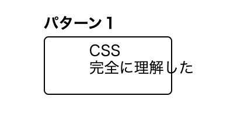
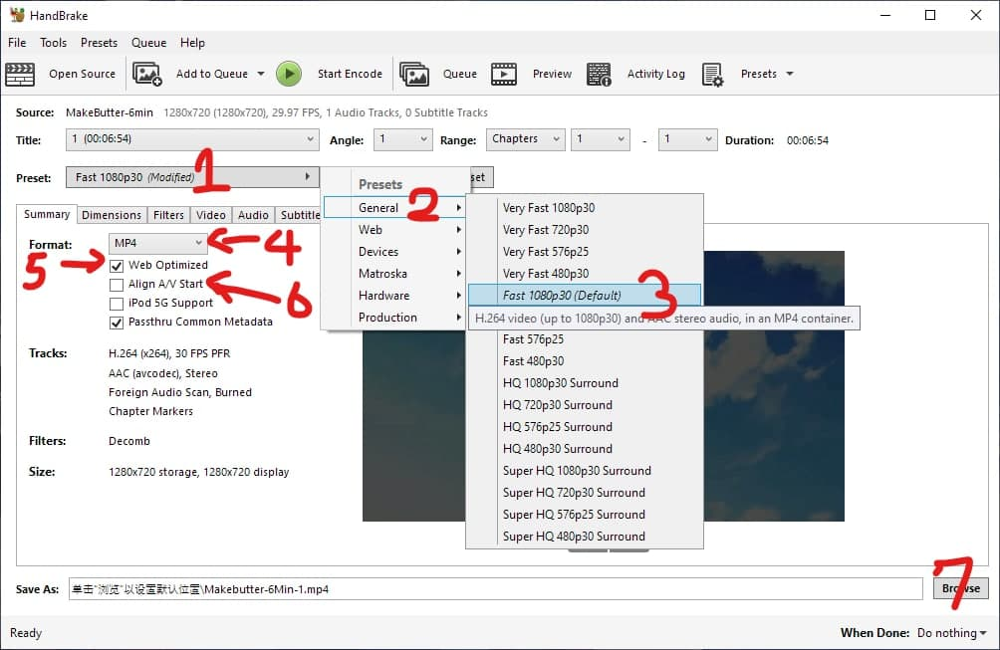
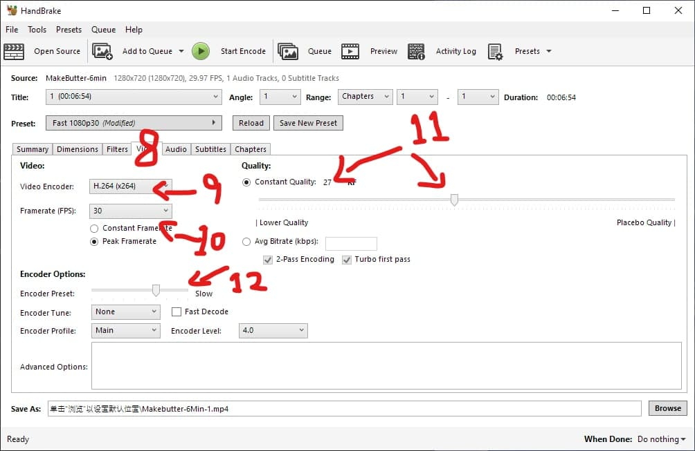
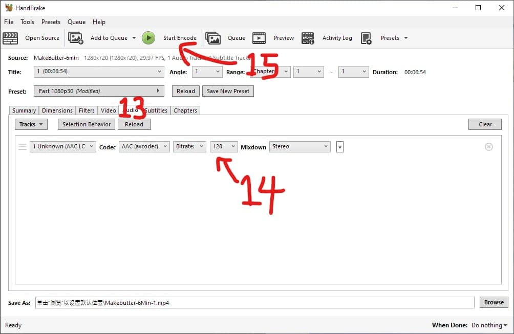

爲了讓文章更加的豐富多彩，我將用過的一些代碼片段，步驟等放在這裏，需要時可隨意 CV，，，



注意，寫文章要腳踏實地地組織文字，這裏的技巧不過是錦上添花。

## 1. HTML 代碼

本博客自帶 bootstrap 框架，合適的 bootstrap 用法都能用，

詳細請看 https://getbootstrap.com/docs/4.0/components/

不想看的話直接看下面。

### 只有手機版才換行

這段話講了那麼多，那麼長，<br class="d-md-none">要是不換行在手機上文字就會擠成一團，
但是電腦上還好，<br class="d-md-none">所以要使用僅限手機版換行。

用法：插入

```
<br class="d-md-none">
```

### 左右滑動圖片展示框

詳細 https://getbootstrap.com/docs/4.0/components/carousel/

<div id="carouselExampleIndicators-screen" class="carousel slide" data-ride="carousel">
  <ol class="carousel-indicators">
    <li data-target="#carouselExampleIndicators-screen" data-slide-to="0" class="active"></li>
    <li data-target="#carouselExampleIndicators-screen" data-slide-to="1"></li>
    <li data-target="#carouselExampleIndicators-screen" data-slide-to="2"></li>
    <li data-target="#carouselExampleIndicators-screen" data-slide-to="3"></li>
  </ol>
  <div class="carousel-inner">
    <div class="carousel-item active">
      
    </div>
    <div class="carousel-item">
      
    </div>
    <div class="carousel-item">
      
    </div>
    <div class="carousel-item">
      
    </div>
  </div>
  <a class="carousel-control-prev" href="#carouselExampleIndicators-screen" role="button" data-slide="prev">
    <span class="carousel-control-prev-icon" aria-hidden="true"></span>
    <span class="sr-only">Previous</span>
  </a>
  <a class="carousel-control-next" href="#carouselExampleIndicators-screen" role="button" data-slide="next">
    <span class="carousel-control-next-icon" aria-hidden="true"></span>
    <span class="sr-only">Next</span>
  </a>
</div>

寫法：注意 id 必須唯一，此處爲 carouselExampleIndicators-screen，若要修改出現的地方全都要修改。

```
<div id="carouselExampleIndicators-screen" class="carousel slide" data-ride="carousel">
  <ol class="carousel-indicators">
    <li data-target="#carouselExampleIndicators-screen" data-slide-to="0" class="active"></li>
    <li data-target="#carouselExampleIndicators-screen" data-slide-to="1"></li>
    <li data-target="#carouselExampleIndicators-screen" data-slide-to="2"></li>
    <li data-target="#carouselExampleIndicators-screen" data-slide-to="3"></li>
  </ol>
  <div class="carousel-inner">
    <div class="carousel-item active">
      
    </div>
    <div class="carousel-item">
      
    </div>
    <div class="carousel-item">
      
    </div>
    <div class="carousel-item">
      
    </div>
  </div>
  <a class="carousel-control-prev" href="#carouselExampleIndicators-screen" role="button" data-slide="prev">
    <span class="carousel-control-prev-icon" aria-hidden="true"></span>
    <span class="sr-only">Previous</span>
  </a>
  <a class="carousel-control-next" href="#carouselExampleIndicators-screen" role="button" data-slide="next">
    <span class="carousel-control-next-icon" aria-hidden="true"></span>
    <span class="sr-only">Next</span>
  </a>
</div>
```

### 視頻畫質切換菜單

在 mylib_async.js 實現

<div class='vidcontainer'>
   <select class='qualitypick' autocomplete='off'>
      <option selected>480p</option>
      <option>1080p</option>
   </select>
   <video controls preload="metadata" width='100%' poster="../image/Kinkoi/op.jpg">
      <source label="480p" src="https://cdn.akamai.steamstatic.com/steam/apps/256817690/movie480.mp4" type="video/mp4">
      <source label="1080p" src="https://cdn.akamai.steamstatic.com/steam/apps/256817690/movie_max.mp4" type="video/mp4" >
<p> To view this video please enable JavaScript</p>
   </video>
</div>

用法：請直接抄，放置多個 src

```
<div class='vidcontainer'>
   <select class='qualitypick' autocomplete='off'>
      <option selected>480p</option>
      <option>1080p</option>
   </select>
   <video controls preload="metadata" width='100%' poster="../image/Kinkoi/op.jpg">
      <source label="480p" src="https://cdn.akamai.steamstatic.com/steam/apps/256817690/movie480.mp4" type="video/mp4">
      <source label="1080p" src="https://cdn.akamai.steamstatic.com/steam/apps/256817690/movie_max.mp4" type="video/mp4" >
<p> To view this video please enable JavaScript</p>
   </video>
</div>
```

### Galgame 路線圖

在 mylib_async.js 實現

<div class="route-map">
    <x-row start-from="3">
        <x-col src="../image/note-snipset/map/0-3.webp"/>
        <x-col src="../image/note-snipset/map/0-4.webp"/>
        <x-col src="../image/note-snipset/map/0-5.webp"/>
    </x-row>
    <x-row>
        <x-col src="../image/note-snipset/map/1-0.webp"/ default>
        <x-col src="../image/note-snipset/map/1-1.webp"/>
        <x-col src="../image/note-snipset/map/1-2.webp"/>
        <x-col src="../image/note-snipset/map/1-3.webp"/>
        <x-col src="../image/note-snipset/map/1-4.webp"/>
        <x-col src="../image/note-snipset/map/1-5.webp"/>
    </x-row>
    <x-row start-from="2">
        <x-col src="../image/note-snipset/map/2-2.webp"/>
        <x-col src="../image/note-snipset/map/2-3.webp"/>
        <x-col src="../image/note-snipset/map/2-4.webp"/>
        <x-col src="../image/note-snipset/map/2-5.webp"/>
    </x-row>
    <x-row start-from="3">
        <x-col src="../image/note-snipset/map/3-3.webp"/>
        <x-col src="../image/note-snipset/map/3-4.webp"/>
        <x-col src="../image/note-snipset/map/3-5.webp"/>
    </x-row>
    <p> JavaScript 錯誤，無法顯示路線圖</p>
</div>

用法：將圖片填入網格，對比下面的圖片和代碼你就明白了。default 是路線圖的起點。


```
<div class="route-map">
    <x-row start-from="3">
        <x-col src="../image/SchoolDaysHQ/map/0-3.webp"/>
        <x-col src="../image/SchoolDaysHQ/map/0-4.webp"/>
        <x-col src="../image/SchoolDaysHQ/map/0-5.webp"/>
    </x-row>
    <x-row>
        <x-col src="../image/SchoolDaysHQ/map/1-0.webp"/ default>
        <x-col src="../image/SchoolDaysHQ/map/1-1.webp"/>
        <x-col src="../image/SchoolDaysHQ/map/1-2.webp"/>
        <x-col src="../image/SchoolDaysHQ/map/1-3.webp"/>
        <x-col src="../image/SchoolDaysHQ/map/1-4.webp"/>
        <x-col src="../image/SchoolDaysHQ/map/1-5.webp"/>
    </x-row>
    <x-row start-from="2">
        <x-col src="../image/SchoolDaysHQ/map/2-2.webp"/>
        <x-col src="../image/SchoolDaysHQ/map/2-3.webp"/>
        <x-col src="../image/SchoolDaysHQ/map/2-4.webp"/>
        <x-col src="../image/SchoolDaysHQ/map/2-5.webp"/>
    </x-row>
    <x-row start-from="3">
        <x-col src="../image/SchoolDaysHQ/map/3-3.webp"/>
        <x-col src="../image/SchoolDaysHQ/map/3-4.webp"/>
        <x-col src="../image/SchoolDaysHQ/map/3-5.webp"/>
    </x-row>
    <p> JavaScript 錯誤，無法顯示路線圖</p>
</div>
```

### 文字和圖片疊加

請直接複製並自己調整

<style>
.text-outline {
    text-shadow:
    -2px -2px 0 #FFF,
    2px -2px 0 #FFF,
    -2px 2px 0 #FFF,
    2px 2px 0 #FFF;
}
text-outline-black {
    text-shadow:
    -2px -2px 0 #000,
    2px -2px 0 #000,
    -2px 2px 0 #000,
    2px 2px 0 #000;
}
</style>
<div class="card bg-transparent text-dark border-warning col-lg-8 my-2">

<div class="card-img-overlay">
<div class="position-absolute" style="bottom:0">
<h5 class="text-danger text-outline font-italic font-weight-bold" style="font-size:200%;">
Sylvia le<br>Cruzcrown<br>Sortilège<br>Sisua
</h5>
<p><mark>
簡稱 <strong>希爾薇</strong>，是神必國家 <em>Sortilège</em> 的公主，<br>
在日本享受國賓待遇。<br>
但是她從來不擺架子，總是天真爛漫，<br>
喜歡亂跑，吃東西，逃課。
</mark></p>
</div>
</div>
</div>

```
<style>
.text-outline {
    text-shadow:
    -2px -2px 0 #FFF,
    2px -2px 0 #FFF,
    -2px 2px 0 #FFF,
    2px 2px 0 #FFF;
}
text-outline-black {
    text-shadow:
    -2px -2px 0 #000,
    2px -2px 0 #000,
    -2px 2px 0 #000,
    2px 2px 0 #000;
}
</style>
<div class="card bg-transparent text-dark border-warning col-lg-8 my-2">
    
    <div class="card-img-overlay">
        <div class="position-absolute" style="bottom:0">
            <h5 class="text-danger text-outline font-italic font-weight-bold" style="font-size:200%;">
                Sylvia le<br>Cruzcrown<br>Sortilège<br>Sisua
            </h5>
            <p><mark>
                簡稱 <strong>希爾薇</strong>，是神必國家 <em>Sortilège</em> 的公主，<br>
                在日本享受國賓待遇。<br>
                但是她從來不擺架子，總是天真爛漫，<br>
                喜歡亂跑，吃東西，逃課。
            </mark></p>
        </div>
    </div>
</div>
```

外星語言 HTML 隨便寫點

### 字體變大

<p style="font-size:250%">你好</p>

```
<p style="font-size:250%">你好</p>
```

### 醒目提示框 

<div class="alert alert-success" role="alert">
  <p class="alert-heading" style="font-size:150%;">內卷！</p>
  <p class="mb-0">這遊戲 CG 有 2k 分辨率，誇張</p>
</div>

```
<div class="alert alert-success" role="alert">
  <p class="alert-heading" style="font-size:150%;">內卷！</p>
  <p class="mb-0">這遊戲 CG 有 2k 分辨率，誇張</p>
</div>
```

### 點擊以後跳出新窗口打開的連結

<a href="/music/" target="_blank">🔗️Galgame 金曲</a>

target="_blank" 是重點。

```
<a href="/music/" target="_blank">🔗️Galgame 金曲</a>
```

### 插入 Steam

<iframe src="https://store.steampowered.com/widget/1277940/" frameborder="0" width="100%" height="200"></iframe>

```
<iframe src="https://store.steampowered.com/widget/遊戲的 ID/" frameborder="0" width="100%" height="200"></iframe>
```

## 2. JS 小技巧

### 召喚 Toast

在 mylib_async.js 實現

<script>
function t(){insertToast('success', '你好', 3000);}
</script>

<a href="javascript:;" class="btn btn-info" onclick="t()">召喚 Toast</a>

```
insertToast('success', 'HTML 內容', 顯示毫秒);
```

### 設置背景圖片

<script>
function b(){
    let target = document.querySelectorAll('.row.nomargin-x')[0];
    target.style['background'] = "url('../image/Tsukikana/night.webp') no-repeat fixed center";
    target.style['background-size'] = 'cover';
    let board = document.getElementById('board');
    board.style['background-color'] = 'rgba(20, 20, 40, 0.80)';
    // 強制暗色模式
    setInterval(() => document.documentElement.setAttribute('data-user-color-scheme', 'dark'), 1000);
    insertToast('dark', '已啟用暗色模式', 2000);
}
</script>

<a href="javascript:;" class="btn btn-info" onclick="b()">測試一下</a>

文章最後插入

```
window.addEventListener('DOMContentLoaded', function() {
    // 設置背景
    let target = document.querySelectorAll('.row.nomargin-x')[0];
    target.style['background'] = "url('../image/Tsukikana/night.webp') no-repeat fixed center";
    target.style['background-size'] = 'cover';
    // 設置透明度
    let board = document.getElementById('board');
    board.style['background-color'] = 'rgba(20, 20, 40, 0.80)';
    // 強制暗色模式
    setInterval(() => document.documentElement.setAttribute('data-user-color-scheme', 'dark'), 1000);
    insertToast('dark', '已啟用暗色模式', 2000);
});
```

## 3. 新增 Galgame 金曲

請看 /music/music.json

格式

```
[
    obj,
    obj,
    obj,
    obj
]
```

obj 的格式是

```
{
    "name": "Never forget",
    "artist": "電気式華憐音楽集団",
    "src": "音樂文件.mp3",
    "poster": "專輯封面.jpg",
    "lyric": "[00:13.27]見上げた刹那に振り....",
    "details": "簡短的說明... <a href='/article/56863.html' target='_blank'>🔗️查看文章</a>",
    "game": "來自的遊戲",
    "netease": 網易雲音樂的 ID, 
    "qq": "QQ 音樂的 ID",
    "kugou": ""
}
```

把這個插入到 json 的最底下，注意不要漏逗號，不要寫錯，寫完自己測試一下

## 4. 如何壓縮視頻

安裝 HandBrake 軟件，打開以後把要壓縮的視頻拖進去，然後







### 如何上傳視頻

懂得都董

