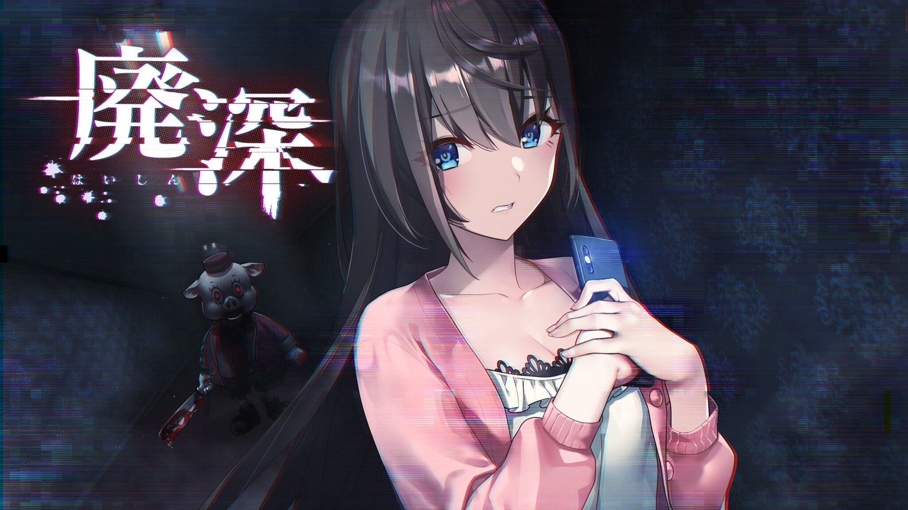
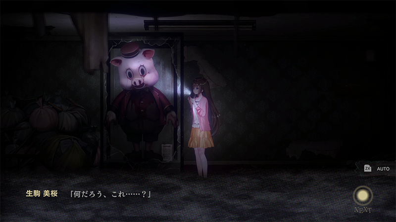
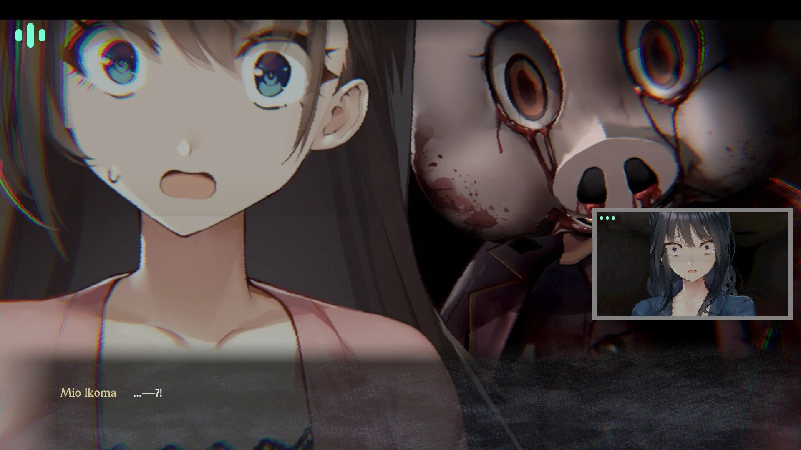
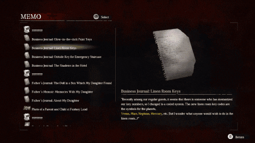
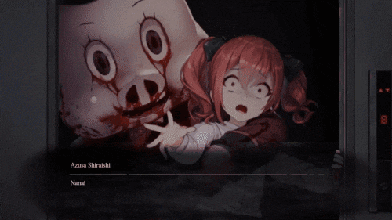
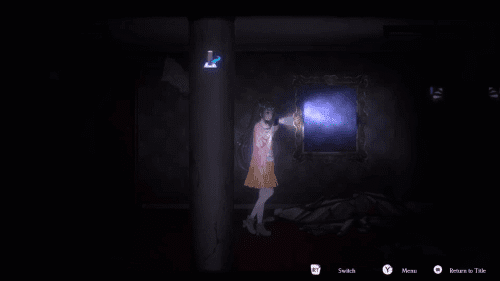
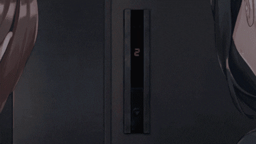
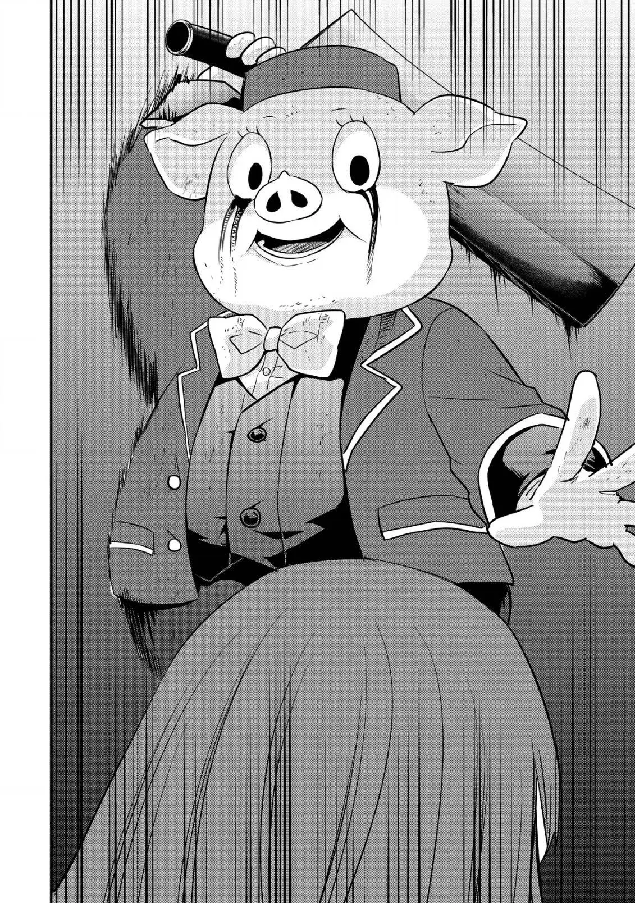

`作者：木衛一`

生放主生驹、樱井和白石三人前往知名恐怖景点「伊邪那美酒店」拍摄探索影片，遭遇恐怖追殺

| 資訊一覽     |                 |
| :----------- | :------------------------------------ |
| **開發商**   | qureate, Orgesta Inc. |
| **企劃**   | Yujiro Usuda |
| **故事設計** |C-Garden,Inc.|
| **角色設計** |Waon Inui|
| **遊戲時長** | 2~6  小時        |
| **類型**     | 恐怖    |
| **難度**     | 中 |
| **分級**     | R-15     |

## 故事開場

「奈奈频道」是**櫻井奈奈**，**白石梓**和**生駒美櫻**共同運營的Youtube頻道。爲了實現頻道一百萬訂閲的目標，**奈奈**提案三人一起前往知名恐怖景点「伊邪那美酒店」，直播潛入吸引觀衆。

「伊邪那美酒店」是一所廢棄多年的高級旅館，當時周圍的游樂場人流不息，旅館生意也因此蒸蒸日上。但不久游樂場就關門大吉，旅館裏也怪事頻發。在旅館老板發瘋砍死自己的親生女兒之後，旅館就被徹底廢棄不再使用。漸漸的，這種遺棄的旅館成爲了城市裏知名的靈異景點，都市傳説裏，常常有人在這裏看到有人影在三樓徘徊，而已經被切斷電路的大樓，有時竟可以看到電燈閃爍...

在**奈奈**的帶領下，**美櫻一行人**走進這座彌漫不詳氣息的靈異旅店。她們發現旅館已經相當破敗，天花板已經塌陷；燈管垂落下來，被電綫拉住，在風中搖搖晃晃；地面滿是瓦礫，很多地方根本不能通行。墻角還立著一個詭異的豬頭人偶皮套，兩眼流出紅褐色的液體，仿佛血淚...

**奈奈**堅信自己的企劃將大獲成功，興奮的直衝向樓梯口，打算直接爬上三樓拍攝「徘徊的人影」，**白石梓**也急忙跟上。女主角**生駒美櫻**卻因爲走神沒能跟上兩人，智能手機也詭異的一格信號都沒有。

爲了和兩個人會合，**美櫻**也只能進入大樓。這時，美櫻卻意外的發現手機信號恢復，白石梓撥來了視頻通話。但通話那頭，白石梓已經因爲恐懼而歇斯底裏。而美櫻的屏幕影像之中，卻有一個豬頭人偶站在她背後，舉著柴刀用力劈下....

在废弃饭店里的直播就此开始...

## 故事梗概[涉劇透]

點此展開

    由於要了解故事的全貌需要收集齊所有的道具和結局
    所以不妨在這個頁面中就先簡單的給各位讀者介紹下這個恐怖游戲完整的背景故事

    故事發生的主要地點「伊邪那美酒店」，過去曾經是供奉夭折孩子的神社。那時這片土地上遭遇饑荒，很多孩子餓死，遺體就被丟棄在酒店的位置。饑荒結束后，有人收殮了這些孩子的尸骨，並建造了一個神社供奉這些孩子的怨靈。之後這片土地遭遇地震，神社被震塌陷入地下，失去一部分了鎮壓的功能。原本被供奉在這裏的怨靈就可以施展力量誘惑人進入神社遺跡取出供奉物，把自己帶出神社。
    後來旅館老闆在這裏建了高級旅館「伊邪那美酒店」，卻因爲工作繁忙不太能照看自己的女兒。女兒不慎就被夭折嬰兒們的怨靈誘惑，取出了鎮壓怨靈的人偶。
    怨靈們在酒店内不停作祟，女兒也因爲被怨靈依憑表現的越來越古怪，最終逼瘋了旅館老闆。老闆拿著柴刀砍死了自己的女兒和員工，變成了這座旅館裏的地縛霛，也就是故事前半段主要的對手，豬頭人偶。
    所以如果想要讓三人組真正擺脫靈異事件，達成true end，就必須完成兩個目標，一個是打敗或者安撫地縛霛旅店老闆，另一個是安撫古老時代因饑荒而死去的夭折孩子怨靈。
    
    故事開始時三人組們實際上并沒有到達真正的現實世界的「伊邪那美酒店」，而是進入了裏世界的「伊邪那美酒店」。這個結論可以通過拼凑各個結局的信息得到。比如奈奈爲了節目效果安排了自己的一個朋友潛入旅館打算扮鬼嚇人，但那個朋友卻始終沒有出現。之後在三人組逃脫的true end裏，朋友打電話來抱怨自己在旅館裏等到天亮都沒有看到他們來。還有逃脫失敗的bad end裏提到，現實世界裏的警察調查后認爲三人根本沒去過旅館。諸如此類的細節還有很多，不贅述了。

## 登場人物

  



    

        
    

    

        {name}
         cv: {cv}
        

        
    



<sp-character no=1 width="869" height="2412" name="生驹美樱" cv="山崎 はるか">
Youtube「奈奈频道」的成员之一。
因爲在萤幕前容易羞涩，所以更常在幕后工作。
意外的在恐怖詭異的環境中有著很强的保持冷靜的能力
在废弃的饭店里，她奋不顾身地解救奈奈和梓两位好友。
</sp-character>

<sp-character no=2 width="969" height="2401" name="樱井奈奈" cv="西 明日香">
Youtube「奈奈频道」的创始人，也是最常出鏡的成員。
是這次靈異饭店探索直播的策劃人。
最初只是为了自己的兴趣才開設頻道直播
然而伴随着观看人数节节上升，奈奈开始追求更多的浏览和訂閲。
目前正在以100万人訂閲人数爲目標！
</sp-character>

<sp-character no=3 width="969" height="2401" name="白石梓" cv="松田 颯水">
帥氣颯爽的美人，因此拥有广大的女性粉丝。
和奈奈是形影不离的青梅竹馬。
从事摄影和编辑的工作。
为求吸引更多的女性粉丝，奈奈也常常硬把她拉进镜头。
與冷靜的外表相反，其實相當害怕恐怖靈異的内容
因此這次的靈異饭店企划，白石本没有参加的意愿。
</sp-character>

<sp-character no=4 width="969" height="2401" name="豬頭人偶" cv="無">
外形上看，是過去旅館附近游樂場的吉祥物
美櫻一行人在废弃的旅館直播時
豬頭人偶神出鬼没的出現在旅店各處
拿着菜刀对着美櫻一行人乱挥乱砍。

</sp-character>

## 遊戲截圖


../image/screamescape/scn/1.webp
../image/screamescape/scn/2.webp
../image/screamescape/scn/3.webp


喜提豬哥跳臉

抓走奈奈

豬哥閃現

## CG


../image/screamescape/cg/cg1.webp
../image/screamescape/cg/cg2.webp
../image/screamescape/cg/cg3.webp
../image/screamescape/cg/cg4.webp
../image/screamescape/cg/cg5.webp
../image/screamescape/cg/cg6.webp


全部都是動態cg，效果如下圖：

就當是為各位讀者節省流量吧，這裏只上傳幾張cg的靜止圖

## 簡評
本作是以做R-18色情内容而出名的**qureate**出品的恐怖類型遊戲，因此也沿襲了優秀的擦邊球風格，露內褲乳溝都是小意思，更絕的是cg場景中居然可以點擊歐派看女主角們抖奶。但本作并沒有R18内容，也沒有色情内容補丁，因此恐怕要讓一些老司機失望了。

故事性以小品遊戲規格來說算是不錯，但全程只有一个随機刷新在你身邊的追逐怪豬頭人偶（外號小豬佩奇，豬哥，二師兄...），整體看起來更像是一个解谜游戏不是恐怖游戏。线索，也就是關鍵道具是直线分布的，跟着剧情走就能拿全。恐怖感對於老恐怖游戲玩家來説可能還是有點不到位....

解謎流程也是較為簡單不難懂，建議多存檔或者直接查攻略，可以節省很多不必要的試錯時間。

使用過的道具，在之後的互動式畫面就不會有再利用的機會了。這多多少少導致劇情上有一些不合理，比如逃生梯開門，你明明有之前撿到的剪刀，但系統強制你要去撿碎玻璃才能把封起門的布條割開....。

游戲專門做了三個女主角的行走LIVE 2D。平常都是慢悠悠的走路，但是豬哥一出現在附近就會變成疾跑，可以借此判斷豬哥刷新與否。人物立繪非常可愛、音樂也非常有恐怖氣氛、角色塑造鮮明，還突然會有福利CG卖肉，值得一試。

不過恐怖游戲還是看vtuber直播最有意思.......

故事劇情本身沒什麽好説的，就是一群人主動求刺激去探索知名恐怖地點結果求肏得肏的故事。這種劇情設定簡直多如繁星。恐怖電影、游戲和小説的敘事到最近幾年基本上已經被用濫了，很難再有什麽新穎的敘事方式了。

故事開頭一小段的自敘其實挺有意思的，很像是《祟神考》裏面提到的”後果自負型“恐怖故事敘事。簡單來説就是日本敘述恐怖故事或者都市傳説時候常用的敘事方式：這故事很嚇人，你別聼，聽了你就倒霉，倒霉別怪我.....

附帶一提，這破游戲最近已經漫畫化了....

這豬哥怎麽這麽可愛

官方網站：

https://qureate.co.jp/haishin/sc/

## PV

<video controls preload="metadata" width='100%'>
<source src="" type="video/mp4"/>

 To view this video please enable JavaScript

</video>

## 還在猶豫是否下載？

這裏有一個 8分鐘的試玩。

<video controls preload="metadata" width='100%'>
<source src="" type="video/mp4"/>

 To view this video please enable JavaScript

</video>

## 資源與下載
可以直接在steam上購買

建议去ryuugames下载

https://www.ryuugames.com/eng-livestream-escape-from-hotel-izanami-free-download/

游戏内置日语，英语和中文，进入setting设置相应语言即可

<!--- 摺疊部分的邊框樣式 --->

