`作者：木衛一`

佇立在光輝的舞臺之上，少女付出了身體爲代價，而道路的盡頭是......

| 資訊一覽     |                 |
| :----------- | :------------------------------------ |
| **開發商**   | AKABEiSOFT3 |
| **監督**     |山だっく|
| **編劇**     |和泉 万夜|
| **原畫**     |砂丘太（EVCG原画） 秋空もみぢ（立ち絵原画）|
| **音樂**     |西坂恭平|
| **遊戲時長** | 6 ~ 10 小時                |
| **類型**     | 拔作        |
| **難度**     | 低 |
| **分級**     | R-18      |

## 故事開場

對在舞台上闪耀的偶像的向往， 究竟會把人推向何方──

來自鄉下的 **如月嶺衣奈** 如願以償作为新偶像出道，实现了从小的梦想。
然而，現實卻與她所渴求的闪耀舞台極其遥远， 出道一年的嶺衣奈迄今仍籍籍無名， 如今連可以接手的工作都沒有。
再這樣下去，自己就將不得不一事無成地 回到自己鄉下的老家了

“比起其他正在大放異彩的偶像們，我所差的究竟在哪裏？”

自信自己不論容貌歌喉還是舞姿都不輸旁人， 但愈發窘迫的處境令嶺衣奈焦躁起來
对現狀感到無法忍耐的嶺衣奈走向了 Producer 的辦公室。

面對无法掩饰愤怒和不耐的嶺衣奈， Producer 只是漫不經心的吐出一句话：
“我會給你建立”關係“的機會—— 只是你要懂得自己該做的是什么。” 
這是枕營業的暗示，年輕女孩獻出肉體， 用性換取手握權力的大人物們的垂青。
對于嶺衣奈這種一無所有的鄉下女孩， 本來除了身體外就沒有可以付出的東西。

恥辱和卑躬屈膝，這絕不是幼年懷揣著成爲偶像的自己所想要的
但現在的嶺衣奈心中有的，只剩對抓住這挽救自己偶像生涯的最後一根稻草的渴望。
不知不觉中，她被带進一家豪華到自己不敢单独进入的酒店餐厅。

等待在那里的，是一位知名公司的高管。

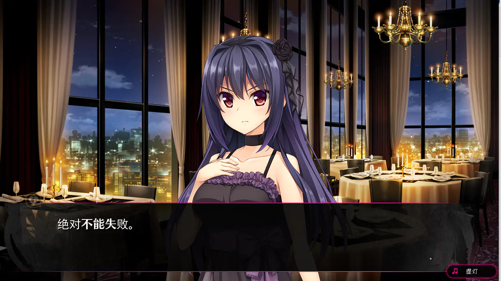

身着精心選取的黑色晚禮裙，嶺衣奈幾乎能感覺到高管炙熱的目光舔舐自己身上。
我需要付出什麽，才能站在光輝的舞臺之上？

爲了能真正踏上“偶像”的道路， 我不惜奉獻出身體......

這就是，天使墮落的開始。

## 故事梗概[涉劇透]

點此展開

**如月嶺衣奈** 為挽救自己的偶像職業生涯， 在事務所 Producer 的牽綫下，
把自己的處女獻給了一名公司高管來換取的工作機會，自此一發不可收拾，

爲了雜志寫真上鏡而和攝影師做愛，
爲了獲取入鏡機會色誘電視劇投資人，
爲了討好綜藝節目主持人而迎合他糟糕的性趣味，
爲了更多的工作機會而和大人物的兒子逢場作戲......

但這一切努力卻隨著一個號稱萬年一遇的 美少女偶像出道而化爲烏有。
喜新厭舊的觀衆們迅速把注意力 轉移到了新出道的人氣偶像身上，
之前討好的大人物也開始對自己失去興趣。

隨著大人物的兒子因爲厭倦而和自己分手，嶺衣奈知道自己自此以後很難再得到工作機會了。
更雪上加霜的是，嶺衣奈發現自己懷孕了，
而她甚至連孩子的父親是誰都不知道......

在和事務所討論決定偶像引退之後， 嶺衣奈想起來那個從自己出道以來就支持著自己的粉絲。
她跑到那個粉絲家裏，一夜春宵， 之後又欺騙他說自己懷了他的孩子。
粉絲既感動又愧疚，發誓自己會負起責任。
在兩人商量著未來的生活的時候，嶺衣奈滿懷希望地想， 
雖然自己在成爲偶像的道路上失敗了，
但自己一定還可以獲得作爲一個普通人的幸福。

**强化補丁部分：**

[以下部分來自官方在游戲發售幾周后發佈的劇情補丁]

    

        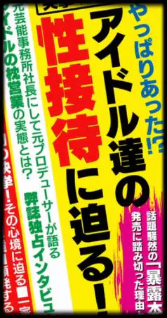
    

    

        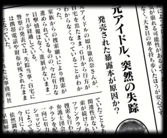
    

多年以後當初的枕營業丑闻曝光，岭衣奈自杀。
嶺衣奈的兒子和自己的父亲做了DNA鉴定，结果证明自己并非父亲亲生，
于是决心杀死那些改变了母亲的男人。

少年给父亲留下了一封信:

<blockquote id="letter">

<strong>给父亲：</strong>

突然来信，十分抱歉。 

我杀了人。

母亲在看了那个报道之后就不在了。 
当时，深爱着母亲的父亲的悲痛， 我不忍目睹，却感同身受。 
父亲告诉过我，母亲曾经是个偶像， 一个为众人所憧憬着的，为大家带去笑容的偶像。 

但是在看过那个报道之后， 我知道了母亲往日的作为，并为之前有过这样的事而震惊。 
母亲当时是怀着怎样的心情，我无法理解。 
我甚至不知道，这种事对粉丝而言是否是背叛。 

我只是觉得，粉丝的心情应该和父亲是相似的， 因此，也应该有大受打击的人。 
我想，母亲落得如此下场，是自作自受。 
既然她是自知自觉地去走这条路， 我当然无法为她辩护。 
毕竟，如果被强迫的话，只要辞职就行了。 
早知道和父亲一起生活这么幸福， 母亲当初更不应该去做那种事情。 

因此，那种事情被曝光之后，我当然会受打击。 
我不知道为什么那个报道到现在才刊登出来。别的杂志还觉得这是炒作或者圈钱。 
但不管怎样，母亲终究还是离我们而去了。 

只是，我有了一个疑问。 
实话说，我在写这封信的时候 还在犹豫我是否应当写下这个疑问。
但为了说明我杀人的理由，我还是写了。 

我会不会，不是父亲的孩子呢？ 
虽然感到抱歉，但我还是没与您商量去做了DNA鉴定。 
至少，我祈祷着结果能证明我确实与父亲血脉相连。 

在看了结果之后， 我对母亲的怨恨无以复加。 

为什么一定要像现在这样把她的儿子牵扯进来呢。 
为什么一定要让深爱着她的丈夫肝肠寸断呢。 
为什么一定要让我的家庭支离破碎呢。 
为什么我一定要这样悲恨交加，不能自已呢。

我不能说，母亲是无辜的。
因为对粉丝而言，母亲无疑是个叛徒。
只是，每每想起父亲谈起母亲的事迹时的笑容，我坚信， 当时母亲至少不忘初心。 
而有些人却视母亲的初心为鱼肉。 

因此，才造成今日之局面。 

所有人——不论是泄露情报的人—— 亦或是报道此事的人 ——该当同罪。 
所以，我会杀了他们。  并不是为了复仇，只是为了满足我的私心。 
即便母亲是自作孽，我仍然失去了一个至亲。

我只是无法原谅使我们的家庭分崩离析的人而已。 
我已经调查好了他们的一切
（名单：
宮原康平（就是那个负责人，已经被做掉了）、
松永京治、竹下宗憲、
近藤剛、榊隆一、三条院英幸、三条院聖也、丸原昭吾（TOSHIKI））。 

我一直为父亲自豪， 纵然我们并不是血亲。 
我一直为母亲骄傲，无论她以前做了什么，即便她已不在身边。 
我的家庭，我的至亲，惟有二人而已。 

不知所云，诚惶诚恐。 多加保重。养育之恩，无以为报。

</blockquote>

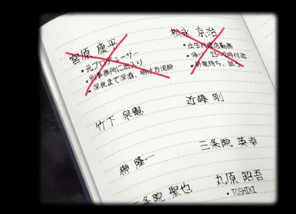

## 登場人物

</img>

</img>

cv:花澤さくら 
<mark>出道一年的新偶像</mark> 
爲了實現成爲偶像的夢想而從鄉下老家來到東京的女孩 
雖然姿貌端麗勤修苦練，但卻遲遲不能出頭，處境窘迫到了一個月都接不到一項工作的程度 
性格好强的她不願意一事無成的回到老家，於是懇求製作人的幫助 
製作人卻理所當然的暗示嶺衣奈通過枕營業或説潛規則來討好大人物 
接受了自己只能靠獻上肉體來追求夢想這一事實，天使被黑暗污穢了 
高管，攝影師，電視劇投資人，主持人，會場主辦方......嶺衣奈一一用身體賄賂，希冀對方的垂愛 
<mark>然而，以色事人，色衰愛馳。深陷其中的嶺衣奈，她的命運又將落向何方？</mark>

  

</img>

</img>

cv:君島りさ 
<mark>和嶺衣奈同一事務所的人氣偶像</mark> 
一个對枕營業樂在其中的享乐主义者。 
對於通過枕營業獲取工作機會這件事絲毫不覺羞愧 
相反還十分享受和各式各樣人性交的過程 
<mark>她不知廉恥的樣子讓嶺衣奈深感厭惡 
    但她靠身體換來的資源卻又讓嶺衣奈艷羡不已 </mark>

  

## 遊戲截圖

  <ol class="carousel-indicators">
    <li data-target="#carouselExampleIndicators-screen" data-slide-to="0" class="active"></li>
    <li data-target="#carouselExampleIndicators-screen" data-slide-to="1"></li>
    <li data-target="#carouselExampleIndicators-screen" data-slide-to="2"></li>
    <li data-target="#carouselExampleIndicators-screen" data-slide-to="3"></li>
    <li data-target="#carouselExampleIndicators-screen" data-slide-to="4"></li>
    <li data-target="#carouselExampleIndicators-screen" data-slide-to="5"></li>

  </ol>
  

    

      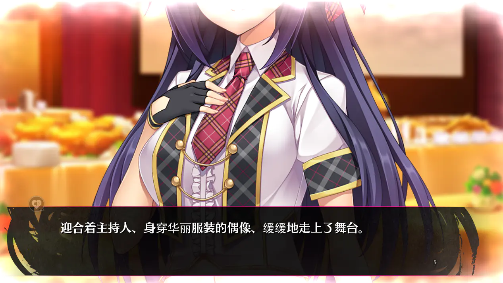
    

    

      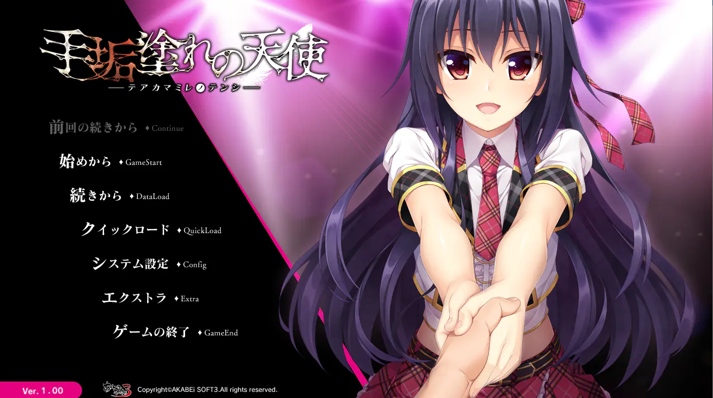
    

    

      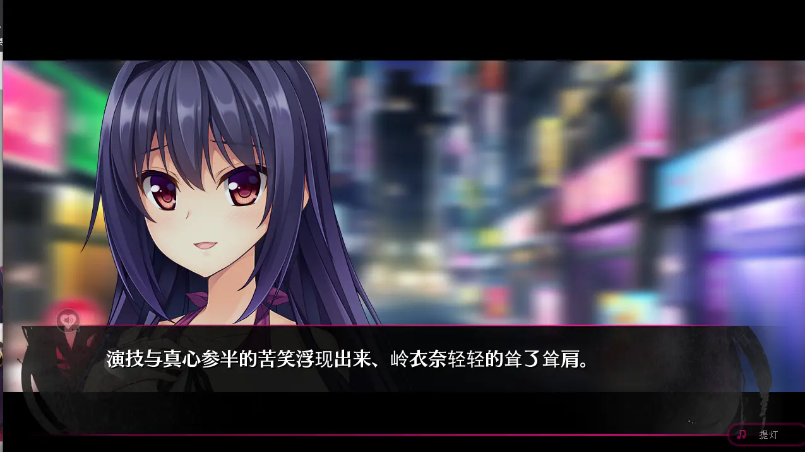
    

    

      
    

    

      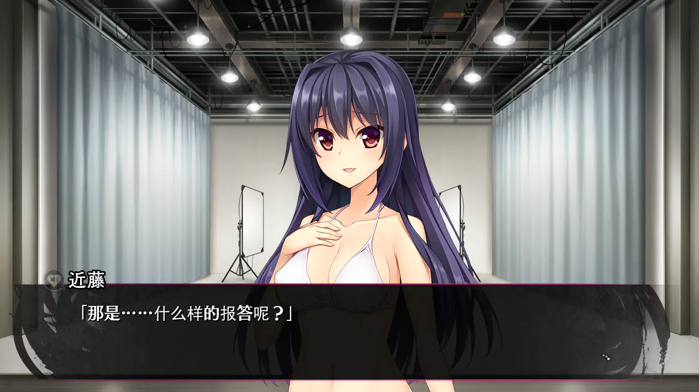
    

    

      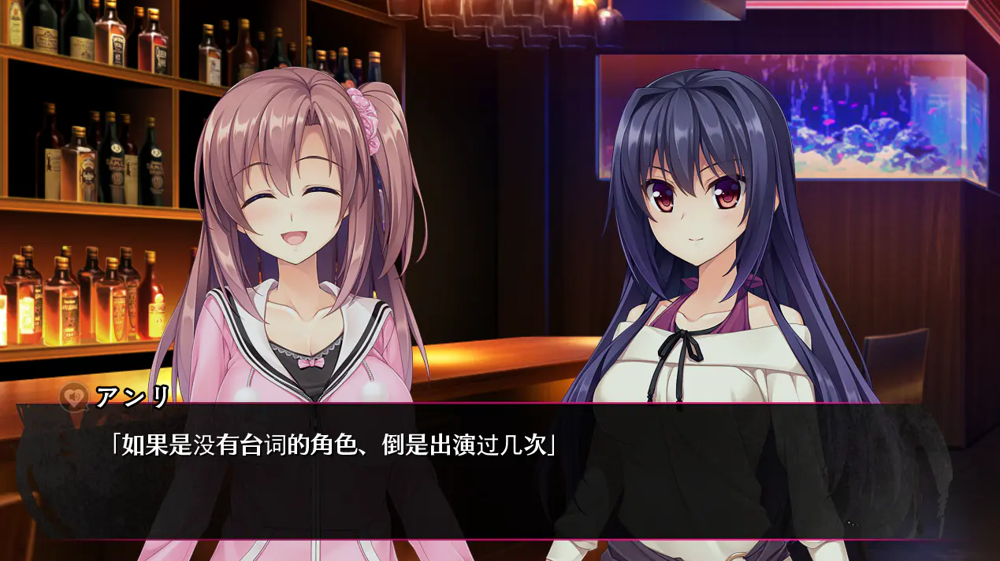
    

  

  <a class="carousel-control-prev" href="#carouselExampleIndicators-screen" role="button" data-slide="prev">
    
    Previous
  </a>
  <a class="carousel-control-next" href="#carouselExampleIndicators-screen" role="button" data-slide="next">
    
    Next
  </a>

 

## CG

  <ol class="carousel-indicators">
    <li data-target="#carouselExampleIndicators-cg" data-slide-to="0" class="active"></li>
    <li data-target="#carouselExampleIndicators-cg" data-slide-to="1"></li>
    <li data-target="#carouselExampleIndicators-cg" data-slide-to="2"></li>
    <li data-target="#carouselExampleIndicators-cg" data-slide-to="3"></li>
    <li data-target="#carouselExampleIndicators-cg" data-slide-to="4"></li>
  </ol>
  

    

      
    

    

      
    

    

      
    

    

      
    

    

      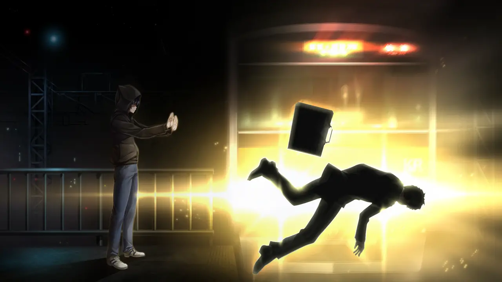
    

  

  <a class="carousel-control-prev" href="#carouselExampleIndicators-cg" role="button" data-slide="prev">
    
    Previous
  </a>
  <a class="carousel-control-next" href="#carouselExampleIndicators-cg" role="button" data-slide="next">
    
    Next
  </a>

 

## ED

<video controls preload="metadata" width='100%'>
<source src="https://bitbucket.org/phobosloreal/galvideo/raw/6291574b6bfe79ed57ef5c077e883aad7363b3c6/teakamamire/ed.mp4" type="video/mp4"/>

 To view this video please enable JavaScript

</video>

## 簡評

《手垢塗れの天使》，中譯《被黑暗洗禮的天使》，由AKABEiSOFT2旗下游戏品牌AKABEiSOFT3制作，发行于2016年。同系列有另外两部作品《手垢塗れの堕天使》和《手垢塗れの復讐》，三部作品的编剧均为和泉万夜。

游戏UI采用了与AKABEiSOFT3同为AKABEiSOFT2旗下的hibiki works的《如月真绫的诱惑》相同的系统。這個UI令我十分不舒服，因爲我找了很久都沒有找到全屏在哪裏，而且經常坏檔，我不得不靠快進來追溯之前的游戲進度。

游戏全程无选项，也就是說只有固定單结局。由於是拔作，敘事本質上其實只是大量的H場景依靠寥寥幾筆承接而成。

值得一提的是游戲在H場景的『表』和『里』双角度描述，让玩家可以看到表面上曲意逢迎的岭衣奈的真实想法。在H場景的對話框左上角有一個聲音播放圖標，點擊后能聽到女主角的心聲，有時還好表現為H場景時嶺衣奈表情的不同。

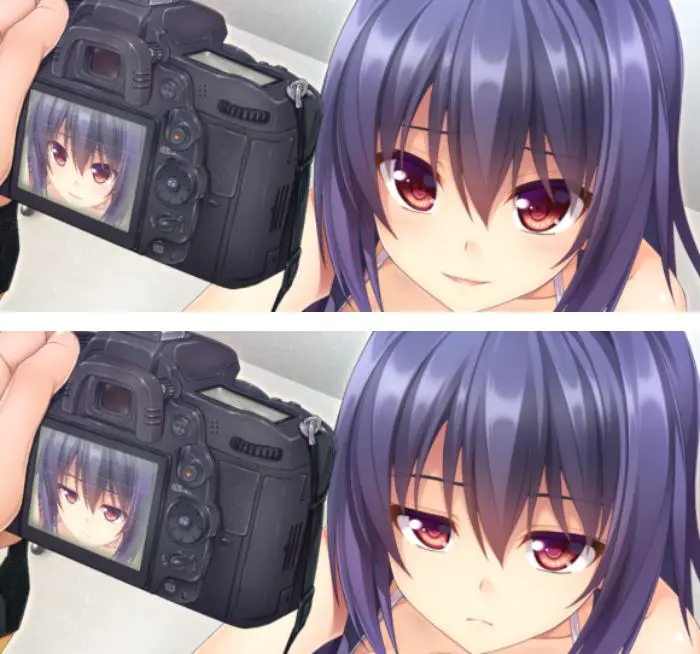

一開始我還對這個設計感到很煩惱，因爲心聲是沒有文本翻譯的，也就是說我可能需要有一定的日語聽力能力才能完全理解劇情。但實際玩過之後我才發現，由於嶺衣奈好强的性格設定，心聲裏沒有複雜的自怨自艾，基本都是抱怨男方惡心，不體貼，性技巧好差我沒感覺，趕緊射精我要休息之類的，完全不影響劇情理解......恐怕這個功能是設計給抖m玩家感受怒駡性愛的......

CG和立繪都很優秀，立繪還會眨眼睛。CG裏的嶺衣奈臀部十分突出性感。雖然故事的主筆是和泉，但意外的完全沒有任何過激性愛，全都是非常正常的性。

音樂非常優秀，尤其是ED，即使對游戲毫無興趣也務必聽聽看，在搭配歌詞后，ED給我的精神衝擊搞不好比故事本身還要大。這也部分是由於故事結尾的敘事方式，結局的一部分是蘊含在ED歌詞中的。

附帶一提，女主角嶺衣奈的聲優**花澤さくら**，同時也是ED的歌唱者，今年3月份要引退了。

官方網站：
http://akabeesoft3.com/products/teakamamire/

## 感想[涉劇透]

點此展開

**1. 結構**

因爲我最近在考慮學習gal劇本的寫作技巧，所以希望能在推完每一部gal結束后都能總結一下自己從這部作品的劇本構架學到了什麽。

因爲來自黑暗的天使本質上是一部拔作，所以故事的敘述都是圍繞著性場景展開的。故事由一個個獨立的性片段綴連而成，而一個獨立的片段又大概分爲三個部分：性場景的中心部分，在性場景前的鋪墊，還有事後的人物感想或説心情之類的。其中前戲又分爲兩個部分，一個是承接之前劇情的敘述，另一個則是敘述這次性行爲的動機。

這樣敘述的故事非常緊凑，但相對的，由於故事缺乏特別細膩的心理或者動機描寫，結局女主角的行爲多多少少有些不合理。

**2. 劇情感想**

説實話像這種鄉下妹進城最後靠身體才能留下來然後玩久了被一脚踢開的故事在現實生活中非常常見。稍微在晚上查查都能找到以前那種初中農村妹進城打工的故事，因爲未成年或者暫住証之類的不得不靠和工頭發生關係才能有活幹，又或者因爲廉價勞動力真的不缺以至於要靠潛規則才能坐的住位置。還很經常爲了省租房錢願意用身體爲代價找個男人家住...即使現在我也聽人抱怨過中國某超一綫的爛褲襠地下偶像未免太多了，實在是麻了。但看完這種講櫻花妹進城市做偶像淪落到不得不靠身體的故事卻還是有點傷心，也許是濾鏡問題，畢竟沒有現實接觸過日本鄉下妹，不會像嫌棄國内廠妹一樣天然不同情。

故事本身心理描寫也不見得很細膩，但聽完ed看了ed歌詞之後卻非常動容。歌詞寫的是女主角在枕營業被曝光以後感覺極度的痛苦，回想過去，自己傻傻的獻出了自己的一切，只希望能站上舞臺，結果卻依然被現實擊垮，最後一無所有。同時又對接盤自己的粉絲感到非常的内疚，向他傾訴自己其實真的愛她，并不是僅僅爲了生活才找他接盤，但如今自己的事情曝光給他帶來了痛苦，自己也無顔見他，只能獻唱一曲然後去死了。

靠人心立業無異於立業于沙土之上。因爲人心遷流嬗變，喜新厭舊，根本不足以倚靠。我自己也見到很多這樣的事情，很多人看著善良純潔的人遭受巨大的不幸，一灑熱淚，發誓自己會永遠支持她，但不久之後就被令人眼花繚亂的新事物奪走注意力，迅速的忘卻了曾經出現在眼前的巨大的不屈不平，也不再關心被傷害與被侮辱的人接下來的命運。痛苦不長久，悲傷也失去意義，過去的種種現在看起來就像笑料一樣，折射出人最可恥的一部分，就是易於遺忘。

一個我很受觸動的地方是女主角的不自由，上位者稍稍流露出一點不滿的表情，女主角都心驚膽戰，不得不卑躬屈膝的請求原諒，并且表態隨時可以獻出身體謝罪。雖然有時也自傲的想自己的身體沒有那麽廉價，但馬上又被現實打回原形，立刻像狗一樣的搖尾乞憐。倒是女主角見到的上位者，一個個都活的非常體面，説話時總能用得體的詞藻來修飾自己猥褻的意圖，即使把女主角像避孕套一樣的用完就丟也絲毫沒有負罪感。因爲我自己也是一個卑躬屈膝才能生活的小角色，在看到這些大人物説話的時候竟然不由自主的聯想自己的上司，不由得生理上都犯惡心。

## 還在猶豫是否下載？

這裏有一個 8分鐘的試玩。

<video controls preload="metadata" width='100%'>
<source src="https://bitbucket.org/phobosloreal/galvideo/raw/6291574b6bfe79ed57ef5c077e883aad7363b3c6/teakamamire/%E8%A2%AB%E9%BB%91%E6%9A%97%E6%B4%97%E7%A4%BC%E7%9A%84%E5%A4%A9%E4%BD%BF-1.mp4" type="video/mp4"/>

 To view this video please enable JavaScript

</video>

## 資源與下載

<!--- 摺疊部分的邊框樣式 --->

