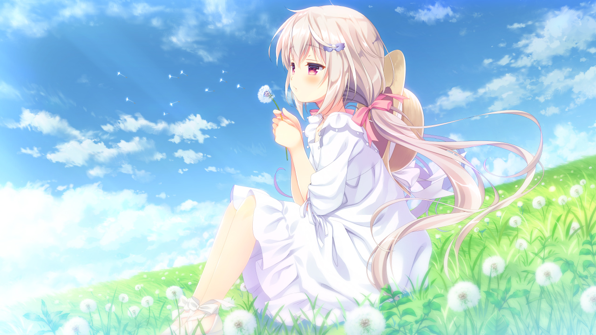
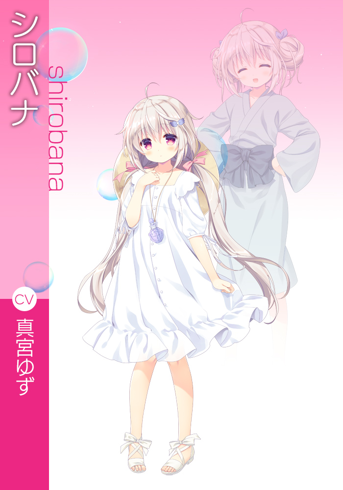
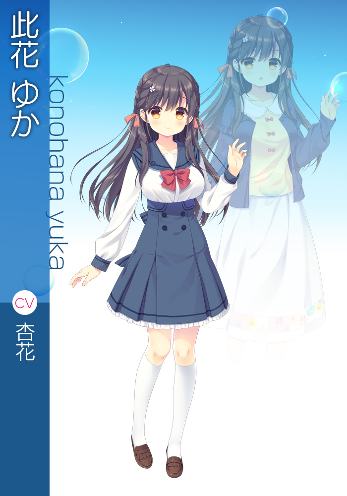
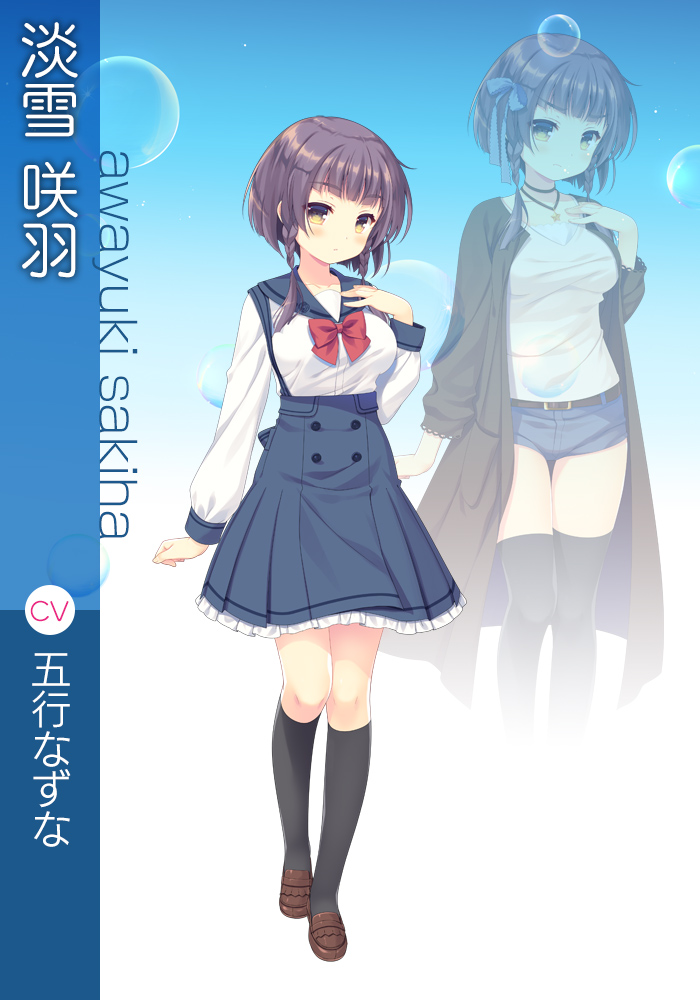
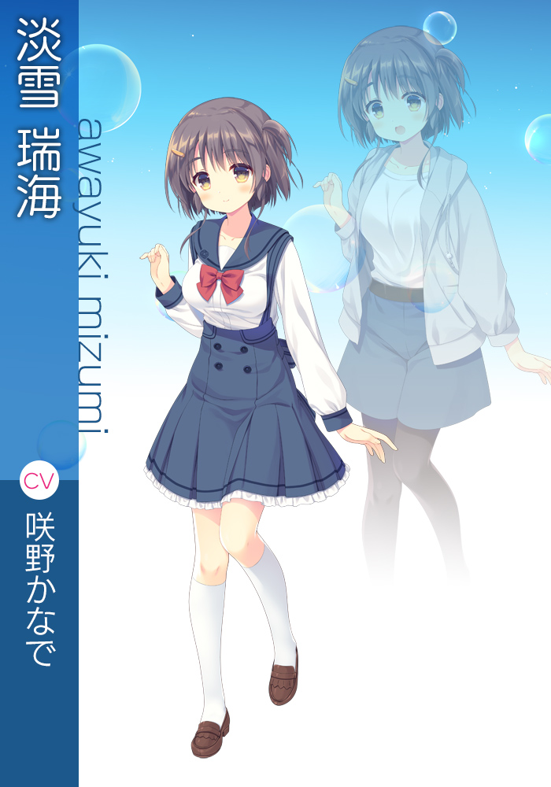
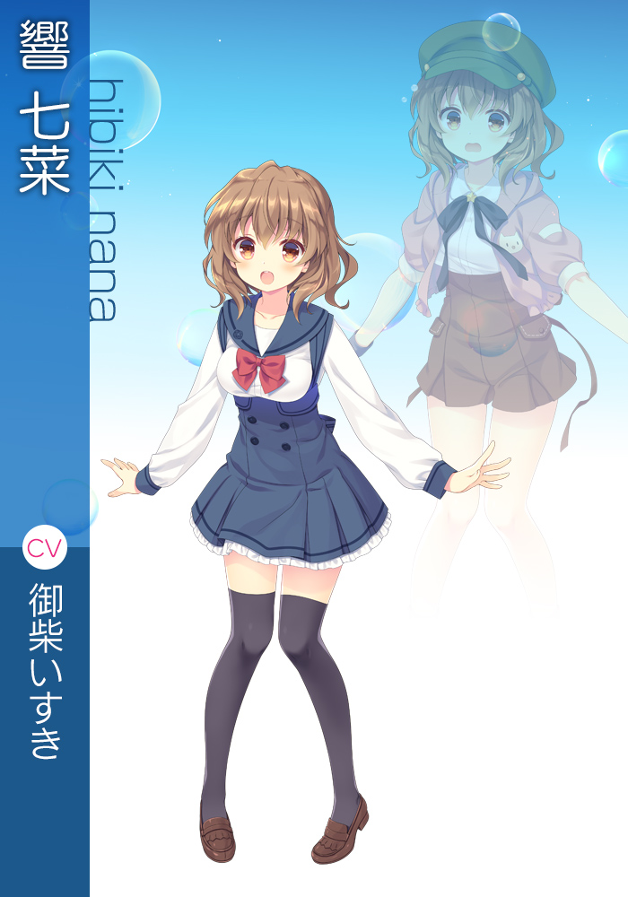
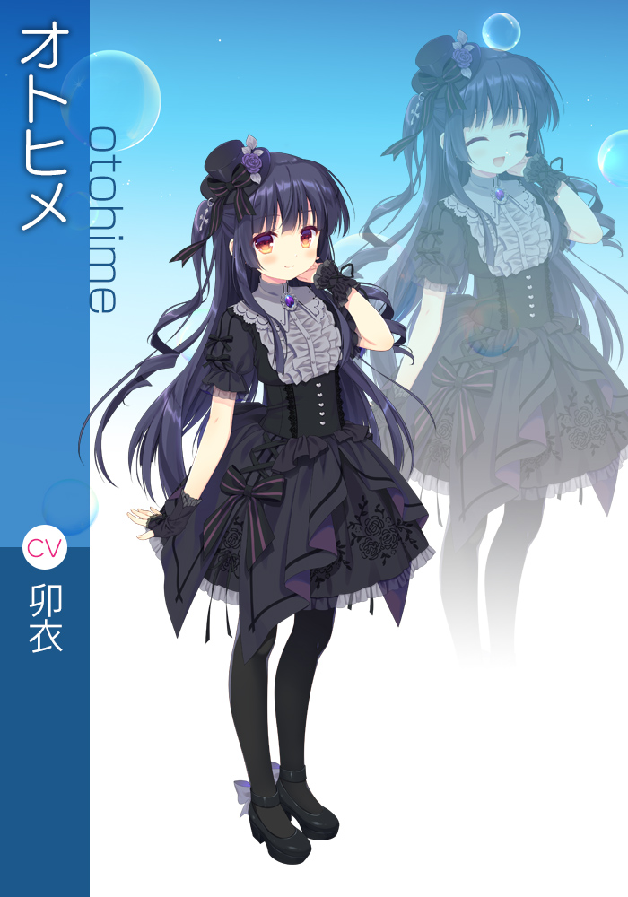
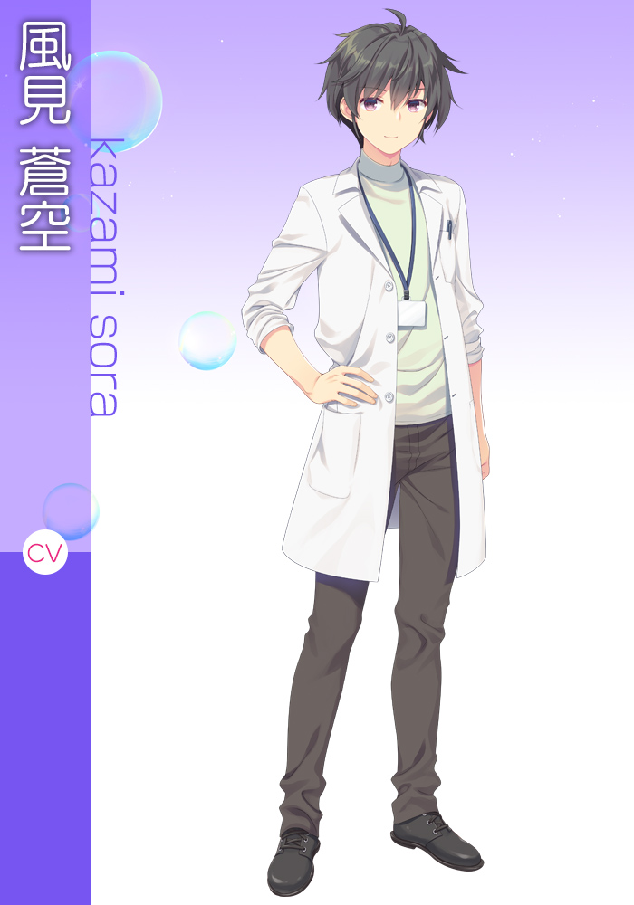

> “呐，苍空。”
> “送归人，对魂人来说也许就像是保健老师一样哪。”



风见苍空，与将草帽挂在脖子上、总是吹着肥皂泡的少女——   一起为了送  轮回转世而持续着旅程。
魂人的俗称便是幽灵，像苍空一样送魂人轮回的人们，有些人称呼他们为 

苍空有着自己的目的。
那便是，找到已经逝世成为魂人、如今依然行踪不明的姐姐。
为代替双亲抚养自己的最爱的姐姐，亲手送归幸福的彼岸。

于是，冬去春来。
苍空与白花，在旅途中造访了  。
那是以蒲公英花田和天然温泉为旅游资源的恬静乡村。
从熟人那里听说，这个乡村里聚集着众多的魂人。
在这些魂人当中，说不定就有姐姐存在。
苍空一边寄宿在温泉旅馆里，一边活用送行人的技术赚取住宿费，在熟人任职校长的 作为临时的保健教师工作着。

作为保健室的老师，与女学生们接触。
作为心理辅导的一环，倾听她们的烦恼。
苍空，与搭档白花一起解决了学园里发生的各种各样的事件。 

| 資訊一覽     |                 |
| :----------- | :------------------------------------ |
| **開發商**   | なかひろ／Citrus |
| **游戏大小** | 3.23G |
| **類型**     | ADV |
| **難度**     | 单线 |
| **分級**     | R-18 |


## 登場人物


	<script type="text/javascript">
        function playSV01a() {
            document.getElementById("sv01a").play();
        }

        function playSV01b() {
            document.getElementById("sv01b").play();
        }

        function playSV01c() {
            document.getElementById("sv01c").play();
        }

        function playSV01d() {
            document.getElementById("sv01d").play();
        }

        function playSV01e() {
            document.getElementById("sv01e").play();
        }

        function playSV01f() {
            document.getElementById("sv01f").play();
        }

        function playSV01g() {
            document.getElementById("sv01g").play();
        }

        function playSV02a() {
            document.getElementById("sv02a").play();
        }

        function playSV02b() {
            document.getElementById("sv02b").play();
        }

        function playSV02c() {
            document.getElementById("sv02c").play();
        }

        function playSV02d() {
            document.getElementById("sv02d").play();
        }

        function playSV03a() {
            document.getElementById("sv03a").play();
        }

        function playSV03b() {
            document.getElementById("sv03b").play();
        }

        function playSV03c() {
            document.getElementById("sv03c").play();
        }

        function playSV03d() {
            document.getElementById("sv03d").play();
        }

        function playSV04a() {
            document.getElementById("sv04a").play();
        }

        function playSV04b() {
            document.getElementById("sv04b").play();
        }

        function playSV04c() {
            document.getElementById("sv04c").play();
        }

        function playSV04d() {
            document.getElementById("sv04d").play();
        }

        function playSV05a() {
            document.getElementById("sv05a").play();
        }

        function playSV05b() {
            document.getElementById("sv05b").play();
        }

        function playSV05c() {
            document.getElementById("sv05c").play();
        }

        function playSV05d() {
            document.getElementById("sv05d").play();
        }

        function playSV06a() {
            document.getElementById("sv06a").play();
        }

        function playSV06b() {
            document.getElementById("sv06b").play();
        }

        function playSV06c() {
            document.getElementById("sv06c").play();
        }

        function playSV06d() {
            document.getElementById("sv06d").play();
        }

        function playSV07a() {
            document.getElementById("sv07a").play();
        }

        function playSV07b() {
            document.getElementById("sv07b").play();
        }

        function playSV07c() {
            document.getElementById("sv07c").play();
        }

        function playSV07d() {
            document.getElementById("sv07d").play();
        }

    </script>
    
    <style>

    .mb0 {
  	margin-bottom: 0;
    }
    section {
	  -moz-box-shadow: 0px 0px 4px rgba(50, 50, 50, 0.7);
	  -webkit-box-shadow: 0px 0px 4px rgba(50, 50, 50, 0.7);
	  box-shadow: 0px 0px 4px rgba(50, 50, 50, 0.7);
	  background: rgba(255, 255, 255, 0.7);
	  padding: 2.5%;
	  box-sizing: border-box;
	  border-radius: 5px;
	  margin-bottom: 2.5%;
    }
    #登場人物 {
      font-family: 'Lucida Grande', 'Hiragino Kaku Gothic ProN', Meiryo, sans-serif;
      font-size: 16px;
      line-height: 1.6em;
      line-break: strict;
      word-break: break-all;
      text-align: justify;
      text-justify: distribute;
    }
    .tabs {
      width: 100%;
      position: relative;
    }
    input[name="tab_item"] {
        display: none;
    }
.tab_item01 {
  top: 0px;
  left: 0px;
  height: 0;
  padding-top: 11.71875%;
  position: relative;
  width: 12.5%;
  background: url("../image/保健室的老师与肥皂泡中毒的助手/tab01.png") no-repeat;
    background-size: auto;
  text-indent: -9999px;
  background-size: cover;
  display: block;
  overflow: hidden;
  float: left;
  -webkit-transition: all 500ms 0s ease;
  transition: all 500ms 0s ease;
  margin-bottom: 2.5%;
  z-index: 10;
}

.tab_item02 {
  top: 0px;
  left: 0px;
  height: 0;
  padding-top: 11.71875%;
  position: relative;
  width: 12.5%;
  background: url("../image/保健室的老师与肥皂泡中毒的助手/tab02.png") no-repeat;
    background-size: auto;
  text-indent: -9999px;
  background-size: cover;
  display: block;
  overflow: hidden;
  float: left;
  -webkit-transition: all 500ms 0s ease;
  transition: all 500ms 0s ease;
  margin-bottom: 2.5%;
  z-index: 10;
}

.tab_item03 {
  top: 0px;
  left: 0px;
  height: 0;
  padding-top: 11.71875%;
  position: relative;
  width: 12.5%;
  background: url("../image/保健室的老师与肥皂泡中毒的助手/tab03.png") no-repeat;
    background-size: auto;
  text-indent: -9999px;
  background-size: cover;
  display: block;
  overflow: hidden;
  float: left;
  -webkit-transition: all 500ms 0s ease;
  transition: all 500ms 0s ease;
  margin-bottom: 2.5%;
  z-index: 10;
}
.tab_item04 {
  top: 0px;
  left: 0px;
  height: 0;
  padding-top: 11.71875%;
  position: relative;
  width: 12.5%;
  background: url("../image/保健室的老师与肥皂泡中毒的助手/tab04.png") no-repeat;
    background-size: auto;
  text-indent: -9999px;
  background-size: cover;
  display: block;
  overflow: hidden;
  float: left;
  -webkit-transition: all 500ms 0s ease;
  transition: all 500ms 0s ease;
  margin-bottom: 2.5%;
  z-index: 10;
}
.tab_item05 {
  top: 0px;
  left: 0px;
  height: 0;
  padding-top: 11.71875%;
  position: relative;
  width: 12.5%;
  background: url("../image/保健室的老师与肥皂泡中毒的助手/tab05.png") no-repeat;
    background-size: auto;
  text-indent: -9999px;
  background-size: cover;
  display: block;
  overflow: hidden;
  float: left;
  -webkit-transition: all 500ms 0s ease;
  transition: all 500ms 0s ease;
  margin-bottom: 2.5%;
  z-index: 10;
}
.tab_item06 {
  top: 0px;
  left: 0px;
  height: 0;
  padding-top: 11.71875%;
  position: relative;
  width: 12.5%;
  background: url("../image/保健室的老师与肥皂泡中毒的助手/tab06.png") no-repeat;
    background-size: auto;
  text-indent: -9999px;
  background-size: cover;
  display: block;
  overflow: hidden;
  float: left;
  -webkit-transition: all 500ms 0s ease;
  transition: all 500ms 0s ease;
  margin-bottom: 2.5%;
  z-index: 10;
}
.tab_item07 {
  top: 0px;
  left: 0px;
  height: 0;
  padding-top: 11.71875%;
  position: relative;
  width: 12.5%;
  background: url("../image/保健室的老师与肥皂泡中毒的助手/tab07.png") no-repeat;
    background-size: auto;
  text-indent: -9999px;
  background-size: cover;
  display: block;
  overflow: hidden;
  float: left;
  -webkit-transition: all 500ms 0s ease;
  transition: all 500ms 0s ease;
  margin-bottom: 2.5%;
  z-index: 10;
}
.tab_item08 {
  top: 0px;
  left: 0px;
  height: 0;
  padding-top: 11.71875%;
  position: relative;
  width: 12.5%;
  background: url("../image/保健室的老师与肥皂泡中毒的助手/tab08.png") no-repeat;
    background-size: auto;
  text-indent: -9999px;
  background-size: cover;
  display: block;
  overflow: hidden;
  float: left;
  -webkit-transition: all 500ms 0s ease;
  transition: all 500ms 0s ease;
  margin-bottom: 2.5%;
  z-index: 10;
}
.tab_content {
  display: none;
  padding: 0;
  clear: both;
  overflow: hidden;
}
.tabs input:checked + .tab_item01, .tabs input:checked + .tab_item02, .tabs input:checked + .tab_item03, .tabs input:checked + .tab_item04, .tabs input:checked + .tab_item05, .tabs input:checked + .tab_item06, .tabs input:checked + .tab_item07, .tabs input:checked + .tab_item08 {
  top: 20px;
}
#c01:checked ~ #c01_content, #c02:checked ~ #c02_content, #c03:checked ~ #c03_content, #c04:checked ~ #c04_content, #c05:checked ~ #c05_content, #c06:checked ~ #c06_content, #c07:checked ~ #c07_content, #c08:checked ~ #c08_content {
  display: block;
  animation: tabAnim ease 0.5s forwards;
}
.chara-wrap {
  display: flex;
  flex-wrap: wrap;
  width: 100%;
  background: #fff;
  overflow: hidden;
  border-radius: 10px;
  justify-content: space-between;
}
.chara-wrap .chara-pic {
  flex-basis: 45%;
  background-color: var(--body-bg-color);
}
.chara-wrap .chara-text {
  background-color: var(--body-bg-color);
  flex-basis: 55%;
  box-sizing: border-box;
  padding: 2.5% 2.5% 0 2.5%;
}
h5.chara-name {
  color: #4594d1;
  margin-bottom: 1em;
  font-size: 1.6em;
  border-bottom: dotted 2px #ccc;
  padding-bottom: 1em;
}

dl.chara-spec {
  overflow: auto;
    overflow-x: auto;
  overflow-x: hidden;
  width: 100%;
  font-size: 0.9em;
  margin-bottom: 1rem;
}
dl.chara-spec dt {

  color: #f90;
  width: 7em;
  font-weight: bold;
}
dl.chara-spec dd {
  color: var(--post-text-color);

}
p:not(:last-child) {
  margin-bottom: 1em;
}
.serifu {
  font-weight: bold;
  color: #eb2783;
}
ul.sv-button {
  display: flex;
  flex-wrap: wrap;
  list-style: none;
  margin: 0 -5px -1em -5px;
  justify-content: center;
}
ul.sv-button li {
  flex-basis: 25%;
  padding: 0 5px 1em 5px;
  box-sizing: border-box;
  background: none;
}
ul.sv-button li button {
  border: none;
  padding: 0;
  cursor: pointer;
  background: none;
  vertical-align: bottom;
}
ul.sv-button li img {
  width: 100%;
}
.movie {
  position: relative;
  width: 100%;
  padding-top: 56.25%;
}
.movie iframe {
  position: absolute;
  top: 0;
  right: 0;
  width: 100% !important;
  height: 100% !important;
  -moz-box-shadow: 0px 0px 4px rgba(50, 50, 50, 0.7);
  -webkit-box-shadow: 0px 0px 4px rgba(50, 50, 50, 0.7);
  box-shadow: 0px 0px 4px rgba(50, 50, 50, 0.7);
}
ul.pic-wrap {
  list-style: none;
  display: flex;
  flex-wrap: wrap;
  margin: 0 -1.25%;
  padding-top: 0.5em;
}
ul.pic-wrap li {
  flex-basis: 50%;
  padding: 0 1.25%;
  box-sizing: border-box;
}
ul.pic-wrap li img {
  width: 100%;
  -moz-box-shadow: 0px 0px 4px rgba(50, 50, 50, 0.7);
  -webkit-box-shadow: 0px 0px 4px rgba(50, 50, 50, 0.7);
  box-shadow: 0px 0px 4px rgba(50, 50, 50, 0.7);
  border-radius: 5px;
}
    </style>
</head>
<body>

<section class="mb0">

                <div class="tabs">

                    <input id="c01" type="radio" name="tab_item" checked="">
                    <label class="tab_item01" for="c01">白花</label>
                    <input id="c02" type="radio" name="tab_item">
                    <label class="tab_item02" for="c02">此花 由香</label>
                    <input id="c03" type="radio" name="tab_item">
                    <label class="tab_item03" for="c03">月森 鈴</label>
                    <input id="c04" type="radio" name="tab_item">
                    <label class="tab_item04" for="c04">淡雪 咲羽</label>
                    <input id="c05" type="radio" name="tab_item">
                    <label class="tab_item05" for="c05">淡雪 瑞海</label>
                    <input id="c06" type="radio" name="tab_item">
                    <label class="tab_item06" for="c06">響 七菜</label>
                    <input id="c07" type="radio" name="tab_item">
                    <label class="tab_item07" for="c07">オトヒメ</label>
                    <input id="c08" type="radio" name="tab_item">
                    <label class="tab_item08" for="c08">風見 蒼空</label>
                    <div class="tab_content" id="c01_content">

                        <div class="chara-wrap">

                            <div class="chara-pic">
                                
                            </div>

                            <div class="chara-text">

                                <h5 class="chara-name">白花</h5>

                                <dl class="chara-spec">
                                    <dt>身高</dt>
                                    <dd>144cm</dd>
                                    <dt>三围</dt>
                                    <dd>71(A)/52/72</dd>
                                </dl>

                                <p class="serifu">「好了，老实点。用我的风让你冷静一下吧」<br>
                                    「我不是路痴。是苍空擅自迷路了。所以都是苍空的错」<br>
                                    「但是……和姐姐见面的时候，苍空还能送归吗？」</p>

                                <p>白花是风见苍空的搭档<br>
                                    虽然说在保健室当助手，但是完全不干事，就是个室内装饰</p>
                               <p>50+岁的萝莉老太婆，本作卿点女主角<br>
                                  唯一有HCG的角色，夜夜压榨苍空 </p>

                                <p>喜欢苍空又不承认，当苍空和别的女孩聊天太久会吃醋<br>
                                    生气用爪子挠苍空后背，或者用泡泡攻击苍空</p>
                                    
                                 <p>讨厌蒲公英，(名字却直译为白色蒲公英)<br>
                                    所以遇到满身蒲公英花味的学生会长会躲出去</p>

                                <!-- samplevoice -->

                                <audio id="sv01a" preload="auto">
                                    <source src="https://citrus-soft.net/product/hokejyo/sv/shi_sv01.mp3" type="audio/mp3">
                                </audio>
                                <audio id="sv01b" preload="auto">
                                    <source src="https://citrus-soft.net/product/hokejyo/sv/shi_sv02.mp3" type="audio/mp3">
                                </audio>
                                <audio id="sv01c" preload="auto">
                                    <source src="https://citrus-soft.net/product/hokejyo/sv/shi_sv03.mp3" type="audio/mp3">
                                </audio>
                                <audio id="sv01d" preload="auto">
                                    <source src="https://citrus-soft.net/product/hokejyo/sv/shi_sv04.mp3" type="audio/mp3">
                                </audio>
                                <audio id="sv01e" preload="auto">
                                    <source src="https://citrus-soft.net/product/hokejyo/sv/shi_sv05.mp3" type="audio/mp3">
                                </audio>
                                <audio id="sv01f" preload="auto">
                                    <source src="https://citrus-soft.net/product/hokejyo/sv/shi_sv06.mp3" type="audio/mp3">
                                </audio>
                                <audio id="sv01g" preload="auto">
                                    <source src="https://citrus-soft.net/product/hokejyo/sv/shi_sv07.mp3" type="audio/mp3">
                                </audio>

                                <ul class="sv-button">
                                    <li><button onclick="playSV01a();"></button></li>
                                    <li><button onclick="playSV01b();"></button></li>
                                    <li><button onclick="playSV01c();"></button></li>
                                    <li><button onclick="playSV01d();"></button></li>
                                    <li><button onclick="playSV01e();"></button></li>
                                    <li><button onclick="playSV01f();"></button></li>
                                    <li><button onclick="playSV01g();"></button></li>
                                </ul>
				<a class="btn" href="https://www.bilibili.com/video/BV1EV41127XU" title="自我介绍">白花的自我介绍视频</a>
                                <!-- /samplevoice -->
			 </div>

                        </div>

                    </div>


                    <div class="tab_content" id="c02_content">

                        <div class="chara-wrap">

                            <div class="chara-pic"></div>
                            <div class="chara-text">

                                <h5 class="chara-name">此花 由香</h5>

                                <dl class="chara-spec">
                                    <dt>身高</dt>
                                    <dd>155cm</dd>
                                    <dt>三围</dt>
                                    <dd>85(E)/55/80</dd>
                                </dl>

                                <p class="serifu">「风见老师。我们又在这个地方见面了呢」<br>
                                    「老师……你喜欢花吗？」<br>
                                    「蒲公英的生命是短暂的……那样短暂的人生，你不后悔吗」</p>

                                <p>此花ゆか是彩香女子学园的一年级学生。<br>
                                    和七菜是同班同学并住在同一个学生宿舍。</p>

                                <p>喜欢跟七菜一起行动。<br>
                                    脸上经常挂着笑容，性格就像冬日里的阳光，<br>
                                    无论遇到什么事情几乎都是微笑面对。</p>

                                <p>经常会一个人去彩香镇郊外的蒲公英花海。<br>
                                    很招蝴蝶喜欢，她伸出手指会有很多蝴蝶停在她手上。</p>

                                <!-- samplevoice -->

                                <audio id="sv02a" preload="auto">
                                    <source src="https://citrus-soft.net/product/hokejyo/sv/yuk_sv01.mp3" type="audio/mp3">
                                </audio>
                                <audio id="sv02b" preload="auto">
                                    <source src="https://citrus-soft.net/product/hokejyo/sv/yuk_sv02.mp3" type="audio/mp3">
                                </audio>
                                <audio id="sv02c" preload="auto">
                                    <source src="https://citrus-soft.net/product/hokejyo/sv/yuk_sv03.mp3" type="audio/mp3">
                                </audio>
                                <audio id="sv02d" preload="auto">
                                    <source src="https://citrus-soft.net/product/hokejyo/sv/yuk_sv04.mp3" type="audio/mp3">
                                </audio>

                                <ul class="sv-button">
                                    <li><button onclick="playSV02a();"></button></li>
                                    <li><button onclick="playSV02b();"></button></li>
                                    <li><button onclick="playSV02c();"></button></li>
                                    <li><button onclick="playSV02d();"></button></li>
                                </ul>

                                <!-- /samplevoice -->
				<a class="btn" href="https://www.bilibili.com/video/BV1bp4y1Y74T" title="自我介绍">此花的自我介绍视频</a>
                            </div>
                        </div>


                    </div>


                    <div class="tab_content" id="c03_content">

                        <div class="chara-wrap">

                            <div class="chara-pic"></div>
                            <div class="chara-text">

                                <h5 class="chara-name">月森 鈴</h5>

                                <dl class="chara-spec">
                                    <dt>身高</dt>
                                    <dd>160cm</dd>
                                    <dt>三围</dt>
                                    <dd>93(H)/57/85</dd>
                                </dl>

                                <p class="serifu">「可爱可爱可爱！我全都要带走！」<br>
                                    「就用月森铃这个可爱的名字来称呼我吧♪」<br>
                                    「ばいばい、風見センセー。またあたしと、素敵な出会いをしようね」</p>


                                <p>月森铃是彩香女子学园的三年级学生<br>
                                    也是学園長的女儿。很会帮助别人，比如给苍空指路蒲公英花田和收留响七菜</p>

                                <p>性格像一只小恶魔，很容易打成一片。最喜欢可爱的东西，学生会室放了许多可爱的玩偶<br>
                                    喜欢泡温泉，经常去彩香町玩，泡完露天温泉后喜欢穿着浴衣。</p>

                                <p>虽然担任学生会长，但很随性。<br>
                                    喜欢去保健室的床上睡觉来躲掉学生会工作，因为浑身蒲公英味道，所以被白花躲着<br>
                                    学生们对她的信赖度很高，在学生会很有人望，关键时刻还是可以依靠的。</p>

                                <!-- samplevoice -->

                                <audio id="sv03a" preload="auto">
                                    <source src="https://citrus-soft.net/product/hokejyo/sv/rin_sv01.mp3" type="audio/mp3">
                                </audio>
                                <audio id="sv03b" preload="auto">
                                    <source src="https://citrus-soft.net/product/hokejyo/sv/rin_sv02.mp3" type="audio/mp3">
                                </audio>
                                <audio id="sv03c" preload="auto">
                                    <source src="https://citrus-soft.net/product/hokejyo/sv/rin_sv03.mp3" type="audio/mp3">
                                </audio>
                                <audio id="sv03d" preload="auto">
                                    <source src="https://citrus-soft.net/product/hokejyo/sv/rin_sv04.mp3" type="audio/mp3">
                                </audio>

                                <ul class="sv-button">
                                    <li><button onclick="playSV03a();"></button></li>
                                    <li><button onclick="playSV03b();"></button></li>
                                    <li><button onclick="playSV03c();"></button></li>
                                    <li><button onclick="playSV03d();"></button></li>
                                </ul>

                                <!-- /samplevoice -->
                                <a class="btn" href="https://www.bilibili.com/video/BV1A5411J78S" title="自我介绍">月森铃的自我介绍视频</a>
                            </div>
                        </div>

                    </div>


                    <div class="tab_content" id="c04_content">

                        <div class="chara-wrap">

                            <div class="chara-pic"></div>
                            <div class="chara-text">

                                <h5 class="chara-name">淡雪 咲羽</h5>

                                <dl class="chara-spec">
                                    <dt>身高</dt>
                                    <dd>157cm</dd>
                                    <dt>三围</dt>
                                    <dd>87(F)/56/83</dd>
                                </dl>

                                <p class="serifu">「我是负责照顾老师的。老师也应该自觉一点」<br>
                                    「本来老师在日常生活中就有不检点的地方。不吃早饭，不洗白大褂，擅自在晚上出门不告诉我……くどくどくどくど」<br>
                                    「请、请不要把那样的事作为目标……笨蛋」<br>
                                    『这是性骚扰吗？』</p>

                                <p>淡雪咲羽是彩香女子学园的二年级学生。<br>
                                    在民宿“四季彩之乡”担任服务员，是瑞海的双胞胎妹妹。</p>

                                <p>是个无表情少女，说话有很缓和平淡<br>
                                    对于作为住宿客人的苍空是一样，给人冰山美人的印象，但是很会照顾人。</p>
                                <p>照顾姐姐请校长分到同一班级，给不吃早餐的苍空送便当</p>
                                <p>实际上是不擅长表露自己的感情和想法<br>
                                    和苍空说话时如果被苍空猜中或者被姐姐瑞海戳穿想法会脸红。。</p>
                                <p>在学校担任保健委员。<br>
                                    苍空在保健室工作的时候也经常照顾ta。</p>

                                <!-- samplevoice -->

                                <audio id="sv04a" preload="auto">
                                    <source src="https://citrus-soft.net/product/hokejyo/sv/sak_sv01.mp3" type="audio/mp3">
                                </audio>
                                <audio id="sv04b" preload="auto">
                                    <source src="https://citrus-soft.net/product/hokejyo/sv/sak_sv02.mp3" type="audio/mp3">
                                </audio>
                                <audio id="sv04c" preload="auto">
                                    <source src="https://citrus-soft.net/product/hokejyo/sv/sak_sv03.mp3" type="audio/mp3">
                                </audio>
                                <audio id="sv04d" preload="auto">
                                    <source src="https://citrus-soft.net/product/hokejyo/sv/sak_sv04.mp3" type="audio/mp3">
                                </audio>

                                <ul class="sv-button">
                                    <li><button onclick="playSV04a();"></button></li>
                                    <li><button onclick="playSV04b();"></button></li>
                                    <li><button onclick="playSV04c();"></button></li>
                                    <li><button onclick="playSV04d();"></button></li>
                                </ul>

                                <!-- /samplevoice -->
                                <a class="btn" href="https://www.bilibili.com/video/BV1ya411w7a2" title="自我介绍">淡雪咲羽的自我介绍视频</a>
                            </div>
                        </div>
                    </div>


                    <div class="tab_content" id="c05_content">

                        <div class="chara-wrap">

                            <div class="chara-pic"></div>
                            <div class="chara-text">

                                <h5 class="chara-name">淡雪 瑞海</h5>

                                <dl class="chara-spec">
                                    <dt>身高</dt>
                                    <dd>157cm</dd>
                                    <dt>三围</dt>
                                    <dd>86(E)/56/83</dd>
                                </dl>

                                <p class="serifu">「在您休息的时候打扰了。我给您拿来了晚饭」<br>
                                    「我还是……第一次……被男人这样对待」<br>
                                    「风见老师，就像家人中的哥哥一样呢。」</p>

                                <p>淡雪瑞海是彩香女子学园的二年级学生。<br>
                                    在民宿“四季彩之乡”担任服务员，是咲羽的双胞胎姐姐。</p>

                                <p>虽然很会照顾人，但因天生病弱，经常散发着虚幻的气息，让人感觉随时都有可能倒下。<br>
                                    因天生病弱，觉得自己给妹妹咲羽和母亲麻衣子添了很多麻烦，心里想着要帮上她们一点忙，所以经常勉强自己做事情。</p>

                                <p>妹妹咲羽是个外冷内热<br>
                                    在咲羽和苍空谈话时有时候会说出她的真实想法</p>

                                <!-- samplevoice -->

                                <audio id="sv05a" preload="auto">
                                    <source src="https://citrus-soft.net/product/hokejyo/sv/miz_sv01.mp3" type="audio/mp3">
                                </audio>
                                <audio id="sv05b" preload="auto">
                                    <source src="https://citrus-soft.net/product/hokejyo/sv/miz_sv02.mp3" type="audio/mp3">
                                </audio>
                                <audio id="sv05c" preload="auto">
                                    <source src="https://citrus-soft.net/product/hokejyo/sv/miz_sv03.mp3" type="audio/mp3">
                                </audio>
                                <audio id="sv05d" preload="auto">
                                    <source src="https://citrus-soft.net/product/hokejyo/sv/miz_sv04.mp3" type="audio/mp3">
                                </audio>

                                <ul class="sv-button">
                                    <li><button onclick="playSV05a();"></button></li>
                                    <li><button onclick="playSV05b();"></button></li>
                                    <li><button onclick="playSV05c();"></button></li>
                                    <li><button onclick="playSV05d();"></button></li>
                                </ul>

                                <!-- /samplevoice -->
                                <a class="btn" href="https://www.bilibili.com/video/BV17V41127zx" title="自我介绍">淡雪瑞海的自我介绍视频</a>
                            </div>
                        </div>

                    </div>


                    <div class="tab_content" id="c06_content">

                        <div class="chara-wrap" style="margin-bottom: 0">

                            <div class="chara-pic"></div>
                            <div class="chara-text">

                                <h5 class="chara-name">響 七菜</h5>

                                <dl class="chara-spec">
                                    <dt>身高</dt>
                                    <dd>152cm</dd>
                                    <dt>三围</dt>
                                    <dd>82(D)/56/79</dd>
                                </dl>

                                <p class="serifu">「我的目标是成为一个让别人刮目相看的人！」<br>
                                    「交给我吧！我会用我的力量，驱散恶灵！」<br>
                                    「我已经只能一边吃着这个蒲公英，一边度过剩下的人生了吧………しくしくしく」</p>

                                <p>响七菜是彩香女子学园的一年级学生。<br>
                                    被学生会长从河边捡到,并收留<br>
                                    现在和此花佑果是同班同学并住在同一个学生宿舍。</p>

                                <p>开朗活泼，擅长活跃气氛。<br>
                                    笑起来很元气<br>
                                    是个好搞定的犬娘<br>
                                    自身的运气总是不好，经常遇到倒霉的事情，但不会气馁，笑容满面。<br>
                                    她其实很容易感到寂寞，想撒娇。</p>

                                <p>总是把币束别在腰间。<br>
                                    慌乱的时候会一边喊着恶灵退散一边挥舞币束逃跑。</p>

                                <!-- samplevoice -->

                                <audio id="sv06a" preload="auto">
                                    <source src="https://citrus-soft.net/product/hokejyo/sv/nan_sv01.mp3" type="audio/mp3">
                                </audio>
                                <audio id="sv06b" preload="auto">
                                    <source src="https://citrus-soft.net/product/hokejyo/sv/nan_sv02.mp3" type="audio/mp3">
                                </audio>
                                <audio id="sv06c" preload="auto">
                                    <source src="https://citrus-soft.net/product/hokejyo/sv/nan_sv03.mp3" type="audio/mp3">
                                </audio>
                                <audio id="sv06d" preload="auto">
                                    <source src="https://citrus-soft.net/product/hokejyo/sv/nan_sv04.mp3" type="audio/mp3">
                                </audio>

                                <ul class="sv-button">
                                    <li><button onclick="playSV06a();"></button></li>
                                    <li><button onclick="playSV06b();"></button></li>
                                    <li><button onclick="playSV06c();"></button></li>
                                    <li><button onclick="playSV06d();"></button></li>
                                </ul>
                                <a class="btn" href="https://www.bilibili.com/video/BV1Ri4y1j7wh" title="自我介绍">響七菜的自我介绍视频</a>
                                <!-- /samplevoice -->

                            </div>

                        </div>

                    </div>


                    <div class="tab_content" id="c07_content">

                        <div class="chara-wrap" style="margin-bottom: 0">

                            <div class="chara-pic"></div>
                            <div class="chara-text">

                                <h5 class="chara-name">乙姬</h5>

                                <dl class="chara-spec">
                                    <dt>身高</dt>
                                    <dd>145cm</dd>
                                    <dt>三围</dt>
                                    <dd>72(A)/52/72</dd>
                                </dl>

                                <p class="serifu">「校医と養護教諭が同じ宿でこうして出会ったんだ、祝杯を上げる意味でも、今夜は酒盛りといこうじゃないか」<br>
                                    「お子さまは寝ていたまえ。ここからは大人の時間だ」<br>
                                    「フッ……時の流れというのは、得てして残酷だね」<br></p>

                                <p>乙姬是彩香女子学园的校医。<br>
                                    和苍空住在同一个温泉旅馆。</p>

                                <p>喜欢喝酒。<br>
                                    平时穿着哥特萝莉式服装、随身携带的包里有医疗器械。<br>
                                    可以操纵名为奇迹的力量[2]，代价是要做羞耻的事情。</p>

                                <p>话的时候总是带着大人一样的口吻，所以有一种达观的感觉，常常会被别人以为在讽刺。<br>
                                    也因为这个说话的语气经常和白花吵架。<br>
                                    拥有丰富的医学方面的知识，语言也很中肯，所以被周围的人所依赖。</p>

                                <!-- samplevoice -->

                                <audio id="sv07a" preload="auto">
                                    <source src="https://citrus-soft.net/product/hokejyo/sv/oto_sv01.mp3" type="audio/mp3">
                                </audio>
                                <audio id="sv07b" preload="auto">
                                    <source src="https://citrus-soft.net/product/hokejyo/sv/oto_sv02.mp3" type="audio/mp3">
                                </audio>
                                <audio id="sv07c" preload="auto">
                                    <source src="https://citrus-soft.net/product/hokejyo/sv/oto_sv03.mp3" type="audio/mp3">
                                </audio>
                                <audio id="sv07d" preload="auto">
                                    <source src="https://citrus-soft.net/product/hokejyo/sv/oto_sv04.mp3" type="audio/mp3">
                                </audio>

                                <ul class="sv-button">
                                    <li><button onclick="playSV07a();"></button></li>
                                    <li><button onclick="playSV07b();"></button></li>
                                    <li><button onclick="playSV07c();"></button></li>
                                    <li><button onclick="playSV07d();"></button></li>
                                </ul>

                                <!-- /samplevoice -->
                                <a class="btn" href="https://www.bilibili.com/video/BV1Fz4y1o7SC" title="自我介绍">乙姬的自我介绍视频</a>
                            </div>
                        </div>

                    </div>


                    <div class="tab_content" id="c08_content">

                        <div class="chara-wrap" style="margin-bottom: 0">

                            <div class="chara-pic"></div>
                            <div class="chara-text">

                                <h5 class="chara-name">風見 蒼空</h5>

                                <dl class="chara-spec">
                                    <dt>身高</dt>
                                    <dd>175cm</dd>
                                </dl>

                                <p class="serifu">「ちょっとだけ休ませてくれよな、シロ……」<br>
                                    「悪かったって。方向音痴は生まれつきなんだ、許してくれ」</p>

                                <p>本作の主人公。<br>
                                    彩香女子学園の保健室の先生。</p>

                                <p>教員免許は持っていないが、医学知識や看護技術はあるため、臨時の養護教諭兼、スクールカウンセラーとして勤めることになる。</p>

                                <p>霊感が高く、魂人の気配を読むことができる。<br>
                                    その気配を頼りに、これまでは送り人として魂人を送る旅に出ていた。<br>
                                    とはいえ、実は極度の方向音痴。<br>
                                    歩くと、よく迷子になる。</p>

                                <p>送り人の中でも無採（むとり）と呼ばれる流派に属しており、言霊（ことだま）を操ることができる。</p>


                            </div>

                        </div>

                    </div>
                    
            </section>


## 遊戲 OP 動畫欣賞



## 屏幕截圖


https://citrus-soft.net/product/hokejyo/images/story/pic.jpg
../image/保健室的老师与肥皂泡中毒的助手/pic02.jpg
../image/保健室的老师与肥皂泡中毒的助手/pic03.jpg
../image/保健室的老师与肥皂泡中毒的助手/pic04.jpg
../image/保健室的老师与肥皂泡中毒的助手/pic06.jpg


<br>

https://citrus-soft.net/product/hokejyo/images/character/pic01.jpg
https://citrus-soft.net/product/hokejyo/images/character/pic01b.jpg
https://citrus-soft.net/product/hokejyo/images/character/pic01c.jpg
https://citrus-soft.net/product/hokejyo/images/character/pic01d.jpg
https://citrus-soft.net/product/hokejyo/images/character/pic01e.jpg


## 一句話點評 
优点：
1 看板娘白花很幼，是我的菜。还是合法萝莉，画风萌系
2 剧情的开头特别宏大，有格局想让人玩下去，剧情不废萌
3 音乐特别好听 用了大量弦乐，很多地方的音乐演绎也用了一些类似影视剧的曲目切换手法 ，非常高级
4 共同线就sex ，省的lsp苦等

缺点：
1 本作基本么有选项，有很多角色却只能攻略一个 是没有经费就砍了吗？


## 相关设定
魂人：

类似于幽灵一样的存在。
魂人通常不会被人类注意到，但是如果长时间在现世逗留就会被发现。
在刚成为魂人的一段时间内会忘记前世的记忆，因此也有魂人会以为自己是普通人。
和人类一起生活的魂人因为某种不知明原因被送归，这种现象被称为神隐。

送归人：

以送归魂人为业的人。
送归人的存在没有被世间一般人广泛了解，魂人的存在也不为人所知。
虽然送归人这一职业没有对世面公开，但是是类似于国家公务员一样的职业。

奇迹：

魂人拥有的一种不可思议的力量，能够操纵自然现象，部分魂人和人类所生的孩子也可以发动。
每个魂人所能操纵的自然现象因魂人而异。
魂人的奇迹是根据生前未能实现的遗憾而决定的。
例如白花的能力是操纵风，因为她想像风一样到处旅行

贡品：

魂人使用奇迹所要付出的代价。
贡品的种类一般为魂人本人所讨厌的行为或事物，与生前的创伤有关。
例如白花生前因病不能多走动，代价就是限制行动能力

流派：

送归人这一职业的详细划分。
一共有“榊、币束、杖、笹竹、弓、剑、矛、杓、葛、无採”10种流派。
不同的流派送归魂人时所使用的採物不同（最后一种“无採”仅使用言灵），对魂人的想法也不同，最大的区别是送归魂人的方法。
因此有关系友好的流派，也有关系敌对的流派。在送归人之间存在派系之争。


## 在猶豫是否要下載？
网页 体验版 无汉化 
https://acs.imel.co.jp/wasm/citrus/hokejyo_tr/artemis.html

## 資源與下載

原版下载
http://www.getchu.com/soft.phtml?id=1096036

<a class="btn" href="https://cn.galgamer.eu.org/d/移动下载/保健室的老师与沉迷吹泡泡的助手.7z" title="广东移动"> 广东移动下载</a>
<a class="btn" href="https://cn.galgamer.eu.org/d/奠信下载/保健室的老师与沉迷吹泡泡的助手.7z" title="广西电信"> 广西奠信下载</a>


百度秒传

```
684d18a8b34e422a994c1f8f3c3038cd#1bd842be92f598ee8a62612458e6246e#3466663029#/保健室的老师与沉迷吹泡泡的助手.7z
```

<style>
body {
    background: url('https://citrus-soft.net/product/hokejyo/images/common/bg2.jpg') no-repeat fixed center;
    background-size: cover;
}
#toc {
     background-color: rgba(0,0,0,0.5);
     padding: 20px 10px 20px 20px;
     border-radius: 10px;
}
#banner {
    background: url('')!important;
    background-color: transparent!important;
}
.full-bg-img > .mask {
  background-color: rgba(0,0,0,0) !important;
}
.page-header  {
  background-color: rgba(0,0,0,0.5);
  padding: 3px;
  border-radius: 5px;
}
:root {
  --board-bg-color: rgba(255,255,255,0.75);
}
[data-user-color-scheme='dark'] {
  --board-bg-color: rgba(0,0,0,0.8);
}
</style>


