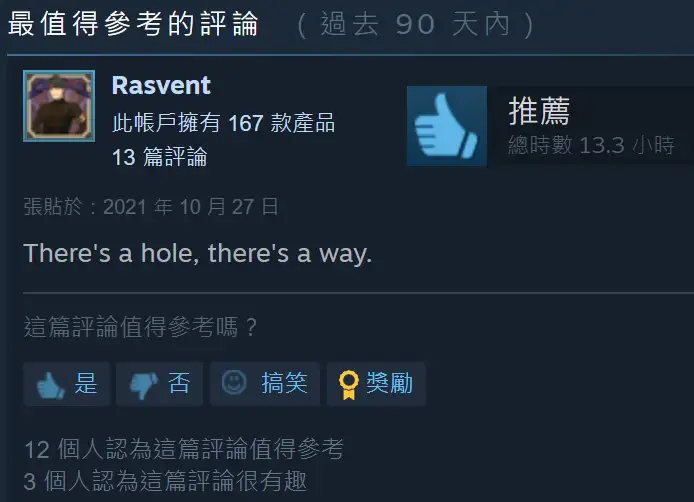

`作者: Patchouli Knowledge`

**做爲神社的繼承人而修行的男主 不知爲何只吸引了僞娘，爲了尋求正常的戀愛只好向神明尋求幫助 最後降臨的是被封印的女裝神！**

| 資訊一覽     |                  |
|:--------:|:---------------- |
| **開發商**  | No Strike（僞娘專業戶） |
| **遊戲時長** | 2 - 4 小時             |
| **類型**   | 搞笑 拔作 僞娘         |
| **難度**   | 無                |
| **分級**   | R-18             |

## 故事梗概

主人公雅人作爲神社的繼承人，認真修行着，由於父親的病逝不得不擔起神社的大梁。

而他的青梅竹馬美代姐也將作爲男巫女和他一起經營神社。

渴望得到異性戀情的雅人向御神祈求，結果神明真的降臨了，

而神明真的可以滿足他的願望嗎？與偽娘沒羞沒躁的生活就此開始！

## 登場人物

### 雅人

本作男主，沒有立繪沒有全名，唯一的設定就是父母雙亡不得不繼承神社，
渴求一段正常的異性戀。

### 圓騰 美代（cv：橘美月）

### 結（cv：麻黒ほん）

### 緋和（cv：スズナ）

## 遊戲 OP

動畫來自被牆的 steam



這電音，神社蹦迪是吧 [🔗️Galgame 金曲：神様妄想桜色](/music/?id=10)

## 簡評

本作由知名僞娘專業戶 No Strike 製作，人也不藏着掖着，從標題到簡介到 pv 都直球的告訴玩家我就是一部以僞娘爲主題的 gal，劇情也簡單就是角色登場後直接開幹，大幹特幹的拔作，CG 畫風十分不錯，登場人物已在上面全部展示，是否對 xp 請自行判斷。

缺點就是太短了，筆者約 2h 就走完了全部劇情，該公司在短期內連續推出了包括本作的三部僞娘作品，而劇情也是完全連續的，根本就是把一個遊戲拆成了三部分來賣，後面兩部筆者還沒玩過以後有時間一定會再出評測介紹（已經趁着冬促全買了，已經準備將靈魂獻給路西法大人，yooooooooooooooo~

| 評分        |      |
|:---------:|:---- |
| **人設**    | ♂/10 |
| **立繪 & CG** | 8/10 |
| **劇情**    | 2/10 |
| **綜合**    | 7/10 |

## CG鑑賞


../image/Josou-Jinja/cg_2.webp
../image/Josou-Jinja/cg_3.webp
../image/Josou-Jinja/cg_4.webp


## 還在猶豫是否下載？

請觀賞 遊戲PV

動畫來自被牆的 steam



## 資源下載



Steam 經常打折且折後價格也就十元上下可以考慮購入，但遊玩時請注意社死可能（您的好友正在遊玩《女裝神社》.JPG）

群友發的資源：

