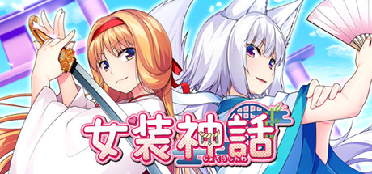
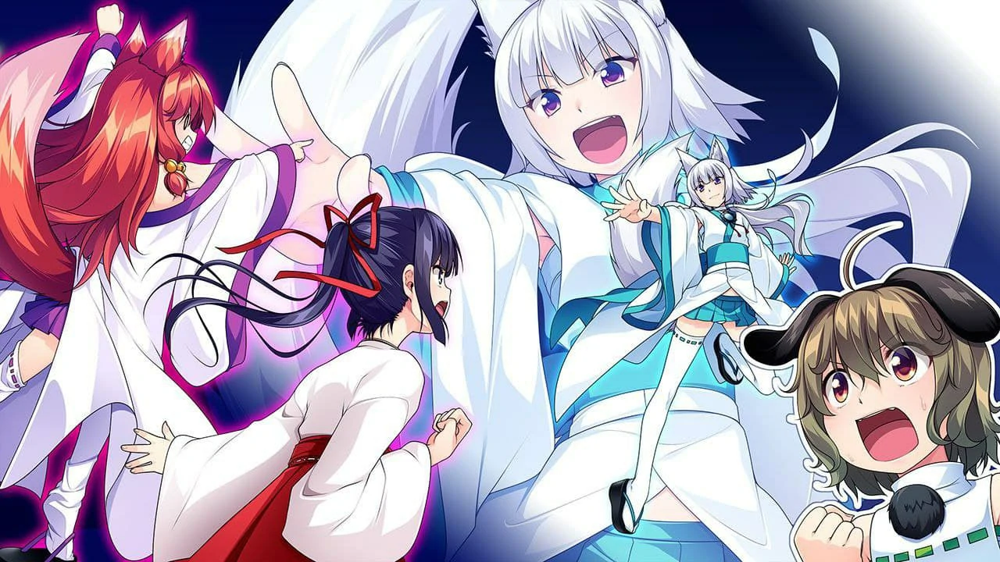

`作者: Patchouli Knowledge`

 少年，前面真的是一條不歸路啊！ 

| 資訊一覽     |                  |
|:--------:|:---------------- |
| **開發商**  | No Strike（僞娘專業戶） |
| **遊戲時長** | 2 - 4 小時             |
| **類型**   | 搞笑 拔作 僞娘         |
| **難度**   | 無                |
| **分級**   | R-18             |

## 故事梗概

[書接上文](https://galgamer.xyz/article/10001)，在男主雅人幹爆兩位僞娘達成和諧幸福的僞娘後宮後回歸日常之後，結緣神結的~~妹妹~~弟弟**環**和其巫女長藉着神○本廳的指令奪取了神社的主導權，並命令禁止僞娘的不純潔交往。

這自然受到了前作的兩位~~女~~男主角的強烈反對

爲了落實僞娘不純潔交往政策，兩位新人順理成章的住進了男主家，僞娘神話正式拉開帷幕……

## 登場人物
前作人物不再介紹
### 昴（cv：御苑生 メイ）
 

又是一個女裝巫女，乘虛而入企圖奪得神社的掌控權， 雖然遵從神社的傳統穿上了巫女服，但對僞娘戀愛呈完全反對  做事一絲不苟對男主尤其嚴厲， 有點S又有些傲嬌。

### 環（cv：野上 結生）

 

又是一個女裝神，上一代的結的弟弟， 和哥哥相反，是斬斷緣分的存在，  認爲男人和僞娘結合會擾亂世間的秩序，確實 爲了保證男主不對僞娘出手， 十分自然的霸佔了男主的臥室進行視姦。

## 遊戲 OP

動畫來自被牆的 steam



## 簡評

製作風格依然延續了上一作，新增添了兩位新僞娘然後大做特做。由於人數的增加，人設的豐富，讓玩法更加多樣，hcg也更加令人社保。尤其是昂，成熟大姐姐帶有一點傲嬌再配上裡界大佬御苑生メイ深厚的配音功底，令人欲罷不能。同時這一部終於將世界觀展開，很好的起到了在整個系列中承上啓下的作用。

缺點已在上一部說過就不在在這贅述，但如果從steam購買的角度來說，打折價格也就二十不到，遊戲內容也就這麼多了。

| 評分        |      |
|:---------:|:------ |
| **人設**    | ♂/10 |
| **立繪 & CG** | ♂/10 |
| **劇情**    | ♂/10 |
| **綜合**    | ♂/10 |

## CG鑑賞


../image/TrapLegend/cg_1.webp
../image/TrapLegend/cg_2.webp
../image/TrapLegend/cg_3.webp
../image/TrapLegend/cg_4.webp


## 還在猶豫是否下載？

請觀賞 十分鐘試玩

來自被牆的 steam



## 資源下載



Steam 經常打折且折後價格也就二十元上下可以考慮購入，但遊玩時請注意社死可能（您的好友正在遊玩《女裝~~神社~~神話》.JPG）

群友發的資源（已打R-18補丁）：

