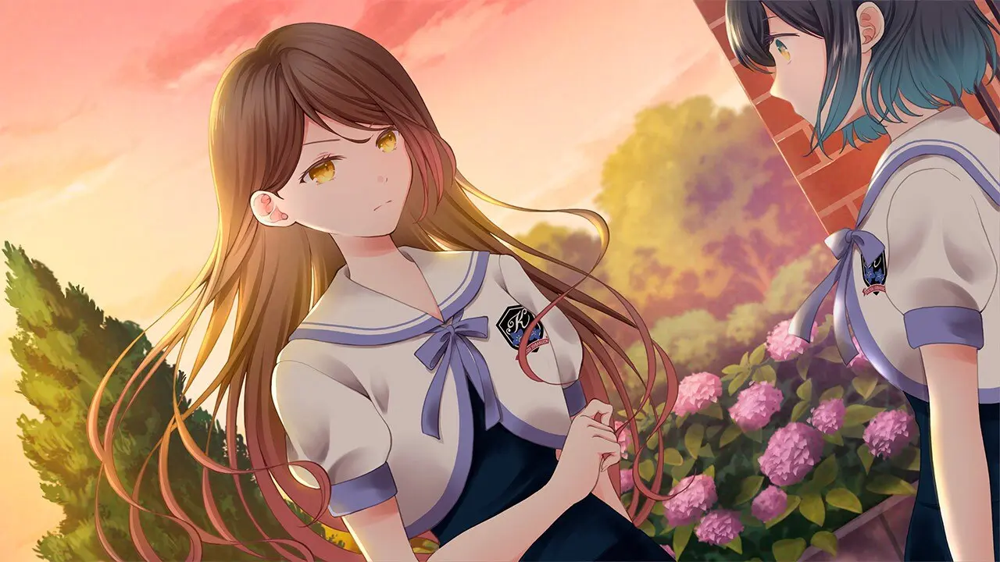
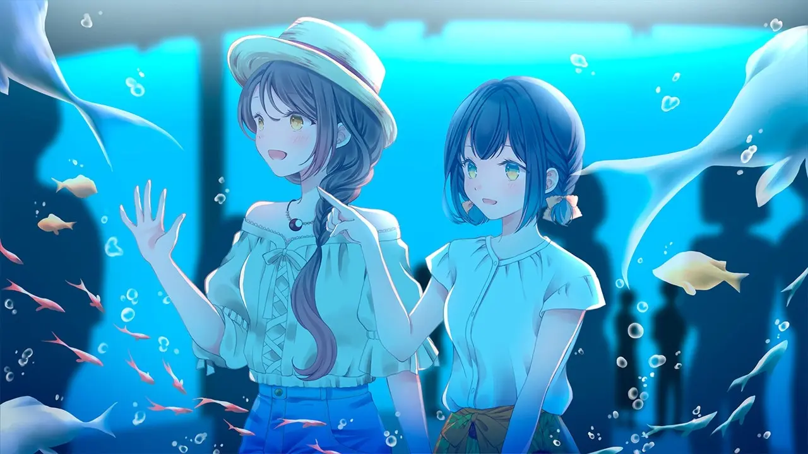
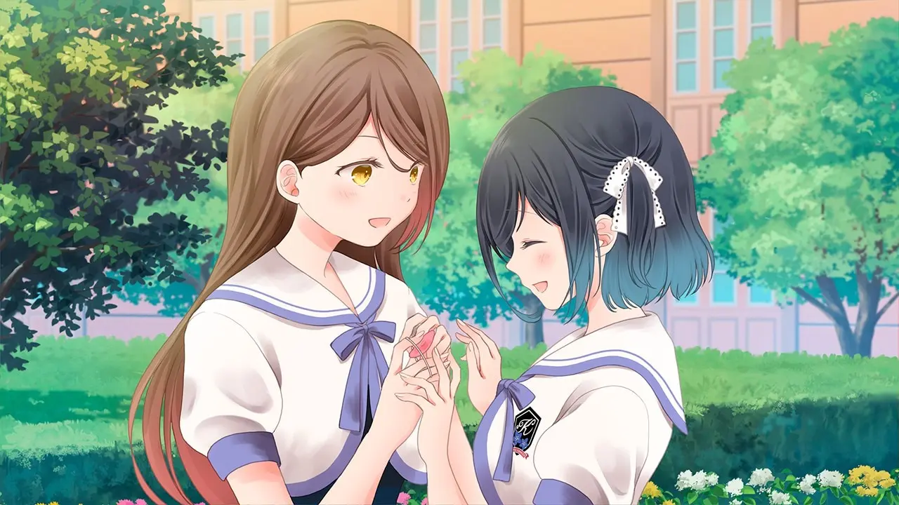
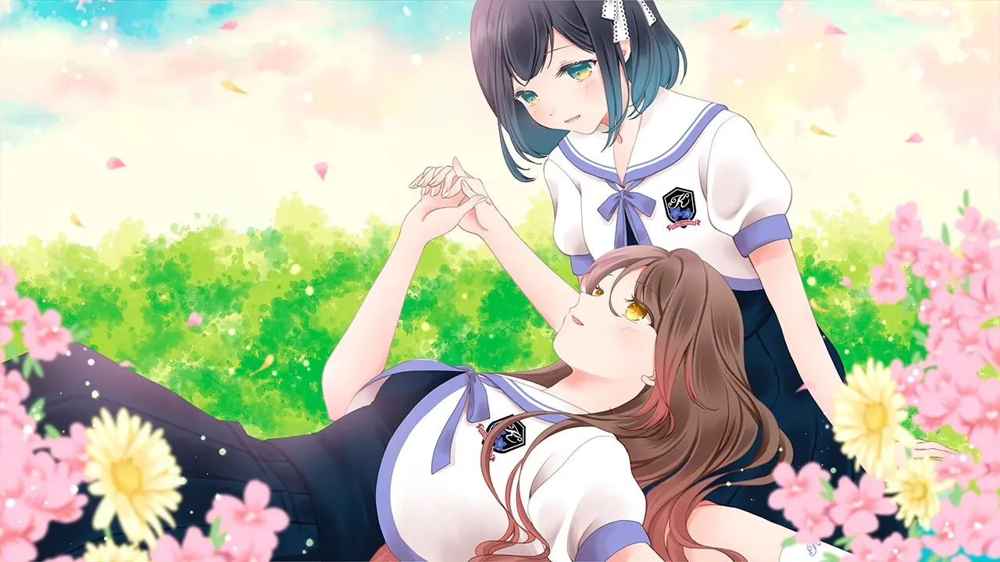
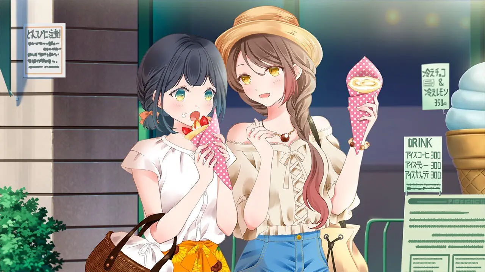

<ruby style="display: block; font-size: 120%; font-weight: bold; text-align: center; margin-bottom: 1em">
一段始于恐吓信的恋情，不知不觉间，逐渐被你所吸引。<rt>脅迫状から始まる恋、いつしかあなたに惹かれていく――
</ruby>

又有谁不喜欢美少女贴贴呢

题注：这个中文标题的翻译可以说是非常有诗意了，日语原文是：<ruby>ツユチル<rp>(</rp><rt>Tsuyuchiru</rt><rp>)</rp></ruby>・<ruby>レター<rp>(</rp><rt>Letter</rt><rp>)</rp></ruby>&nbsp;～海と栞に雨音を～标题直译的话就是“梅雨散落之信，海上的雨声和书签”，我猜译者可能是想表达两位主角梅雨般的恋爱过程，而副标题的“海”和“汐”则是指代两位主角。

| 資訊一覽     |                 |
| :----------- | :-------------- |
| **開發商**   | Lily Spinel     |
| **編劇**     | 御厨みくり      |
| **類型**     | 渐渐喜欢上你的百合恋爱ADV |
| **遊戲時長** | 5 小時左右      |
| **難度**     | 0（无选项）     |
| **分級**     | 全年龄          |

虽然本作是 Lily Spinel 公司的首部作品，但其 Staff 阵容不可谓不豪华

* 编剧：御厨みくり出品过作品《花咲<ruby>ワーク<rp>(</rp><rt>Work</rt><rp>)</rp></ruby><ruby>スプリング<rp>(</rp><rt>spring</rt><rp>)</rp></ruby>!》、《箱庭ロ<ruby>ジック<rp>(</rp><rt>logic</rt><rp>)</rp></ruby>》、《<ruby>カルマルカ<rp>(</rp><rt>Karumaruka</rt><rp>)</rp></ruby>＊<ruby>サークル<rp>(</rp><rt>Circle</rt><rp>)</rp></ruby>》、《罪ノ光<ruby>ランデヴー<rp>(</rp><rt>Rendezvous</rt><rp>)</rp></ruby>》、《<ruby>フローラル<rp>(</rp><rt>Floral</rt><rp>)</rp></ruby>・<ruby>フローラブ<rp>(</rp><rt>Flowlove</rt><rp>)</rp></ruby>》、《<ruby>キミ<rp>(</rp><rt>You</rt><rp>)</rp></ruby>へ贈る、<ruby>ソラ<rp>(</rp><rt>Sky</rt><rp>)</rp></ruby>の花》、《<ruby>トリノライン<rp>(</rp><rt>Trinoline</rt><rp>)</rp></ruby>》、《翠の海 -midori no umi-》，其剧本水平大家应该有所了解；
* 原画为百合画师 [@sheepD_](https://twitter.com/sheepD_) ／ [pixiv](https://www.pixiv.net/users/14807885)

## 故事

<dl>
<dt>舞台：</dt>
<dd>私立桔梗女子学园（总之就是贵族学园，GALGAME常见展开）</dd>
<dt>设定：</dt>
<dd>校规极其宽松，没有女女恋爱的障碍（） 
但是不能带手机，于是信纸成为了不同年级学生的主要交流方式（而且用鞋盒当作信箱，这设定太熟悉了）。 
同时放学后也不能在商店街买零食吃（这也太死板了吧）。</dd>
</dl>

  

  

  

  

  

  

  

  

  

（原文有出入）

一场突如其来的告白让湊汐里陷入混乱，究竟有何渊源？又是什么让身为高岭之花的学姐恨之入骨却又不得不放下身段向学妹告白？恐吓信究竟是谁所编写，犯人又有着什么样的目的？敬请收看走进科学系列节目有案可查之

（好吧整个剧情就是白开水，没有雷，再讲下去就=剧透了）

## 登場人物

<ruby>湊<rp>(</rp><rt>みなと</rt><rp>)</rp></ruby>
<ruby>汐里<rp>(</rp><rt>しおり</rt><rp>)</rp></ruby>
 * 本作主角
CV:門脇舞以

属于那种学校里透明的存在（或者说，普通人）。

感情细腻，内心坚强，即使隐约察觉出是谎言，也要维持这段不稳定的感情关系。

高中部1年级菊组 生日 5月19日 A型血 服饰部

<ruby>仓桥<rp>(</rp><rt>くらはし</rt><rp>)</rp></ruby>
<ruby>海琴<rp>(</rp><rt>みこと</rt><rp>)</rp></ruby>
 * 还是本作主角 CV:倉知怜鳳

高岭之花（校园人气美少女）但不喜欢别人因为样貌而告白。

非常宠爱妹妹结海，恐吓信事件也是为了保护妹妹才开始告白。

高中部2年级椿组 生日 8月11日 AB型血 回家部

<ruby>仓桥<rp>(</rp><rt>くらはし</rt><rp>)</rp></ruby>
<ruby>结海<rp>(</rp><rt>ゆみ</rt><rp>)</rp></ruby>
 * 海琴的妹妹 CV:春岡沙和

自幼体弱多病，独特的成长环境使她在某些方面比姐姐海琴更为成熟。

学校里因身体原因几乎总呆在保健室，因而很少能和其他同学接触。

高中部1年级百合组 生日 3月15日 AB型血 回家部

<ruby>相场<rp>(</rp><rt>あいば</rt><rp>)</rp></ruby>
<ruby>真帆<rp>(</rp><rt>まほ</rt><rp>)</rp></ruby>
 * 汐里的同班同学（好姬友） CV:戸坂美月

汐里的同班同学，善于照顾他人。

是少数除姐姐外能经常与结海接触的人。

高中部1年级菊组 生日 9月26日 AB型血 社会部

<ruby>立花<rp>(</rp><rt>たつばな</rt><rp>)</rp></ruby>
<ruby>碧<rp>(</rp><rt>あおい</rt><rp>)</rp></ruby>
CV:清水愛

传说中的绯闻少女（虽然很清白）。

喜欢（口头？）汐里。

高中部3年级藤组 生日 4月9日 A型血 学生会议长

<ruby>伏见<rp>(</rp><rt>ふしみ</rt><rp>)</rp></ruby>
<ruby>凪纱<rp>(</rp><rt>なぎさ</rt><rp>)</rp></ruby>
CV:岡本理絵

报社社员设定，总是被人认为在收集绯闻。

海琴的朋友。

高中部2年级椿组 生日 7月13日 B型血 报社

## 遊戲 OP 動畫欣賞

   <select class='qualitypick' autocomplete='off'>
      <option selected>480p</option>
      <option>1080p</option>
   </select>
   <video controls preload="metadata" width='100%' poster="../image/tsuyuchiru1/movie.webp">
      <source label="480p" src="https://cdn.akamai.steamstatic.com/steam/apps/256836633/movie480.webm" type="video/webm">
      <source label="480p" src="https://cdn.akamai.steamstatic.com/steam/apps/256836633/movie480.mp4" type="video/mp4">
      <source label="1080p" src="https://cdn.akamai.steamstatic.com/steam/apps/256836633/movie_max.webm" type="video/webm">
      <source label="1080p"   src="https://cdn.akamai.steamstatic.com/steam/apps/256836633/movie_max.mp4" type="video/mp4" >
      
 To view this video please enable JavaScript

   </video>

## CG截图

  <ol class="carousel-indicators">
    <li data-target="#carouselExampleIndicators-cg" data-slide-to="0" class="active"></li>
    <li data-target="#carouselExampleIndicators-cg" data-slide-to="1"></li>
    <li data-target="#carouselExampleIndicators-cg" data-slide-to="2"></li>
    <li data-target="#carouselExampleIndicators-cg" data-slide-to="3"></li>
    <li data-target="#carouselExampleIndicators-cg" data-slide-to="4"></li>
  </ol>
  

    

      
    

    

      
    

    

      
    

    

      
    

    

      
    

  

  <a class="carousel-control-prev" href="#carouselExampleIndicators-cg" role="button" data-slide="prev">
    
    Previous
  </a>
  <a class="carousel-control-next" href="#carouselExampleIndicators-cg" role="button" data-slide="next">
    
    Next
  </a>

 

## 一句話點評 

游戏的叙事方式是视角互换，也就是一天写汐里视角，接下来就以主角海琴看同一天，相比与传统单一视角为主的视觉小说，这种叙事方式优势是更能体现出两人心境的变化，劣势就是让玩家无法彻底代入期中某一个角色，而是被迫以旁观者视角体验整个剧情，而且某种意义上重复剧情有点拖时间，时间线跳跃也会导致体验破碎（这个意义上说我认为可能有更好的处理方法）。

另外一个无分支零选项的游戏好意思设置 1,200 个存档位吗？？？

## 資源與下載

（等待补上）

<iframe src="https://store.steampowered.com/widget/1637370/" frameborder="0" style="width: 100%; height: 200px"></iframe>