`作者: Patchouli Knowledge`

<p class="text-center">Wovon man nicht sprechen kann, darueber muss man schweigen.</p>

<p class="text-center">語りえないことについては、沈黙するほかない。</p>

<p class="text-center">對於不可言說之物，應保持沉默。</p>


| 資訊一覽     |                  |
|:--------:|:---------------- |
| **開發商**  | KeroQ |
| **遊戲時長** | 10 - 15 H          |
| **類型**   | 電波 哲學 克蘇魯         |
| **難度**   | 低（劇情幾乎無分叉）                |
| **分級**   | R-18（大量h和血腥鏡頭）             |

## 故事梗概

1999年，日本雖已成爲世界第二大經濟體，但整個國家籠罩在泡沫經濟結束後的不景氣之下，人們的精神都處於十分不安定的狀態。

那一年的7月，東京都的一所中學裡的一名學生墜樓而亡，據傳言這是爲了舉行某種防止世界終結的儀式。
於是「7月20日世界將迎來終結」的謠言立刻席捲了整個校園……

7月20日的**終之空**來臨前究竟發生了什麼？故事的全貌就從四位主角的不同視角下逐步呈現。

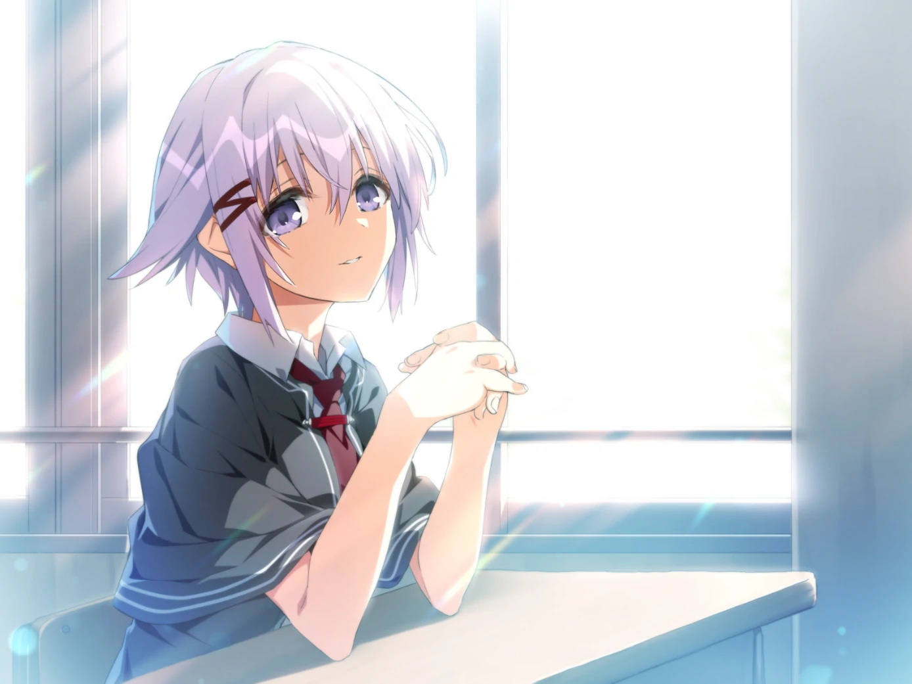

## 登場人物

### 水上 行人（cv：櫻木 章人）

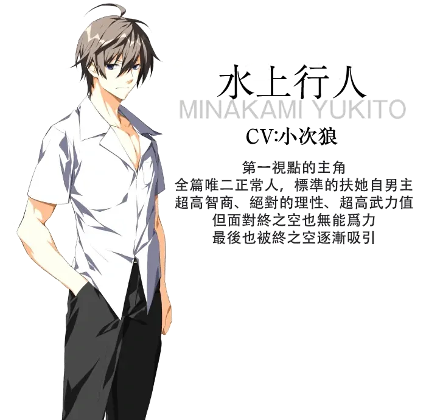

### 若槻 琴美（cv：間宮 菜南子）

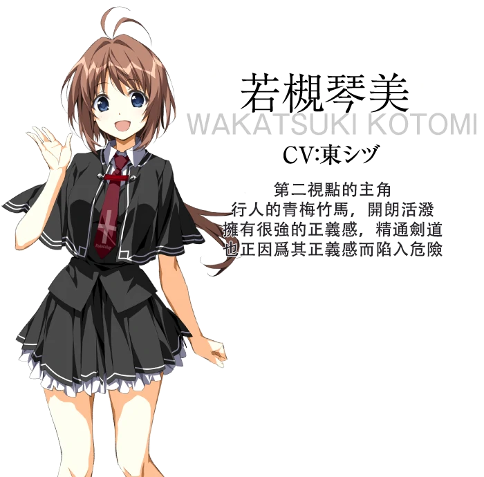

### 高島 柘榴（cv：風花 真白）

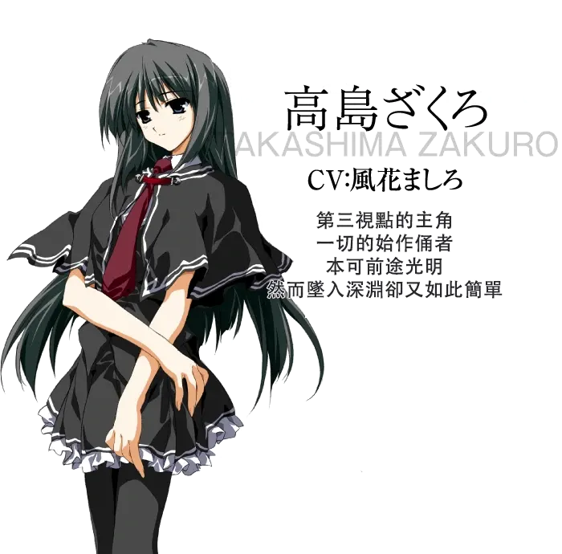

### 橫山 克子（cv：秋野 花）

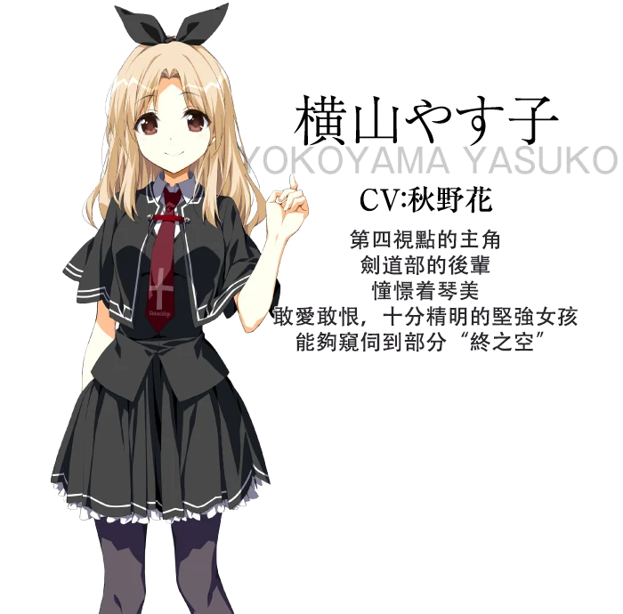

### 間宮 卓司（cv：松元 惠）

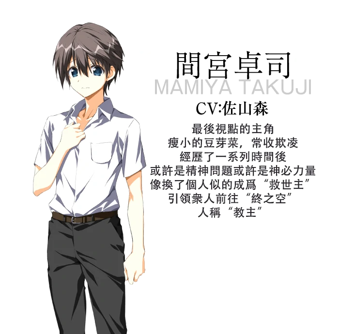


### 音無 彩名（cv：西連寺 亞希）

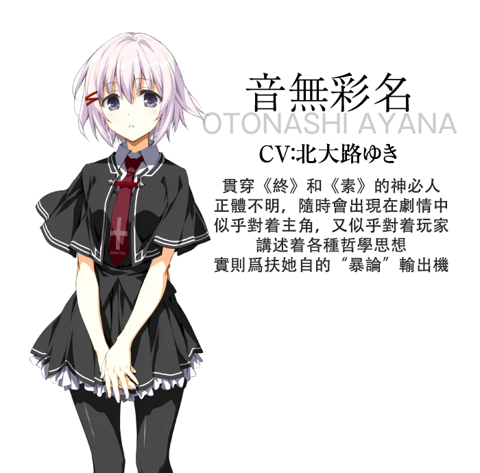

## 遊戲 PV

<video controls preload="metadata" width='100%' poster="../image/終之空/op.jpg">
  <source src="https://s3static-zone0.galgamer.eu.org/video-2d35/tsuinosora/pv-1.mp4" type="video/mp4" />
  <p> To view this video please enable JavaScript</p>
</video>

來自 1999 年原版遊戲。

## 簡評

<div class="alert alert-warning" role="alert">
  <p class="mb-0" style="font-size:150%;">
    終之空註定是充滿爭議性的一部作品，無法用簡單的優缺點概括
  </p>
</div>

相信很多人知道這部作品都是因爲大名鼎鼎的十二神器之首**素晴日**，這裏我先梳理一下這兩部作品的發售順序爲：

<div class="alert alert-success text-center" role="alert">
  <p class="mb-0">
    1999年老版終之空➡2010素晴日原版➡素晴日HD&終之空remake
  </p>
</div>

而終之空作爲素晴日的前身，情節上有許多相同之處，但整個故事是完全不同的，不可混爲一談，並不能說玩了其中一個另一個也玩完了。

闡述了這兩部的區別後回歸到終之空本身，先從最表面的立繪CG和音樂來說，
重置版下的立繪和CG精緻清爽十分養眼，讓人在被弔詭的劇情的折磨下能勉強有些慰藉，
但個人更喜歡老版素晴日那種，帶着一點狂氣的畫風，更契合劇情氣氛（沒錯就是教主演講那段）；

而音樂方面，重置版並沒有新增bgm有點沒誠意，但原版的bgm就已經足夠詭異讓人遊玩時有壓迫感，
然而缺少像素晴日中《夜の向日葵》那樣十分抓耳的曲調。

接下來就是重中之重的劇情方面，終之空的劇情很簡單，通過四位主角的視角拼湊出完整的集體自殺事件；

但扶她自通過 ***音無彩名*** 之口瘋狂的向玩家灌輸他喜愛的著名哲學家 ***維特根斯坦*** 的思想理論，同時再輔以 **克蘇魯**、**futa**等猛料，來闡述他的世界觀。

 * 如果你對上了他的電波 或者 你剛好對這方面很有研究，那很好這對你來說是一部好作品；
 * 如果你對不上他的電波 或者 你對這些一無所知，那你就會發出疑問**「你在講什麼雞擺？」**

這註定是一部評論會兩極化很嚴重的作品，然而gal在國內依然是小圈子，肯靜心閱讀大量文本的gal玩家們似乎對這種作品的接受度十分高，大概這就是電波作品的魅力所在吧。

（該作被稱爲三大毒電波作品之一）


| 評分        |      |
|:---------:|:----- |
| **人設**    | 9/10 |
| **立繪 & CG** | 9/10 |
| **劇情**    | 7.5/10 |
| **音樂**    | 7/10 |
| **綜合**    | 7.5/10 |


## CG鑑賞

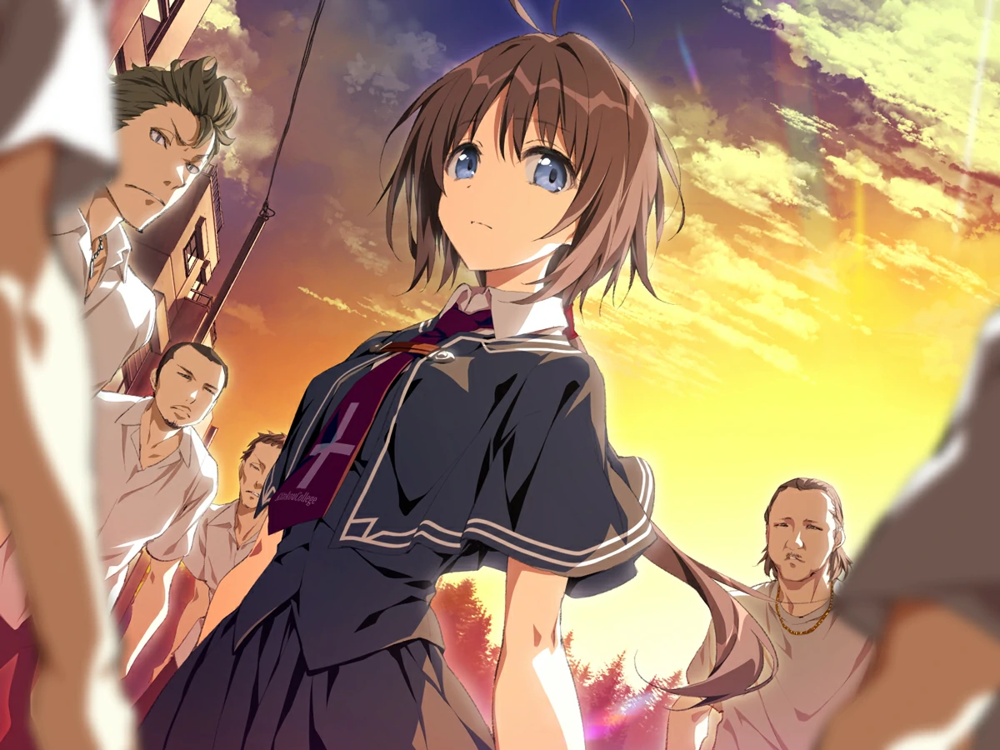

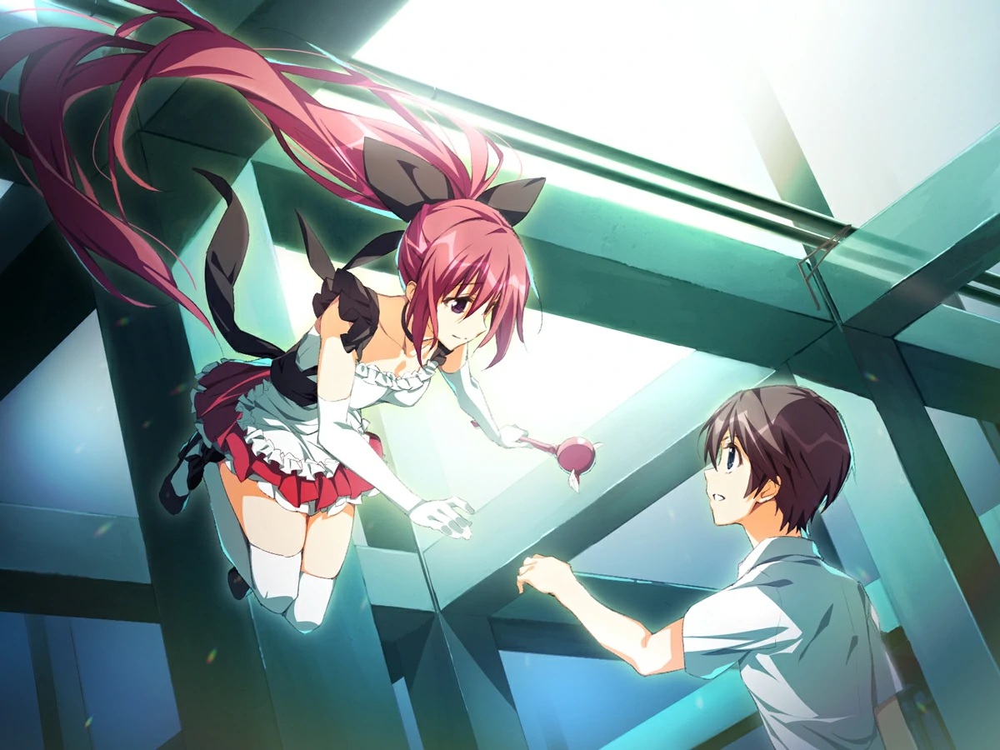

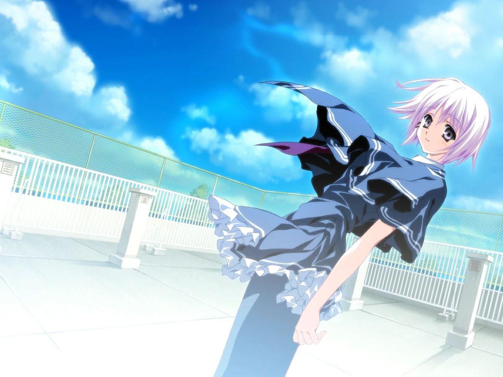

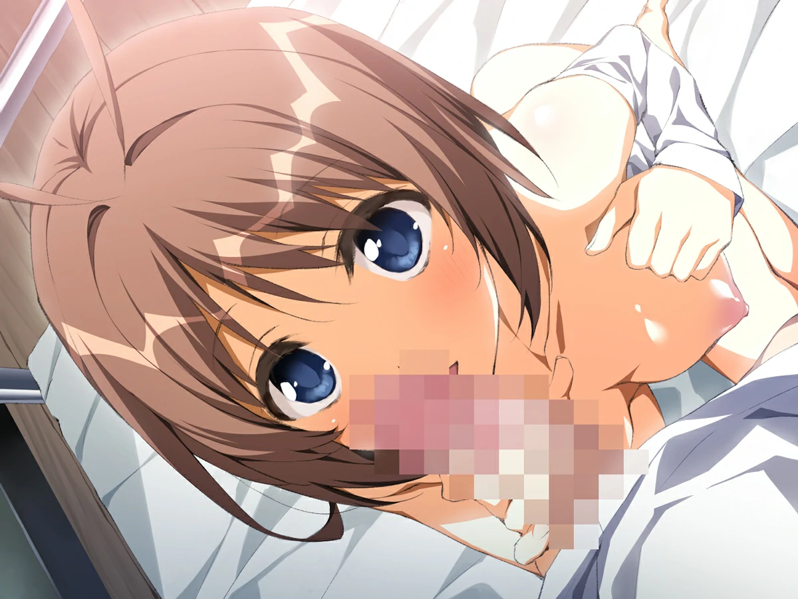

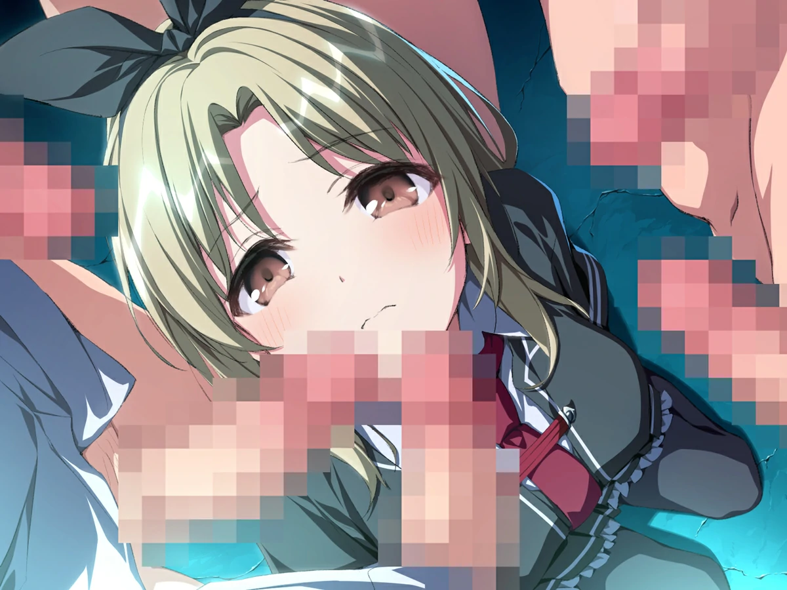

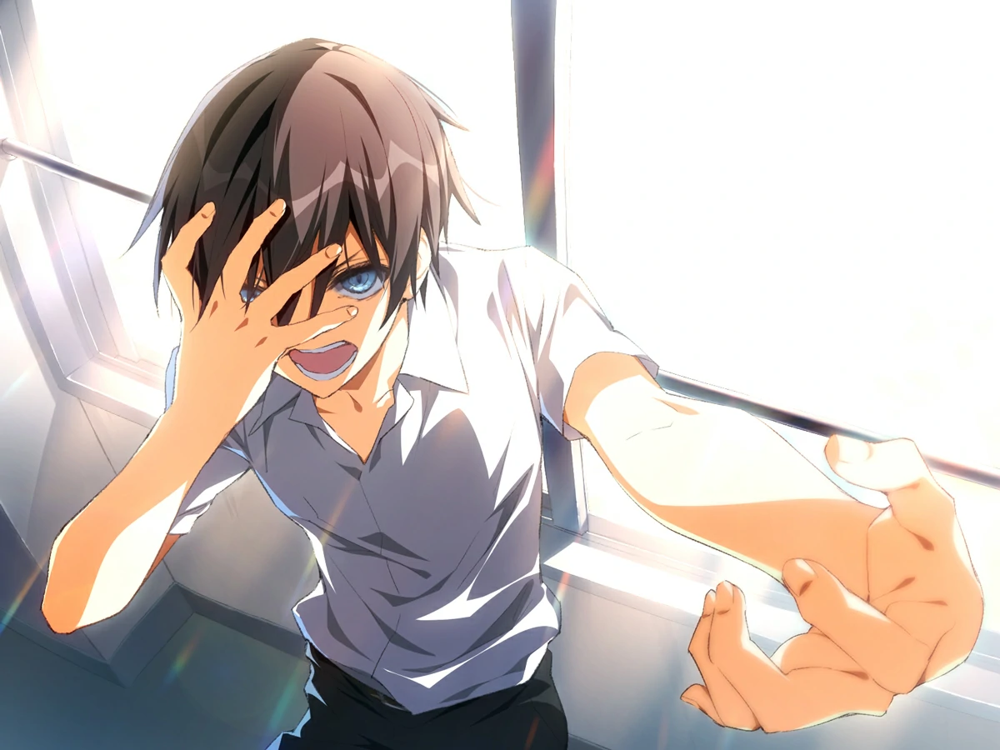

**以下爲1999年舊版CG，可能不符合當代審美請提前做好心理準備**


../image/終之空/cg_07.webp
../image/終之空/cg_08.webp
../image/終之空/cg_09.webp
../image/終之空/cg_010.webp
../image/終之空/cg_011.webp


## 舊版立繪鑑賞

<div class="row">
  <div class="col-6 col-lg-4 my-1 mx-0">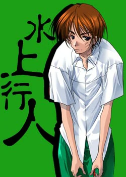</div>
  <div class="col-6 col-lg-4 my-1 mx-0">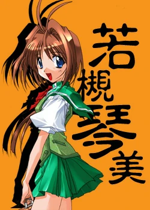</div>
  <div class="col-6 col-lg-4 my-1 mx-0">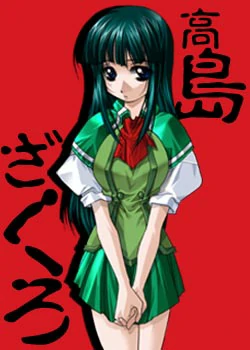</div>
  <div class="col-6 col-lg-4 my-1 mx-0">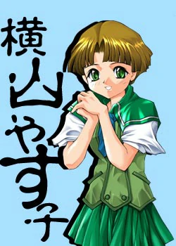</div>
  <div class="col-6 col-lg-4 my-1 mx-0">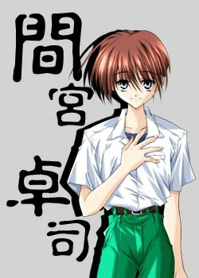</div>
  <div class="col-6 col-lg-4 my-1 mx-0">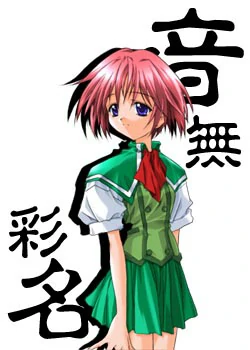</div>
</div>

## 資源下載

### 遊戲本體

磁力連結：
內含

 * 素晴日十週年紀念版
 * 終之空 remake
 * 終之空 1999 原版

共三個遊戲的官方光盤鏡像 ISO。

```
magnet:?xt=urn:btih:b65a3001ff57d54a660536dbb3dd2d818ed73e96
```

Telegram 頻道：

終之空remake： (解压密码：莱茵)

1999年原作（無漢化）：

### 漢化補丁

終之空remake汉化補丁：

1999年原作漢化補丁：沒有


<style>
body {
    background: url('../image/終之空/back.gif') 
}
#banner {
    background: url('')!important;
    background-color: transparent!important;
}
#toc {
     background-color: rgba(0,0,0,0.5);
     padding: 20px 10px 20px 20px;
     border-radius: 10px;
}
</style>
<script>
window.addEventListener('DOMContentLoaded', function() {
document.documentElement.setAttribute('data-user-color-scheme', 'dark');
});
</script>
