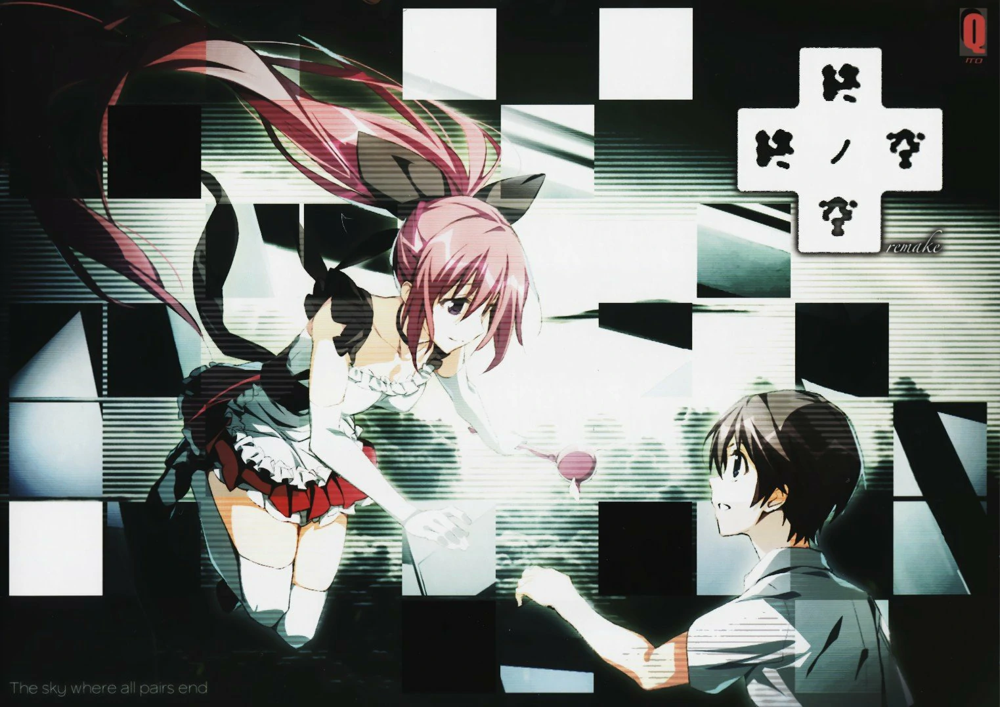

`作者: Patchouli Knowledge`

<p class="text-center" style="font-size: 100%">Wovon man nicht sprechen kann, darueber muss man schweigen.<br>語りえないことについては、沈黙するほかない。<br class="d-md-none">對於不可言說之物，應保持沉默。</p>



| 資訊一覽     |                  |
|:--------:|:---------------- |
| **開發商**  | KeroQ |
| **遊戲時長** | 10 - 15 H          |
| **類型**   | 電波 哲學 克蘇魯         |
| **難度**   | 低（劇情幾乎無分叉）                |
| **分級**   | R-18（大量h和血腥鏡頭）             |

## 故事梗概

1999年，日本雖是世界第二大經濟體，但整個國家籠罩在泡沫經濟結束後的不景氣之下，人們的精神都處於不安定。
那一年的7月，東京都的一所中學一名學生墜樓而亡，據傳言是爲了舉行某種防止世界終結的儀式。於是“7月20日世界將迎來終結”的謠言立刻瘋狂的充斥校園……
7月20日的**終之空**來臨前究竟發生了什麼？故事的全貌就從四位主角的不同視角下逐步呈現。


## 登場人物

### 水上 行人（cv：櫻木 章人）


### 若槻 琴美（cv：間宮 菜南子）


### 高島 柘榴（cv：風花 真白）


### 橫山 克子（cv：秋野 花）


### 間宮 卓司（cv：松元 惠）


### 音無 彩名（cv：西連寺 亞希）


## 遊戲 PV

<style>
  #y2b {
    box-shadow: 0 5px 11px 0 rgb(0 0 0 / 18%), 0 4px 15px 0 rgb(0 0 0 / 15%);
    border-radius: 10px;
    aspect-ratio: 16 / 9;
    /*height: 100%;*/
    width: 100%;
    background-color: transparent;
    background-image: url('../image/mona-loading.webp');
    background-size: 70px;
    background-repeat: no-repeat;
    background-position: center
  }
</style>
<iframe id='y2b' loading="lazy" src="https://www.youtube.com/embed/-FtSzVkwR1s" title="YouTube video player" frameborder="0" allow="encrypted-media; picture-in-picture" allowfullscreen></iframe>


## 簡評

<p class="col" style="font-size:180%;">這註定是充滿爭議性的一部作品，無法用簡單的優缺點概括</p>

相信很多人知道這部作品都是因爲大名鼎鼎的十二神器之首**素晴日**，這裏我先梳理一下這兩部作品的發售順序爲：
<p class="text-center" style="font-size:150%;">1999年老版➡素晴日原版➡素晴日HD&終之空remake</p>
而終之空作爲素晴日的前身，情節上有許多相同之處但整個故事是完全不同的，不能將兩者混爲一談，並不能說玩了其中一個另一個也玩完了。
<br>
<br>
闡述了這兩部的區別後回歸到終之空本身，先從最表面的立繪CG和音樂來說，重置版下的立繪和CG十分的精緻清爽令人養眼，讓人在被弔詭的劇情折磨下勉強有些慰藉，但個人更喜歡老版素晴日那種畫風帶着一點狂氣更契合劇情氣氛（沒錯就是教主演講那段）；而音樂方面，重置版並沒有新增bgm有點沒誠意，但原版的bgm就已經足夠詭異讓人遊玩是感到壓迫感，然而缺乏素晴日《夜の向日葵》這樣十分抓耳的曲調。
<br>
<br>
接下來就是重中之重的劇情方面，終之空的劇情很簡單，通過四位主角的視角拼湊出完整的集體自殺事件，但扶她自通過<b>音無彩名</b>之口瘋狂的向玩家灌輸他喜愛的著名哲學家<b>維特根斯坦</b>的思想理論，同時再輔以<b>克蘇魯</b>、<b>futa</b>等猛料，來闡述他的世界觀。
</p>
* 如果你對上了他的電波或者你剛好對這方面很有研究，那很好這對你來說是一部好作品；</p>
* 如果你對不上他的電波或者你對這些一無所知，那你就會發出疑問“<b>你在講什麼雞擺？</b>”
</p>
這註定是一部評論會兩極化很嚴重的作品，然而gal在國內依然是小圈子，肯靜心閱讀大量文本的gal玩家們似乎對這種文字接受度十分高，大概這就是電波作品的魅力所在吧。（該作爲三大毒電波作品之一）
<br>
<br>

| 評分        |      |
|:---------:|:----- |
| **人設**    | 9/10 |
| **立繪 & CG** | 9/10 |
| **劇情**    | 7.5/10 |
| **音樂**    | 7/10 |
| **綜合**    | 7.5/10 |


## CG鑑賞
**第七張開始爲舊版CG可能不符合當代審美故提前提醒做好準備**

../image/終之空/cg_01.webp
../image/終之空/cg_02.webp
../image/終之空/cg_03.webp
../image/終之空/cg_04.webp
../image/終之空/cg_05.webp
../image/終之空/cg_06.webp
../image/終之空/cg_07.webp
../image/終之空/cg_08.webp
../image/終之空/cg_09.webp
../image/終之空/cg_010.webp
../image/終之空/cg_011.webp


## 舊版立繪鑑賞

../image/終之空/yuito.webp
../image/終之空/kotomi01.webp
../image/終之空/zakuro.webp
../image/終之空/yasuko.webp
../image/終之空/takutyan.webp
../image/終之空/ayana.webp


## 資源下載

遊戲本體（內含素晴日HD、終之空remake和終之空1999原版）：

```
magnet:?xt=urn:btih:b65a3001ff57d54a660536dbb3dd2d818ed73e96
```

或者：[telegram资源(解压密码：莱茵)](https://t.me/ACGNyouxifenxiang/1744)

群友發的1999版資源（無漢化）：

群友發的remake汉化補丁：
<style>
body {
    background: url('../image/終之空/back.gif') 
}
#banner {
    background: url('')!important;
    background-color: transparent!important;
}
#toc {
     background-color: rgba(0,0,0,0.5);
     padding: 20px 10px 20px 20px;
     border-radius: 10px;
}
</style>
<script>
window.addEventListener('DOMContentLoaded', function() {
setInterval(() => document.documentElement.setAttribute('data-user-color-scheme', 'dark'), 500);
});
</script>
