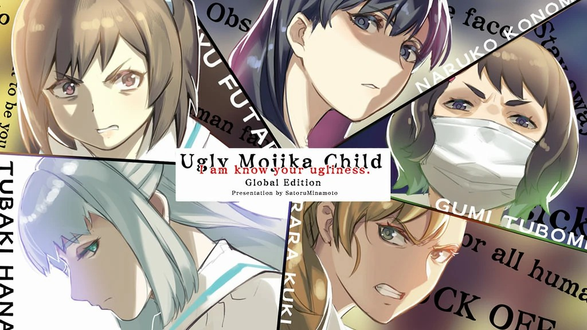
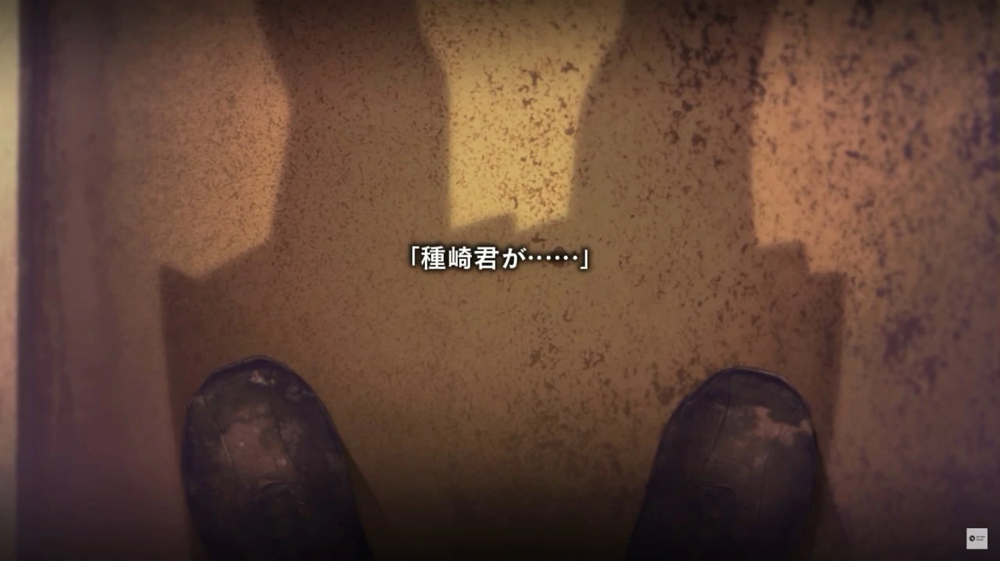
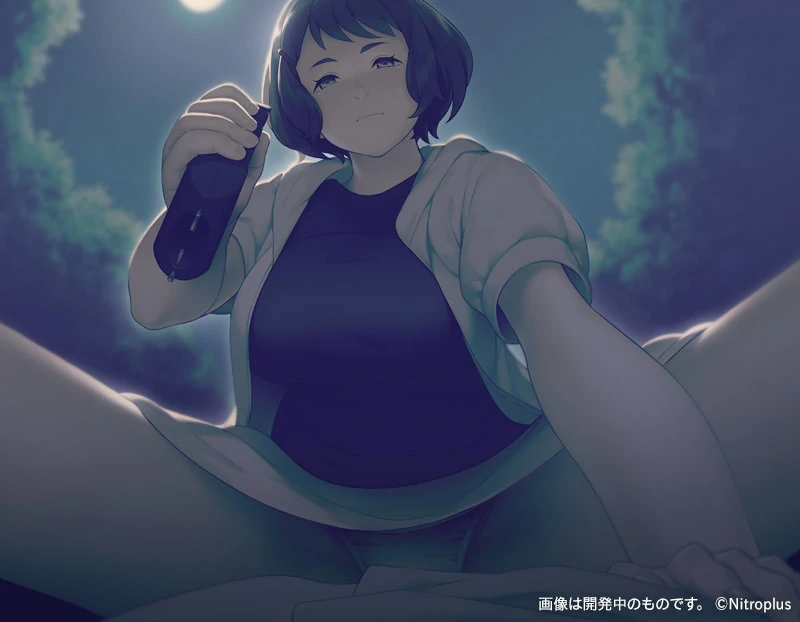

`作者: Patchouli Knowledge`

  如果可以讀心，你會怎麼做？ 

| 資訊一覽     |                  |
|:--------:|:---------------- |
| **開發商**  | Nitro+ |
| **遊戲時長** | 12 - 15 H          |
| **類型**   | 黑深殘 拔作 校園霸凌          |
| **難度**   | 一般（四條個人線和TE，個人線較簡單）                |
| **分級**   | R-18（注意少量虐待場景）             |

## 故事梗概

男主種崎捨從出生開始就擁有讀心「文字化」的超能力，這種作弊的能力本該讓他走上人生巔峯，
但彷彿被上帝玩弄一般，他擁有奇醜無比的外貌（醜到其他人直視他就會想吐），
因此只要有其他人在場男主永遠都是低着頭看着地板，以自己爲中心1.2m半徑圓內就是男主的全世界。

旁人不知道男主的讀心能力，再加上醜陋的外貌，男主自然成爲了全校的欺凌對象和發泄口，
再加上早就被父母拋棄毫無靠山，每天就像過街老鼠一樣在校園苟且偷生。

然而一天男主暗戀的同桌 ***雙葉實憂*** 將其約出來，竟對這麼一個 ***“醜小鴨”*** 表白，
果不其然是玩弄的假意告白，這一次的羞辱終於讓男主下定決心利用自己的能力像整個學院復仇。

## 人物介紹

### 雙葉 實憂（cv：前田 惠）

男主的同桌，是唯一不會欺凌男主的人，並時不時給予鼓勵。 
正因這份溫柔和可愛的外表讓男主瘋狂暗戀。   
其實對男主這麼好完全是因爲如果男主撐不下去自殺那下一個就輪到她了。 
和外表清純不符，其實十分工於心計。

### 九鬼 綺羅羅（cv：米島 希）

帶頭欺凌男主的小太妹，站在學院食物鏈頂端的女人。 
是掌控小鎮的黑道九鬼組的大小姐，同時還是街頭小混混組織老大的女朋友，連老師都不敢招惹她，十分飛揚跋扈。 

### 許裴 鳴子（cv：大久保 藍子）

經典的學生會長人設，同時還是學院理事長的女兒。  
是除了實憂以外對男主“比較好”的人。   
成績優秀待人友好，無論是老師還是同學都很信賴依仗她。

### 花椿（cv：木村 彩香）

小鎮中心魂正神社的無口甚至無心巫女。  
男主無法讀她的心，因爲她真的沒有內心。  
作爲傳統世世代代守護着神社裏的不潔之物。

### 四月一日 胡頽子（cv：三宅 麻理惠）

巨乳電腦中級高手。  
平時幫同學破解學校發的平板電腦讓大家方便的網上沖浪，表面是知識分子，實則背後是……

## 遊戲 PV

動畫來自被牆的油管，請翻牆

<iframe id='y2b' loading="lazy" src="https://www.youtube-nocookie.com/embed/ms9MTSs438o" title="YouTube video player" frameborder="0" allow="encrypted-media; picture-in-picture" allowfullscreen></iframe>

## 幾句話簡評

  
優點：

  </img>

 * 畫風不錯，不是那種典型的美少女畫風，但如果戳到你的點那絕對夠味，全篇充滿着啪啪啪，各種玩法絕對能滿足你。
 * 極具表現力的演出，男主擡起頭涌入視野的文字非常有衝擊力。（漢化組真的強
 * 幾條個人線挺有意思的，但討厭凌辱、ntr、肢體殘害的玩家請注意迴避，***不建議未成年人和身心不夠成熟的人遊玩。***

 

  
缺點：

  </img>

 * OP還不錯，但全程bgm都很壓抑與雜亂，並且充斥着很重的心跳聲，雖說是爲了配合劇情，但沒有令人印象深刻的感覺。
 * 主線寫殘了，遠不如個人線優秀，結束的有些不明不白又或者說過於單薄（明明前面鋪墊那麼多）
 * 全程低頭的視角剛開始玩會感覺挺有意思，但深入遊玩後會讓玩家有些乏味。

| 評分        |      |
|:---------:|:----- |
| **人設**    | 8/10 |
| **立繪 & CG** | 9/10 |
| **劇情**    | 6/10 |
| **音樂**    | 7/10 |
| **綜合**    | 7/10 |

## CG鑑賞


../image/醜小鴨/img_gallery_1.webp
../image/醜小鴨/img_gallery_6.webp
../image/醜小鴨/img_gallery_7.webp
../image/醜小鴨/img_gallery_8.webp
../image/醜小鴨/img_gallery_11.webp
../image/醜小鴨/img_gallery_12.webp
../image/醜小鴨/img_gallery_13.webp
../image/醜小鴨/img_gallery_14.webp
../image/醜小鴨/img_gallery_15.webp


 

 


../image/醜小鴨/img_gallery_2.webp
../image/醜小鴨/img_gallery_4.webp
../image/醜小鴨/img_gallery_5.webp
../image/醜小鴨/img_gallery_9.webp


## 遊戲資源

[🔗️盜版](https://t.me/ACGNyouxifenxiang/2259)（內含漢化補丁和攻略）

