`作者: Patchouli Knowledge`

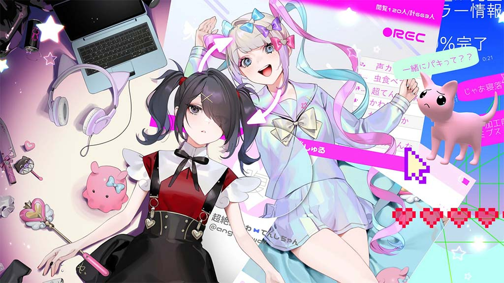

  † 昇天 † 
  † 昇天 † 
  † 昇天 † 
  † 昇天 † 
  † 昇天 † 
  † 昇天 † 
  † 昇天 †

| 資訊一覽     |                  |
|:--------:|:---------------- |
| **開發商**  | WSS playground |
| **遊戲時長** | 8 - 10 H          |
| **類型**   | 養成 像素 網絡         |
| **難度**   | 較高（二十多結局，少數幾個比較陰間）                |
| **分級**   | 全年齡（但注意有較多強光閃爍和少量血腥鏡頭）             |

## 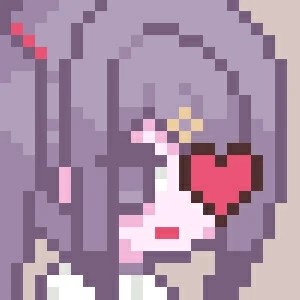 故事梗概

地雷系少女**糖糖**經過化妝後成爲「超絕可愛天使醬」**超天醬**開始了她的直播生涯。

而你作爲男朋友 **阿P** 要幫助這位有點脆弱，時不時神經經的少女安排日常生活，尋找直播的點子，共同向着百萬粉絲的目標前進！

你的每一個決定都會左右最後的結局，在這三十天內和糖糖一起努力榨乾宅宅們的錢包吧！

## 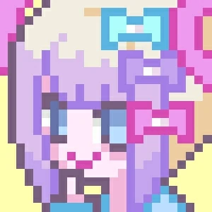 人物介紹

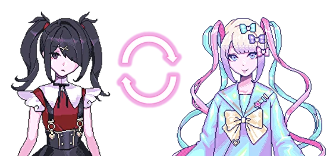


../image/重度依賴/tangtang_3.webp
../image/重度依賴/tangtang_4.webp


🔼日常狀態下的糖糖，看起來乖巧文靜，其實是個時而任性，時而努力，十分渴望得到認可的孩子，精神狀態非常不穩定，喜歡飛葉子和阿P。


../image/重度依賴/chaotian_3.webp
../image/重度依賴/chaotian_4.webp


🔼直播中的糖糖，化妝COS後變身爲超天醬，是降臨在互聯網來拯救宅宅們的「超絕可愛天使」媚宅主播

阿P：糖糖的男朋友，協助糖糖直播，安排她的日常生活。

## 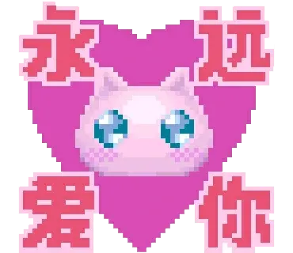 遊戲 PV

動畫來自被牆的 steam



新pv



舊pv

## 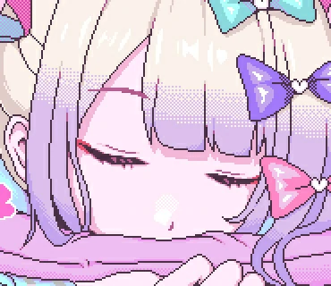 簡評

一句話：這是一部非常優秀的像素風格的養成類遊戲。

適時變奏的音樂，精美的像素CG，無處不在的亞文化neet，更不用說讓人一眼就記住的糖糖，無不體現製作人的用心。
二十多個結局不多也不少，且每個結局都設計的非常好，有偏搞笑的也有深刻黑暗的，你都能在現實中找到對應的實例。

最後更要吹爆的是漢化組，漢化的十分接地氣，融入了非常多我們本土的梗且很自然，
不逛個十年貼吧，不看個四五年VTB，真沒這功力。（優秀的漢化甚至讓部分玩家以爲這是國產遊戲）

雖然是養成類遊戲且有大量隨機事件，但隨機事件不影響整體走勢，對於想肝出全結局的玩家比較友好，快的話6-8H即可。

但該遊戲內含有大量不健康行爲，不建議心智不成熟的和未成年人遊玩，遊戲是遊戲，現實是現實，切勿模仿！

### 一些題外話

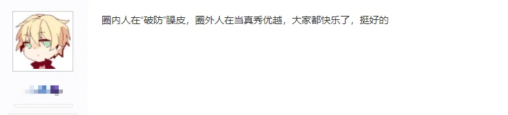

筆者在朋友圈中是知名管人癡，自從這遊戲在一月份火爆宅圈後就很多人按頭讓我玩想看我 ***“破防”***。
相信很多人也是看到很多對這遊戲的評價都集中在「管人殺手」「玩完我取關了嘉然」才對這遊戲感興趣。
筆者於二月份初買的玩了兩個小時打了兩三個結局就擱置了，一是因爲工作忙沒時間玩遊戲，二是因爲這遊戲和管人沒啥關係啊，讓我有點失望（而且糖糖真的很麻煩）。

我自認爲我還算是個V老嗨，從17年開始關注老愛，見證了這個圈子發展至今，
有許多V非常努力提升自己，也有些V擺爛提純，如果你是沖着VTB來玩這遊戲的那可能要失望了（首先糖糖就不是V），
但這遊戲本身絕對不會讓你失望，製作人的目的是讓玩家去體會感受精神疾病患者的世界，
在日本本土玩家也是關注這點，但在國內就歪到了VTB可能這就是國情差異吧。

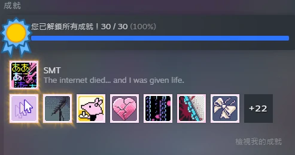

<a href="https://steamcommunity.com/app/1451940/discussions/0/4287991687308982957/">全成就攻略</a>

| 評分        |      |
|:---------:|:----- |
| **人設**    | 9/10 |
| **立繪 & CG** | 10/10 |
| **劇情**    | 8/10 |
| **音樂**    | 8/10 |
| **綜合**    | 9/10 |

## 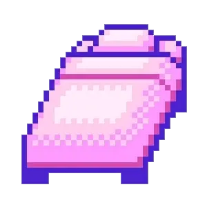 欣賞糖糖美照


../image/重度依賴/cg_05.webp
../image/重度依賴/cg_06.webp
../image/重度依賴/cg_07.webp
../image/重度依賴/cg_08.webp
../image/重度依賴/cg_09.webp
../image/重度依賴/cg_10.webp


超天醬可愛捏


../image/重度依賴/cg_01.webp
../image/重度依賴/cg_02.webp
../image/重度依賴/cg_03.webp
../image/重度依賴/cg_04.webp


糖糖你帶我走吧

  

    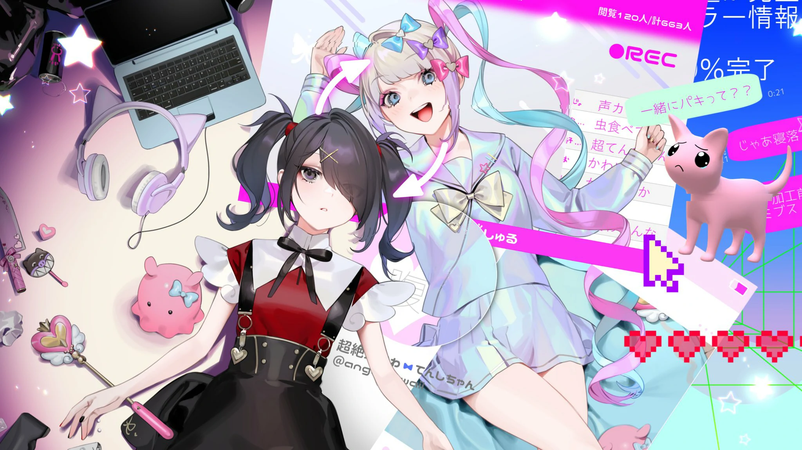
  

  

    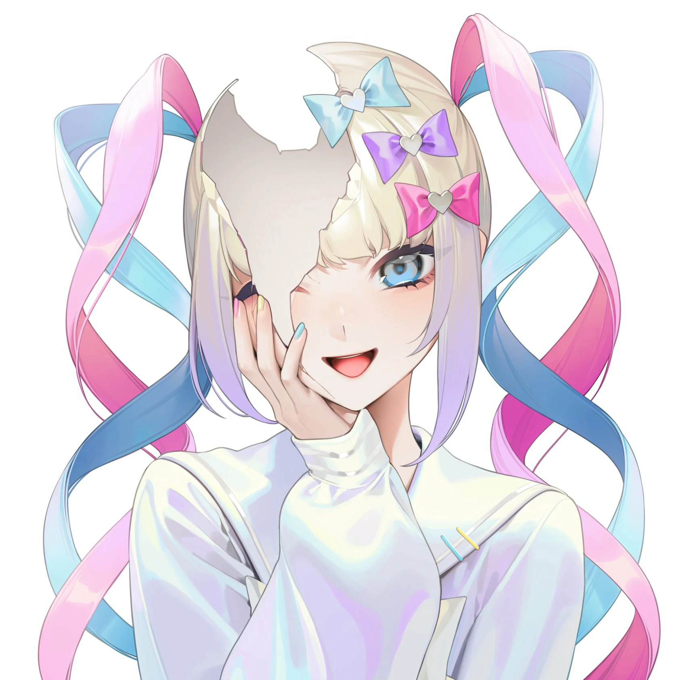
  

  

    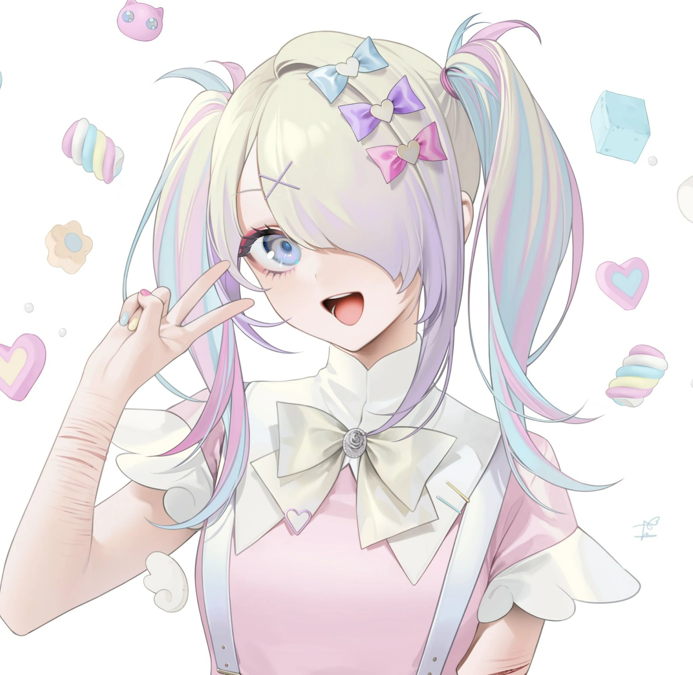
  

  

    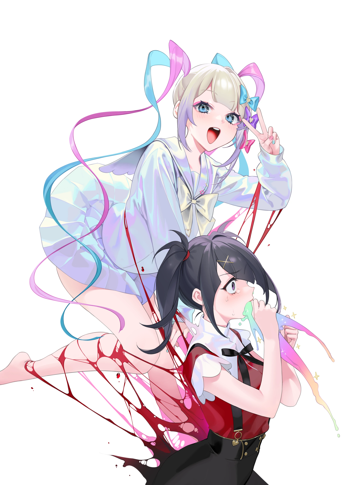
  

親爹<a href="https://twitter.com/imlllsn">🔗️imlllsn</a>繪圖（老師圖超色還不速速關注？）

## 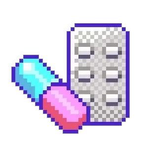 OP

OP的畫面和歌詞致敬了許多經典Galgame（多爲電波向），你能看出[🔗️幾個](https://www.yystv.cn/p/8763)？（該鏈接有嚴重劇透請確定自己玩夠了不怕劇透才閱讀）

當然本遊戲每個角落都充滿致敬和梗，二老嗨的你肯定能看出不少。



本作製作人にゃるら非常喜歡電波系作品

## 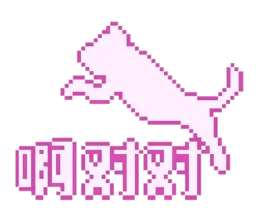 遊戲資源



因爲剛出故目前只打過九折，根據該發行商其他遊戲的經驗後續很有可能有更大力度的折扣。

但這價格即使原價也不貴，遊戲質量和內容量真的非常良心，買不了吃虧買不了上當！

steam目前無驗證，可採用退款大法白嫖。或者[🔗️盜版](https://www.ryuugames.com/eng-needy-streamer-overdose/)（遊戲本體自帶中文，設置裏調）

群友發的[🔗️Telegram 貼紙](https://t.me/addstickers/chaotianjiang)

